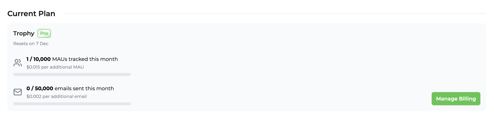

## Usage-based Billing

Trophy follows a usage-based pricing model where customers only pay for the units of usage they consume. For Trophy, a unit of usage corresponds to a single [Monthly Active User](##monthly-active-users-maus) (MAU).

## Monthly Active Users (MAUs)

Trophy defines an MAU as a single user that is involved in at least one API call in a given month.

<Tip>
  Bear in mind **you never pay for churned users**. If a user signs up to your
  product in a given month but doesn't return, you only pay for that user once
  and never again.
</Tip>

## Features

Trophy splits features into two groups, [Core](#core-features), and [Advanced](#advanced-features).

### Core Features

Core features include all gamification mechanics including:

- [Achievements](/platform/achievements)
- [Streaks](/platform/streaks)
- [Points](/platform/points)
- [Leaderboards](/platform/leaderboards)
- [Emails](/platform/emails)

All customers have access to all core features.

### Advanced Features

Advanced features include:

- [Webhooks](/webhooks)
- [Custom Attributes](/platform/users#custom-user-attributes)
- [DNS Verification](/platform/emails#dns-verification-advanced)

Advanced features are limited to [paid plans](#paid-plans).

## Free Tier

The free tier grants access to all [Core Features](#core-features) for up to **100 MAUs**. This allows teams to test and evaluate Trophy without accruing usage charges.

<Note>
  If you exceed the free plan, don't panic! Nothing will stop working, we'll
  just reach out to you with a friendly reminder to upgrade.
</Note>

## Paid Plans

Trophy has two paid plans, [Starter](#starter-plan) and [Pro](#pro-plan).

### Starter Plan

The starter plan is for customers who have graduated from the testing and evaluation phase and are using Trophy in small-scale production deployments.

Unlike the [Free Tier](#free-tier), the starter plan has no limits on monthly active users.

<Tip>
  Beyond ~ 16,000 MAUs it's usually more cost-efficient to upgrade to the [Pro
  Plan](#pro-plan).
</Tip>

### Pro Plan

The pro plan is for customers who are using Trophy in larger scale deployments or who require [advanced features](#advanced-features).

### Plan Limits

Here's a comparison of the limits of each paid plan:

| Item            | Starter | Pro      |
| --------------- | ------- | -------- |
| Base price ($)  | `99`    | `299`    |
| Included MAUs   | `1,000` | `10,000` |
| Included emails | `5,000` | `50,000` |

## Custom Contracts

If you have more than **100,000 MAUs** and would like to discuss custom contracts to suit your business needs then please [get in touch](mailto:hello@trophy.so) and we'll be happy to help.

## Viewing Your Usage

You can view your usage for the current billing period on the [billing page](https://app.trophy.so/billing) of the Trohpy dashboard and view all past invoices in your billing portal.

<Frame>
  
</Frame>

## Frequently Asked Questions

<AccordionGroup>
  <Accordion title="When will I be charged?">
    We charge all customers on the 1st of the month for usage in arrears.
  </Accordion>
</AccordionGroup>

## Get Support

Want to get in touch with the Trophy team? Reach out to us via [email](mailto:support@trophy.so). We're here to help!
