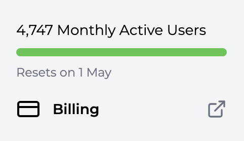

## Usage-based Billing

Trophy follows a usage-based pricing model where customers only pay for the units of usage they consume. For Trophy, a unit of usage corresponds to a single [Monthly Active User](##monthly-active-users-maus) (MAU).

## Monthly Active Users (MAUs)

Trophy defines an MAU as a single user that is involved in at least one API call in a given month.

<Note>
  Bear in mind **you never pay for churned users**. If a user signs up to your
  product in a given month but doesn't return, you only pay for that user once
  and never again.
</Note>

## Free tier

All customers start on the free tier. This allows dev teams to build and test implementations for up to **100 MAUs** without accurring any usage charges.

<Note>
  If you exceed the free plan, don't panic! Nothing will stop working, we'll
  just reach out to you with a friendly reminder to add a payment method.
</Note>

## Estimating Costs

You'll be charged a flat rate of `$49` + `$0.015` / MAU (USD) above the [Free Tier](#free-tier). You can estimate your monthly charges using our [calculator](https://www.trophy.so/pricing), but here are some common examples:

| MAUs      | Cost (USD) |
| --------- | ---------- |
| `100`     | `0`        |
| `1,000`   | `62.5`     |
| `5,000`   | `122.5`    |
| `10,000`  | `197.5`    |
| `50,000`  | `797.5`    |
| `100,000` | `1,547.5`  |

## Custom Contracts

If you have more than **100,000 MAUs** and would like to discuss custom contracts to suit your business needs then please [get in touch](mailto:hello@trophy.so) and we'll be happy to help.

## Viewing Your Usage

You can view your usage for the current billing period in the [Trophy dashboard](https://app.trophy.so) and view all past invoices on the [Billing](#billing) page.

<Frame>
  
</Frame>

## Frequently Asked Questions

<AccordionGroup>
  <Accordion title="When will I be charged?">
    We charge all customers on the 1st of the month in arreas.
  </Accordion>
</AccordionGroup>

## Get Support

Want to get in touch with the Trophy team? Reach out to us via [email](mailto:support@trophy.so). We're here to help!
