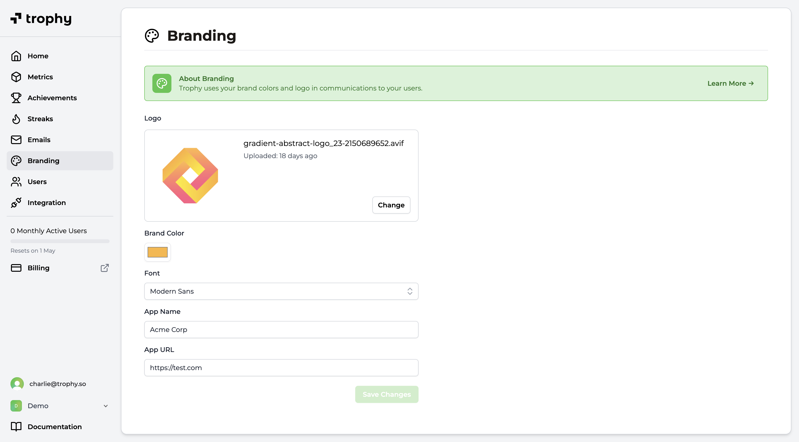

## Configure Branding

The [branding page](https://app.trophy.so/branding) in the Trophy dashboard allows you to configure the following account-level settings. These setting will be used in any communications you configure Trophy to send to users, like [Emails](/platform/emails).

<Frame>
  
</Frame>

- **Logo**: Upload your brand’s logo to be displayed in the header of Trophy emails. We recommend using a horizontal logo with a transparent background or a plain background color with rounded corners.
- **Font**: The default font used in Trophy emails.
- **Brand Color**: Choose a primary color for your brand. Trophy will use this color for buttons and other elements in your emails.
- **App Name**: Enter the name of your app or service. Trophy will use this name in various places in your emails.
- **App URL**: Enter a default URL to use when not overridden on a per-email basis. Usually this is the URL of your app or service's sign in page.

## Get Support

Want to get in touch with the Trophy team? Reach out to us via [email](mailto:support@trophy.so). We're here to help!
