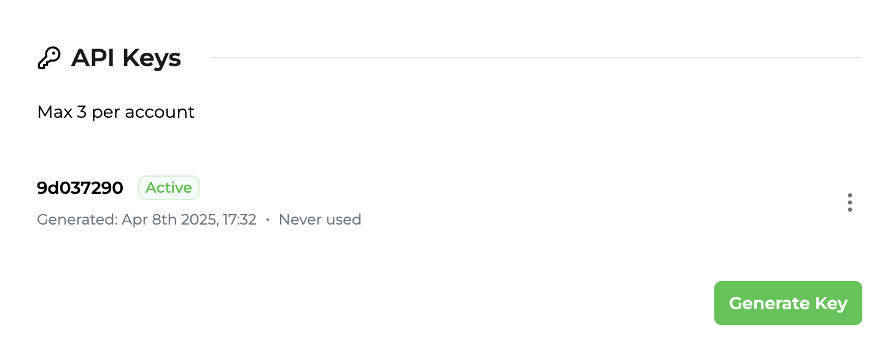
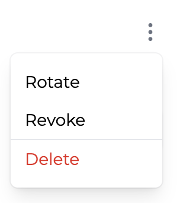

## API Keys

Every account can create a maximum of 3 API keys from the [Integration Page](https://app.trophy.so/integration). If you've already signed up, you'll have created one during onboarding.

Trophy keeps track of and displays when each API key in your account was created and when it was last used so you can easily keep track of usage.

<Frame>
  
</Frame>

### Anatomy of an API key

Each API key is made up of 2 parts separated by a period:

```bash
{prefix}•{body}
```

- The _prefix_ is the first 8 characters. It's readable and will always stay the same so it's easily recognisable.
- The _body_ is the secret part, and is only shown to you once when you create the key.

<Note>
  When using the API, both parts of your API key must be sent in the `X-API-KEY`
  header.
</Note>

### Authenticating Requests

When making requests to the API, make sure to include **both** parts of your API key in the `X-API-KEY` header as in this example:

```bash
curl https://app.trophy.so/api/users/<userId>/metrics/<key> \
     -H "X-API-KEY: ********.***********************"
```

If you do not pass an API key, or your API key is invalid, you'll receive a `401` response code.

## Managing API keys

There are a few different operations you can perform on API keys from within your Trophy dashboard to manage your integration.

<Frame>
  
</Frame>

### Rotating keys

API keys can be rotated if you want to change them for any reason. At the point of rotation, the original API key will no longer function and any requests still using it will begin receiving `401` responses immediately.

<Note>
  Note that when rotating keys, both the prefix and the body will change.
</Note>

### Revoking keys

API keys can also be revoked entirely at which point they become _Inactive_. At the point of revocation, the API key will no longer function and any requests still using it will begin receiving `401` responses immediately.

Once revoked you can re-activate the API key at any time.

<Note>
  Neither the prefix or the body of the key change when revoked or re-activated.
</Note>

### Deleting API keys

If you're 100% sure you no longer need an API key, they can be deleted.

<Error>Once API keys are deleted, they cannot be recovered.</Error>

## Get Support

Want to get in touch with the Trophy team? Reach out to us via [email](mailto:support@trophy.so). We're here to help!
