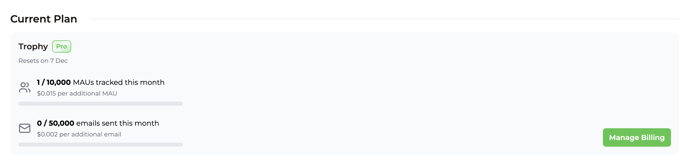

import { PlanBadge } from "../components/plan-badge.jsx";

## Facturación basada en uso {#usage-based-billing}

Trophy sigue un modelo de precios basado en uso donde los clientes solo pagan por las unidades de uso que consumen. Para Trophy, una unidad de uso corresponde a un único [Usuario Activo Mensual](#monthly-active-users-maus) (MAU).

<Info>
  Consulta nuestra [página de precios](https://trophy.so/pricing) para obtener una estimación de tus
  costos según tu uso esperado.
</Info>

## Usuarios Activos Mensuales (MAU) {#monthly-active-users-maus}

Trophy define un MAU como un único usuario que envía al menos un [evento de métrica](/es/features/events) a Trophy en un mes determinado.

Ten en cuenta que nunca pagas por usuarios que han abandonado. Si un usuario se registra en tu producto en un mes determinado pero no regresa, solo pagas por ese usuario una vez y nunca más.

## Nivel gratuito {#free-tier}

El nivel gratuito permite a los equipos probar y evaluar Trophy hasta **1,000 MAU** sin acumular cargos por uso.

<Note>
  Una vez que superes el plan gratuito, tu cuenta seguirá funcionando y
  nos pondremos en contacto contigo directamente con un amable recordatorio para actualizar.
</Note>

## Planes de pago {#paid-plans}

Trophy tiene dos planes de pago, [Starter](#starter-plan) y [Pro](#pro-plan).

### Plan Starter {#starter-plan}

El plan starter es para clientes que han superado la fase de prueba y evaluación y están usando Trophy en implementaciones de producción a pequeña escala.

A diferencia del [Nivel gratuito](#free-tier), el plan starter no tiene límites en MAU.

### Plan Pro {#pro-plan}

El plan pro es para clientes que están usando Trophy en implementaciones de mayor escala o que requieren funciones más avanzadas.

### Límites del Plan {#plan-allowances}

Aquí hay una comparación de los límites de cada plan de pago:

| Elemento                        | Starter | Pro      |
| ------------------------------- | ------- | -------- |
| Precio base                     | `$25`   | `$299`   |
| MAU incluidos                   | `1,000` | `10,000` |
| Correos electrónicos incluidos  | `2,000` | `20,000` |
| Notificaciones push incluidas   | `2,000` | `20,000` |

### Excedentes {#overages}

Los excedentes se cobran en los planes de pago por encima de los [límites](#plan-allowances) incluidos a las siguientes tarifas:

| Elemento                     | Starter  | Pro      |
| ---------------------------- | -------- | -------- |
| 1 MAU                        | `$0.015` | `$0.015` |
| 1,000 correos electrónicos   | `$2.50`  | `$2.00`  |
| 1,000 Notificaciones push    | `$1.50`  | `$1.00`  |

Los descuentos por volumen están disponibles como parte de [contratos personalizados](#custom-contracts).

## Funcionalidades {#features}

Aquí hay una lista de todas las funcionalidades de Trophy y el plan en el que están disponibles:

<PlanBadge plan="free" />

- [Logros](/es/features/achievements)
- [Rachas](/es/features/streaks)
- [Puntos](/es/features/points)
- [Clasificaciones](/es/features/leaderboards)
- [Correos electrónicos](/es/features/emails)
- [Notificaciones push](/es/features/push-notifications)
- Análisis de 7 días

<PlanBadge plan="starter" />

- MAU adicionales permitidos
- Análisis de 12 meses

<PlanBadge plan="pro" />

- [Webhooks](/es/webhooks)
- [Atributos personalizados](/es/features/users#custom-user-attributes)

## Contratos Personalizados {#custom-contracts}

Si tienes más de 100K MAU y te gustaría discutir contratos personalizados que incluyan descuentos por volumen para adaptarse a las necesidades de tu negocio, [contáctanos](mailto:support@trophy.so) y estaremos encantados de ayudarte.

## Consultar Tu Uso {#viewing-your-usage}

Puedes consultar tu uso del período de facturación actual en la [página de facturación](https://app.trophy.so/billing) del panel de Trophy y ver todas las facturas anteriores en tu portal de facturación.

<Frame>
  
</Frame>

## Preguntas Frecuentes {#frequently-asked-questions}

<AccordionGroup>
    <Accordion title="¿Cuándo se me cobrará?">
      Cobramos a todos los clientes el día 1 de cada mes por el uso del mes anterior y por las tarifas del plan por adelantado.
    </Accordion>
</AccordionGroup>

## Obtener Soporte {#get-support}

¿Quieres ponerte en contacto con el equipo de Trophy? Contáctanos por [correo electrónico](mailto:support@trophy.so). ¡Estamos aquí para ayudarte!
