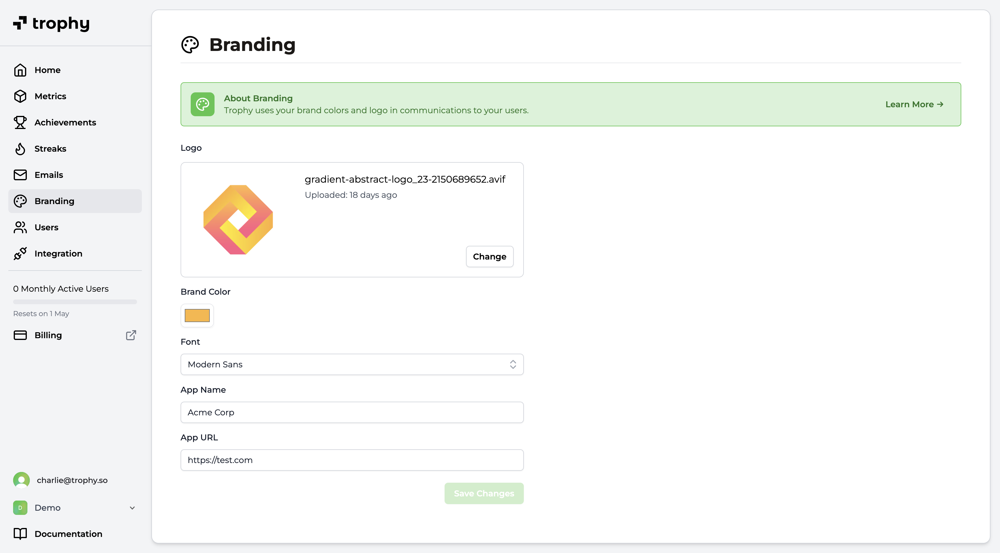

## Configurar la Marca {#configure-branding}

La [página de marca](https://app.trophy.so/branding) en el panel de Trophy le permite configurar los siguientes ajustes a nivel de cuenta. Estos ajustes se utilizarán en cualquier comunicación que configure Trophy para enviar a los usuarios, como [Correos electrónicos](/es/platform/emails).

<Frame>
  
</Frame>

- **Logotipo**: Cargue el logotipo de su marca para mostrarlo en el encabezado de los correos electrónicos de Trophy. Recomendamos utilizar un logotipo horizontal con fondo transparente o un color de fondo sólido con esquinas redondeadas.
- **Fuente**: La fuente predeterminada utilizada en los correos electrónicos de Trophy.
- **Color de Marca**: Elija un color primario para su marca. Trophy utilizará este color para botones y otros elementos en sus correos electrónicos.
- **Nombre de la Aplicación**: Ingrese el nombre de su aplicación o servicio. Trophy utilizará este nombre en varios lugares de sus correos electrónicos.
- **URL de la Aplicación**: Ingrese una URL predeterminada para usar cuando no se sobrescriba caso por caso en cada correo electrónico. Por lo general, esta es la URL de la página de inicio de sesión de su aplicación o servicio.

## Obtener Soporte {#get-support}

¿Desea ponerse en contacto con el equipo de Trophy? Comuníquese con nosotros por [correo electrónico](mailto:support@trophy.so). ¡Estamos aquí para ayudar!
