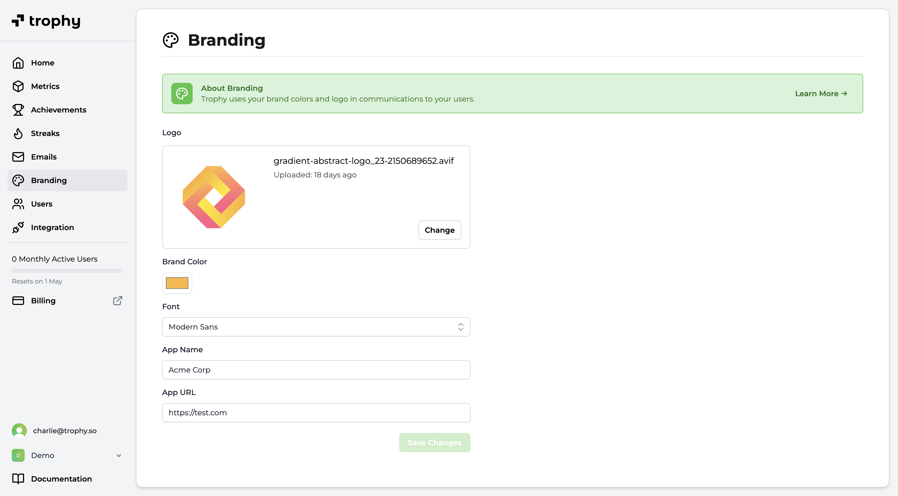

## Configurar la marca {#configure-branding}

La [página de marca](https://app.trophy.so/branding) en el panel de Trophy te permite configurar los siguientes ajustes a nivel de cuenta. Estos ajustes se utilizarán en cualquier comunicación que configures para que Trophy envíe a los usuarios, como [correos electrónicos](/es/features/emails).

También puedes obtener y actualizar los ajustes de marca, experimentación y agregación con la [API de administración de configuración de organización](/es/admin-api/endpoints/settings/get-organization-settings).

<Frame>
  
</Frame>

- **Logotipo**: Sube el logotipo de tu marca para mostrarlo en el encabezado de los correos electrónicos de Trophy. Recomendamos usar un logotipo horizontal con fondo transparente o un color de fondo liso con esquinas redondeadas.
- **Fuente**: La fuente predeterminada utilizada en los correos electrónicos de Trophy.
- **Color de marca**: Elige un color principal para tu marca. Trophy utilizará este color para botones y otros elementos en tus correos electrónicos.
- **Nombre de la aplicación**: Introduce el nombre de tu aplicación o servicio. Trophy utilizará este nombre en varios lugares de tus correos electrónicos.
- **URL de la aplicación**: Introduce una URL predeterminada para usar cuando no se anule por correo electrónico. Normalmente, esta es la URL de la página de inicio de sesión de tu aplicación o servicio.

## Obtener soporte {#get-support}

¿Quieres contactar con el equipo de Trophy? Comunícate con nosotros por [correo electrónico](mailto:support@trophy.so). ¡Estamos aquí para ayudarte!
