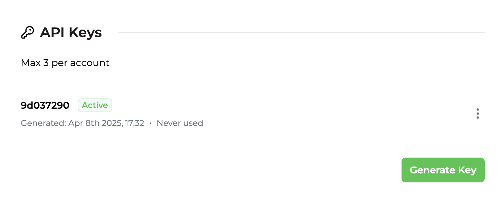
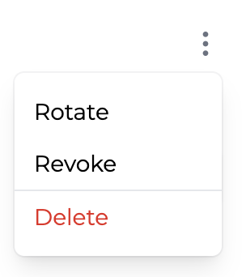

## Claves API {#api-keys}

Cada cuenta puede crear un máximo de 3 claves API desde la [Página de Integración](https://app.trophy.so/integration). Si ya te has registrado, habrás creado una durante la incorporación.

Trophy realiza un seguimiento y muestra cuándo se creó cada clave API en tu cuenta y cuándo se usó por última vez para que puedas rastrear fácilmente el uso.

<Frame>
  
</Frame>

### Anatomía de una clave API {#anatomy-of-an-api-key}

Cada clave API está compuesta por 2 partes separadas por un punto:

```bash
{prefix}•{body}
```

- El _prefijo_ son los primeros 8 caracteres. Es legible y siempre permanecerá igual para que sea fácilmente reconocible.
- El _cuerpo_ es la parte secreta y solo se te muestra una vez cuando creas la clave.

<Note>
  Al utilizar la API, ambas partes de tu clave API deben enviarse en el encabezado `X-API-KEY`.
</Note>

### Autenticación de Solicitudes {#authenticating-requests}

Al realizar solicitudes a la API, asegúrate de incluir **ambas** partes de tu clave API en el encabezado `X-API-KEY` como en este ejemplo:

```bash
curl https://app.trophy.so/api/users/<userId>/metrics/<key> \
     -H "X-API-KEY: ********.***********************"
```

Si no pasas una clave API o tu clave API no es válida, recibirás un código de respuesta `401`.

## Gestión de claves API {#managing-api-keys}

Existen varias operaciones diferentes que puedes realizar con las claves API desde tu panel de Trophy para gestionar tu integración.

<Frame>
  
</Frame>

### Rotación de claves {#rotating-keys}

Las claves de API se pueden rotar si deseas cambiarlas por cualquier motivo. En el momento de la rotación, la clave de API original dejará de funcionar inmediatamente y cualquier solicitud que aún la utilice comenzará a recibir respuestas `401`.

<Note>
  Ten en cuenta que al rotar las claves, tanto el prefijo como el cuerpo cambiarán.
</Note>

### Revocación de claves {#revoking-keys}

Las claves de API también se pueden revocar por completo, momento en el cual pasan a estar _Inactivas_. En el momento de la revocación, la clave de API dejará de funcionar inmediatamente y cualquier solicitud que aún la utilice comenzará a recibir respuestas `401`.

Una vez revocada, puedes reactivar la clave de API en cualquier momento.

<Note>
  Ni el prefijo ni el cuerpo de la clave cambian cuando se revoca o se reactiva.
</Note>

### Eliminación de claves de API {#deleting-api-keys}

Si estás 100% seguro de que ya no necesitas una clave de API, se pueden eliminar.

<Error>Una vez que las claves de API se eliminan, no se pueden recuperar.</Error>

## Obtener soporte {#get-support}

¿Quieres ponerte en contacto con el equipo de Trophy? Contáctanos por [correo electrónico](mailto:support@trophy.so). ¡Estamos aquí para ayudarte!
