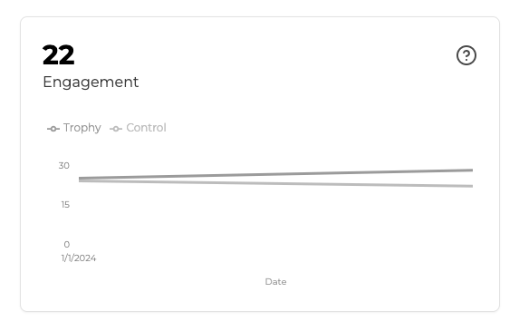
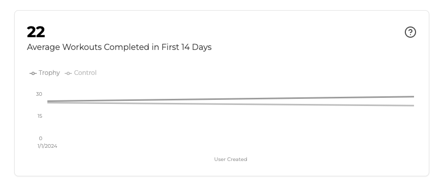

## ¿Qué es el Engagement? {#what-is-engagement}

El engagement de usuarios en Trophy se refiere al nivel promedio de actividad que tus usuarios muestran al usar tu producto.

Como Trophy rastrea las interacciones de usuarios a través de [Métricas](/es/platform/metrics), puede ofrecerte información sobre qué tan activos están tus usuarios con respecto a cada una y en conjunto.

El engagement de usuarios en Trophy es el valor promedio total de eventos de métricas por usuario activo diario. La fórmula es:

```
sum of all metric event values in a day / number of users active that day
```

## Analíticas de Engagement {#engagement-analytics}

Los dashboards de Trophy para cada métrica muestran gráficos de engagement para esa métrica, y el dashboard principal de Trophy presenta el engagement de usuarios de forma agregada.

<Frame>
  
</Frame>

Trophy también muestra gráficos que presentan el engagement de usuarios durante sus primeros días después de registrarse en tu producto.

<Frame>
  
</Frame>

Nos referimos a esto como 'engagement temprano' y es el engagement de usuarios medido por Trophy únicamente para usuarios dentro del período de tiempo establecido en la configuración 'Ventana de Activación de Nuevos Usuarios' en la [página de integración](https://app.trophy.so/integration/configure).

<Frame>
  
</Frame>

Este es un gráfico útil para comprender el engagement de usuarios durante sus primeros días con tu producto y para identificar dónde pueden estar ocurriendo obstáculos en la activación inicial de usuarios.

## Obtén Soporte {#get-support}

¿Quieres contactar al equipo de Trophy? Comunícate con nosotros por [correo electrónico](mailto:support@trophy.so). ¡Estamos aquí para ayudarte!
