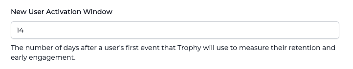

## ¿Qué es la retención? {#what-is-retention}

La retención de usuarios es el porcentaje de usuarios que siguen utilizando tu producto después de un cierto periodo.

Los marcos temporales comunes incluyen retención a 7, 14 y 30 días, donde los periodos más cortos proporcionan información sobre la experiencia inicial del usuario y los periodos más largos ofrecen información sobre el ajuste producto-mercado a largo plazo.

## Analítica de retención {#retention-analytics}

Trophy incluye un gráfico de retención para cada métrica en su panel de métricas y un gráfico agregado de retención de usuarios en el panel principal.

<Frame>
  
</Frame>

La [página de integración](https://app.trophy.so/integration/configure) te permite controlar el marco temporal en el que deseas medir la retención mediante la configuración 'Ventana de activación de nuevos usuarios'.

<Frame>
  
</Frame>

## Obtener soporte {#get-support}

¿Quieres contactar con el equipo de Trophy? Comunícate con nosotros por [correo electrónico](mailto:support@trophy.so). ¡Estamos aquí para ayudarte!
