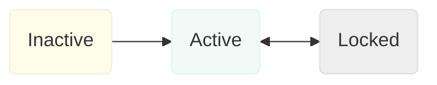
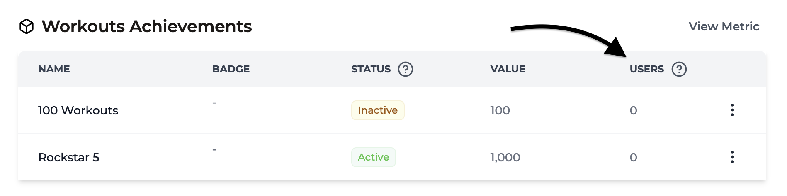
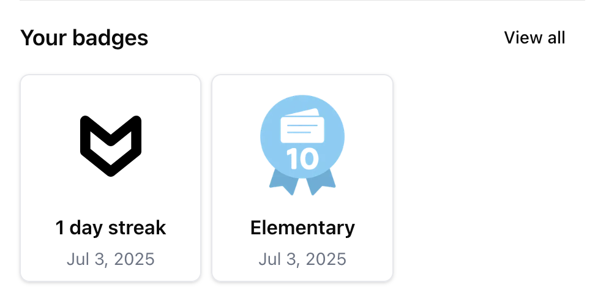
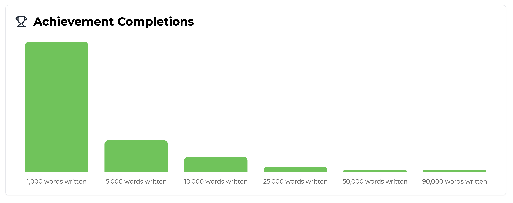

import MetricChangeResponseBlock from "../../snippets/metric-change-response-block.mdx";
import AllAchievementsResponseBlock from "../../snippets/all-achievements-response-block.mdx";

## ¿Qué son los Logros? {#what-are-achievements}

Los logros son recompensas que los usuarios pueden desbloquear mientras usan tu plataforma. Se pueden utilizar para recompensar a los usuarios por el progreso continuo en los recorridos principales del usuario, o para motivarlos a explorar funcionalidades más recientes.

Los logros funcionan mejor cuando están diseñados para incentivar a los usuarios a realizar acciones que probablemente conduzcan a un aumento de la retención.

<Tip>
  Usa las [analíticas de métricas](/es/features/metrics#metric-analytics) de Trophy para comparar
  la retención de cada interacción del usuario, luego configura logros en torno a
  estas interacciones para maximizar el impacto en la retención.
</Tip>

Aquí examinaremos los tipos de logros que puedes crear con Trophy, las diferentes formas de usarlos y cómo integrarlos en tu plataforma.

Mira a Charlie mientras explica el uso de logros en una aplicación NextJS:

<Frame>
  <iframe
    width="560"
    height="315"
    src="https://www.youtube.com/embed/U6TRxV036Lk?si=pAX37TXL8rNeFzz7"
    title="YouTube video player"
    frameborder="0"
    allow="accelerometer; autoplay; clipboard-write; encrypted-media; gyroscope; picture-in-picture"
    allowfullscreen
  ></iframe>
</Frame>

## Tipos de Logros {#achievement-types}

Trophy ofrece cinco tipos de logros: [Métrica](#metric-achievements), [API](#api-achievements), [Racha](#streak-achievements), [Aniversario](#anniversary-achievements) y [Logros compuestos](#composite-achievements), detallados a continuación.

### Logros de Métrica {#metric-achievements}

Los logros de métrica están vinculados a [Métricas](/es/features/metrics) y se utilizan mejor cuando quieres incentivar a los usuarios a realizar la misma acción una y otra vez.

Tomemos el ejemplo de una plataforma de estudio que usa Trophy para animar a los usuarios a ver más tarjetas de estudio con logros de métrica de la siguiente manera:

- 1.000 tarjetas de estudio
- 2.500 tarjetas de estudio
- 5.000 tarjetas de estudio
- 10.000 tarjetas de estudio
- 25.000 tarjetas de estudio
- 50.000 tarjetas de estudio

En este caso crearías una métrica llamada _Tarjetas Volteadas_ y crearías logros vinculados a la métrica para cada hito.

Dado que estos logros están directamente vinculados a la métrica _Tarjetas Volteadas_, Trophy rastreará automáticamente cuándo los usuarios desbloquean estos logros a medida que [incrementan la métrica](/es/features/events#tracking-metric-events).

Cuando se desbloquean logros, Trophy incluye información sobre los logros desbloqueados en la respuesta del [API de Eventos](/es/api-reference/endpoints/events/submit-a-metric-event) y activa automáticamente [Emails de Logros](/es/features/emails#achievement-emails) si están configurados.

<MetricChangeResponseBlock />

### Logros de API {#api-achievements}

Los logros de API solo se pueden completar una vez y son útiles para recompensar a los usuarios por realizar acciones específicas.

Ejemplos comunes incluyen:

- Un usuario que completa su perfil después de registrarse
- Un usuario que vincula su cuenta de redes sociales a una plataforma
- Un usuario que comparte su experiencia con el producto en redes sociales

Los logros de API sirven como una manera fácil de recompensar a los usuarios por completar cualquier acción que consideres importante para la retención.

Al igual que los logros de métrica, los logros de API también pueden activar [Emails de Logros](/es/features/emails#achievement-emails) automatizados si están configurados.

### Logros de Racha {#streak-achievements}

Los logros de racha están directamente vinculados a la [Racha](/es/features/streaks) de un usuario y se desbloquean automáticamente cuando los usuarios alcanzan una duración de racha particular.

Puedes crear tantos logros de racha como desees para duraciones de racha cada vez mayores, por ejemplo 7 días, 30 días y 365 días para motivar a los usuarios a usar tu aplicación cada vez más.

Al igual que los logros de métrica y API, puedes agregar un nombre personalizado y asignar una insignia a los logros de racha.

### Logros de Aniversario {#anniversary-achievements}

Los logros de aniversario se desbloquean automáticamente cuando un usuario alcanza un aniversario específico de su fecha de registro.

Crea un logro para cada año que quieras celebrar, por ejemplo 1 año, 2 años y 5 años. Trophy desbloquea cada logro cuando se alcanza el [`signUpDate`](/es/features/users#optional-attributes) del usuario más ese número de años.

Los usuarios sin `signUpDate` no son elegibles. Establece `signUpDate` cuando [identifiques](/es/features/users#identifying-users) o [actualices](/es/features/users#keeping-users-up-to-date) usuarios para que Trophy pueda detectar aniversarios.

Trophy evalúa el aniversario en el día calendario según la [`tz`](/es/features/users#optional-attributes) del usuario. Establece `tz` para que el logro se desbloquee en el día local correcto.

Al igual que otros tipos de logros, los logros de aniversario pueden activar [Correos de Logros](/es/features/emails#achievement-emails) cuando se desbloquean.

### Logros Compuestos {#composite-achievements}

Los logros compuestos se desbloquean automáticamente cuando un usuario ha completado todos los logros prerequisito que selecciones. Son ideales para crear recompensas por niveles o maestría que reconocen a los usuarios que han alcanzado un conjunto específico de hitos.

Por ejemplo, podrías crear un logro compuesto "Maestro del Estudio" que se desbloquea cuando un usuario ha completado:
- 1,000 tarjetas de estudio
- Racha de 7 días
- Completar la incorporación

Los logros compuestos son útiles para crear rutas de progresión y fomentar que los usuarios interactúen en diferentes áreas de tu aplicación. Al igual que otros tipos de logros, pueden activar [Correos de Logros](/es/features/emails#achievement-emails) cuando se desbloquean.

## Crear Logros {#creating-achievements}

Para crear nuevos logros, dirígete a la [página de logros](https://app.trophy.so/achievements) en el panel de Trophy y haz clic en el botón **Nuevo Logro**:

<Tip>
También puedes crear, actualizar y eliminar logros mediante programación con la [API de administración](/es/admin-api/endpoints/achievements/create-achievements).
</Tip>

<Frame>
  <video
    autoPlay
    muted
    loop
    playsInline
    className="w-full aspect-video"
    src="../../assets/features/achievements/create_new_achievement.mp4"
  ></video>
</Frame>

<Steps>
<Step title="Ingresa un nombre">
  Ingresa un nombre para el logro. Este se devolverá desde las API y estará disponible para su uso en correos electrónicos y otras áreas de Trophy cuando sea apropiado.
</Step>

<Step title="Ingresa una descripción (Opcional)">
  Ingresa una breve descripción del logro. Esta se devolverá desde las API
  y estará disponible para su uso en correos electrónicos y otras áreas de Trophy
  cuando sea apropiado.
</Step>

<Step title="Agrega una insignia (Opcional)">
  Puedes agregar una insignia subiendo una imagen o ingresando una URL de imagen personalizada.
  La URL se devuelve en las respuestas de la API y se usa en correos electrónicos y otras áreas de
  Trophy cuando sea apropiado.
</Step>

<Step title="Elige un tipo de activador">
  Elige cómo quieres que se desbloquee este logro.
  
- Al elegir **Métrica** el logro se desbloqueará automáticamente cuando el total de métricas del usuario alcance el valor de activación del logro.

- Al elegir **Racha** el logro se desbloqueará automáticamente cuando la longitud de la racha del usuario alcance el valor de activación del logro.

- Al elegir **Aniversario** el logro se desbloqueará automáticamente cuando el usuario alcance el aniversario especificado de su [`signUpDate`](/es/features/users#optional-attributes).

- Al elegir **Llamada API** el logro solo se desbloqueará cuando sea marcado explícitamente como completado por tu código mediante una solicitud a la [API de completar logro](/es/api-reference/endpoints/achievements/mark-an-achievement-as-completed).

- Al elegir **Compuesto** el logro se desbloqueará automáticamente cuando el usuario haya completado todos los logros prerequisito que selecciones.

</Step>

<Step title="Configura el activador">
  Una vez que hayas elegido el tipo de activador para el logro, necesitas configurar los ajustes del activador.

- Si elegiste el activador **Métrica**, deberás seleccionar la métrica y el valor total del usuario que debe desbloquear el logro al alcanzarse.

- Si elegiste el activador **Racha**, deberás establecer la longitud de la racha que debe desbloquear el logro.

- Si elegiste el activador **Aniversario**, deberás establecer el número de años después del registro que debe desbloquear el logro.

- Si elegiste el activador **Llamada API**, deberás elegir una referencia única `key` que usarás para completar el logro a través de la [API](/es/api-reference/endpoints/achievements/mark-an-achievement-as-completed).

- Si elegiste el activador **Compuesto**, deberás seleccionar los logros prerequisitos que deben completarse todos para que este logro se desbloquee. El logro compuesto se desbloqueará automáticamente cuando un usuario complete el último prerequisito.

</Step>

<Step title="Añade filtros de atributos (Opcional)">
Puedes asignar filtros de atributos a un logro para restringir aún más quién puede desbloquearlo y cuándo.

- Para limitar un logro de **Métrica** a que solo se aplique a eventos con [atributos de evento personalizados](/es/features/events#custom-event-attributes) específicos, añade uno o más filtros en la sección **Atributos de Evento**.

- Para limitar cualquier tipo de logro a que solo se aplique a un usuario con uno o más [atributos de usuario personalizados](/es/features/users#custom-user-attributes) específicos, añade atributos y los valores deseados en la sección **Atributos de Usuario**.

<Note>
  Cuando estableces múltiples filtros de atributos de evento, todos deben coincidir para que el
  logro de métrica se aplique. En las respuestas de API, `eventAttributes` es el
  campo canónico e `eventAttribute` está obsoleto por compatibilidad heredada.
</Note>

</Step>

<Step title="Guarda">
  Guarda el nuevo logro.
</Step>
</Steps>

## Gestión de Logros {#managing-achievements}

Trophy cuenta con herramientas integradas para ayudarte a probar y controlar qué logros se pueden desbloquear, por quién y cuándo, sin afectar la producción.

### Estados de los Logros {#achievement-statuses}

Aquí tienes una descripción general de los diferentes estados de los logros y lo que significan.

**Inactivo**

Todos los logros se crean como inactivos. Los logros inactivos no se pueden completar y no se devuelven en ninguna API de logros. Los usuarios no los verán hasta que los actives.

**Activo**

Cuando activas un logro, lo haces 'en vivo'. Los usuarios pueden completarlo y se devolverá desde todas las API de logros.

**Bloqueado**

Cuando bloqueas un logro, los usuarios que aún no lo hayan desbloqueado ya no podrán desbloquearlo, pero los usuarios que ya lo hayan desbloqueado no se verán afectados.

Los logros bloqueados solo se devuelven en las API para usuarios que ya los han conseguido.

### Flujo de Trabajo de Logros {#achievement-workflow}

Los logros se pueden mover a través de diferentes estados según el siguiente flujo de trabajo:



## Completar Logros {#completing-achievements}

Si estás usando logros basados en métricas, no es necesario _completar_ logros explícitamente. Una vez que hayas configurado el [seguimiento de métricas](/es/features/events#tracking-metric-events) en tu código, todos los logros vinculados a la métrica se rastrearán automáticamente.

De manera similar, si estás usando logros de racha, todos los logros relacionados con la racha del usuario se desbloquearán automáticamente cuando un usuario alcance la longitud de racha respectiva.

Los logros de aniversario también se completan automáticamente. Se desbloquean cuando un usuario alcanza el aniversario configurado de su [`signUpDate`](/es/features/users#optional-attributes). Los usuarios sin un `signUpDate` no pueden desbloquearlos.

Los logros compuestos también se completan automáticamente. Se desbloquean tan pronto como un usuario haya completado todos sus logros prerequisito. No se necesitan llamadas API adicionales.

Sin embargo, si estás utilizando logros de API, tendrás que marcarlos como completados para cada usuario según corresponda. Para hacer esto, puedes usar la [API de Completar Logro](/es/api-reference/endpoints/achievements/mark-an-achievement-as-completed) utilizando el `key` del logro que deseas completar.

Esto devolverá una respuesta que contiene detalles del logro que se completó y que se puede usar en cualquier flujo de trabajo posterior a la finalización, como mostrar una notificación en la aplicación.

{/* vale off */}

```json Response
{
  "completionId": "0040fe51-6bce-4b44-b0ad-bddc4e123534",
  "achievement": {
    "id": "5100fe51-6bce-6j44-b0hs-bddc4e123682",
    "trigger": "api",
    "name": "Finish onboarding",
    "description": "Complete the onboarding process.",
    "badgeUrl": "https://example.com/badge.png",
    "key": "finish-onboarding",
    "achievedAt": "2021-01-01T00:00:00Z"
  }
}
```

{/* vale on */}

## Retroactividad de Logros {#backdating-achievements}

De forma predeterminada, cada vez que cambias un logro al [estado](#managing-achievements) 'Activo', Trophy verificará si algún usuario existente cumple con los requisitos del logro y lo completará automáticamente en segundo plano.

Esto significa que cuando lances nuevos logros en producción, o edites un logro activo existente, la retroactividad ocurrirá automáticamente.

Lo mismo se aplica cuando estableces o cambias el [`signUpDate`](/es/features/users#optional-attributes) de un usuario. Si el usuario ya califica para algún logro de aniversario activo, Trophy los completa de forma silenciosa.

<Note>
  Cuando los logros se completan de esta manera, los usuarios no reciben ninguna
  notificación de que esto ha sucedido. Esto es para evitar que los cambios en tus
  logros en Trophy resulten en que los usuarios reciban muchas notificaciones.
</Note>

Puedes verificar cuántos usuarios han completado logros en cualquier momento en la [página de logros](https://app.trophy.so/achievements) del panel de Trophy. La columna _Usuarios_ en los logros puede actualizarse durante la retroactividad.

<Frame>
  
</Frame>

## Uso de Insignias {#using-badges}

<Frame>
  <video
    autoPlay
    muted
    loop
    playsInline
    className="w-full aspect-video"
    src="../../assets/features/achievements/upload_badge.mp4"
  ></video>
</Frame>

Puedes asignar una insignia a cualquier logro cargando una imagen—Trophy la sirve y devuelve la URL—o proporcionando tu propia URL de imagen. Las respuestas de API relevantes incluyen ese valor en `badgeUrl` para usarlo como `src` en las etiquetas ``.

```json Response {8}
{
  "completionId": "0040fe51-6bce-4b44-b0ad-bddc4e123534",
  "achievement": {
    "id": "5100fe51-6bce-6j44-b0hs-bddc4e123682",
    "trigger": "api",
    "name": "Finish onboarding",
    "description": "Complete the onboarding process.",
    "badgeUrl": "https://example.com/badge.png",
    "key": "finish-onboarding",
    "achievedAt": "2021-01-01T00:00:00Z"
  }
}
```

## Mostrar Logros {#displaying-achievements}

Trophy cuenta con varias APIs que permiten mostrar logros dentro de tus aplicaciones. Aquí veremos las diferentes formas de usarlas y los tipos de interfaces que puedes construir.

<Tip>
  Consulta nuestra [guía completa](/es/guides/how-to-build-an-achievements-feature) sobre
  cómo agregar una funcionalidad de logros a tu app para más detalles.
</Tip>

### Todos los Logros {#all-achievements}

Para mostrar una vista general de alto nivel de todos los logros que los usuarios pueden completar, utiliza el [endpoint de todos los logros](/es/api-reference/endpoints/achievements/all-achievements). Usa estos datos para construir una interfaz que dé a los usuarios una idea de las rutas de progresión dentro de tu aplicación.

<Frame>
  <video
    autoPlay
    muted
    loop
    playsInline
    className="w-full aspect-video"
    src="../../assets/features/achievements/displaying_trophy_cabinet.mp4"
  ></video>
</Frame>

El endpoint de todos los logros devuelve una lista de todos los logros dentro de tu cuenta de Trophy. Cada logro devuelto también incluye `completions` (el número de usuarios que han completado el logro) y `rarity` (el porcentaje de usuarios que han completado el logro) como sigue:

<AllAchievementsResponseBlock />

### Logros de Usuario {#user-achievements}

Si en cambio estás construyendo elementos de interfaz específicos para usuarios, entonces utiliza el [endpoint de logros de usuario](/es/api-reference/endpoints/users/get-a-users-completed-achievements) para devolver los logros que un usuario específico ha completado.

<Tip>
  También puedes incluir logros que un usuario aún no ha completado al incluir
  el parámetro de consulta `includeIncomplete=true`.
</Tip>

<Frame>
  
</Frame>

## Analíticas de Logros {#achievement-analytics}

Si tienes logros configurados para cualquiera de tus [Métricas](/es/features/metrics), entonces la página de analíticas de métricas muestra un gráfico que te presenta el progreso actual de todos los Usuarios de la siguiente manera:

<Frame>
  
</Frame>

## Preguntas Frecuentes {#frequently-asked-questions}

<AccordionGroup>
  <Accordion title="¿Qué tipo de logros debo usar?">
    Usa logros de métricas para recompensar a los usuarios por realizar la misma acción una y otra vez, y para incentivarlos a hacerlo más.

    Usa logros de racha para recompensar a los usuarios por mantener su racha.

    Usa logros de aniversario para recompensar a los usuarios por permanecer en tu plataforma a lo largo del tiempo.

    Usa logros de API cuando quieras recompensar a los usuarios por realizar acciones específicas que solo necesitan realizar una vez.

    Usa logros compuestos cuando quieras crear recompensas escalonadas o de nivel de maestría que se desbloqueen cuando los usuarios completen un conjunto específico de logros prerequisitos.

  </Accordion>

    <Accordion title="¿Qué logros debería crear?">
    Los logros, como toda la gamificación, ofrecen la mejor retención cuando están estrechamente alineados con la razón principal por la que el usuario usa tu plataforma.

    Usa los [análisis de métricas](/es/features/metrics#metric-analytics) de Trophy para comparar la retención de cada interacción del usuario, luego configura logros en torno a estas interacciones para maximizar el impacto en la retención.

</Accordion>

</AccordionGroup>

## Obtener soporte {#get-support}

¿Quieres contactar con el equipo de Trophy? Comunícate con nosotros por [correo electrónico](mailto:support@trophy.so). ¡Estamos aquí para ayudarte!
