import { PlanBadge } from "../components/plan-badge.jsx";

Trophy puede enviar emails automatizados a los usuarios basados en activadores clave sin requerir código. Aquí veremos cuáles son estos activadores y cómo pueden formar parte de la experiencia de gamificación de tu producto.

## Tipos de Emails {#types-of-emails}

Trophy soporta 4 tipos de emails, cada uno diseñado para adaptarse a un escenario común en la construcción de experiencias de gamificación.

Todos los emails son opcionales, pero los cuatro pueden usarse simultáneamente y controlarse desde la página de [Emails](https://app.trophy.so/emails/configure) en el panel de Trophy.

<Frame>
  <video
    autoPlay
    muted
    loop
    playsInline
    className="w-full aspect-15/4"
    src="../../assets/features/emails/email_types.mp4"
  ></video>
</Frame>

- **Emails de logros** se envían a los usuarios cada vez que desbloquean un [Logro](/es/features/achievements).
- **Emails de resumen** se envían a los usuarios con una frecuencia predefinida para resumir el progreso. Los emails de resumen pueden configurarse para enviarse diaria, semanal, mensual o anualmente según tu caso de uso.
- **Emails de reactivación** se envían a los usuarios después de que se vuelven inactivos con el objetivo de traerlos de vuelta a tu aplicación.
- **Emails de rachas** se envían automáticamente a los usuarios recordándoles extender su [Racha](/es/features/streaks).

## Envío de Emails {#sending-emails}

Para comenzar a enviar emails con Trophy, necesitarás verificar tu dominio y añadir y activar plantillas de email para los tipos que deseas enviar.

<Tip>
  Los usuarios pueden controlar qué notificaciones por email reciben a través del
  [API de preferencias de usuario](/es/features/users#notification-preferences) de Trophy. Esto te permite
  construir un centro de preferencias en tu aplicación donde los usuarios pueden activar o
  desactivar tipos específicos de emails.
</Tip>

### Verificación de dominio {#domain-verification}

Trophy admite el envío de correos electrónicos desde tu propio dominio desde el primer momento. Hay dos formas de configurar esto: Verificación del remitente y Verificación DNS.

Todas las configuraciones de dominio se pueden encontrar en la página [Dominios](https://app.trophy.so/emails/domains) del panel de Trophy.

<Tip>
  Si buscas configurarte rápidamente, te recomendamos comenzar con la
  Verificación del remitente y luego configurar la Verificación DNS cuando estés
  listo para pasar a producción.
</Tip>

<CardGroup cols={2}>
  <Card
    title="Verificación del remitente"
    icon="check"
    href="#sender-verification-basic"
  >
    Verifica rápidamente una sola dirección de correo electrónico
  </Card>
  <Card title="Verificación DNS" icon="lock" href="#dns-verification-advanced">
    Recomendado para uso en producción
  </Card>
</CardGroup>

#### Verificación del remitente (básica) {#sender-verification-basic}

Durante la incorporación, se te pedirá que configures la Verificación del remitente. Esta es una forma muy sencilla de verificar rápidamente una única dirección de correo electrónico que deseas usar con Trophy sin necesidad de cambiar código ni configuraciones DNS.

Se te pedirá que ingreses la dirección de correo electrónico, el nombre del remitente y el correo de respuesta que deseas que Trophy utilice al enviar correos:

<Frame>
  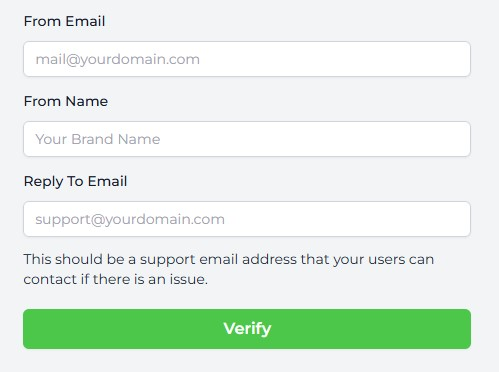
</Frame>

Trophy enviará un correo de verificación a esa dirección. Simplemente haz clic en el enlace del correo para que Trophy sepa que eres el propietario de la dirección y estarás listo.

<Note>
  El correo que recibas provendrá de nuestro proveedor de correo, Postmark. ¡Así
  que estate atento a 'Postmark Support' en tu bandeja de entrada!
</Note>

La Verificación del remitente es excelente para comenzar, pero tiene la limitación de que no te beneficiarás de tu reputación de correo existente y solo podrás enviar correos desde una dirección.

Además, si deseas cambiar la dirección en el futuro, tendrás que realizar la Verificación del remitente nuevamente, lo cual puedes hacer en la [pantalla de configuración](https://app.trophy.so/integration?tab=domains).

#### Verificación DNS (Avanzado) {#dns-verification-advanced}

<Note>
  Esta función está disponible en el plan [Starter](/es/account/billing#starter-plan).
</Note>

Para uso en producción, recomendamos la verificación DNS. Una vez configurada, esto te permite configurar Trophy para enviar correos electrónicos desde cualquier dirección en tu dominio. Así que si deseas cambiar la dirección en el futuro, no necesitarás verificar nuevamente.

Completar la verificación DNS también te brinda todos los beneficios de cualquier reputación de dominio existente y es la mejor manera de asegurarte de que tus correos electrónicos eviten la carpeta de spam.

Sin embargo, esto requiere agregar un par de nuevas entradas en tu DNS para permitir que Trophy verifique que eres propietario del dominio.

Sigue los pasos a continuación para configurar la verificación DNS:

<Steps>
<Step title="Dirígete a la página de Correos electrónicos">
    Dentro de la página de Correos electrónicos, encontrarás la pestaña [Dominios](https://app.trophy.so/emails/domains), que es donde configurarás todo lo relacionado con el dominio de correo electrónico que Trophy utilizará para enviar correos en tu nombre.
</Step>

<Step title="Configura tu dominio">
    Dirígete a la sección de Verificación DNS e ingresa el dominio que deseas configurar con Trophy.

    También puedes configurar una Ruta de retorno personalizada. Aquí es donde Trophy reenviará las notificaciones de correos rebotados para ayudarte a investigar problemas de entregabilidad:

    <Frame>
      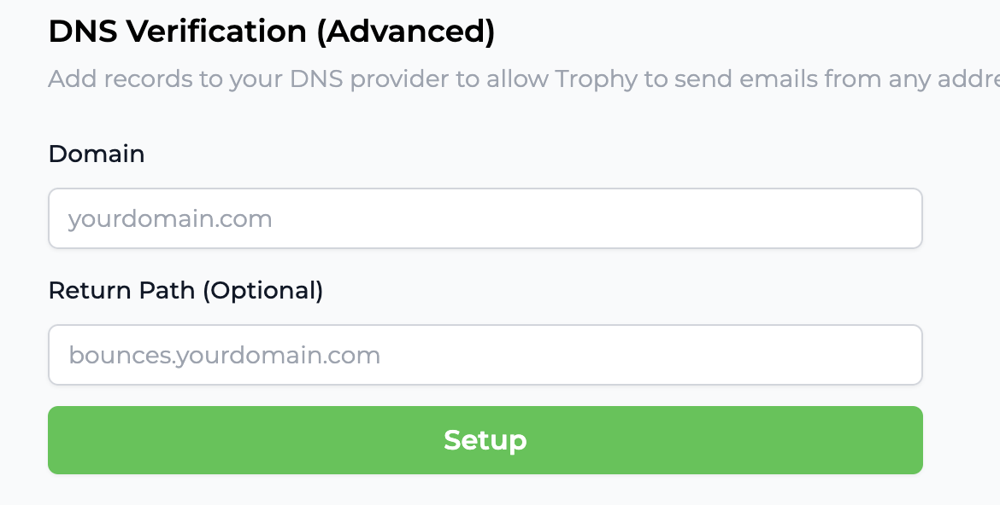
    </Frame>

</Step>

<Step title="Configura tus registros DNS">

    Una vez que hayas ingresado tu dominio de correo electrónico, Trophy te proporcionará los detalles de dos nuevos registros DNS que necesitarás agregar a tu proveedor de DNS.

    <Frame>
      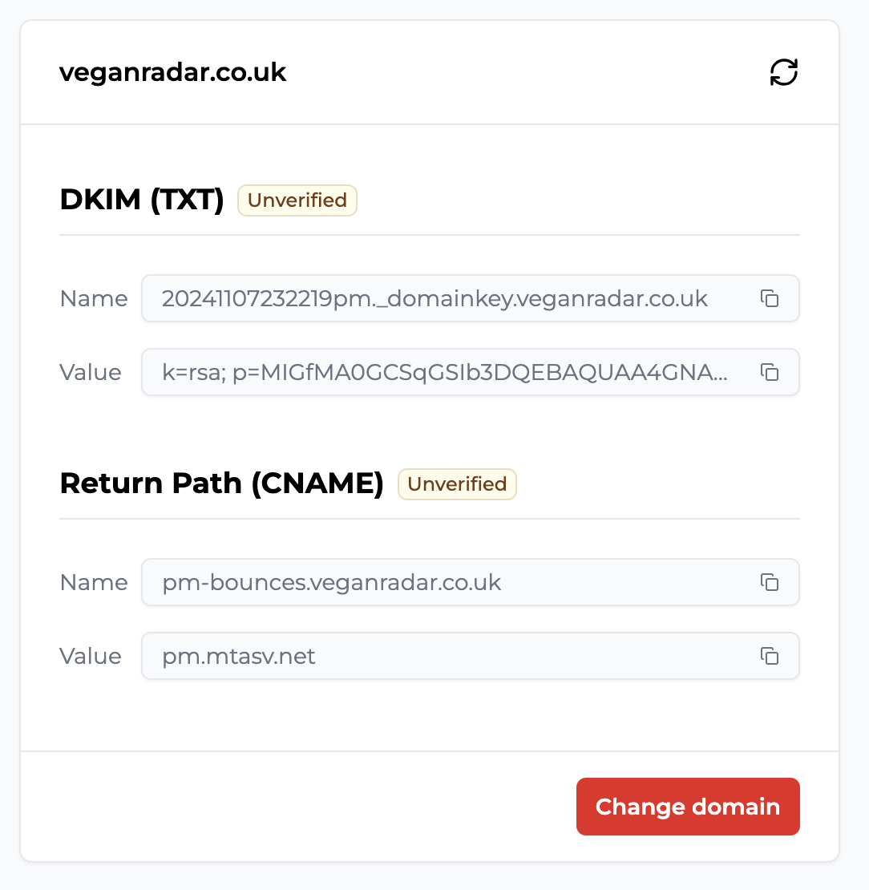
    </Frame>

    - Primero está el registro **DKIM** que utilizan los proveedores de correo como Google para verificar la autenticidad de los correos electrónicos. Ingresa el nombre y el valor proporcionados como un nuevo registro **TXT** en tu proveedor de DNS.
    - Segundo está el registro **Return Path**. Este se utiliza para reenviar notificaciones de rebotes de correo electrónico a tu dominio. Ingresa el nombre y el valor proporcionados como un nuevo registro **CNAME** en tu proveedor de DNS.

    Estas son las páginas de los proveedores de DNS más comunes sobre cómo configurar nuevos registros:

    <AccordionGroup>
      <Accordion title='GoDaddy'>
          [Agregar un registro TXT](https://www.godaddy.com/en-uk/help/add-a-txt-record-19232)
          [Agregar un registro CNAME](https://www.godaddy.com/en-uk/help/add-a-cname-record-19236)
      </Accordion>
      <Accordion title='Cloudflare'>
          [Agregar registros DNS](https://developers.cloudflare.com/dns/manage-dns-records/how-to/create-dns-records/#create-dns-records)
      </Accordion>
      <Accordion title="NameCheap">
          [Agregar un registro CNAME](https://www.namecheap.com/support/knowledgebase/article.aspx/9646/2237/how-to-create-a-cname-record-for-your-domain/)
          [Agregar un registro TXT](https://www.namecheap.com/support/knowledgebase/article.aspx/317/2237how-do-i-add-txtspfdkimdmarc-records-for-my-domain/#:~:text=this%20guide%20.-,DKIM%20records,-DKIM%20(DomainKeys%20Identified))
      </Accordion>
    </AccordionGroup>

    <Warning>Nota: Si estás utilizando un proxy como Cloudflare, asegúrate de desactivarlo para estos registros o Trophy no podrá verificarlos correctamente.</Warning>

</Step>

<Step title="Verificar registros DNS">

    Una vez que hayas agregado los dos registros en tu configuración de DNS, pulsa el ícono de actualizar y Trophy intentará verificar los registros por ti.

    Normalmente Trophy puede verificar los registros en unos pocos minutos, pero ten en cuenta que los cambios de DNS pueden tardar hasta unas horas en propagarse completamente.

    Si ves la siguiente alerta, es posible que los registros aún no se hayan propagado o que haya un problema con tu configuración.

    <Frame>
      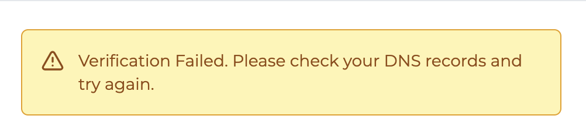
    </Frame>

    Una vez que estés seguro de que todo está configurado correctamente en tu proveedor de DNS, pulsa actualizar y Trophy intentará verificar tus registros DNS una vez más.

    En cuanto veas el siguiente mensaje, sabrás que todo está verificado:

    <Frame>
      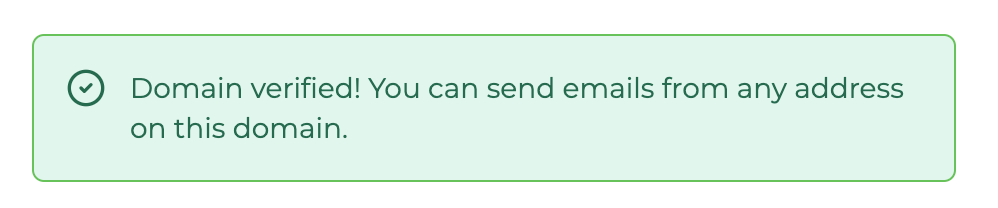
    </Frame>

</Step>

<Step title="Configura tu dirección de envío">

    Una vez que tus registros DNS estén verificados, es momento de elegir la dirección de correo electrónico desde la que deseas enviar emails. Ten en cuenta que ahora que has verificado completamente tu dominio, puedes cambiar esta dirección cuando quieras sin afectar la capacidad de entrega.

    Simplemente ingresa la dirección de correo electrónico desde la que deseas que Trophy envíe, el nombre que se mostrará a los usuarios en su bandeja de entrada cuando reciban correos y una dirección de correo de soporte que puedan usar para contactarte si es necesario:

    <Frame>
      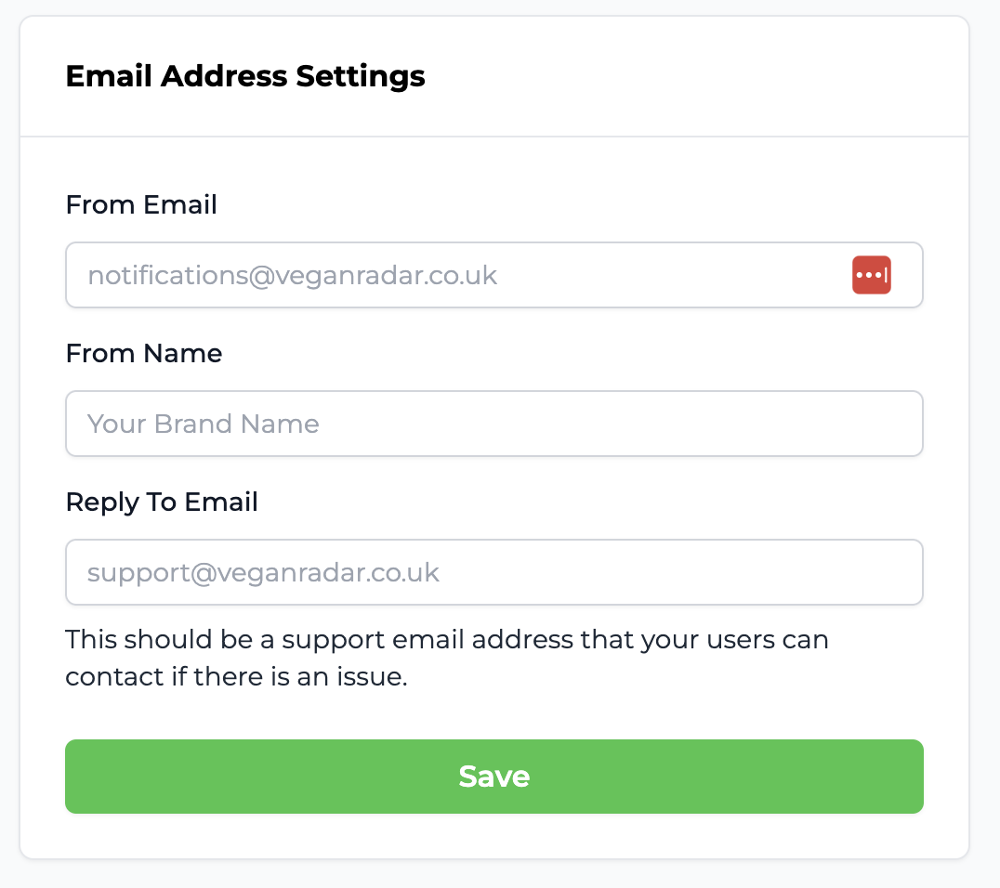
    </Frame>

</Step>

</Steps>

### Activadores de correo electrónico {#email-triggers}

En la página de [configuración de correo electrónico](https://app.trophy.so/emails/configure), cada tipo de correo tiene su propia sección. Agrega plantillas bajo el tipo correspondiente y activa una para comenzar a enviar.

#### Correos de resumen {#recap-emails}

Los correos de **resumen** envían reportes de progreso semanales o mensuales a los usuarios. Puedes cambiar la frecuencia de estos correos en la página de [integración](https://app.trophy.so/integration/configure) usando la configuración de **Período de agregación**, o con la [Admin API de configuración de organización](/es/admin-api/endpoints/settings/update-organization-settings).

<Frame>
  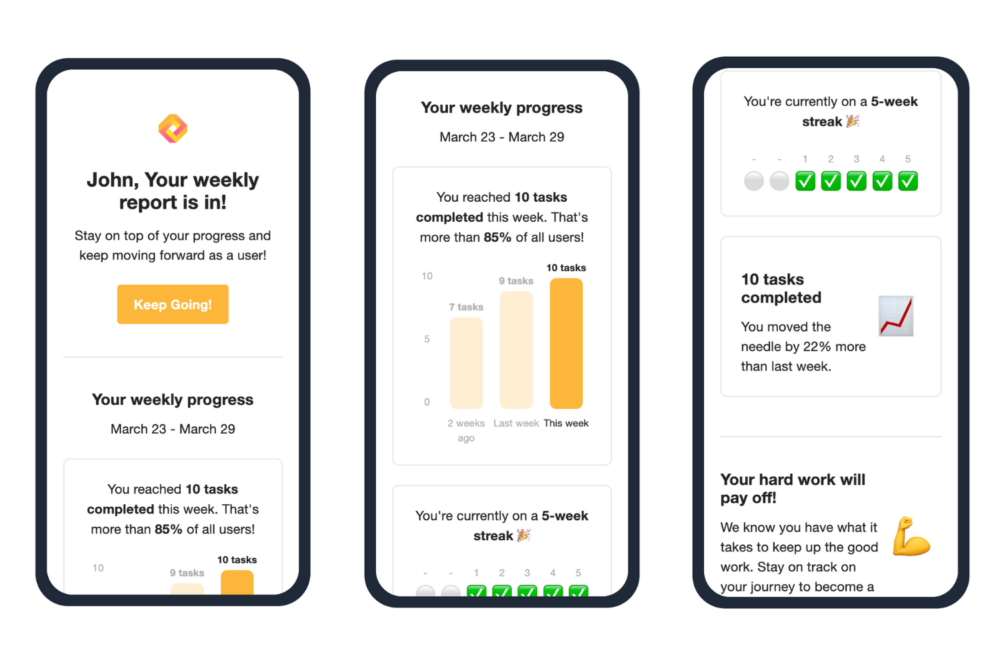
</Frame>

#### Correos de Reactivación {#reactivation-emails}

Los correos de **Reactivación** envían mensajes de recuperación a los usuarios después de que se vuelven inactivos. Estos correos se envían según el siguiente cronograma:

- Después de 3 días de inactividad
- Después de 5 días de inactividad
- Después de 7 días de inactividad
- Después de 14 días de inactividad
- Después de 30 días de inactividad

<Frame>
  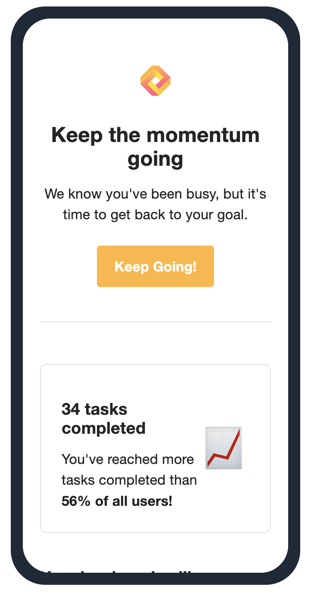
</Frame>

#### Correos de Racha {#streak-emails}

Los correos de **Racha** recuerdan a los usuarios extender su racha antes de que expire. Estos correos se envían según la frecuencia de racha que configuraste en la [página de rachas](https://app.trophy.so/streaks):

- Si tu aplicación usa una **racha diaria**, este correo se enviará cuatro horas antes del final del día (en la zona horaria de cada usuario).
- Para **rachas semanales**, se enviará el viernes por la mañana.
- Para **rachas mensuales**, se enviará el día 25 del mes.

<Frame>
  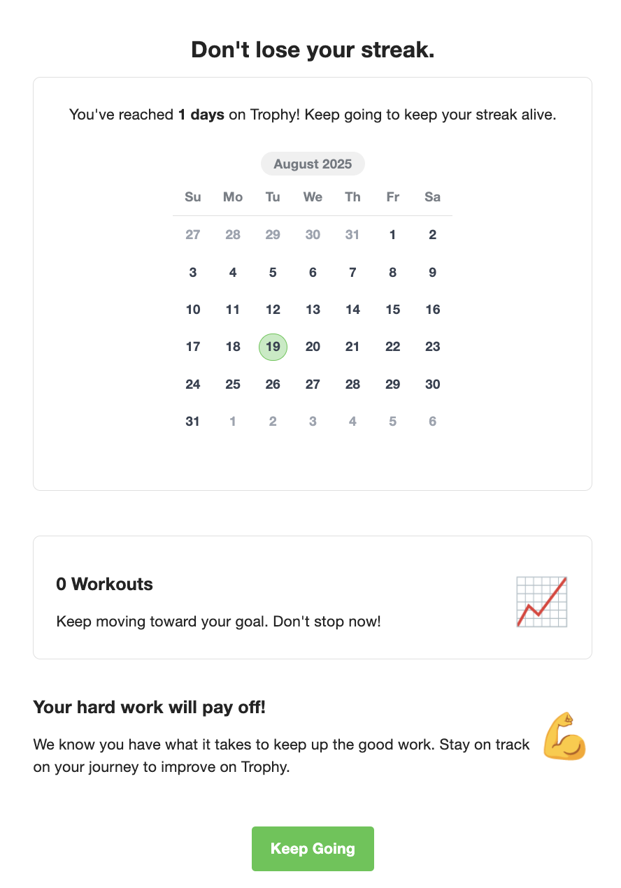
</Frame>

#### Correos de Logros {#achievement-emails}

Los correos de **Logro** felicitan a los usuarios cuando completan un [logro](/es/features/achievements) que hayas configurado en Trophy. Estos correos se envían entre las 5 y las 9 PM el día en que se completa el logro, o al día siguiente a las 5 PM si es después de las 9 PM cuando el usuario completa el logro.

<Frame>
  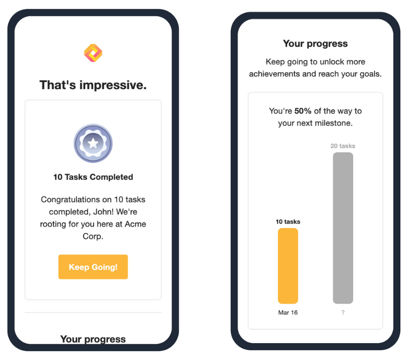
</Frame>

#### Limitar Correos a Tipos Específicos de Usuarios {#limiting-emails-to-specific-types-of-users}

Cada plantilla de correo puede limitarse a usuarios con valores específicos de [atributos de usuario personalizados](/es/features/users#custom-user-attributes).

Para cada atributo al que desees restringir el correo, haz clic en el ícono de más junto al encabezado **Filtros de Usuario** de la plantilla de correo, luego selecciona el atributo e ingresa el valor deseado. Solo los usuarios que tengan **todos** los valores de atributo especificados recibirán correos de esta plantilla.

<Frame>
  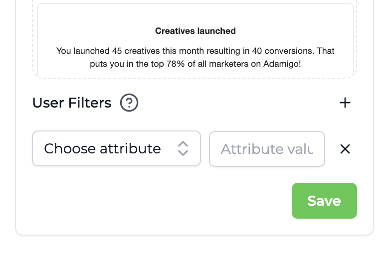
</Frame>

#### Zonas Horarias {#time-zones}

Si especificas una zona horaria para cada usuario mediante [Identificación de Usuarios](/es/features/users#param-tz), Trophy utilizará esa zona horaria local para programar correos según la lógica especificada anteriormente. Si no proporcionas zonas horarias para los usuarios que identificas, Trophy utilizará por defecto la hora del Este.

### Envío de correos electrónicos mediante webhooks {#sending-emails-via-webhooks}

En lugar de que Trophy envíe correos electrónicos por ti, puedes suscribirte a eventos de webhook de correo electrónico y enviar mensajes tú mismo a través de tu propio proveedor de correo o pipeline.

Cuando un correo electrónico esté programado normalmente, Trophy activa el webhook correspondiente para que puedas gestionar la entrega:

- [`emails.recap_due`](/es/webhooks/events/emails/recap-due)
- [`emails.reactivation_due`](/es/webhooks/events/emails/reactivation-due)
- [`emails.streak_reminder_due`](/es/webhooks/events/emails/streak-reminder-due)
- [`emails.achievement_due`](/es/webhooks/events/emails/achievement-due)

Estos webhooks se activan en función de los propios disparadores de correo electrónico, independientemente de si las plantillas de correo electrónico están habilitadas o deshabilitadas, e independientemente de cualquier [filtro de atributos de usuario](#limiting-emails-to-specific-types-of-users) configurado en esas plantillas. Si necesitas un filtrado equivalente, aplícalo en tu controlador de webhook.

Los webhooks de correo electrónico respetan las [preferencias de notificación](/es/features/users#notification-preferences) y el [atributo de control](/es/platform/experimentation#control-ratio) utilizado para la experimentación. Trophy no activará webhooks de correo electrónico para usuarios que hayan optado por no recibir ese tipo de correo electrónico, o para usuarios en el grupo de control.

<Warning>
  Si estás enviando correos electrónicos tú mismo desde estos webhooks, asegúrate de que las plantillas de correo electrónico correspondientes estén desactivadas en Trophy. Los webhooks de correo electrónico se activan cuando se cumplen los disparadores incluso si las plantillas están deshabilitadas, pero si las plantillas permanecen habilitadas, Trophy también enviará sus propios correos electrónicos, lo que resultará en una entrega duplicada.
</Warning>

## Diseño de correos electrónicos {#designing-emails}

Trophy tiene un editor de correo electrónico basado en bloques con todas las funciones que te permite diseñar plantillas, controlando todo el texto del correo electrónico y las líneas de asunto. En la página de [correos electrónicos](https://app.trophy.so/emails/configure), añade plantillas en cada sección de [tipo de correo electrónico](#email-triggers) que desees utilizar.

<Frame>
  <video
    autoPlay
    muted
    loop
    playsInline
    className="w-full aspect-15/4"
    src="../../assets/features/emails/designing_emails.mp4"
  ></video>
</Frame>

### Plantillas predeterminadas {#default-templates}

Por defecto, Trophy proporciona una plantilla para cada [tipo de correo electrónico](#types-of-emails) como un buen punto de partida. Las plantillas predeterminadas no se pueden cambiar, pero puedes duplicarlas y personalizarlas como desees.

<Tip>
  También puedes crear plantillas en blanco si solo quieres empezar desde cero.
</Tip>

### Crear una nueva plantilla {#creating-a-new-template}

Para crear una nueva plantilla de correo electrónico, sigue los pasos a continuación.

<Steps>
  <Step title="Dirígete a la página de correos electrónicos">
    En la página de correos electrónicos, encontrarás la pestaña
    [Configurar](https://app.trophy.so/emails/configure), donde cada sección de tipo de correo contiene sus plantillas.
  </Step>
  <Step title="Añadir una plantilla">
    Haz clic en el botón *Añadir plantilla* dentro de la sección del tipo de correo para el que deseas crear una plantilla.

    <Frame>
      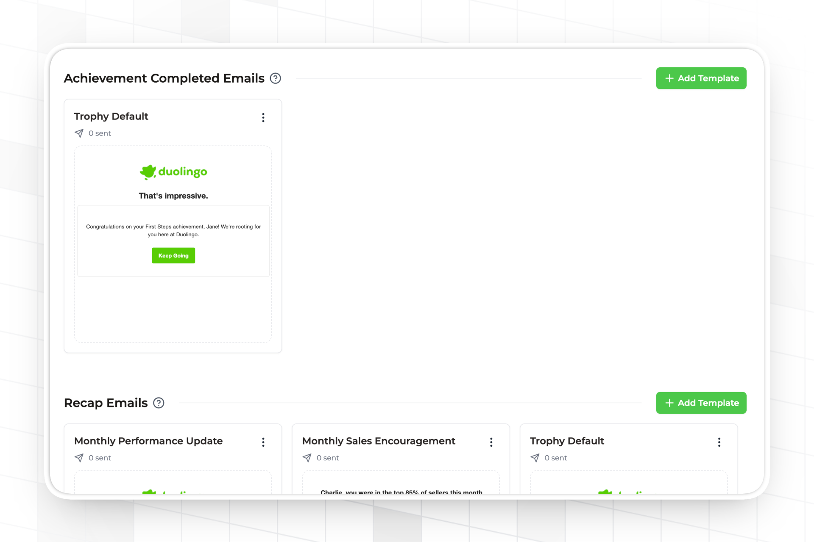
    </Frame>

  </Step>
  <Step title="Diseña tu nueva plantilla">
    Utiliza el editor basado en bloques para diseñar tu plantilla de correo electrónico.

    <Frame>
      <video
        autoPlay
        muted
        loop
        playsInline
        className="w-full aspect-15/4"
        src="../../assets/features/emails/designing_emails.mp4"
      ></video>
    </Frame>

  </Step>
</Steps>

### Tipos de bloques {#block-types}

El editor de correos electrónicos de Trophy admite varios tipos de bloques diferentes que sirven para distintos propósitos. Todos los componentes básicos que esperarías encontrar en un editor de correos como párrafos, encabezados e imágenes se denominan [Bloques básicos](#basic-blocks). También existe un conjunto de componentes más potentes como gráficos y rachas que aprovechan los datos de actividad de usuario y las funciones de gamificación de Trophy. Estos se denominan [Bloques inteligentes](#smart-blocks).

<Frame>
  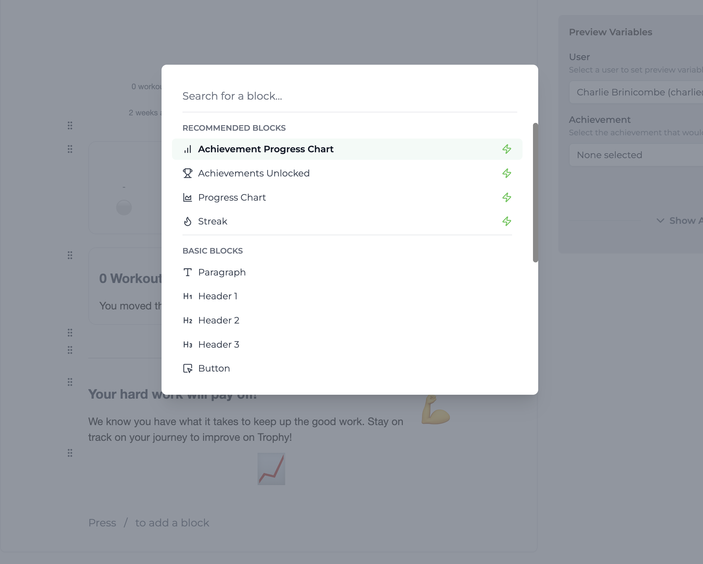
</Frame>

#### Bloques básicos {#basic-blocks}

Aquí está la lista completa de bloques básicos sin opinión que Trophy admite:

- **Párrafo** - Útil para fragmentos de texto cortos o largos.
- **H1, H2, H3** - Útiles para encabezados de distintos tamaños.
- **Botón** - Crea una llamada a la acción para que los usuarios la realicen en los correos electrónicos.
- **Tarjeta** - Puede anidar otros bloques, centrando la atención.
- **Divisor** - Útil para separar el contenido en secciones lógicas.
- **Emoji** - Incluye cualquier emoji compatible, controlando el tamaño.
- **Imagen** - Sube cualquier imagen y Trophy la renderizará en los correos electrónicos.
- **Espaciador** - Útil para dar espacio a los bloques y que destaquen.
- **Columnas** - Útiles para crear diseños de hasta 3 columnas con cualquier contenido.
- **Logo** - Renderizará el logo de tu organización, configurado en la página de [Marca](https://app.trophy.so/branding).

#### Bloques condicionales {#conditional-blocks}

Trophy también cuenta con un potente sistema de renderizado condicional basado en el tipo de bloque _Conditional_.

Al anidar cualquier otro bloque dentro de un bloque condicional y configurar la lógica de condiciones, puedes crear prácticamente cualquier diseño de email que muestre diferentes bloques en los correos según la evaluación de condiciones en el momento del envío.

Si estás familiarizado con los operadores lógicos `if/else`, esto te resultará muy familiar. De lo contrario, aquí tienes un diagrama rápido para explicar cómo funciona.

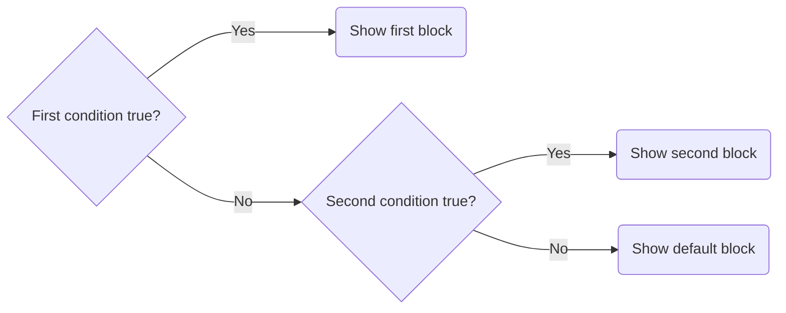
```mermaid
flowchart LR
    B@{ shape: diamond, label: "First condition true?" }
    C@{ shape: rounded, label: "Show first block" }
    D@{ shape: diamond, label: "Second condition true?" }
    E@{ shape: rounded, label: "Show second block" }
    F@{ shape: rounded, label: "Show default block" }

    B-- Yes --->C
    B-- No --->D
    D-- Yes --->E
    D-- No --->F
```

Un caso de uso común para el bloque condicional es mostrar condicionalmente a un usuario su racha (uno de los [Smart Blocks](#smart-blocks) integrados de Trophy) y algún texto motivacional relacionado con la racha solo si tiene una racha activa. Si el destinatario no está en una racha en el momento en que se envía el email, se muestra un mensaje simple en su lugar.

<Frame>
  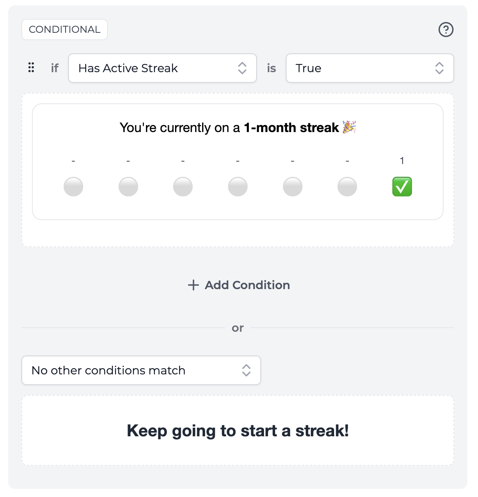
</Frame>

Esto crea un marco potente para diseñar emails basados en datos de usuario altamente relevantes y personalizados, y se puede usar para crear una amplia gama de emails para casos de uso comunes de gamificación.

#### Smart Blocks {#smart-blocks}

Los smart blocks son componentes potentes diseñados para admitir casos de uso comunes de gamificación e integrarse con todas las funcionalidades de Trophy, incluyendo métricas, logros y rachas.

Puedes encontrar todos los smart blocks en la sección _Recommended Blocks_, y siempre son reconocibles por el icono <Icon icon="zap" />.

Mira a Charlie explicar los smart blocks y cómo funcionan:

<Frame>
  <iframe
    width="560"
    height="315"
    src="https://www.youtube.com/embed/CA7i8Gd5K1s?si=mHkAwVPZYMoBPm15"
    title="YouTube video player"
    frameborder="0"
    allow="accelerometer; autoplay; clipboard-write; encrypted-media; gyroscope; picture-in-picture"
    allowfullscreen
  ></iframe>
</Frame>

Lea más sobre el caso de uso de cada bloque inteligente:

<AccordionGroup>
  <Accordion title="Gráfico de progreso de logros" icon="zap">
    El bloque de gráfico de progreso de logros muestra un gráfico con barras para hasta cinco logros de una métrica en particular, destacando los que el destinatario ha desbloqueado.
    
    Elija la métrica para mostrar logros usando el selector de métrica.

    <Frame>
      <video
        autoPlay
        muted
        loop
        playsInline
        className="w-full aspect-video"
        src="../../assets/features/emails/achievement_progress_block.mp4"
      ></video>
    </Frame>

  </Accordion>

{" "}

<Accordion title="Logros desbloqueados" icon="zap">
  El bloque de logros desbloqueados muestra el logro que el destinatario ha desbloqueado. Esto solo es útil en el contexto de correos electrónicos de logros desbloqueados. Si el destinatario no ha desbloqueado ningún logro, este bloque no se mostrará en los correos electrónicos.

Cuando los logros tienen insignias, estas se mostrarán automáticamente, así como el nombre del logro.

  <Frame>
      <video
        autoPlay
        muted
        loop
        playsInline
        className="w-full aspect-video"
        src="../../assets/features/emails/achievements_unlocked_block.mp4"
      ></video>
    </Frame>
</Accordion>

{" "}

<Accordion title="Gráfico de progreso" icon="zap">
  El bloque de gráfico de progreso muestra el progreso del destinatario con respecto a una métrica en particular durante los últimos 3 [períodos de agregación](#aggregation-period).

  <Frame>
      <video
        autoPlay
        muted
        loop
        playsInline
        className="w-full aspect-video"
        src="../../assets/features/emails/progress_chart_block.mp4"
      ></video>
    </Frame>
</Accordion>

  <Accordion title="Racha" icon="zap">
    El bloque de racha muestra la racha actual del destinatario según la configuración de rachas de su cuenta.
    
    Para rachas diarias, se muestra un bloque de calendario que muestra el historial de rachas del último mes. Las rachas semanales y mensuales muestran los últimos 7 períodos del historial de rachas.

    <Frame>
      <video
        autoPlay
        muted
        loop
        playsInline
        className="w-full aspect-video"
        src="../../assets/features/emails/streak_block.mp4"
      ></video>
    </Frame>

  </Accordion>
</AccordionGroup>

### Variables de correo electrónico {#email-variables}

Trophy proporciona un amplio conjunto de variables de correo electrónico que se pueden usar para insertar texto altamente relevante y personalizado en el cuerpo de los correos electrónicos y líneas de asunto.

Las variables aportan contexto de tu cuenta de Trophy, los datos de progreso del destinatario y la configuración específica del correo a tus plantillas de email.

Las variables de email se pueden insertar escribiendo `@` en cualquier bloque que admita texto enriquecido, como encabezados, párrafos y botones, y buscando la variable deseada.

Esto abrirá la ventana del editor de variables donde puedes configurar las variables como en la demostración a continuación.

<Tip>También puedes usar variables en las líneas de asunto de los correos.</Tip>

<Frame>
  <video
    autoPlay
    muted
    loop
    playsInline
    className="w-full aspect-video"
    src="../../assets/features/emails/email_variables_demo.mp4"
  ></video>
</Frame>

A continuación, consulta la lista completa de todas las variables de email compatibles con el creador de correos, desglosadas por categoría.

<AccordionGroup>
<Accordion title="Usuario">
Variables relacionadas con el destinatario del correo.

- **Nombre**: El nombre del destinatario, si está configurado

Adicionalmente, todos los [atributos de usuario personalizados](/es/features/users#custom-user-attributes) están disponibles como variables de email.

</Accordion>
<Accordion title="Métricas">
  Variables relacionadas con los datos de eventos rastreados del destinatario en las métricas.

Cada métrica de Trophy admite las siguientes variables de email:

- **Nombre de la métrica**: El nombre de la métrica
- **Unidades de la métrica**: Las unidades de la métrica
- **Total actual**: La suma de todos los valores de eventos del destinatario hasta la fecha
- **Cambio en este periodo**: Cambio absoluto en el total actual del destinatario en el periodo de agregación actual
- **Cambio en este periodo (%)**: Cambio porcentual en el total actual del destinatario en el periodo de agregación actual
- **Percentil (Histórico)**: El total actual del destinatario comparado con todos los demás usuarios de todos los tiempos
- **Percentil (Este periodo)**: El total actual del destinatario comparado con todos los demás usuarios en el periodo de agregación actual

Adicionalmente, los alias dinámicos **Más alto** y **Más bajo** admiten el mismo conjunto de variables. Al usar estos alias, Trophy seleccionará la métrica donde el destinatario tenga el total actual más alto o más bajo en el momento del envío.

Al usar variables de métricas, también tienes la opción de filtrar los datos a los que hacen referencia cualquiera de las variables anteriores mediante un [atributo de evento personalizado](/es/features/events#custom-event-attributes).

    </Accordion>

<Accordion title="Puntos">

De manera similar a las métricas, cada sistema de puntos tiene las siguientes variables que se pueden usar para agregar datos dinámicos al contenido del correo electrónico:

- **Total Actual**: El total de puntos del destinatario
- **Cambio Este Período**: Cambio absoluto en el total de puntos del destinatario en el período de agregación actual
- **Cambio Este Período (%)**: Cambio porcentual en el total de puntos del destinatario en el período de agregación actual
- **Percentil (Todo el Tiempo)**: El total de puntos del destinatario comparado con todos los demás usuarios de todos los tiempos
- **Percentil (Este Período)**: El total de puntos del destinatario comparado con todos los demás usuarios en el período de agregación actual

.

</Accordion>
<Accordion title="Logros">
  <Note>
  Estas variables solo son relevantes para [correos electrónicos de logros](#achievement-emails).
  </Note>

Al configurar una plantilla para usar con correos electrónicos de logros, las siguientes variables están disponibles:

- **Es Logro Final**: Si el logro que activa el correo electrónico es parte de una serie de logros de métricas, esto es verdadero cuando el logro es el logro final de la serie
- **Porcentaje Hasta el Siguiente Logro**: Si el logro que activa el correo electrónico es parte de una serie de logros de métricas, este es el porcentaje hasta que el usuario desbloquee el siguiente logro de la serie
- **Nombre del Logro**: El nombre del logro que activó el correo electrónico
- **Descripción del Logro**: La descripción del logro que activó el correo electrónico

.

  </Accordion>
<Accordion title="Racha">
  Variables relacionadas con la racha del destinatario.

- **Tiene Racha Activa**: Verdadero si el destinatario tiene una racha activa al momento de enviar el correo electrónico, falso en caso contrario
- **Longitud de la Racha**: La longitud de la racha actual del destinatario
- **Racha Extendida**: Verdadero si la racha del destinatario fue extendida, falso en caso contrario
- **Días Desde la Última Extensión**: El número de días desde que el usuario extendió por última vez su racha

.

</Accordion>
<Accordion title="Reactivación">
  <Note>
  Estas variables solo son relevantes para [correos de reactivación](#reactivation-emails).
  </Note>

- **Número de Mensaje**: El número del mensaje en la secuencia de reactivación (1-5)

.

</Accordion>
<Accordion id="aggregation-period" title="Período de Agregación">
    <Note>
  Estas variables solo son relevantes para [correos resumen](#recap-emails).
  </Note>

- **Rango de Fechas del Período Actual**: Las fechas de inicio y fin del período de agregación actual

.

</Accordion>
</AccordionGroup>

#### Uso Avanzado {#advanced-usage}

Hay un par de opciones adicionales a considerar al usar variables de correo.

**Prefijo y Sufijo**

Puede proporcionar un prefijo y sufijo para variables de texto como el nombre del destinatario o el nombre de una métrica en particular.

<Frame>
  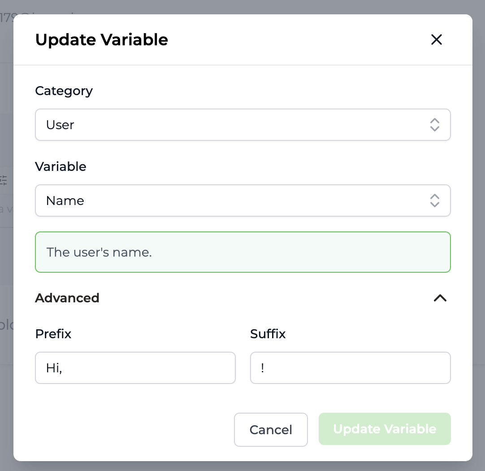
</Frame>

Si el valor de la variable no se renderiza cuando se envía el correo, Trophy no mostrará la variable ni el prefijo o sufijo para mantener los correos limpios.

**Singular y Plural**

Al usar variables numéricas como el total actual de puntos del destinatario o el total de métricas, también puede proporcionar un sufijo singular y plural que lo acompañe.

<Frame>
  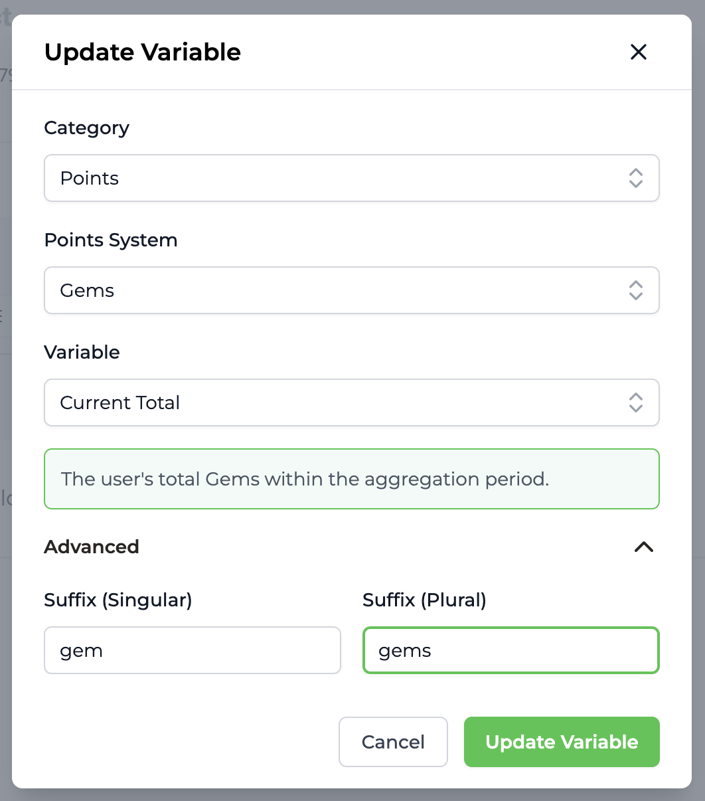
</Frame>

### Variaciones de Texto {#text-variations}

Las variaciones se pueden usar para agregar aleatoriedad al texto dentro de los correos enviados por Trophy. Esto evita que los correos se vuelvan aburridos y ayuda a mejorar las tasas de apertura y clics.

<Frame>
  <iframe
    width="560"
    height="315"
    src="https://www.youtube.com/embed/mlxMqHsdql8?si=hhizWfwiylgxxEuV"
    title="YouTube video player"
    frameborder="0"
    allow="accelerometer; autoplay; clipboard-write; encrypted-media; gyroscope; picture-in-picture"
    allowfullscreen
  ></iframe>
</Frame>

Cualquier bloque que admita entrada de texto, incluidos H1, H2, H3 y párrafo, admite variaciones.

<Tip>También puede usar variaciones para agregar aleatoriedad a los asuntos de correo.</Tip>

Para crear una variación, haga clic en el botón _Agregar Variación_ en cualquier bloque que las admita.

<Frame>
  <video
    autoPlay
    muted
    loop
    playsInline
    className="w-full aspect-video"
    src="../../assets/features/emails/creating_variations.mp4"
  ></video>
</Frame>

<Note>
  Las variaciones aún no admiten pruebas A/B, pero esto está en nuestra hoja de ruta, así que permanece atento...
</Note>

### Uso del editor {#using-the-editor}

El editor de plantillas de correo electrónico es un lienzo en blanco para diseñar correos que se vean geniales en la bandeja de entrada. Usar [bloques](#block-types) preconfigurados facilita enormemente la creación de plantillas de correo electrónico que se adapten a casos de uso comunes de gamificación. Aquí te explicaremos cómo utilizar mejor el editor para crear correos electrónicos con un aspecto increíble.

#### Añadir bloques {#adding-blocks}

Para añadir un nuevo bloque a una plantilla de correo electrónico, presiona la tecla <Icon icon="square-slash" />. Esto abrirá el diálogo de selección de bloques donde puedes elegir el bloque que deseas añadir.

<Frame>
  <video
    autoPlay
    muted
    loop
    playsInline
    className="w-full aspect-video"
    src="../../assets/features/emails/add_new_block_slash.mp4"
  ></video>
</Frame>

O si quieres añadir un bloque inmediatamente después de otro bloque, utiliza el menú de bloques.

<Frame>
  <video
    autoPlay
    muted
    loop
    playsInline
    className="w-full aspect-video"
    src="../../assets/features/emails/add_new_block_by_block_menu.mp4"
  ></video>
</Frame>

#### Organizar bloques {#arranging-blocks}

Los bloques se pueden arrastrar hacia arriba y hacia abajo usando el menú de bloques.

<Frame>
  <video
    autoPlay
    muted
    loop
    playsInline
    className="w-full aspect-video"
    src="../../assets/features/emails/arranging_blocks.mp4"
  ></video>
</Frame>

#### Formato de texto {#text-formatting}

El editor de correo electrónico ofrece formato de texto enriquecido que incluye negrita, cursiva, [hipervínculos](https://www.youtube.com/watch?v=dQw4w9WgXcQ) y formato `code`.

<Frame>
  <video
    autoPlay
    muted
    loop
    playsInline
    className="w-full aspect-video"
    src="../../assets/features/emails/rich_text_formatting.mp4"
  ></video>
</Frame>

### Estilo de fuente {#font-style}

En la [página de configuración de correo electrónico](https://app.trophy.so/emails/configure), encontrarás una configuración para cambiar el estilo de fuente utilizado en todos los correos electrónicos.

<Frame>
  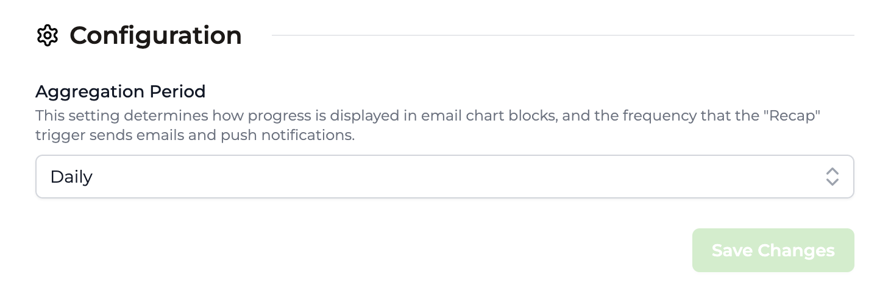
</Frame>

Otros estilos de correo electrónico se extraen de la configuración de [Marca](https://app.trophy.so/branding) de tu cuenta de Trophy.

## Gestión de cancelaciones de suscripción {#handling-unsubscribes}

Todos los correos electrónicos que Trophy envía incluyen un enlace y mensaje para cancelar la suscripción. Esto es importante para mantener el cumplimiento de las regulaciones y no es posible ocultarlo.

<Info>
  El mensaje se leerá de la siguiente manera: Estás recibiendo este correo electrónico porque
  estás suscrito a informes de progreso y correos de logros. Si ya no
  deseas recibir estos correos, puedes cancelar tu suscripción.
</Info>

Cualquier destinatario que haga clic en este enlace será redirigido a una página con tu marca que le permite controlar qué notificaciones por correo electrónico recibe.

<Tip>
  Como alternativa al enlace de cancelación de suscripción, también puedes crear un centro de
  preferencias en tu aplicación usando la [API de preferencias de
  usuario](/es/features/users#notification-preferences) de Trophy. Esto brinda a los usuarios un control más
  granular sobre qué tipos de correos electrónicos reciben.
</Tip>

## Analíticas de correo electrónico {#email-analytics}

Trophy tiene analíticas integradas para todos los correos electrónicos que envía. Esto incluye:

- Destinatarios (El número total de personas que recibieron el correo electrónico)
- Tasa de apertura (El porcentaje de destinatarios que abrieron el correo electrónico)
- Tasa de clics (El porcentaje de destinatarios que hicieron clic en al menos un enlace del correo electrónico)
- Tasa de retención (El porcentaje de usuarios que abrieron el correo electrónico y regresaron a usar tu plataforma después de al menos 2 días)

<Frame>
  <video
    autoPlay
    muted
    loop
    playsInline
    className="w-full aspect-video"
    src="../../assets/features/emails/email_analytics.mp4"
  ></video>
</Frame>

## Preguntas frecuentes {#frequently-asked-questions}

<AccordionGroup>
<Accordion title="¿Puedo enviar correos electrónicos desde mi propio dominio?">
    ¡Sí! El envío de correos electrónicos desde tu propio dominio es compatible de forma inmediata. Sigue los pasos en la sección sobre [envío de correos electrónicos](#sending-emails) para comenzar.
  </Accordion>

{" "}

<Accordion title="¿Limitan la cantidad de correos electrónicos que puedo enviar?">
  No, no limitamos la cantidad de correos electrónicos que puedes enviar. Sin embargo, monitoreamos el uso
  para prevenir abusos.
</Accordion>

</AccordionGroup>

## Obtener Soporte {#get-support}

¿Quieres ponerte en contacto con el equipo de Trophy? Contáctanos por [correo electrónico](mailto:support@trophy.so). ¡Estamos aquí para ayudarte!
