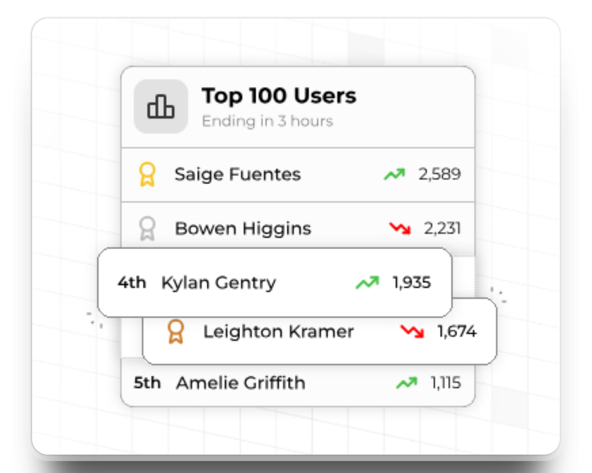
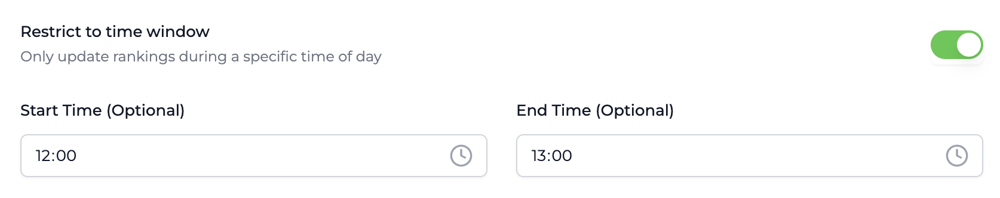
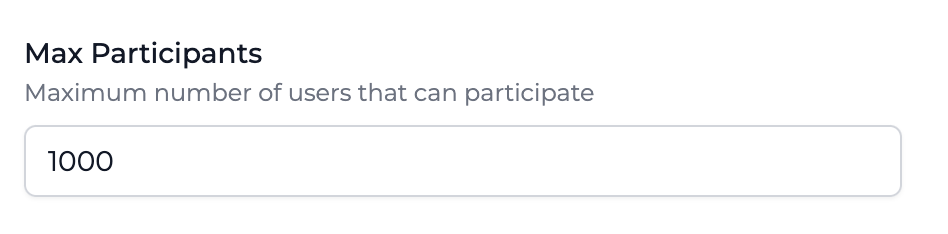
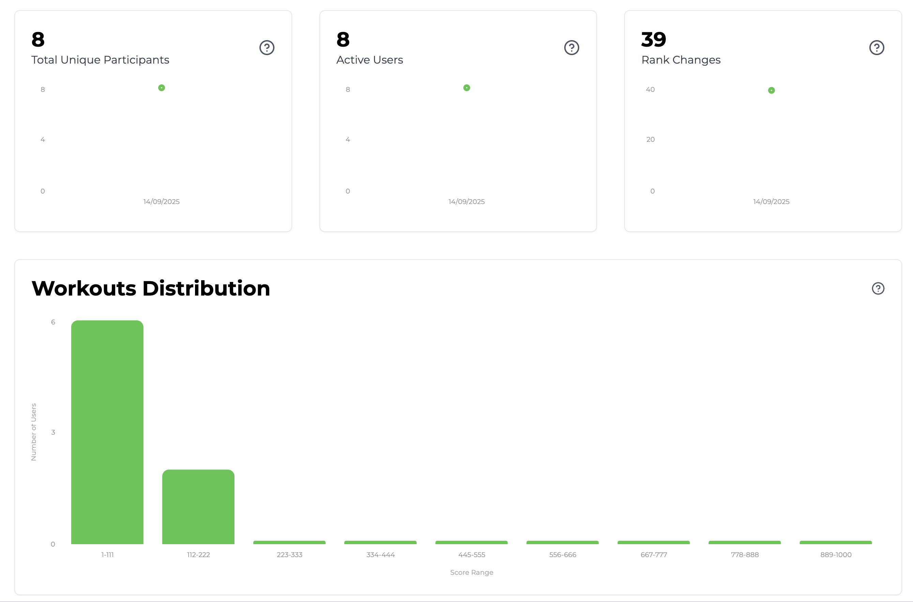
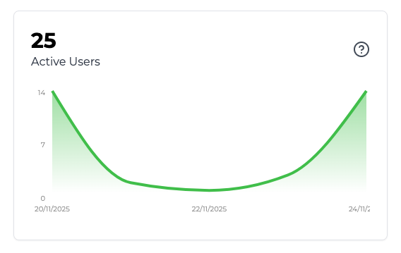

import LeaderboardSingleAttributeRequest from "../../snippets/leaderboard-rankings-request-single-attribute.mdx";
import LeaderboardMultiAttributeRequest from "../../snippets/leaderboard-rankings-request-multiple-attributes.mdx";

## ¿Qué son las Clasificaciones? {#what-are-leaderboards}

Las Clasificaciones son competencias sociales entre usuarios de tu aplicación. Usa clasificaciones para aumentar la participación y fomentar la interacción social.

<Frame>
  
</Frame>

## Tipos de Clasificaciones {#types-of-leaderboards}

En esta sección describimos los diferentes tipos de clasificaciones compatibles con Trophy y cuándo usar cada una.

### Clasificaciones Perpetuas {#perpetual-leaderboards}

Las clasificaciones perpetuas nunca se reinician. Una vez iniciadas, rastrean y clasifican continuamente el progreso de los usuarios a lo largo del tiempo de forma permanente, o hasta la [fecha de finalización](#end-dates) configurada.

Usa clasificaciones perpetuas cuando quieras crear clasificaciones históricas de la actividad de los usuarios.

### Clasificaciones Recurrentes {#repeating-leaderboards}

Las clasificaciones recurrentes se pueden configurar para reiniciarse después de cualquier número arbitrario de días, meses o años.

En Trophy, cada instancia de una clasificación recurrente se llama **'ejecución'**. Por ejemplo, una clasificación mensual tendría 12 ejecuciones en un año, pero una clasificación diaria tendría `n` ejecuciones en un mes donde `n` es el número de días en un mes determinado.

Trophy rastrea las clasificaciones en cada ejecución de una clasificación recurrente de forma individual y proporciona [APIs](/es/api-reference/endpoints/leaderboards/get-leaderboard) para obtener datos de clasificación de ejecuciones históricas.

<Tip>
  Recomendamos usar clasificaciones recurrentes en lugar de perpetuas siempre que sea posible, ya que las clasificaciones recurrentes dan a los nuevos usuarios la misma oportunidad de competir con los usuarios existentes, lo que ayuda a evitar que las clasificaciones se vuelvan obsoletas.
</Tip>

#### Manejo de zonas horarias {#handling-time-zones}

Si has rastreado las [zonas horarias](/es/features/users#param-tz) de tus usuarios con Trophy, estas se utilizarán para garantizar que cada usuario tenga las mismas oportunidades de ganar sin importar dónde se encuentre en el mundo.

En la práctica, esto significa que las clasificaciones se finalizan y los ganadores se eligen aproximadamente 12 horas después de que terminen naturalmente en UTC para permitir que los usuarios de todas las zonas horarias hagan su último esfuerzo.

#### Consejos para clasificaciones semanales {#tips-for-weekly-leaderboards}

Para crear una clasificación semanal, configura una [clasificación recurrente](#repeating-leaderboards) con un cronograma de 7 días y establece la fecha de inicio en el próximo primer día de la semana.

Mientras esperas a que llegue la fecha de inicio, la clasificación estará en estado `scheduled` y se activará automáticamente en la fecha de inicio.

## Lógica de clasificación {#ranking-logic}

Las clasificaciones en Trophy son configurables para ordenar a los participantes de diferentes maneras y así admitir casos de uso comunes.

### Métodos de clasificación {#ranking-methods}

El método de clasificación de una clasificación determina en qué dimensión se ordenarán los participantes.

<Frame>
  
</Frame>

#### Clasificaciones por métrica {#metric-rankings}

Las clasificaciones por métrica están vinculadas a una [Métrica](/es/features/metrics) existente de Trophy y ordenan a los usuarios según su valor métrico total.

Utiliza clasificaciones por métrica si solo deseas ordenar a los usuarios según una única interacción.

#### Clasificaciones por puntos {#points-rankings}

Las clasificaciones por puntos están vinculadas a un [Sistema de Puntos](/es/features/points) existente de Trophy y ordenan automáticamente a los usuarios según sus puntos totales.

Utiliza una clasificación por puntos si deseas ordenar a los usuarios según una combinación de métricas, logros u otras funciones de Trophy.

#### Clasificaciones de Racha {#streak-rankings}

Las clasificaciones de racha ordenan a los usuarios según la duración de su racha actual.

<Note>
  Las clasificaciones de racha solo pueden ser [perpetuas](#perpetual-leaderboards).
</Note>

### Desgloses de Clasificación {#ranking-breakdowns}

Si tienes una base de usuarios grande, es una buena práctica dividir a los participantes de la clasificación en grupos más pequeños y socialmente conectados. Esto a menudo genera mayor participación que cuando se usan clasificaciones globales.

Las clasificaciones en Trophy se pueden configurar para agrupar usuarios en grupos más pequeños según uno o más [atributos de usuario personalizados](/es/features/users#custom-user-attributes).

<Tip>
  Cuando se usan desgloses de clasificación, los [límites de participantes](#participant-limits)
  se aplican a nivel de grupo, no globalmente.
</Tip>

Para configurar un desglose de clasificación, dirígete a la página de configuración de la clasificación y crea o selecciona uno o más atributos de usuario en el campo 'Atributos de Desglose'.

Trophy comenzará automáticamente a agrupar usuarios en clasificaciones más pequeñas según los valores de los atributos elegidos para cada usuario.

<Frame>
  <video
    autoPlay
    muted
    loop
    playsInline
    className="w-full aspect-15/4"
    src="../../assets/features/leaderboards/breakdowns.mp4"
  ></video>
</Frame>

Para obtener las clasificaciones de un grupo particular de usuarios con un valor de atributo específico, usa la [API de clasificaciones](/es/api-reference/endpoints/leaderboards/get-leaderboard), especificando un filtro de atributo en el parámetro `userAttributes` de la siguiente manera:

<LeaderboardSingleAttributeRequest />

Para obtener las clasificaciones de un grupo particular de usuarios con una combinación específica de atributos de usuario, pasa múltiples filtros `key:value` delimitados por comas en `userAttributes` de la siguiente manera:

<LeaderboardMultiAttributeRequest />

<Note>
  Cuando se proporcionan múltiples filtros `userAttributes`, todos los filtros deben coincidir
  para que un usuario se incluya en las clasificaciones devueltas.
</Note>

## Fechas de Inicio y Fin {#start-end-dates}

Usa fechas de inicio y fin para controlar la ventana dentro de la cual las clasificaciones están clasificando activamente a los usuarios.

<Frame>
  
</Frame>

### Fechas de inicio {#start-dates}

Las clasificaciones en Trophy se pueden configurar para que inicien en una fecha futura de su elección. Esto suele ser útil para permitir tiempo para cambios o ajustes de último momento antes de que las clasificaciones empiecen a clasificar a los usuarios.

Las clasificaciones con una fecha de inicio en el futuro se programan y se activan automáticamente en la fecha de inicio que usted elija.

### Fechas de finalización {#end-dates}

Las clasificaciones en Trophy pueden tener fechas de finalización. Si establece una fecha de finalización en una clasificación, después de esa fecha entrará en estado `finished` y las clasificaciones se finalizarán y se elegirán los ganadores.

<Note>
  Debido a las diferencias en [zonas horarias](#handling-time-zones), las clasificaciones pueden finalizarse hasta 12 horas después de la fecha de finalización en UTC para permitir que todos los usuarios alcancen la fecha de finalización según su reloj local.
</Note>

## Restricciones de tiempo {#time-restrictions}

Además de las [fechas de inicio y finalización](#start-end-dates), las clasificaciones se pueden configurar para tener restricciones de tiempo.

Cuando las restricciones de tiempo están habilitadas, las clasificaciones solo se actualizarán durante el período de tiempo configurado.

Las restricciones de tiempo son útiles al crear clasificaciones para eventos o promociones de tiempo limitado que se ejecutan durante un período de tiempo específico.

Las restricciones de tiempo funcionan en todas las clasificaciones, incluidas las [clasificaciones recurrentes](#repeating-leaderboards). Cuando una clasificación recurrente tiene una restricción de tiempo, la restricción de tiempo se aplicará a cada ejecución de la clasificación.

### Configurar restricciones de tiempo {#setting-time-restrictions}

Para establecer restricciones de tiempo en una clasificación, diríjase a la página de configuración de la clasificación y active el interruptor etiquetado 'Restringir a ventana de tiempo'. Esto le dará dos campos, una hora de inicio y una hora de finalización.

- Configurar solo una hora de inicio significa que las clasificaciones de la tabla de clasificación solo comenzarán a actualizarse después de la hora de inicio en cada día en que la clasificación esté activa.
- De manera similar, configurar solo una hora de finalización significa que las clasificaciones de la tabla de clasificación dejarán de actualizarse después de la hora de finalización en cada día en que la clasificación esté activa.
- Configurar tanto una hora de inicio como de finalización significa que las clasificaciones de la tabla de clasificación solo se actualizarán durante el período de tiempo configurado.

<Frame>
  
</Frame>

### Consideraciones de Zona Horaria {#time-zone-considerations}

Las restricciones de tiempo en las clasificaciones se aplican en **hora local** para cada participante según su [zona horaria](/es/features/users#param-tz) configurada.

Esto significa que cada usuario puede participar en la clasificación en cualquier momento durante la restricción de tiempo configurada según su reloj local.

## Límites de Participantes {#participant-limits}

Las clasificaciones en Trophy tienen un número máximo predeterminado de participantes de **1,000**. Sin embargo, una clasificación puede configurarse para tener cualquier número arbitrario de participantes para admitir casos de uso como _Top 100_ o similares.

<Frame>
  
</Frame>

Si una clasificación ya tiene un número de participantes que coincide con su máximo configurado, los nuevos usuarios tendrán que superar la puntuación del rango más bajo para unirse a la clasificación.

La única excepción a esto es cuando se utilizan [atributos de desglose](#ranking-breakdowns) para agrupar a los participantes en cohortes más pequeñas. Al usar atributos de desglose, el límite de participantes se aplica a cada grupo, no de manera general.

<Tip>
Si necesitas un límite de participantes mayor, considera usar [atributos de desglose](#ranking-breakdowns) para agrupar a los participantes en cohortes más pequeñas. O contáctanos en [support@trophy.so](mailto:support@trophy.so) y estaremos encantados de aumentar tus valores predeterminados.
</Tip>

## Creación de Clasificaciones {#creating-leaderboards}

Para crear una clasificación, dirígete a la [página de clasificaciones](https://app.trophy.so/leaderboards) en el panel de Trophy y haz clic en el botón _Nueva Clasificación_.

<Frame>
  <video
    autoPlay
    muted
    loop
    playsInline
    className="w-full aspect-15/4"
    src="../../assets/features/leaderboards/creating_leaderboards.mp4"
  ></video>
</Frame>

<Steps>
  <Step title="Ingresa un nombre">
    Elige un nombre para la clasificación.
  </Step>
  
  <Step title="Ingresa una clave única">
    Ingresa una clave de referencia única para la clasificación. Esto es lo que usarás para referenciar la clasificación en el código de tu aplicación.
  </Step>

   <Step title="Elige un método de clasificación">
    Elige uno de los [métodos](#ranking-methods) por el cual la clasificación ordenará a los usuarios:

    - **Métrica**: Ordena a los usuarios por el valor total de una métrica elegida
    - **Puntos**: Ordena a los usuarios por los puntos totales en un sistema de puntos elegido
    - **Racha**: Ordena a los usuarios por la longitud de la racha actual

  </Step>

    <Step title="Establece el máximo de participantes">
    Elige el número máximo de participantes que la clasificación debe soportar. El
    límite superior actual soportado por Trophy es de 1,000. Lee [esta
    sección](#participant-limits) para saber más sobre cómo elegimos este límite.
    </Step>

    <Step title="Guarda los cambios">
    Guarda los cambios y dirígete a la página de configuración para establecer [fechas de inicio y fin](#start-end-dates), [programaciones de clasificaciones recurrentes](#repeating-leaderboards) y más.
    </Step>

</Steps>

## Gestión de Clasificaciones {#managing-leaderboards}

Las clasificaciones en Trophy tienen varios estados que te ayudan a controlar cuándo y cómo los usuarios pueden unirse a ellas.

### Estados de Clasificación {#leaderboard-statuses}

Las clasificaciones pueden tener uno de los siguientes estados:

- `Inactive`
- `Scheduled`
- `Active`
- `Finished`

Todas las nuevas clasificaciones se crean como `Inactive`. Mientras están inactivas, cualquier propiedad o configuración de la clasificación puede modificarse, no serán visibles para los usuarios y los usuarios no podrán unirse a ellas.

Una vez que estés listo para que los usuarios comiencen a participar, puedes hacerlo `Active`. Esto significa que Trophy empezará a rastrear la actividad de los usuarios e ingresarlos en las clasificaciones.

Las clasificaciones que se hayan configurado con una [fecha de inicio](#start-dates) en el futuro no pueden activarse, solo pueden estar `Scheduled`. Una vez que la fecha de inicio haya pasado, Trophy las hará `Active` automáticamente y comenzará a aceptar participantes.

Si una clasificación tiene una [fecha de finalización](#end-dates), una vez que haya pasado Trophy la moverá automáticamente al estado `Finished` y dejará de monitorear la actividad de los usuarios. Una vez que una clasificación haya finalizado, no será visible para los usuarios, pero aún podrás consultar las APIs para obtener las posiciones de ejecuciones históricas.

## Mostrar Clasificaciones {#displaying-leaderboards}

<Tip>
  Consulta nuestra [guía completa](/es/guides/how-to-build-a-leaderboards-feature) sobre
  cómo agregar clasificaciones a tu aplicación para más detalles.
</Tip>

## Analíticas de Clasificaciones {#leaderboard-analytics}

Trophy tiene analíticas integradas para ayudarte a entender cómo los usuarios interactúan con tus clasificaciones.

<Frame>
  
</Frame>

### Total de Participantes Únicos {#total-unique-participants}

Este gráfico muestra cuántos usuarios únicos han participado en cualquier ejecución de una clasificación a lo largo del tiempo. Esto es útil para comprender cuántos de tus usuarios realmente participan en las clasificaciones y cómo los [límites de participantes](#participant-limits) están afectando esto.

<Frame>
  
</Frame>

### Usuarios Activos {#active-users}

Este gráfico muestra la cantidad de usuarios que han cambiado de posición al menos una vez en una clasificación determinada. Esto es útil para tener una idea de qué tan competitivo es el usuario promedio en una clasificación particular.

<Frame>
  
</Frame>

### Cambios de rango {#rank-changes}

Este gráfico muestra el número total de cambios de rango en una clasificación particular a lo largo del tiempo. Esto es útil para entender qué tan competitivos son los usuarios en general.

<Frame>
  
</Frame>

### Distribución de puntuaciones {#score-distribution}

Este gráfico es un histograma de las puntuaciones de los usuarios en una clasificación particular. Esto es útil para tener una idea de qué tan agrupados o dispersos están los usuarios, y qué secciones de las clasificaciones son las más competitivas.

<Frame>
  
</Frame>

## Preguntas frecuentes {#frequently-asked-questions}

<AccordionGroup>
  <Accordion id="leaderboard-participant-limit-faq" title="¿Cuántos participantes pueden estar en una clasificación al mismo tiempo?">
    Limitamos las clasificaciones a 1,000 participantes.
    
    Lee más sobre esto en la [sección dedicada](#participant-limits) de esta página.

  </Accordion>

{" "}

<Accordion id="leaderboard-weekly-faq" title="No veo una opción de clasificación semanal, ¿cómo puedo configurar una?">
  Trophy admite la ejecución de clasificaciones repetitivas en cualquier número
  arbitrario de días. Así que una clasificación semanal sería simplemente una clasificación que se repite cada 7
  días. Lee [esta sección](#tips-for-weekly-leaderboards) para más consejos sobre
  la creación de clasificaciones semanales.
</Accordion>
</AccordionGroup>

## Obtener soporte {#get-support}

¿Quieres ponerte en contacto con el equipo de Trophy? Comunícate con nosotros por [correo electrónico](mailto:support@trophy.so). ¡Estamos aquí para ayudarte!
