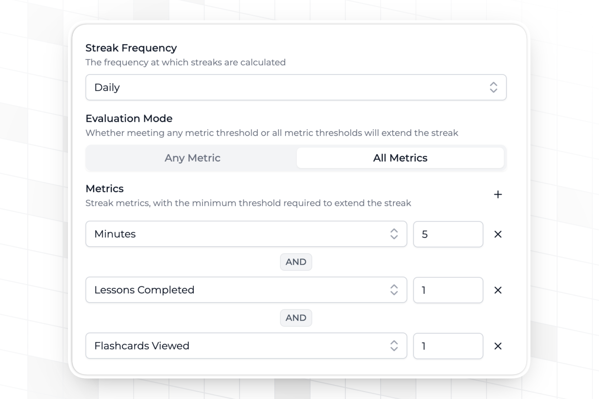
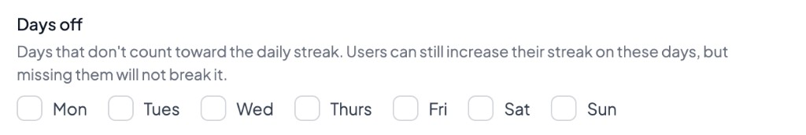
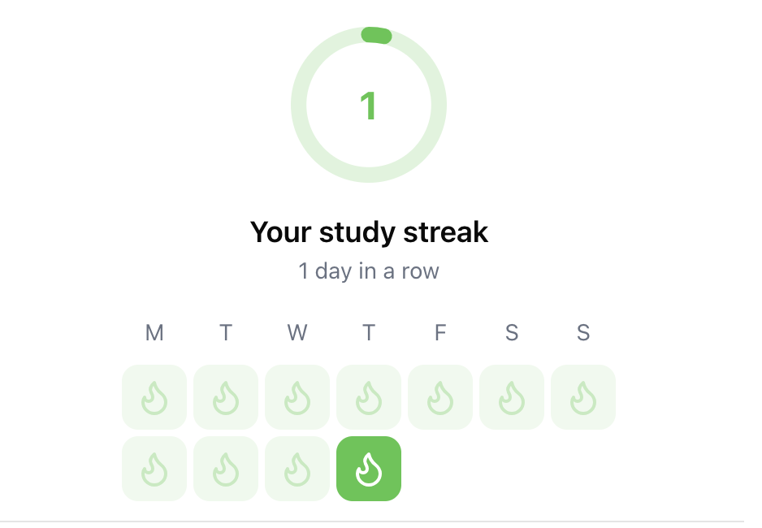

import MetricChangeResponseBlock from "../../snippets/metric-change-response-block.mdx";

## ¿Qué son las rachas? {#what-are-streaks}

Una racha es un período de días, semanas o meses consecutivos en los que un usuario ha realizado una acción clave en tu plataforma. Se ha demostrado que las rachas aumentan de forma significativa la retención, en especial cuando la acción del usuario que se mide se alinea con el valor central de tu producto.

## Frecuencia de la racha {#streak-frequency}

Las rachas en Trophy pueden ser **diarias, semanales o mensuales**. Esto significa que un usuario debe cumplir sus [condiciones de racha](#streak-conditions) al menos una vez cada día, semana o mes natural para mantener su racha.

Si has [configurado zonas horarias](/es/features/users#param-tz) para tus usuarios, Trophy hará un seguimiento automático de la racha de cada usuario en su zona horaria local (incluso cuando cambien de zona horaria) y mantendrá las rachas intactas.

<Note>
Trophy calcula automáticamente los datos de racha para cada frecuencia de racha, por lo que puedes cambiar de frecuencia en cualquier momento.
</Note>

## Condiciones de la racha {#streak-conditions}

En Trophy puedes definir los umbrales que un usuario debe alcanzar para extender su racha según tus [Métricas](/es/features/metrics) configuradas.

Puedes elegir qué métricas forman parte de tu racha y, para las que elijas, establecer un umbral personalizado que los usuarios deben alcanzar.

<Frame>
  
</Frame>

Al combinar métricas, puedes elegir entre dos modos de evaluación:
- `ALL` significa que un usuario debe alcanzar todos los umbrales de las métricas para extender su racha
- `OR` significa que un usuario solo tiene que alcanzar uno de los umbrales de las métricas para extender su racha

De este modo, puedes diseñar la lógica de tu racha para que se ajuste al caso de uso de tu aplicación.

### Días libres {#days-off}

Para las rachas diarias, puedes marcar días concretos de la semana como días libres en la [página de rachas](https://app.trophy.so/streaks) del panel de Trophy. Esos días no cuentan para la racha: los usuarios pueden seguir ampliando su racha si están activos, pero si no hacen actividad en un día libre, la racha no se rompe.

<Frame>
  
</Frame>

Debes dejar al menos un día que cuente para la racha. Las rachas semanales y mensuales ignoran los días libres.

A diferencia de las [congelaciones de racha](#streak-freezes), los días libres no se consumen. Se aplican todas las semanas hasta que los cambies.

Si has habilitado la [personalización de rachas](#streak-personalization), los usuarios pueden sustituir los días libres predeterminados mediante las [preferencias de usuario](/es/features/users#streak-preferences).

## Congelaciones de racha {#streak-freezes}

Las congelaciones de racha ayudan a los usuarios a mantener sus rachas durante más tiempo, ya que les permiten omitir un número determinado de períodos sin que la racha vuelva a cero. Así, las rachas siguen siendo motivadoras aunque los usuarios no mantengan un hábito de uso perfecto.

Las congelaciones de racha son opcionales y se pueden configurar en la [página de rachas](https://app.trophy.so/streaks) del panel de Trophy.

Cuando están habilitadas, tú decides cuántas congelaciones puede tener un usuario y cuántas se le otorgan con el tiempo. Cuando un usuario omite un período, se consume una congelación. Las congelaciones se consumen hasta que el usuario se queda sin ninguna; en ese momento, su racha se restablece a cero.

<Note>
Las congelaciones de racha se diferencian de las [pausas de racha](#streak-pauses) en que las congelaciones permiten a los usuarios omitir un número determinado de períodos sin romper su racha, independientemente del motivo, mientras que las pausas de racha protegen una racha específicamente durante un intervalo de fechas conocido y predefinido, como unas vacaciones o un descanso programados. Las congelaciones se consumen automáticamente cuando el usuario no realiza una actividad requerida, mientras que las pausas se crean manualmente con antelación para cubrir ausencias planificadas.
</Note>

### Otorgar congelaciones {#granting-freezes}

Puedes configurar cualquier cantidad de congelaciones para otorgarlas a los nuevos usuarios cuando los identifiques por primera vez con Trophy. Para configurarlo, activa la concesión de congelaciones y define el número inicial de congelaciones en la página de rachas del panel de Trophy.

<Frame>
  <video
    autoPlay
    muted
    loop
    playsInline
    className="w-full aspect-15/4"
    src="../../assets/features/streaks/freeze_grants.mp4"
  ></video>
</Frame>

Trophy también puede otorgar congelaciones de racha a los usuarios de forma automática con el tiempo. Puedes elegir el número de días durante los cuales se otorgará a cada usuario la cantidad de congelaciones que prefieras.

Para configurarlo, define en la página de rachas del panel de Trophy el número de días durante los cuales se otorgarán las congelaciones y la cantidad de congelaciones que se otorgarán. Aquí también puedes establecer el número máximo de congelaciones que puede tener cada usuario, con un límite de 100.

<Frame>
  <video
    autoPlay
    muted
    loop
    playsInline
    className="w-full aspect-15/4"
    src="../../assets/features/streaks/freeze_accumulation.mp4"
  ></video>
</Frame>

Si has configurado zonas horarias para tus usuarios, Trophy consumirá automáticamente las congelaciones a medianoche en la zona horaria del usuario cuando sea necesario para extender su racha. Si corresponde otorgar nuevas congelaciones a un usuario, se le otorgarán hasta diez minutos después.
## Pausas de racha {#streak-pauses}

Las pausas de racha protegen la racha de un usuario durante un intervalo de fechas conocido, como unas vacaciones u otro descanso planificado. Mientras una pausa cubre un período, Trophy mantiene la longitud de la racha del usuario en lugar de finalizarla si no cumple sus [condiciones de racha](#streak-conditions).

<Note>
Las pausas de racha se diferencian de las [congelaciones de racha](#streak-freezes) en que las pausas protegen específicamente la racha de un usuario durante un intervalo de fechas conocido y predefinido, como unas vacaciones o un descanso programado, mientras que las congelaciones permiten a los usuarios omitir un número determinado de días (o períodos) sin perder su racha, sin importar el motivo. Las pausas se crean manualmente con antelación para cubrir ausencias planificadas, mientras que las congelaciones se consumen automáticamente cuando el usuario no realiza una actividad requerida.
</Note>

### Creación de pausas {#creating-pauses}

Crea pausas con la [API de administración para crear pausas de rachas](/es/admin-api/endpoints/streaks/create-pauses). Puedes crear pausas para hasta 100 usuarios en una sola solicitud.

Cada pausa requiere:

- `userId`: el usuario para el que se crea la pausa
- `start`: la primera fecha que cubre la pausa
- `end`: la última fecha que cubre la pausa

Se rechazan las fechas de inicio en el pasado. Si has [configurado zonas horarias](/es/features/users#param-tz) para tus usuarios, Trophy evalúa `start` respecto a la fecha actual en la zona horaria local de cada usuario.

### Eliminación de pausas {#deleting-pauses}

Para evitar que se aplique una pausa, elimínala con la [API de administración para eliminar pausas de rachas](/es/admin-api/endpoints/streaks/delete-pauses).

### Lectura de pausas {#reading-pauses}

La [API de rachas de usuario](/es/api-reference/endpoints/users/get-a-users-streak) devuelve las pausas próximas y las activas en el campo `pauses`. Se omiten las pausas pasadas y las eliminadas.

Cada período de `streakHistory` incluye `usedPause`, que es `true` cuando la racha del usuario estuvo en pausa durante ese período.

## Seguimiento de rachas {#tracking-streaks}

Trophy calcula automáticamente las rachas de todos los usuarios a partir de los [eventos de métricas](/es/features/events#tracking-metric-events) que reportas a Trophy.

No se requiere trabajo adicional para hacer el seguimiento de las rachas y puedes empezar a usarlas de inmediato. Solo asegúrate de que las rachas estén activadas en el panel de Trophy.

También puedes leer y actualizar la configuración de rachas de la organización —frecuencia, modo de evaluación, métricas, días libres, personalización y congelaciones— con la [API de administración de ajustes de rachas](/es/admin-api/endpoints/streaks/update-streak-settings).

<Tip>
Para ver un recorrido completo sobre cómo configurar una funcionalidad de rachas con Trophy, consulta nuestra [guía oficial](/es/guides/how-to-build-a-streaks-feature).
</Tip>

## Personalización de rachas {#streak-personalization}

Trophy permite que los usuarios personalicen el funcionamiento de su racha dentro de los límites que tú definas. Para ello, activa la personalización de rachas en la [página de rachas](https://app.trophy.so/streaks) del panel de Trophy.

Una vez habilitada la función, los usuarios podrán personalizar, a través de las preferencias de usuario, las [condiciones de la racha](#streak-conditions) que deben cumplir para extender su racha, incluidos el modo de evaluación de la racha, el umbral de cada métrica y los [días libres](#days-off).

<Tip>
Para obtener más información sobre cómo establecer las preferencias de un usuario específico, consulta la documentación dedicada a las [preferencias de usuario](/es/features/users#streak-preferences).
</Tip>

<Frame>
  <video
    autoPlay
    muted
    loop
    playsInline
    className="w-full aspect-15/4"
    height="200"
    width="100%"
    noZoom
    src="../../assets/features/streaks/streak_personalization.mp4"
  />
</Frame>

## Gestión de Rachas {#managing-streaks}

Esta sección describe algunas de las operaciones que puedes realizar para gestionar las rachas de los usuarios en tu aplicación.

### Restauración de la Racha de un usuario {#restoring-a-users-streak}

Para restaurar la racha de un usuario, ve a la página de detalles del usuario y usa la acción 'Restaurar Racha'. Al restaurar la racha de un usuario, esta vuelve a la duración que tenía cuando la perdió por última vez.

<Tip>
También puedes usar la [API de administración para restaurar rachas](/es/admin-api/endpoints/streaks/restore-streaks) para restaurar rachas de forma programática.
</Tip>

<Frame>
  <video
    autoPlay
    muted
    loop
    playsInline
    className="w-full aspect-15/4"
    src="../../assets/features/streaks/restoring_streaks.mp4"
  ></video>
</Frame>

### Restablecimiento de la Racha de un usuario {#resetting-a-users-streak}

Para restablecer a cero la racha de un usuario, ve a la página de detalles del usuario y usa la acción 'Restablecer Racha'. Al restablecer la racha de un usuario, su racha actual termina de inmediato, independientemente de si ha cumplido sus [condiciones de la racha](#streak-conditions) en el período actual.

<Tip>
También puedes usar la [API de administración para restablecer rachas](/es/admin-api/endpoints/streaks/reset-streaks) para restablecer las rachas de hasta 100 usuarios en una sola solicitud.
</Tip>

Si restableces la racha de un usuario por error, puedes recuperarla [restaurando la racha del usuario](#restoring-a-users-streak).

Cuando se restablece una racha, el período correspondiente en el campo `streakHistory` de la [API de rachas de usuario](/es/api-reference/endpoints/users/get-a-users-streak) incluye una marca de tiempo `resetAt` que indica cuándo se produjo el restablecimiento.

## Mostrar rachas {#displaying-streaks}

Trophy expone los datos de rachas de dos maneras, que puedes usar para crear elementos de interfaz en tus aplicaciones y mostrar las rachas a los usuarios.

<Tip>
  Consulta nuestra [guía completa](/es/guides/how-to-build-a-streaks-feature) sobre cómo agregar una
  función de rachas a tu app para obtener más detalles.
</Tip>

### Respuesta del evento de métrica {#metric-event-response}

Cuando [incrementas una métrica](/es/features/events#tracking-metric-events) para un usuario, la respuesta de la [API de métricas](/es/api-reference/endpoints/events/submit-a-metric-event) incluye la Racha actual del usuario.

<MetricChangeResponseBlock />

Puedes usar esta información para activar de forma transaccional elementos de UI/UX, como:

- Mostrar ventanas emergentes dentro de la app
- Reproducir efectos de sonido

### API de rachas de usuario {#user-streaks-api}

La [API de rachas de usuario](/es/api-reference/endpoints/users/get-a-users-streak) devuelve la Racha actual de un solo usuario, junto con su historial reciente de rachas y cualquier [pausa de racha](#streak-pauses) próxima o activa. Usa el parámetro de consulta `historyPeriods` para controlar cuántos períodos se devuelven.

{/* vale off */}

```json Response [expandable]
{
  "length": 1,
  "frequency": "weekly",
  "started": "2025-04-02",
  "periodStart": "2025-03-31",
  "periodEnd": "2025-04-05",
  "expires": "2025-04-12",
  "rank": 5,
  "pauses": [
    {
      "id": "550e8400-e29b-41d4-a716-446655440000",
      "start": "2026-08-20",
      "end": "2026-08-27"
    }
  ],
  "streakHistory": [
    {
      "periodStart": "2025-03-02",
      "periodEnd": "2025-03-08",
      "length": 9,
      "usedPause": false
    },
    {
      "periodStart": "2025-03-09",
      "periodEnd": "2025-03-15",
      "length": 0,
      "usedPause": false
    },
    {
      "periodStart": "2025-03-16",
      "periodEnd": "2025-03-22",
      "length": 0,
      "usedPause": false
    },
    {
      "periodStart": "2025-03-23",
      "periodEnd": "2025-03-29",
      "length": 1,
      "usedPause": false
    },
    {
      "periodStart": "2025-03-30",
      "periodEnd": "2025-04-05",
      "length": 2,
      "usedPause": false
    },
    {
      "periodStart": "2025-04-06",
      "periodEnd": "2025-04-12",
      "length": 3,
      "usedPause": false
    },
    {
      "periodStart": "2025-04-13",
      "periodEnd": "2025-04-19",
      "length": 4,
      "usedPause": false
    }
  ]
}
```

{/* vale on */}

Usa estos datos para mostrar el historial de rachas de un usuario en tu aplicación.

<Frame>
  
</Frame>

### Listar las rachas de varios usuarios {#list-multiple-users-streaks}

Si quieres mostrar las rachas de varios usuarios a la vez, por ejemplo, para admitir una función de rachas entre amigos o grupos de usuarios, usa la [API de listado de rachas de usuarios](/es/api-reference/endpoints/streaks/get-streaks).

```json [expandable]
[
  {
    "userId": "user-123",
    "streakLength": 15,
    "extended": "2025-01-01T05:03:00Z"
  },
  {
    "userId": "user-456",
    "streakLength": 12,
    "extended": "2025-01-01T08:43:00Z"
  },
  {
    "userId": "user-789",
    "streakLength": 0,
    "extended": null
  }
]
```

## Obtener soporte {#get-support}

¿Quieres ponerte en contacto con el equipo de Trophy? Escríbenos por [correo electrónico](mailto:support@trophy.so). ¡Estamos aquí para ayudarte!
