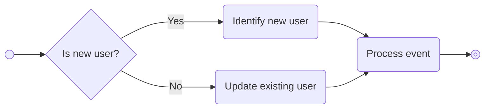

import MetricChangeRequestBlock from "../../snippets/metric-change-request-block.mdx";
import IdentifyUserRequestBlock from "../../snippets/identify-user-request-block.mdx";
import UpdateUserNotificationPreferencesBlock from "../../snippets/update-user-notification-preferences-block.mdx";
import GetUserNotificationPreferencesBlock from "../../snippets/get-user-notification-preferences-block.mdx";
import UserStreakPreferencesResponseBlock from "../../snippets/user-streak-preferences-response-block.mdx";

## ¿Qué son los Usuarios? {#what-are-users}

Los usuarios son las personas individuales que utilizan tu producto. Le informas a Trophy sobre tus usuarios a través de APIs y utilizas el panel de control para diseñar experiencias de gamificación en torno a ellos.

Los usuarios deben ser individuos, no pueden ser empresas u organizaciones. Para crear estructuras organizacionales o agrupaciones de usuarios, considera utilizar un [atributo de usuario personalizado](#custom-user-attributes).

## Atributos Clave {#key-attributes}

Los atributos clave son propiedades de los usuarios controladas y gestionadas por Trophy y son para cosas como `id` o `email`, algunos son obligatorios mientras que otros son opcionales.

### Atributos Obligatorios {#required-attributes}

Trophy solo requiere un atributo clave, `id`. Cada usuario sobre el que informes a Trophy debe tener un `id`, esto es lo que los identifica como una persona única.

<ParamField path="id" type="string" required={true}>
  Este es el ID del usuario en **tu** base de datos.
</ParamField>

<Tip>
  Para simplificar las cosas, Trophy te permite utilizar tu propio `id` que ya tienes
  en tu base de datos en lugar de necesitar gestionar otro solo para Trophy.
</Tip>

### Atributos Opcionales {#optional-attributes}

Además, puedes informar a Trophy sobre cualquiera de los siguientes atributos clave opcionales y los pondrá a tu disposición como parte de tu experiencia de gamificación:

<ParamField path="name" type="string">
  El nombre completo del usuario. Este está accesible en plantillas de correo electrónico y otras áreas
  donde puedas querer dirigirte al usuario por su nombre.
</ParamField>

<ParamField path="email" type="string">
  La dirección de correo electrónico del usuario. Esta dirección se utilizará en cualquier
  [correo electrónico](/es/features/emails) que configures como parte de tu experiencia
  de gamificación con Trophy.
</ParamField>

<ParamField path="tz" type="string">
  La zona horaria del usuario. Debe especificarse como un [identificador de zona horaria
  IANA](https://en.wikipedia.org/wiki/List_of_tz_database_time_zones).
  Se utiliza para rachas, clasificaciones del ranking y envío de correos electrónicos a los usuarios de
  acuerdo con su hora local.

En JavaScript, puedes obtener la zona horaria del usuario usando este fragmento:

```js Fetching timezone
// e.g. 'Europe/London'
const timezone = Intl.DateTimeFormat().resolvedOptions().timeZone;
```

</ParamField>

<ParamField path="subscribeToEmails" type="boolean" default="true">
  Si has configurado algún [correo electrónico](/es/features/emails) de Trophy, solo se
  enviarán a un usuario cuando este campo sea true. Nota: Si no proporcionas un
  `email`, intentar establecer este campo como true generará un error.
</ParamField>

<ParamField path="signUpDate" type="string">
  La fecha en que el usuario se registró en tu plataforma, como `YYYY-MM-DD`. Se aceptan
  fechas-hora ISO 8601 y se almacenan como su día de calendario UTC. No debe ser
  posterior al día de hoy en la zona horaria del usuario. Este campo es independiente de
  `created`, que es la fecha en que Trophy tuvo conocimiento del usuario por primera vez.
</ParamField>

<ParamField path="deviceTokens" type="array<string>">
  La lista de tokens de dispositivo que se asociarán con el usuario. Si has configurado
  [Notificaciones push](/es/features/push-notifications) de Trophy, solo se
  enviarán a un usuario cuando se proporcione este campo.
</ParamField>

## Atributos de usuario personalizados {#custom-user-attributes}

<Note>
  Esta función está disponible en el plan [Pro](/es/account/billing#pro-plan)
</Note>

<Frame>
  
</Frame>

Los atributos de usuario personalizados son gestionados por ti y pueden ser cualquier cosa que necesites según tu caso de uso.

Por ejemplo, una aplicación de aprendizaje de idiomas podría usar un atributo de usuario personalizado para el idioma que un usuario está aprendiendo, o una plataforma de estudio podría usar uno para la materia favorita del usuario.

Los atributos de usuario personalizados te permiten informar a Trophy sobre esta información contextual y usarla para personalizar las funciones de gamificación.

### Crear atributos {#creating-attributes}

Para crear un nuevo atributo de usuario personalizado, dirígete a la [pestaña de atributos](https://app.trophy.so/users/attributes) de la página de usuarios en el panel de Trophy y pulsa el botón _Agregar atributo de usuario_.

Asigna al atributo un nombre y una clave única. La clave es lo que usarás para hacer referencia al atributo en las llamadas a la API.

<Frame>
  <video
    autoPlay
    muted
    loop
    playsInline
    className="w-full aspect-15/4"
    src="../../assets/features/users/create_custom_user_attribute.mp4"
  ></video>
</Frame>

### Establecer atributos {#setting-attributes}

Los atributos pueden recibir valores para usuarios específicos usando su clave única, ya sea en línea, mientras los usuarios incrementan métricas mediante la [API de incremento de métricas](/es/api-reference/endpoints/events/submit-a-metric-event), o explícitamente a través de las APIs de [identificación de usuario](/es/api-reference/endpoints/users/identify-a-user), [crear usuario](/es/api-reference/endpoints/users/create-a-user) o [actualizar usuario](/es/api-reference/endpoints/users/update-a-user).

<Warning>
  Trophy solo establecerá valores de atributos que primero hayan sido creados
  en el panel. Hacemos esto para ayudarte a mantener un conjunto limpio de atributos y
  prevenir sobrescrituras accidentales.

Si recibes un error similar al siguiente, es posible que hayas escrito mal la clave del atributo en la solicitud, o que necesites crear primero el atributo en el panel de Trophy:

{/* vale off */}

```json
{
  "error": "Invalid attribute keys: pln. Please ensure all attribute keys match those set up at https://app.trophy.so/users/attributes."
}
```

{/* vale on */}

</Warning>

En todas las APIs, el esquema para establecer valores de atributos es consistente. Aquí tienes un ejemplo de una carga útil de solicitud que establece el valor de dos atributos de usuario personalizados `subject` y `plan`:

```json {4-7}
{
  "name": "Joe Bloggs",
  "email": "joe.bloggs@example.com",
  "attributes": {
    "subject": "physics",
    "plan": "free"
  }
}
```

### Usar atributos {#using-attributes}

Usa atributos de usuario personalizados en Trophy para personalizar funciones de gamificación, agregar y filtrar datos devueltos por las APIs, y para segmentar y comparar cohortes de usuarios en análisis.

#### Personalización de Funciones {#feature-personalization}

Los atributos personalizados de usuario pueden utilizarse para personalizar logros, customizar la forma en que diferentes usuarios ganan puntos y más. Sigue los enlaces a las páginas relevantes a continuación para obtener más información.

<CardGroup>
  <Card
    title="Personalización de Logros"
    icon="trophy"
    href="/es/features/achievements#creating-achievements"
  >
    Configura logros que solo pueden ser desbloqueados por usuarios específicos.
  </Card>
  <Card
    title="Personalización de Puntos"
    icon="sparkle"
    href="/es/features/points#points-triggers"
  >
    Personaliza cómo diferentes usuarios ganan puntos.
  </Card>
  <Card
    title="Segmentación de Correos Electrónicos"
    icon="split"
    href="/es/features/emails#limiting-emails-to-specific-types-of-users"
  >
    Controla qué usuarios reciben correos electrónicos gamificados.
  </Card>
  <Card
    title="Personalización de Correos Electrónicos"
    icon="trophy"
    href="/es/features/emails#email-variables"
  >
    Personaliza el contenido y las líneas de asunto de los correos electrónicos con atributos personalizados de usuario.
  </Card>
</CardGroup>

#### Agregación y Filtrado de Datos {#data-aggregation-and-filtering}

Puedes usar atributos personalizados de usuario para agregar y filtrar datos devueltos por algunas APIs para soportar una amplia gama de casos de uso de gamificación. En todos los casos, los atributos se incluyen en el parámetro de consulta `userAttributes` usando un esquema consistente:

`?userAttributes=city:london,subscription-plan:pro`

Aquí está una lista de todas las APIs que soportan el parámetro de consulta `userAttributes`:

- [Resumen de Puntos](/es/api-reference/endpoints/points/get-points-summary)

#### Analíticas Segmentadas {#segmented-analytics}

Los atributos personalizados de usuario pueden utilizarse para segmentar y comparar gráficos de retención y engagement entre grupos de usuarios.

Esto es útil para comprender qué cohortes están haciendo pleno uso de tus funciones de gamificación, y cuáles tienen dificultades para interactuar y por lo tanto requieren atención.

<Frame>
  <video
    autoPlay
    muted
    loop
    playsInline
    className="w-full aspect-15/4"
    src="../../assets/features/users/segmenting_analytics.mp4"
  ></video>
</Frame>

## Identificación de Usuarios {#identifying-users}

Cuando le informas a Trophy sobre un usuario en tu plataforma, a esto lo llamamos **identificación**. Hay dos formas en las que puedes identificar usuarios con Trophy, identificación [en línea](#inline-identification) e identificación [explícita](#explicit-identification).

<Tip>
  Recomendamos comenzar con la identificación en línea si eres nuevo en
  Trophy. Si decides que necesitas más control, prueba la identificación explícita.
</Tip>

### Identificación en línea {#inline-identification}

La identificación en línea es la forma más sencilla de informar a Trophy sobre tus usuarios, ya que no requiere ningún código específico de identificación de usuarios. Simplemente le dices a Trophy sobre los usuarios a medida que utilizan tu plataforma de forma normal.

En la práctica, esto significa que cada vez que usas la [API de eventos de métricas](/es/api-reference/endpoints/events/submit-a-metric-event), pasas los detalles completos del usuario que activó el evento.

Aquí hay un ejemplo donde se realiza una llamada a la API de eventos de métricas, y los detalles del usuario que realizó la interacción se pasan en el cuerpo de la solicitud:

<MetricChangeRequestBlock />

En este caso, si esta es la primera interacción del usuario (es decir, es un usuario nuevo), entonces se creará automáticamente un nuevo registro para él en Trophy.

Sin embargo, si Trophy encuentra un registro existente con el mismo `id`, entonces Trophy actualizará los detalles del usuario que se pasen.

En otras palabras, la identificación en línea se realiza mediante una operación `UPSERT`.

<br />



<br />

Identificar usuarios de esta manera tiene dos beneficios clave:

- Todos los usuarios nuevos que se registren en tu plataforma e incrementen una métrica son rastreados automáticamente en Trophy sin necesidad de que escribas código de identificación explícito
- Cualquier cambio en las propiedades de usuarios existentes como nombre o dirección de correo electrónico se sincroniza automáticamente con Trophy la próxima vez que el usuario incremente una métrica

De esta manera, la identificación en línea te permite mantener toda tu base de usuarios constantemente sincronizada con Trophy con la menor cantidad de código requerido por tu parte.

Por eso recomendamos comenzar primero con la identificación inline y luego explorar la identificación explícita si descubres que necesitas más control.

### Identificación Explícita {#explicit-identification}

La identificación explícita es cuando escribes código en tu aplicación que le indica explícitamente a Trophy sobre los usuarios de forma separada de cualquier interacción con métricas. Esto es útil si deseas un control completo sobre cómo y cuándo Trophy conoce a tus usuarios.

Los escenarios en los que podrías querer usar la identificación explícita incluyen:

- Quieres informar a Trophy sobre nuevos usuarios inmediatamente al registrarse, antes de que incrementen una métrica
- Rastreas muchas métricas en Trophy y no quieres repetir el código de identificación inline.
- Quieres informar a Trophy solo sobre un grupo específico de usuarios, del cual controlas las condiciones

En este caso, puedes informar a Trophy sobre nuevos usuarios usando el [API de Identificación de Usuarios](/es/api-reference/endpoints/users/identify-a-user).

<IdentifyUserRequestBlock />

<Tip>
  Al igual que en la identificación inline, la identificación explícita también funciona mediante
  una operación `UPSERT` lo que significa que todos los atributos de usuario se mantienen sincronizados
  con Trophy automáticamente.
</Tip>

## Creación de Usuarios {#creating-users}

Para crear explícitamente un nuevo usuario en Trophy, usa el [API de Creación de Usuarios](/es/api-reference/endpoints/users/create-a-user).

## Mantener los Usuarios Actualizados {#keeping-users-up-to-date}

Para informar a Trophy sobre una actualización de un usuario en tu plataforma, puedes usar el [API de Actualización de Usuarios](/es/api-reference/endpoints/users/update-a-user).

Todas las propiedades que pases a Trophy se actualizarán a los nuevos valores que especifiques.

<Tip>
  Como la [identificación de usuarios](#identifying-users) mantiene los registros de usuarios actualizados por
  defecto, generalmente no es necesario actualizar explícitamente los usuarios en Trophy cada
  vez que una de sus propiedades cambia en tu aplicación. Sin embargo, el API de
  actualización de usuarios está disponible si realmente lo necesitas.
</Tip>

## Configuración de preferencias de usuario {#setting-user-preferences}

Trophy cuenta con API para ayudarte a crear un centro de preferencias que tus usuarios pueden utilizar para controlar y personalizar la forma en que interactúan con tus funcionalidades de gamificación.

Esta sección describe todas las preferencias que puedes exponer a tus usuarios y su función.

### Preferencias de notificaciones {#notification-preferences}

Puedes usar Trophy para enviar [correos electrónicos](/es/features/emails) y [notificaciones push](/es/features/push-notifications) gamificados a tus usuarios.

La [API de actualización de preferencias](/es/api-reference/endpoints/users/update-user-preferences) de Trophy te permite crear un centro de preferencias dentro de tu aplicación con el que tus usuarios pueden interactuar para controlar qué notificaciones reciben y a través de qué canales.

<Frame>
  
</Frame>

La API te permite actualizar las preferencias de notificación de un usuario para diferentes tipos de notificación:

- **achievement_completed**: Notificaciones enviadas cuando un usuario completa un logro
- **recap**: Notificaciones de resumen periódico sobre el progreso del usuario
- **reactivation**: Notificaciones enviadas para volver a interactuar con usuarios inactivos
- **streak_reminder**: Recordatorios para ayudar a los usuarios a mantener sus rachas

Para cada tipo de notificación, puedes especificar en qué canales debe recibir notificaciones el usuario: `email`, `push`, o ambos. Para desactivar un tipo de notificación por completo, pasa un array vacío.

Por ejemplo, el siguiente fragmento de código actualiza las preferencias de notificación de un usuario en Trophy:

<UpdateUserNotificationPreferencesBlock />

Para crear una interfaz de centro de preferencias en tu aplicación, primero debes obtener las preferencias actuales del usuario mediante la [API de obtención de preferencias](/es/api-reference/endpoints/users/get-user-preferences).

Esto devolverá la configuración de notificaciones actual del usuario, que luego podrás mostrar en tu interfaz y permitir que los usuarios modifiquen.

<GetUserNotificationPreferencesBlock />

La API devuelve una respuesta que contiene las preferencias de notificación actuales del usuario para cada tipo de notificación:

```json Response {3}
{
  "notifications": {
    "achievement_completed": ["email", "push"],
    "recap": ["email"],
    "reactivation": ["push"],
    "streak_reminder": ["email", "push"]
  }
}
```

Puedes usar esta respuesta para:

- **Rellenar controles de formulario**: Preselecciona casillas de verificación o conmutadores en la interfaz de tu centro de preferencias según los valores actuales
- **Mostrar el estado actual**: Muestra qué notificaciones están habilitadas y a través de qué canales
- **Gestionar preferencias faltantes**: Si un tipo de notificación no está presente en la respuesta, significa que el usuario aún no ha configurado preferencias para ello, y puedes usar la configuración predeterminada de tu aplicación

Una vez que hayas obtenido y mostrado las preferencias, los usuarios pueden realizar cambios en tu interfaz, y puedes usar la [API de actualización de preferencias](/es/api-reference/endpoints/users/update-user-preferences) para guardar sus selecciones de vuelta en Trophy.

### Preferencias de Racha {#streak-preferences}

Trophy admite preferencias de usuario para rachas, lo que permite a los usuarios personalizar las condiciones que deben cumplir para extender su racha, incluyendo qué días de la semana cuentan para ella.

<Note>
Para usar las preferencias de racha, debes tener la [personalización de rachas](/es/features/streaks#streak-personalization) habilitada.
</Note>

Una vez que la personalización de rachas esté habilitada, la [API de actualización de preferencias](/es/api-reference/endpoints/users/update-user-preferences) te permitirá sobrescribir la configuración predeterminada de rachas para un usuario específico.

Las siguientes configuraciones de racha pueden ser sobrescritas por las preferencias de usuario:
- `enabled`: Si las rachas se calculan para este usuario. Cuando `false`, la racha del usuario siempre es `0` y no se envían webhooks ni notificaciones de racha.
- `metrics`: Un array de [métricas](/es/features/metrics) con umbrales personalizados requeridos para extender la racha.
- `evaluationMode`: Determina cómo se combinan las métricas para extender la racha. Puede ser `ALL` o `OR`.
- `daysOff`: Un array de números de días de la semana (`0` = domingo hasta `6` = sábado) que sobrescriben los [días libres](/es/features/streaks#days-off) de la organización. El usuario no perderá su racha si está inactivo en estos días.

<UserStreakPreferencesResponseBlock />

Una vez que se establecen las preferencias de racha, la [API de obtención de preferencias](/es/api-reference/endpoints/users/get-user-preferences) devolverá la configuración de racha personalizada del usuario.

## Recuperación de información del usuario {#retrieving-user-information}

Para obtener los detalles de un usuario que ya has identificado con Trophy, utiliza la [API Get User](/es/api-reference/endpoints/users/get-a-single-user).

Esto devolverá los detalles completos del usuario junto con el atributo `control` que puedes usar para inscribir condicionalmente a los usuarios en cualquier función de gamificación. Obtén más información sobre [Experimentación](/es/platform/experimentation).

```json Response {3}
{
  "id": "user-id",
  "control": false,
  "created": "2021-01-01T00:00:00Z",
  "email": "user@example.com",
  "name": "User",
  "signUpDate": "2020-08-20",
  "subscribeToEmails": true,
  "tz": "Europe/London",
  "updated": "2021-01-01T00:00:00Z"
}
```

## Analítica de usuarios {#user-analytics}

### Analítica básica {#basic-analytics}

Por defecto, Trophy incluye analítica de usuarios de alto nivel en la [página de Usuarios](https://app.trophy.so/users) que incluye:

- El número total de usuarios que le has indicado a Trophy
- El número de usuarios que están activos diariamente
- El número de usuarios que están activos mensualmente

<Frame>
  
</Frame>

En esta página también puedes buscar entre todos los usuarios que Trophy ha registrado, lo cual puede ser útil para depuración.

### Usuarios destacados {#top-users}

Además, en el [Dashboard](https://app.trophy.so), Trophy muestra una lista de _Usuarios Destacados_ con el conjunto de usuarios que han logrado el mayor progreso contra las Métricas de tu plataforma.

¡Estos son tus usuarios más comprometidos, así que es útil saber quiénes son!

## Preguntas frecuentes {#frequently-asked-questions}

<AccordionGroup>
  <Accordion title="¿Cuántos usuarios puedo indicarle a Trophy?">
    ¡Tantos como quieras! Trophy solo cobra cada mes por los usuarios _activos_, que son los usuarios que interactúan con tu producto al menos una vez en un mes determinado.

    Esto es excelente porque significa que si un usuario abandona, no pagarás por él en los meses siguientes.

    Puedes ver el número total de usuarios que se te cobrarán cada mes dentro de Trophy en la barra lateral:

    <Frame>
      
    </Frame>

    Puedes estimar los costos de uso en nuestra [página de precios](https://trophy.so/pricing).

  </Accordion>

</AccordionGroup>

## Obtener soporte {#get-support}

¿Quieres ponerte en contacto con el equipo de Trophy? Comunícate con nosotros por [correo electrónico](mailto:support@trophy.so). ¡Estamos aquí para ayudarte!
