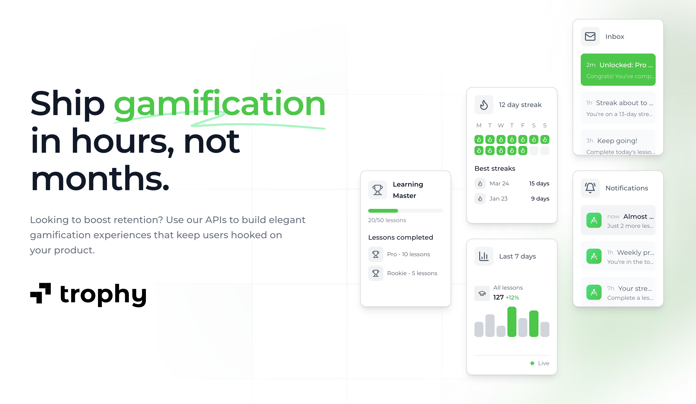

Trophy es un conjunto de herramientas fácil de usar para desarrolladores que permite crear experiencias de producto gamificadas en cualquier aplicación móvil o web.

Facilita la creación de funciones como [Logros](/es/platform/achievements), [Rachas](/es/platform/streaks), [Puntos](/es/platform/points) y [Clasificaciones](/es/platform/leaderboards) con solo unas pocas líneas de código, y puede enviar [correos electrónicos](/es/platform/emails) y [Notificaciones push](/es/platform/push-notifications) gamificados para aumentar tu retención y engagement.

<CardGroup>
  <Card
    title="Inicio rápido"
    icon="circle-play"
    href="/es/getting-started/quickstart"
  >
    Integra Trophy en tu backend en menos de 10 minutos.
  </Card>
  <Card title="Guías" icon="rocket" href="/es/guides">
    Usa Trophy para crear soluciones prácticas a casos de uso comunes de gamificación.
  </Card>
  <Card title="Plataforma" icon="box" href="/es/platform">
    Aprende los conceptos clave detrás de la creación de experiencias de gamificación con Trophy.
  </Card>
  <Card title="Referencia del API" icon="code" href="/es/api-reference">
    Explora el API de Trophy y descubre lo que es posible.
  </Card>
</CardGroup>

## Por qué Trophy {#why-trophy}

<Frame>
  
</Frame>

Si tu objetivo es que tus usuarios creen un hábito regular de usar tu aplicación —para aprender algo, publicar contenido o incluso hacer ejercicio— la gamificación podría ser para ti.

Ha sido comprobado por Duolingo y otros que la gamificación aumenta predeciblemente la retención e incrementa el engagement en la plataforma.

Pero construir gamificación a escala puede ser complicado. Tienes una base de usuarios global, todos en diferentes zonas horarias, todos con diferentes patrones de uso que necesitan ser medidos y optimizados en tiempo real. Además, quieres ejecutar experimentos para probar diferentes enfoques y ver cómo impactan la retención, pero esto requiere cambios constantes en el código, lo que retrasa el trabajo en tu producto principal.

Trophy elimina el trabajo pesado involucrado en crear funciones como logros, rachas, sistemas de puntos y clasificaciones, al mismo tiempo que proporciona APIs confiables y escalables para lanzar experiencias de gamificación más rápido que construyéndolas internamente. Además, ofrece una plataforma web para configurar, medir y experimentar fácilmente con la experiencia del producto sin cambios constantes en el código.

## Obtener soporte {#get-support}

¿Quieres ponerte en contacto con el equipo de Trophy? Escríbenos por [correo electrónico](mailto:support@trophy.so). ¡Estamos aquí para ayudarte!
