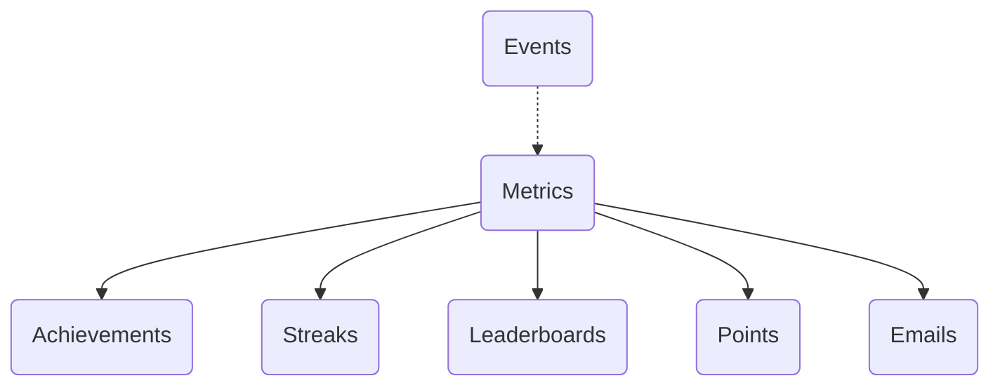
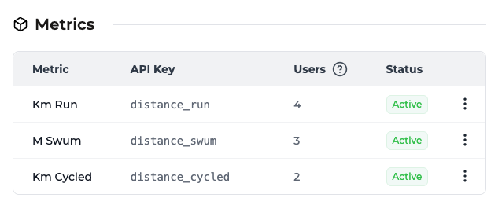
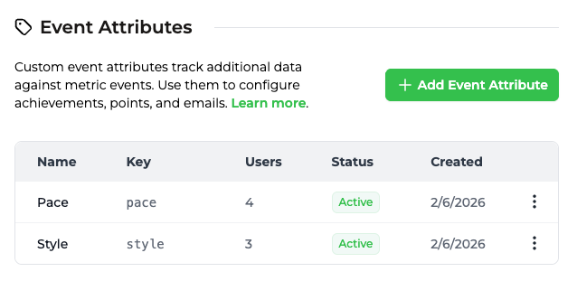
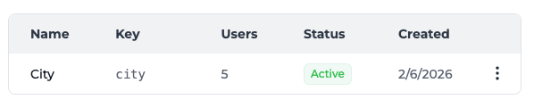
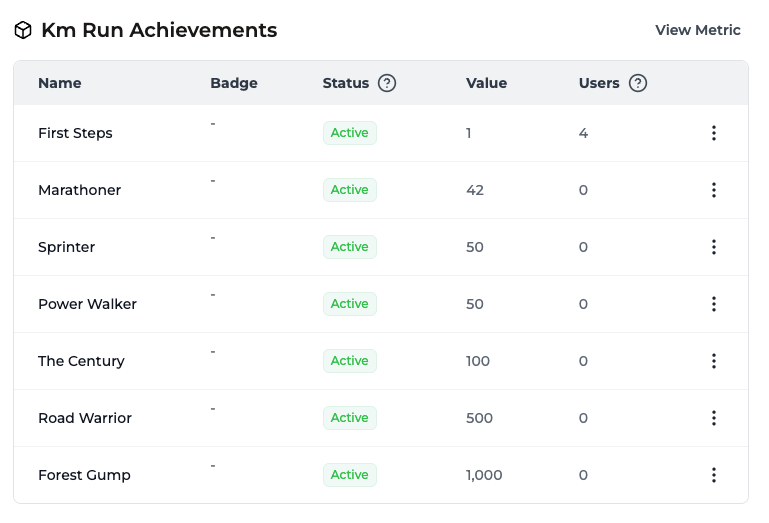
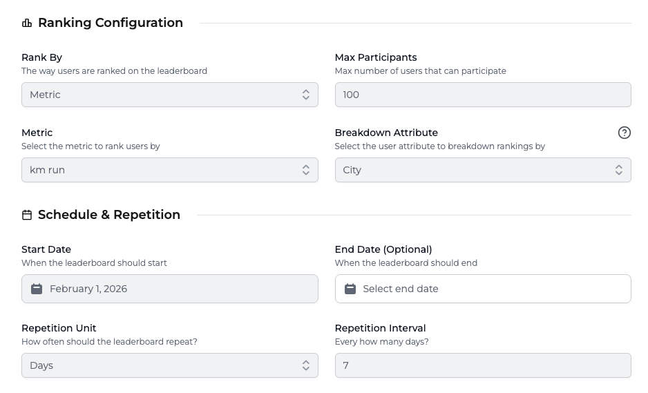
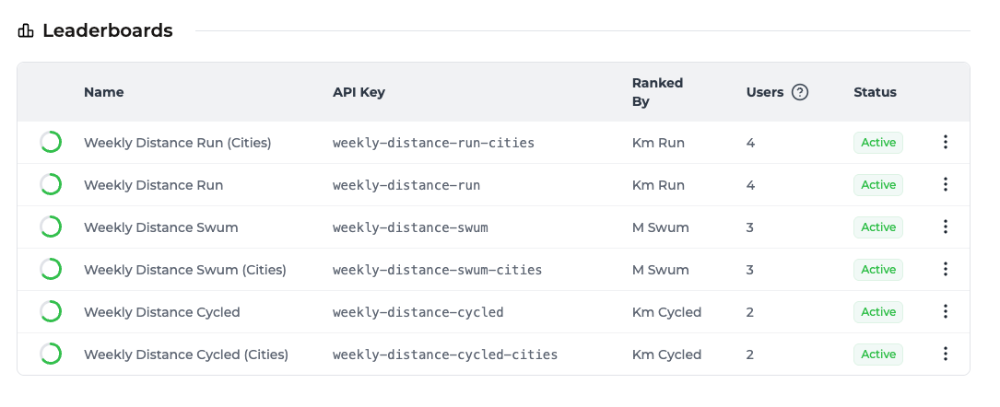
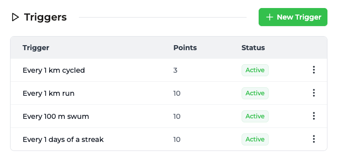

En este tutorial, crearemos **TrophyFitness**, una aplicación de fitness para consumidores que rastrea carrera, ciclismo y natación. Implementaremos un bucle de gamificación completo que incluye clasificaciones semanales, rachas formadoras de hábitos y un sistema de progresión por niveles.

Si quieres ir directamente al código, consulta el [repositorio de ejemplo](https://github.com/trophyso/example-fitness-platform) o la [demostración en vivo](https://fitness.examples.trophy.so).

<Frame>
  <video
    autoPlay
    muted
    loop
    playsInline
    className="w-full aspect-video"
    src="../../assets/guides/example-apps/example-fitness-app/demo.mp4"
  ></video>
</Frame>

## Tabla de Contenidos {#table-of-contents}

- [Stack Tecnológico](#tech-stack)
- [Requisitos Previos](#prerequisites)
- [Configuración e Instalación](#setup-installation)
- [Diseñar el Modelo de Datos](#designing-the-data-model)
- [Cómo Funciona Trophy](#how-trophy-works)
- [Configurar Trophy](#setting-up-trophy)
- [Acciones del Servidor](#server-actions)
- [El Sistema de Niveles](#the-leveling-system)
- [Crear el Panel de Control](#building-the-dashboard)
- [Registrar Entrenamientos](#logging-workouts)
- [Implementar Clasificaciones](#implementing-leaderboards)
- [Crear la Página de Logros](#building-the-achievements-page)
- [Crear la Página de Perfil](#building-the-profile-page)
- [El Resultado](#the-result)

## Stack Tecnológico {#tech-stack}

- **Framework:** [Next.js 15](https://nextjs.org) (App Router)
- **UI:** [Shadcn/UI](https://ui.shadcn.com) + TailwindCSS
- **Iconos:** [Lucide React](https://lucide.dev)
- **Gamificación:** [Trophy](https://trophy.so)

## Requisitos Previos {#prerequisites}

- Una cuenta de Trophy (regístrate [aquí](https://app.trophy.so/sign-up)).
- Node.js 18+ instalado.

## Configuración e Instalación {#setup-installation}

Primero, clona el repositorio inicial o crea una nueva aplicación Next.js:

```bash
npx create-next-app@latest trophy-fitness
```

Instala las dependencias necesarias:

```bash
npm install @trophyso/node lucide-react clsx tailwind-merge
```

Configura tus variables de entorno en `.env.local`:

```bash
TROPHY_API_KEY=your_api_key_here
```

## Diseñar el Modelo de Datos {#designing-the-data-model}

Para una aplicación de fitness multideporte, necesitamos normalizar los esfuerzos. Un ciclo de 10 km no es lo mismo que una carrera de 10 km. Utilizaremos tres métricas distintas para rastrear datos sin procesar y un sistema de XP unificado para la progresión.

### 1. Las Métricas {#1-the-metrics}

Rastrearemos la distancia como el valor principal.

- `distance_run` (km) - con atributo `pace` (caminar/correr).
- `distance_cycled` (km)
- `distance_swum` (m) - con atributo `style` (estilo libre/braza).

### 2. Los Atributos {#2-the-attributes}

Para habilitar clasificaciones locales, etiquetaremos a cada usuario con un atributo `city`.

## Cómo Funciona Trophy {#how-trophy-works}

Antes de profundizar en el código, entendamos cómo Trophy impulsa nuestra capa de gamificación. En Trophy, las [Métricas](/es/platform/metrics) representan diferentes interacciones que los usuarios pueden realizar e impulsan funciones como [Logros](/es/platform/achievements), [Rachas](/es/platform/streaks) y [Correos Electrónicos](/es/platform/emails).



Cuando se registran eventos para un usuario específico, cualquier logro vinculado a la métrica especificada se desbloqueará si se cumplen los requisitos, las rachas se calcularán automáticamente, las clasificaciones se actualizarán y cualquier correo electrónico configurado se programará.

Esto es lo que hace que construir experiencias gamificadas con Trophy sea tan poderoso: hace todo el trabajo detrás de escena.

## Configuración de Trophy {#setting-up-trophy}

Así es como configuraremos Trophy para nuestra aplicación de fitness:

<AccordionGroup>
  <Accordion title="Crear métricas" icon="box">
    Dirígete a la [página de métricas](https://app.trophy.so/metrics) de Trophy y crea tres métricas:
    
    - `distance_run` — Total de kilómetros corridos
    - `distance_cycled` — Total de kilómetros en bicicleta  
    - `distance_swum` — Total de metros nadados
    
    Estas claves son las que referenciaremos en nuestro código al enviar eventos.

    <Frame>
      
    </Frame>

  </Accordion>

  <Accordion title="Crear atributos" icon="tag">
    Mientras aún estás en la [página de métricas](https://app.trophy.so/metrics), configura
    los atributos de evento **pace** y **style**:

    <Frame>
      
    </Frame>

    Luego, ve a la [página de atributos de usuario](https://app.trophy.so/users/attributes)
    y crea el atributo de usuario **city**:

    <Frame>
      
    </Frame>

  </Accordion>

  <Accordion title="Crear logros" icon="trophy">
    Ve a la [página de logros](https://app.trophy.so/achievements) de Trophy
    y crea logros de hitos para cada deporte. Por ejemplo:
    
    **Running:** 
    
    - First 5K (5km en total) 
    - Half Marathon Hero (21.1km en total) 
    - Marathon Master (42.2km en total) 
    
    **Cycling:** 
    
    - Century Rider (100km en total) 
    - Tour Stage (200km en total) 
    
    **Swimming:** 
    - Pool Regular (1000m en total) 
    - Open Water Ready (5000m en total) 
    
    Vincula cada logro a la métrica correspondiente.

    <Frame>
      
    </Frame>
  </Accordion>

  <Accordion title="Configurar clasificaciones" icon="chart-bar">
    Ve a la [página de clasificaciones](https://app.trophy.so/leaderboards) y configura
    clasificaciones semanales para impulsar la competencia. Cada clasificación debe configurarse
    con **Unidad de repetición: Días** e **Intervalo de repetición: 7** para
    repetirse semanalmente.

    <Frame>
      
    </Frame>
    
    **Clasificaciones globales:** 
    
    - `weekly-distance-run` 
    - `weekly-distance-cycled` 
    - `weekly-distance-swum`
    
    **Clasificaciones por ciudad** (desglose por atributo de usuario **city**): 
    
    - `weekly-distance-run-cities` 
    - `weekly-distance-cycled-cities` 
    - `weekly-distance-swum-cities`

    <Frame>
      
    </Frame>
  </Accordion>

  <Accordion title="Configurar puntos XP" icon="star">
    Ve a la [página de puntos](https://app.trophy.so/points) y crea un sistema de puntos
    llamado `xp` que otorgue puntos según la actividad: 
    
    - Running: 10 XP por km 
    - Cycling: 3 XP por km 
    - Swimming: 10 XP por cada 100m 
    
    Este enfoque normalizado garantiza una progresión justa entre deportes.
    
    <Frame>
      
    </Frame>

    Luego configura **[Niveles de puntos](/es/platform/points#points-levels)** en el mismo sistema `xp` para que Trophy pueda rastrear el nivel de cada usuario. Usa las claves y umbrales a continuación para que el código de esta guía coincida con tu panel:

    | Nombre    | Clave       | Umbral de puntos |
    | ------- | --------- | ---------------- |
    | Rookie  | `rookie`  | 0                |
    | Active  | `active`  | 100              |
    | Mover   | `mover`   | 500              |
    | Athlete | `athlete` | 2500             |
    | Pro     | `pro`     | 10000            ||
  </Accordion>

  <Accordion title="Configurar racha diaria" icon="flame">
    Dirígete a la [página de rachas](https://app.trophy.so/streaks) y configura una
    racha diaria vinculada a cualquiera de las métricas de distancia. Los usuarios mantendrán su
    racha registrando al menos una actividad por día.
  </Accordion>

  <Accordion title="Configurar correos electrónicos" icon="mail">
    Dirígete a la [página de correos electrónicos](https://app.trophy.so/emails) y añade y activa plantillas para estos correos electrónicos automatizados de participación:
    
    - **Logro desbloqueado** — Celebra nuevas insignias
    - **Racha en riesgo** — Recuerda a los usuarios antes de que pierdan su racha
    - **Resumen semanal** — Resumen del progreso y posición en la clasificación
    
    Cada tipo de correo tiene su propia sección—añade una plantilla en cada una y actívala para comenzar a enviar. Configura tu marca en la [página de marca](https://app.trophy.so/branding) para correos electrónicos profesionales.
  </Accordion>
</AccordionGroup>

## Acciones del Servidor {#server-actions}

Crearemos un archivo `src/app/actions.ts` para manejar todas las interacciones con la API de Trophy. Esto mantiene nuestras claves API seguras y nos permite aprovechar las Server Actions de Next.js.

```tsx src/app/actions.ts [expandable]
"use server";

import { TrophyApiClient, TrophyApi } from "@trophyso/node";
import { revalidatePath } from "next/cache";

const trophy = new TrophyApiClient({
  apiKey: process.env.TROPHY_API_KEY as string,
});

export async function identifyUser(userId: string, name?: string, tz?: string) {
  try {
    const user = await trophy.users.identify(userId, { name, tz });
    return { success: true, user };
  } catch (error) {
    return { success: false, error: "Failed to identify user" };
  }
}

export async function updateUserCity(userId: string, city: string) {
  try {
    await trophy.users.update(userId, { attributes: { city } });
    revalidatePath("/leaderboards");
    revalidatePath("/profile");
    return { success: true };
  } catch (error) {
    return { success: false, error: "Failed to update city" };
  }
}

export async function getUserStats(userId: string) {
  try {
    // Fetch all user data in parallel
    const [streak, achievements, metrics, pointsResponse, pointsLevels] =
      await Promise.all([
        trophy.users.streak(userId).catch(() => null),
        trophy.users
          .achievements(userId, { includeIncomplete: "true" })
          .catch(() => []),
        trophy.users.allMetrics(userId).catch(() => []),
        trophy.users.points(userId, "xp").catch(() => null),
        trophy.points.levels("xp").catch(() => []),
      ]);

    return {
      streak,
      achievements,
      points: pointsResponse,
      pointsLevels,
      metrics,
    };
  } catch (error) {
    console.error("Failed to fetch user stats:", error);
    return null;
  }
}

export async function logActivity(params: {
  type: "run" | "cycle" | "swim";
  distance: number;
  userId: string;
  city?: string;
  pace?: string;
  style?: string;
}) {
  const { type, distance, userId, city, pace, style } = params;

  let metricKey = "";
  const eventAttributes: Record<string, string> = {};

  switch (type) {
    case "run":
      metricKey = "distance_run";
      if (pace) eventAttributes.pace = pace;
      break;
    case "cycle":
      metricKey = "distance_cycled";
      break;
    case "swim":
      metricKey = "distance_swum";
      if (style) eventAttributes.style = style;
      break;
  }

  try {
    // Log the event
    const response = await trophy.metrics.event(metricKey, {
      user: {
        id: userId,
        ...(city ? { attributes: { city } } : {}),
      },
      value: distance,
      ...(Object.keys(eventAttributes).length > 0
        ? { attributes: eventAttributes }
        : {}),
    });

    revalidatePath("/");
    revalidatePath("/leaderboards");
    revalidatePath("/profile");

    return { success: true, data: response };
  } catch (error) {
    console.error("Failed to log activity:", error);
    return { success: false, error: "Failed to log activity" };
  }
}

export async function getLeaderboard(leaderboardKey: string, city?: string) {
  try {
    const response = await trophy.leaderboards.get(leaderboardKey, {
      userAttributes: city ? `city:${city}` : undefined,
    });
    return response.rankings || [];
  } catch (error) {
    return [];
  }
}

export async function getRecentActivities(userId: string) {
  // Fetch daily summaries for the last 30 days
  const endDate = new Date().toISOString().split("T")[0];
  const startDate = new Date(Date.now() - 30 * 24 * 60 * 60 * 1000)
    .toISOString()
    .split("T")[0];

  const metrics = [
    { key: "distance_run", type: "run", unit: "km" },
    { key: "distance_cycled", type: "cycle", unit: "km" },
    { key: "distance_swum", type: "swim", unit: "m" },
  ];

  try {
    const summaries = await Promise.all(
      metrics.map(async (metric) => {
        try {
          const data = await trophy.users.metricEventSummary(
            userId,
            metric.key,
            {
              aggregation: "daily",
              startDate,
              endDate,
            },
          );
          return data
            .filter((item) => item.change > 0)
            .map((item) => ({
              id: `${metric.key}-${item.date}`,
              type: metric.type,
              value: item.change,
              unit: metric.unit,
              date: item.date,
            }));
        } catch {
          return [];
        }
      }),
    );

    return summaries
      .flat()
      .sort((a, b) => new Date(b.date).getTime() - new Date(a.date).getTime())
      .slice(0, 5);
  } catch {
    return [];
  }
}

// Helper to get User ID from cookies
export async function getUserIdFromCookies() {
  const { cookies } = await import("next/headers");
  const cookieStore = await cookies();
  return cookieStore.get("trophy-fitness-user-id")?.value ?? null;
}
```

## El Sistema de Niveles {#the-leveling-system}

Trophy almacena el nivel de cada usuario en el sistema de puntos `xp` cuando configuras [Niveles de Puntos](/es/platform/points#points-levels). La carga útil de [puntos de usuario](/es/api-reference/endpoints/users/get-a-users-points) incluye un objeto `level`. La [API de lista de niveles](/es/api-reference/endpoints/points/get-points-levels) devuelve cada nivel y umbral para que puedas mostrar el progreso hacia el siguiente.

Añade un pequeño ayudante junto a las constantes de tu aplicación en `src/lib/constants.ts`:

```tsx src/lib/constants.ts
export type ActivityType = "run" | "cycle" | "swim";

/** Shape of a level from Trophy (`GET /points/{key}/levels`). */
export type TrophyPointsLevel = {
  id: string;
  key: string;
  name: string;
  description: string | null;
  badgeUrl: string | null;
  points: number;
};

/**
 * Derive progress from Trophy totals + levels. Prefer `currentLevel` from the user
 * points API when present; otherwise infer from `total` and threshold order.
 */
export function getLevelProgress(
  total: number,
  levels: TrophyPointsLevel[],
  currentLevel: TrophyPointsLevel | null | undefined,
) {
  const sorted = [...levels].sort((a, b) => a.points - b.points);
  if (sorted.length === 0) {
    return {
      currentLevel: null as TrophyPointsLevel | null,
      tierNumber: null as number | null,
      nextLevel: null as TrophyPointsLevel | null,
      progressToNextLevel: 0,
      xpToNext: null as number | null,
    };
  }

  let current = currentLevel ?? null;
  if (!current) {
    for (let i = sorted.length - 1; i >= 0; i--) {
      if (total >= sorted[i].points) {
        current = sorted[i];
        break;
      }
    }
  }

  const idx = current != null ? sorted.findIndex((l) => l.key === current.key) : -1;
  const tierNumber = idx >= 0 ? idx + 1 : null;
  const nextLevel =
    idx >= 0 && idx < sorted.length - 1 ? sorted[idx + 1] : null;

  let progressToNextLevel = 100;
  let xpToNext: number | null = null;

  if (nextLevel != null && current != null) {
    const span = nextLevel.points - current.points;
    const into = total - current.points;
    progressToNextLevel =
      span > 0 ? Math.min(100, Math.max(0, (into / span) * 100)) : 100;
    xpToNext = Math.max(0, nextLevel.points - total);
  } else if (nextLevel != null && current == null) {
    const span = nextLevel.points;
    progressToNextLevel =
      span > 0 ? Math.min(100, Math.max(0, (total / span) * 100)) : 0;
    xpToNext = Math.max(0, nextLevel.points - total);
  }

  return {
    currentLevel: current,
    tierNumber,
    nextLevel,
    progressToNextLevel,
    xpToNext,
  };
}
```

## Construyendo el Panel {#building-the-dashboard}

El panel agrega todas las estadísticas del usuario. Obtenemos los datos del lado del servidor y derivamos barras de progreso de los umbrales devueltos por la API.

```tsx src/app/page.tsx [expandable]
import {
  getUserStats,
  getUserIdFromCookies,
  getRecentActivities,
} from "./actions";
import { getLevelProgress } from "@/lib/constants";
import {
  Zap,
  Flame,
  Footprints,
  Bike,
  Waves,
  Trophy,
  TrendingUp,
} from "lucide-react";
import { Card, CardContent } from "@/components/ui/card";
import { Progress } from "@/components/ui/progress";
import { Button } from "@/components/ui/button";
import { LogActivityDialog } from "@/components/log-activity-dialog";

export default async function Dashboard() {
  const userId = await getUserIdFromCookies();
  const [stats, recentActivities] = await Promise.all([
    getUserStats(userId ?? ""),
    getRecentActivities(userId ?? ""),
  ]);

  const streakLength = stats?.streak?.length ?? 0;
  const totalXP = stats?.points?.total ?? 0;
  const levelProgress = getLevelProgress(
    totalXP,
    stats?.pointsLevels ?? [],
    stats?.points?.level,
  );

  // Helper to get total for a metric key
  const getMetricTotal = (key: string) =>
    stats?.metrics?.find((m) => m.key === key)?.current ?? 0;

  // Find the next badge to earn
  const nextAchievement = stats?.achievements?.find((a) => !a.achievedAt);

  return (
    <div className="space-y-8">
      {/* Level & Streak Header */}
      <div className="flex items-start gap-4">
        <div className="flex-1 space-y-3">
          <div className="flex items-center gap-2">
            <div className="w-10 h-10 rounded-xl bg-primary/10 flex items-center justify-center">
              <Zap className="w-5 h-5 text-primary" />
            </div>
            <div>
              <div className="text-sm text-muted-foreground">
                {levelProgress.tierNumber != null
                  ? `Level ${levelProgress.tierNumber}`
                  : "Level"}
              </div>
              <div className="font-semibold text-lg">
                {levelProgress.currentLevel?.name ?? "XP"}
              </div>
            </div>
          </div>
          <Progress value={levelProgress.progressToNextLevel} className="h-2" />
          <div className="flex justify-between text-xs text-muted-foreground">
            <span>{totalXP} XP</span>
            {levelProgress.nextLevel != null && levelProgress.xpToNext != null && (
              <span>
                {levelProgress.xpToNext} XP to {levelProgress.nextLevel.name}
              </span>
            )}
          </div>
        </div>

        <div className="flex flex-col items-center p-3 rounded-2xl bg-orange-50 border border-orange-100">
          <Flame
            className={`w-7 h-7 ${streakLength > 0 ? "text-orange-500" : "text-muted-foreground"}`}
          />
          <span className="text-lg font-bold text-orange-600">
            {streakLength}
          </span>
          <span className="text-[10px] uppercase tracking-wide">
            day streak
          </span>
        </div>
      </div>

      {/* Stats Grid */}
      <div className="grid grid-cols-3 gap-3">
        <Card>
          <CardContent className="p-4 text-center">
            <Footprints className="w-5 h-5 text-blue-500 mx-auto mb-2" />
            <div className="text-2xl font-bold">
              {getMetricTotal("distance_run").toFixed(1)}
            </div>
            <div className="text-xs text-muted-foreground">km run</div>
          </CardContent>
        </Card>
        {/* Repeat for Cycle and Swim... */}
      </div>

      {/* Next Badge Teaser */}
      {nextAchievement && (
        <Card className="bg-primary/5 border-0">
          <CardContent className="p-5 flex items-center gap-4">
            <div className="w-12 h-12 rounded-2xl bg-primary/15 flex items-center justify-center">
              <Trophy className="w-6 h-6 text-primary" />
            </div>
            <div className="flex-1">
              <div className="text-xs font-medium text-primary uppercase">
                Next Badge
              </div>
              <h4 className="font-semibold">{nextAchievement.name}</h4>
              <p className="text-sm text-muted-foreground">
                {nextAchievement.description}
              </p>
            </div>
            <LogActivityDialog>
              <Button>Log Workout</Button>
            </LogActivityDialog>
          </CardContent>
        </Card>
      )}
    </div>
  );
}
```

Nota el contenedor `LogActivityDialog` alrededor del botón—lo construiremos a continuación.

## Registrando Entrenamientos {#logging-workouts}

El botón Registrar Entrenamiento abre un cuadro de diálogo donde los usuarios seleccionan su tipo de actividad, ingresan la distancia y envían. Esto activa la acción del servidor `logActivity` que envía el evento a Trophy.

Primero, instala los componentes requeridos de shadcn/ui:

```bash
npx shadcn@latest add dialog tabs input label select
```

Luego crea el componente de diálogo:

```tsx components/log-activity-dialog.tsx [expandable]
"use client";

import { useState, useTransition } from "react";
import {
  Dialog,
  DialogContent,
  DialogHeader,
  DialogTitle,
  DialogTrigger,
  DialogDescription,
} from "@/components/ui/dialog";
import { Tabs, TabsList, TabsTrigger } from "@/components/ui/tabs";
import { Button } from "@/components/ui/button";
import { Input } from "@/components/ui/input";
import { Label } from "@/components/ui/label";
import {
  Select,
  SelectContent,
  SelectItem,
  SelectTrigger,
  SelectValue,
} from "@/components/ui/select";
import { Footprints, Bike, Waves, Loader2, Zap } from "lucide-react";
import { toast } from "sonner";
import { logActivity } from "@/app/actions";
import { ActivityType } from "@/lib/constants";
import { getUserCity } from "@/lib/city";
import { useUser } from "@/components/user-provider";

export function LogActivityDialog({ children }: { children: React.ReactNode }) {
  const { userId } = useUser();
  const [open, setOpen] = useState(false);
  const [isPending, startTransition] = useTransition();
  const [activeTab, setActiveTab] = useState<ActivityType>("run");
  const [distance, setDistance] = useState("");
  const [pace, setPace] = useState("run");
  const [style, setStyle] = useState("freestyle");

  const handleSubmit = async (e: React.FormEvent) => {
    e.preventDefault();

    if (!userId) {
      toast.error("User not initialized");
      return;
    }

    const distNum = parseFloat(distance);
    if (!distNum || distNum <= 0) {
      toast.error("Please enter a valid distance");
      return;
    }

    const city = getUserCity();

    startTransition(async () => {
      const result = await logActivity({
        userId,
        type: activeTab,
        distance: distNum,
        city,
        pace: activeTab === "run" ? pace : undefined,
        style: activeTab === "swim" ? style : undefined,
      });

      if (result.success) {
        toast.success("Workout Saved!", {
          description: `Logged ${distNum} ${activeTab === "swim" ? "m" : "km"} ${activeTab}.`,
        });
        setOpen(false);
        setDistance("");
      } else {
        toast.error("Failed to save workout");
      }
    });
  };

  return (
    <Dialog open={open} onOpenChange={setOpen}>
      <DialogTrigger asChild>{children}</DialogTrigger>
      <DialogContent className="sm:max-w-[400px]">
        <DialogHeader>
          <DialogTitle>Log Workout</DialogTitle>
          <DialogDescription>
            Record your workout to earn XP and climb the leaderboard.
          </DialogDescription>
        </DialogHeader>

        <Tabs value={activeTab} onValueChange={(v) => setActiveTab(v as ActivityType)}>
          <TabsList className="grid w-full grid-cols-3">
            <TabsTrigger value="run"><Footprints className="w-4 h-4 mr-1" /> Run</TabsTrigger>
            <TabsTrigger value="cycle"><Bike className="w-4 h-4 mr-1" /> Cycle</TabsTrigger>
            <TabsTrigger value="swim"><Waves className="w-4 h-4 mr-1" /> Swim</TabsTrigger>
          </TabsList>

          <form onSubmit={handleSubmit} className="space-y-4 pt-4">
            <div className="space-y-2">
              <Label htmlFor="distance">Distance ({activeTab === "swim" ? "m" : "km"})</Label>
              <Input
                id="distance"
                type="number"
                step="0.1"
                placeholder="0.0"
                value={distance}
                onChange={(e) => setDistance(e.target.value)}
                required
              />
            </div>

            {activeTab === "run" && (
              <div className="space-y-2">
                <Label>Pace</Label>
                <Select value={pace} onValueChange={setPace}>
                  <SelectTrigger><SelectValue /></SelectTrigger>
                  <SelectContent>
                    <SelectItem value="run">Running</SelectItem>
                    <SelectItem value="walk">Walking</SelectItem>
                  </SelectContent>
                </Select>
              </div>
            )}

            {activeTab === "swim" && (
              <div className="space-y-2">
                <Label>Style</Label>
                <Select value={style} onValueChange={setStyle}>
                  <SelectTrigger><SelectValue /></SelectTrigger>
                  <SelectContent>
                    <SelectItem value="freestyle">Freestyle</SelectItem>
                    <SelectItem value="breaststroke">Breaststroke</SelectItem>
                  </SelectContent>
                </Select>
              </div>
            )}

            <Button type="submit" className="w-full" disabled={isPending || !distance}>
              {isPending ? <Loader2 className="w-4 h-4 animate-spin" /> : <><Zap className="w-4 h-4 mr-2" /> Save Workout</>}
            </Button>
          </form>
        </Tabs>
      </DialogContent>
    </Dialog>
  );
}
```

### Contexto del Usuario {#user-context}

El diálogo necesita acceso al ID del usuario actual. Crea un proveedor de contexto:

```tsx components/user-provider.tsx [expandable]
"use client";

import { createContext, useContext, useEffect, useState, ReactNode } from "react";
import { getUserId, getUserName } from "@/lib/user";
import { identifyUser } from "@/app/actions";

interface UserContextType {
  userId: string | null;
  userName: string | null;
  isLoading: boolean;
}

const UserContext = createContext<UserContextType>({
  userId: null,
  userName: null,
  isLoading: true,
});

export function useUser() {
  return useContext(UserContext);
}

export function UserProvider({ children }: { children: ReactNode }) {
  const [userId, setUserId] = useState<string | null>(null);
  const [userName, setUserName] = useState<string | null>(null);
  const [isLoading, setIsLoading] = useState(true);

  useEffect(() => {
    const initUser = async () => {
      const id = getUserId();
      const name = getUserName();
      const tz = Intl.DateTimeFormat().resolvedOptions().timeZone;
      
      setUserId(id);
      setUserName(name);
      
      await identifyUser(id, name ?? undefined, tz);
      setIsLoading(false);
    };
    initUser();
  }, []);

  return (
    <UserContext.Provider value={{ userId, userName, isLoading }}>
      {children}
    </UserContext.Provider>
  );
}
```

Envuelve tu aplicación con el proveedor en `layout.tsx`:

```tsx app/layout.tsx
import { UserProvider } from "@/components/user-provider";

export default function RootLayout({ children }) {
  return (
    <html>
      <body>
        <UserProvider>
          {children}
        </UserProvider>
      </body>
    </html>
  );
}
```

### Utilidades Auxiliares {#helper-utilities}

El contexto del usuario depende de funciones auxiliares para gestionar la identidad del usuario en localStorage:

```tsx lib/user.ts [expandable]
const USER_ID_KEY = "trophy-fitness-user-id";
const USER_NAME_KEY = "trophy-fitness-user-name";

const ADJECTIVES = ["Swift", "Mighty", "Blazing", "Iron", "Golden", "Thunder", "Lightning"];
const NOUNS = ["Runner", "Cyclist", "Swimmer", "Athlete", "Champion", "Tiger", "Eagle"];

function generateRandomName(): string {
  const adj = ADJECTIVES[Math.floor(Math.random() * ADJECTIVES.length)];
  const noun = NOUNS[Math.floor(Math.random() * NOUNS.length)];
  return `${adj}${noun}${Math.floor(Math.random() * 100)}`;
}

export function getUserId(): string {
  let userId = localStorage.getItem(USER_ID_KEY);
  if (!userId) {
    userId = crypto.randomUUID();
    localStorage.setItem(USER_ID_KEY, userId);
    localStorage.setItem(USER_NAME_KEY, generateRandomName());
  }
  // Sync to cookie for server-side access
  document.cookie = `${USER_ID_KEY}=${userId}; path=/; max-age=31536000; SameSite=Lax`;
  return userId;
}

export function getUserName(): string | null {
  return localStorage.getItem(USER_NAME_KEY);
}
```

Para las clasificaciones basadas en ciudad, inferimos la ciudad del usuario a partir de su zona horaria:

```tsx lib/city.ts [expandable]
const TIMEZONE_TO_CITY: Record<string, string> = {
  "America/New_York": "New York",
  "America/Los_Angeles": "Los Angeles",
  "Europe/London": "London",
  "Europe/Paris": "Paris",
  "Europe/Berlin": "Berlin",
  "Asia/Tokyo": "Tokyo",
  "Australia/Sydney": "Sydney",
  // ... add more as needed
};

const STORAGE_KEY = "trophy-fitness-city";

export function getUserCity(): string {
  const stored = localStorage.getItem(STORAGE_KEY);
  if (stored) return stored;
  
  const timezone = Intl.DateTimeFormat().resolvedOptions().timeZone;
  return TIMEZONE_TO_CITY[timezone] || "London";
}

export function setStoredCity(city: string): void {
  localStorage.setItem(STORAGE_KEY, city);
}
```

## Implementando Clasificaciones {#implementing-leaderboards}

Construiremos una interfaz con pestañas que permite a los usuarios cambiar entre actividades (Correr/Ciclismo/Natación) y alcances (Global vs. Ciudad Local).

```tsx src/app/leaderboards/page.tsx [expandable]
"use client";

import { useState, useEffect, useMemo } from "react";
import { Tabs, TabsContent, TabsList, TabsTrigger } from "@/components/ui/tabs";
import { getLeaderboard } from "@/app/actions";
import { Trophy, Globe, MapPin } from "lucide-react";
import { getUserCity } from "@/lib/city";

export default function LeaderboardsPage() {
  const [scope, setScope] = useState<"global" | "city">("global");
  const [activeTab, setActiveTab] = useState("run");
  const [data, setData] = useState([]);

  // Get user's city from localStorage
  const city = useMemo(() => getUserCity(), []);

  useEffect(() => {
    // Determine the leaderboard key based on tab and scope
    const baseKey = `weekly-distance-${activeTab}`;
    const key = scope === "city" ? `${baseKey}-cities` : baseKey;
    const cityParam = scope === "city" ? city : undefined;

    getLeaderboard(key, cityParam).then(setData);
  }, [scope, activeTab, city]);

  return (
    <div className="space-y-6">
      <div className="flex items-center justify-between">
        <h1 className="text-xl font-bold flex items-center gap-2">
          <Trophy className="w-5 h-5 text-primary" /> Leaderboards
        </h1>

        {/* Scope Toggle */}
        <div className="flex gap-2 bg-secondary/50 p-1 rounded-xl">
          <button
            onClick={() => setScope("global")}
            className={`px-3 py-1 rounded-lg text-sm flex gap-2 ${scope === "global" ? "bg-white shadow" : ""}`}
          >
            <Globe className="w-4 h-4" /> Global
          </button>
          <button
            onClick={() => setScope("city")}
            className={`px-3 py-1 rounded-lg text-sm flex gap-2 ${scope === "city" ? "bg-white shadow" : ""}`}
          >
            <MapPin className="w-4 h-4" /> Local
          </button>
        </div>
      </div>

      <Tabs value={activeTab} onValueChange={setActiveTab}>
        <TabsList className="grid w-full grid-cols-3">
          <TabsTrigger value="run">Run</TabsTrigger>
          <TabsTrigger value="cycle">Cycle</TabsTrigger>
          <TabsTrigger value="swim">Swim</TabsTrigger>
        </TabsList>

        <TabsContent value={activeTab}>
          {data.map((entry, index) => (
            <div
              key={entry.userId}
              className="flex items-center gap-4 p-4 border-b last:border-0"
            >
              <div className="font-bold w-6">{index + 1}</div>
              <div className="flex-1 font-medium">
                {entry.userName || "Anonymous"}
              </div>
              <div className="font-bold">
                {entry.value} {activeTab === "swim" ? "m" : "km"}
              </div>
            </div>
          ))}
        </TabsContent>
      </Tabs>
    </div>
  );
}
```

## Construyendo la Página de Logros {#building-the-achievements-page}

Un espacio dedicado para mostrar insignias es esencial para la retención a largo plazo. Usaremos los datos de `stats.achievements` para renderizar una cuadrícula de insignias, distinguiendo visualmente entre estados ganados (coloridos) y bloqueados (escala de grises).

```tsx src/app/achievements/page.tsx [expandable]
import { getUserStats, getUserIdFromCookies } from "@/app/actions";
import { Tabs, TabsContent, TabsList, TabsTrigger } from "@/components/ui/tabs";
import { Card, CardContent } from "@/components/ui/card";
import { Award, Lock } from "lucide-react";

export default async function AchievementsPage() {
  const userId = await getUserIdFromCookies();
  const stats = await getUserStats(userId ?? "");

  // Helper to split achievements
  const earned = stats?.achievements?.filter((a) => a.achievedAt) ?? [];
  const locked = stats?.achievements?.filter((a) => !a.achievedAt) ?? [];

  const AchievementCard = ({ achievement, isEarned }) => (
    <Card
      className={`text-center ${isEarned ? "bg-primary/5" : "bg-muted/50"}`}
    >
      <CardContent className="p-4 flex flex-col items-center gap-2">
        <div
          className={`w-12 h-12 rounded-xl flex items-center justify-center ${isEarned ? "bg-primary/20" : "bg-muted"}`}
        >
          {isEarned ? (
            <Award className="text-primary" />
          ) : (
            <Lock className="text-muted-foreground" />
          )}
        </div>
        <div className="font-semibold text-sm">{achievement.name}</div>
        <div className="text-xs text-muted-foreground">
          {achievement.description}
        </div>
      </CardContent>
    </Card>
  );

  return (
    <div className="space-y-6">
      <h1 className="text-xl font-bold flex gap-2 items-center">
        <Award className="text-primary" /> Achievements
      </h1>

      <Tabs defaultValue="all">
        <TabsList className="grid w-full grid-cols-3">
          <TabsTrigger value="all">All</TabsTrigger>
          <TabsTrigger value="earned">Earned</TabsTrigger>
          <TabsTrigger value="locked">Locked</TabsTrigger>
        </TabsList>

        <TabsContent value="all" className="grid grid-cols-2 gap-4">
          {[...earned, ...locked].map((a) => (
            <AchievementCard
              key={a.id}
              achievement={a}
              isEarned={!!a.achievedAt}
            />
          ))}
        </TabsContent>
        {/* Repeat grid for "earned" and "locked" tabs... */}
      </Tabs>
    </div>
  );
}
```

## Construyendo la Página de Perfil {#building-the-profile-page}

Finalmente, la página de perfil lo integra todo. Muestra las "Estadísticas de por Vida" del usuario, su progresión actual de XP y les permite actualizar su configuración (como su ciudad).

```tsx src/app/profile/page.tsx [expandable]
import { getUserStats, getUserIdFromCookies } from "@/app/actions";
import { getLevelProgress } from "@/lib/constants";
import { Avatar, AvatarFallback } from "@/components/ui/avatar";
import { Card, CardContent } from "@/components/ui/card";
import { Progress } from "@/components/ui/progress";
import { CitySetting } from "@/components/city-setting";

export default async function ProfilePage() {
  const userId = await getUserIdFromCookies();
  const stats = await getUserStats(userId ?? "");
  const levelProgress = getLevelProgress(
    stats?.points?.total ?? 0,
    stats?.pointsLevels ?? [],
    stats?.points?.level,
  );

  // Helper to safely get metric totals
  const getTotal = (key: string) =>
    stats?.metrics?.find((m) => m.key === key)?.current ?? 0;

  return (
    <div className="space-y-8">
      {/* Header */}
      <div className="flex flex-col items-center py-8 bg-gradient-to-b from-primary/10 to-transparent rounded-3xl">
        <Avatar className="w-24 h-24 border-4 border-background shadow-lg mb-4">
          <AvatarFallback className="text-2xl font-bold text-primary">
            ME
          </AvatarFallback>
        </Avatar>
        <h1 className="text-xl font-bold">Athlete Profile</h1>
        <div className="text-primary font-medium">
          {levelProgress.currentLevel?.name ?? "Athlete"}
        </div>
      </div>

      {/* Progress Card */}
      <Card>
        <CardContent className="p-5 space-y-4">
          <div className="flex justify-between items-baseline">
            <span className="text-sm text-muted-foreground">
              Experience Points
            </span>
            <span className="text-xl font-bold">
              {stats?.points?.total ?? 0} XP
            </span>
          </div>
          <Progress value={levelProgress.progressToNextLevel} className="h-2" />
        </CardContent>
      </Card>

      {/* Lifetime Stats */}
      <div className="grid grid-cols-3 gap-3">
        <Card>
          <CardContent className="p-4 text-center">
            <div className="text-xl font-bold">
              {getTotal("distance_run").toFixed(1)}
            </div>
            <div className="text-xs text-muted-foreground">km run</div>
          </CardContent>
        </Card>
        {/* Repeat for other sports... */}
      </div>

      {/* Settings Component (Client Component) */}
      <Card>
        <CardContent className="p-4">
          <CitySetting />
        </CardContent>
      </Card>
    </div>
  );
}
```

## El Resultado {#the-result}

¡Ahora tienes un ciclo de gamificación de fitness completamente funcional! Los usuarios pueden registrar entrenamientos en múltiples deportes, progresar a través de niveles de Puntos, ganar insignias y competir en las Clasificaciones.

<Frame>
  <video
    autoPlay
    muted
    loop
    playsInline
    className="w-full aspect-video"
    src="../../assets/guides/example-apps/example-fitness-app/demo.mp4"
  ></video>
</Frame>

### Lo Que Has Construido {#what-youve-built}

- **Seguimiento multideporte** con XP normalizado entre carrera, ciclismo y natación
- **Clasificaciones semanales** con competencia global y por ciudad
- **Progresión por niveles** desde Principiante hasta Profesional
- **Sistema de logros** con insignias de hitos
- **Rachas diarias** para impulsar la retención

### Próximos Pasos {#next-steps}

- **Conecta dispositivos de fitness** — Integra con Strava, Apple Health o Google Fit para registrar entrenamientos automáticamente
- **Añade funciones sociales** — Permite que los usuarios sigan amigos, comparen estadísticas y compartan logros
- **Crea una experiencia móvil** — Convierte a PWA o empaqueta con Capacitor para distribución en tiendas de aplicaciones
- **Añade notificaciones push** — Alerta a los usuarios cuando su racha esté en riesgo o hayan sido superados en la clasificación
