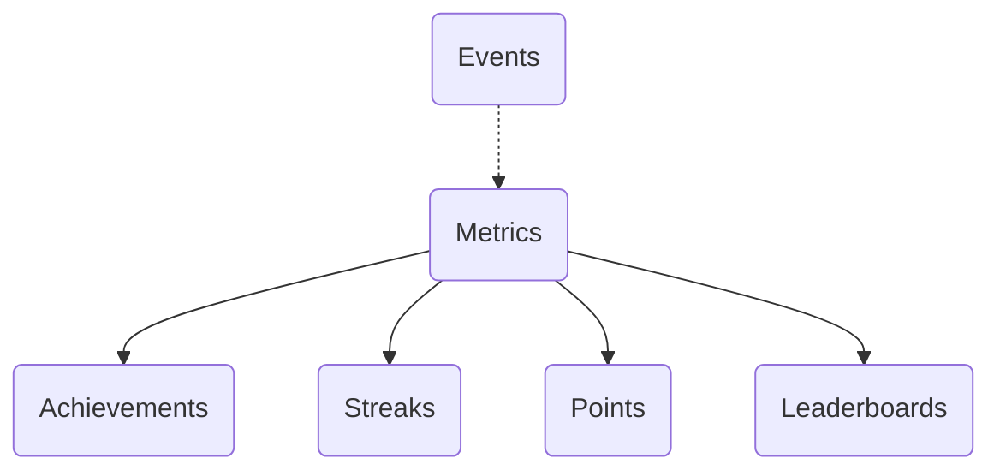
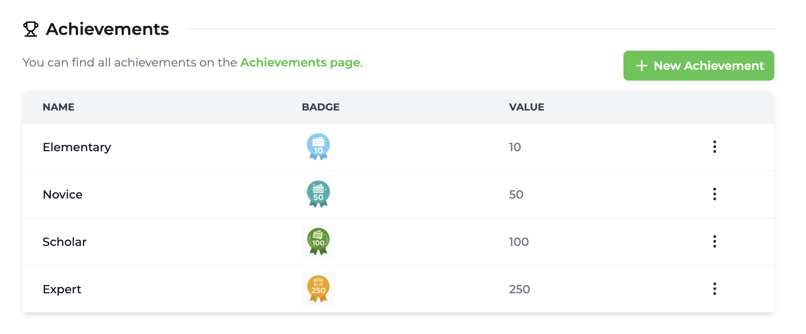
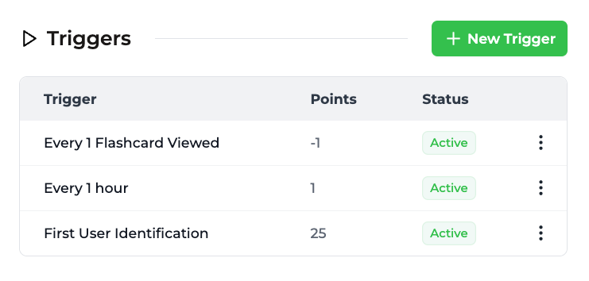

import MetricChangeRequestBlock from "../../snippets/metric-change-request-block.mdx";
import MetricChangeResponseBlock from "../../snippets/metric-change-response-block.mdx";

En este tutorial construiremos una plataforma de estudio de ejemplo usando Trophy para gamificación. Si prefieres ir directamente al final, puedes revisar el [repositorio de ejemplo](https://github.com/trophyso/example-study-platform) o la [demostración en vivo](https://study.examples.trophy.so).

<Frame>
  <video
    autoPlay
    muted
    loop
    playsInline
    className="w-full aspect-15/4"
    src="../../assets/guides/example-apps/example-study-app/intro-demo.mp4"
  ></video>
</Frame>

## Tabla de contenidos {#table-of-contents}

- [Stack tecnológico](#tech-stack)
- [Requisitos previos](#pre-requisites)
- [Configuración e instalación](#setup-%26-installation)
- [Construcción de la función de tarjetas didácticas](#building-the-flashcards-feature)
- [Añadiendo gamificación básica](#adding-basic-gamification)
- [Añadiendo un sistema de XP](#adding-an-xp-system)
- [Añadiendo clasificaciones](#adding-leaderboards)
- [Añadiendo un sistema de energía](#adding-an-energy-system)
- [El resultado](#the-result)

## Stack tecnológico {#tech-stack}

- [NextJS 15](https://nextjs.org/docs) (React 19)
- [Shadcn/Ui](https://ui.shadcn.com)
- [Lucide](https://lucide.dev/icons) para iconografía
- [Motion](https://motion.dev/) para animaciones
- [HTML5 Audio API](https://developer.mozilla.org/en-US/docs/Web/API/Web_Audio_API) para efectos de sonido
- [Trophy](https://trophy.so) para gamificación

## Requisitos previos {#pre-requisites}

- Una cuenta de Trophy (no te preocupes, la configuraremos sobre la marcha...)

## Configuración e instalación {#setup-installation}

<Tip>
  ¿Quieres omitir la configuración? Ve directamente a [la parte
  divertida](#setting-up-flashcard-data).
</Tip>

Primero necesitamos crear un nuevo proyecto NextJS:

```bash
npx create-next-app@latest
```

Configura este nuevo proyecto como prefieras, pero para los propósitos de este tutorial nos ceñiremos principalmente a los valores predeterminados:

```bash
What is your project named? my-app
Would you like to use TypeScript? Yes
Would you like to use ESLint? Yes
Would you like to use Tailwind CSS? Yes
Would you like your code inside a `src/` directory? Yes
Would you like to use App Router? (recommended) Yes
Would you like to use Turbopack for `next dev`?  Yes
Would you like to customize the import alias (`@/*` by default)? No
```

A continuación, inicializaremos una nueva instalación de la biblioteca de UI favorita de todos, shadcn/ui:

```bash
npx shadcn@latest init
```

Me encontré con una advertencia con React 19, que [parece ser un problema común](https://ui.shadcn.com/docs/react-19) al inicializar con `npm`:

```bash
It looks like you are using React 19.
Some packages may fail to install due to peer dependency issues in npm (see https://ui.shadcn.com/react-19).

? How would you like to proceed? › - Use arrow-keys. Return to submit.
❯   Use --force
    Use --legacy-peer-deps
```

Para los propósitos de este tutorial elegí `--force`, pero debes elegir la configuración que consideres más adecuada para tus requisitos.

## Construcción de la Función de Tarjetas de Estudio {#building-the-flashcards-feature}

### Configuración de Datos de Tarjetas de Estudio {#setting-up-flashcard-data}

Para los propósitos de este tutorial, vamos a usar algunos tipos simples con un almacén de datos en memoria. En una aplicación de producción probablemente querrás considerar almacenar esta información en una base de datos.

Aquí tendremos un tipo muy simple que almacena información sobre cada tarjeta de estudio donde usaremos la propiedad `front` para almacenar las preguntas cuyas respuestas el estudiante quiere aprender, y la propiedad `back` para almacenar las respuestas a cada pregunta:

```ts src/types/flashcard.ts
export interface IFlashcard {
  id: string;
  front: string;
  back: string;
}
```

Luego, para comenzar, almacenaremos algunas tarjetas de estudio en memoria centradas en aprender las capitales de ciudades:

```ts src/data.ts [expandable]
import { IFlashcard } from "./types/flashcard";

export const flashcards: IFlashcard[] = [
  {
    id: "1",
    front: "What is the capital of France?",
    back: "Paris",
  },
  {
    id: "2",
    front: "What is the capital of Germany?",
    back: "Berlin",
  },
  {
    id: "3",
    front: "What is the capital of Italy?",
    back: "Rome",
  },
  {
    id: "4",
    front: "What is the capital of Spain?",
    back: "Madrid",
  },
  {
    id: "5",
    front: "What is the capital of Portugal?",
    back: "Lisbon",
  },
  {
    id: "6",
    front: "What is the capital of Greece?",
    back: "Athens",
  },
  {
    id: "7",
    front: "What is the capital of Turkey?",
    back: "Ankara",
  },
  {
    id: "8",
    front: "What is the capital of Poland?",
    back: "Warsaw",
  },
  {
    id: "9",
    front: "What is the capital of Romania?",
    back: "Bucharest",
  },
  {
    id: "10",
    front: "What is the capital of Bulgaria?",
    back: "Sofia",
  },
  {
    id: "11",
    front: "What is the capital of Hungary?",
    back: "Budapest",
  },
  {
    id: "12",
    front: "What is the capital of Czechia?",
    back: "Prague",
  },
  {
    id: "13",
    front: "What is the capital of Slovakia?",
    back: "Bratislava",
  },
  {
    id: "14",
    front: "What is the capital of Croatia?",
    back: "Zagreb",
  },
  {
    id: "15",
    front: "What is the capital of Serbia?",
    back: "Belgrade",
  },
  {
    id: "16",
    front: "What is the capital of Montenegro?",
    back: "Podgorica",
  },
  {
    id: "17",
    front: "What is the capital of North Macedonia?",
    back: "Skopje",
  },
  {
    id: "18",
    front: "What is the capital of Kosovo?",
    back: "Pristina",
  },
  {
    id: "19",
    front: "What is the capital of Albania?",
    back: "Tirana",
  },
  {
    id: "20",
    front: "What is the capital of Bosnia and Herzegovina?",
    back: "Sarajevo",
  },
];
```

### Diseño Básico de Tarjetas de Estudio {#basic-flashcard-layout}

Con algunos datos básicos configurados, necesitamos agregar una forma para que los usuarios puedan recorrer sus tarjetas de estudio.

Para esto usaremos los componentes `carousel` e `card` de shadcn/ui, por lo que necesitamos agregarlos a nuestro proyecto:

```bash
npx shadcn@latest add carousel card
```

Luego, crearemos un nuevo componente `<Flashcards />` que combina estos elementos en una solución funcional, especificando que podemos pasar cualquier lista de objetos `IFlashcard` como props

```tsx src/app/flashcards.tsx [expandable]
import {
  Carousel,
  CarouselContent,
  CarouselItem,
  CarouselPrevious,
  CarouselNext,
} from "@/components/ui/carousel";
import { Card, CardContent } from "@/components/ui/card";
import { IFlashcard } from "@/types/flashcard";

interface Props {
  flashcards: IFlashcard[];
}

export default function Flashcards({ flashcards }: Props) {
  return (
    <Carousel className="w-full max-w-md">
      <CarouselContent>
        {flashcards.map((flashcard) => (
          <CarouselItem key={flashcard.id}>
            <div className="p-1">
              <Card>
                <CardContent className="flex items-center justify-center p-6">
                  <span className="text-4xl text-center font-semibold">
                    {flashcard.front}
                  </span>
                </CardContent>
              </Card>
            </div>
          </CarouselItem>
        ))}
      </CarouselContent>
      <CarouselPrevious />
      <CarouselNext />
    </Carousel>
  );
}
```

Luego actualizaremos nuestro archivo `page.tsx` para mostrar nuestro componente `<Flashcards />`, pasando nuestros datos de tarjetas de estudio de ejemplo:

```tsx src/app/page.tsx
import { flashcards } from "@/data";
import Flashcards from "./flashcards";

export default function Home() {
  return (
    <div className="flex flex-col items-center justify-center h-screen">
      <Flashcards flashcards={flashcards} />
    </div>
  );
}
```

Al final de este paso, deberías tener una interfaz de usuario de tarjetas de estudio funcional que te permita recorrer cada tarjeta de estudio en nuestro conjunto de datos de ciudades.

<Frame>
  <video
    autoPlay
    muted
    loop
    playsInline
    className="w-full aspect-video"
    src="../../assets/guides/example-apps/example-study-app/basic-flashcard-ui.mp4"
  ></video>
</Frame>

### Voltear Tarjetas de Estudio {#flipping-flashcards}

Ahora esto está genial, pero no es muy útil como aplicación de estudio en este momento ya que no hay forma de ver si obtuviste la respuesta correcta. Necesitamos agregar una manera de voltear las tarjetas y verificar nuestra respuesta...

Para simplificar esto, primero crearemos un componente `<Flashcard />` que será responsable de toda la lógica para cada tarjeta de estudio:

```tsx src/app/flashcard.tsx [expandable]
import { Card, CardContent } from "@/components/ui/card";
import { CarouselItem } from "@/components/ui/carousel";
import { IFlashcard } from "@/types/flashcard";

interface Props {
  flashcard: IFlashcard;
}

export default function Flashcard({ flashcard }: Props) {
  return (
    <CarouselItem key={flashcard.id}>
      <div className="p-1">
        <Card>
          <CardContent className="flex items-center justify-center p-6">
            <span className="text-4xl text-center font-semibold">
              {flashcard.front}
            </span>
          </CardContent>
        </Card>
      </div>
    </CarouselItem>
  );
}
```

Luego simplificaremos nuestro componente `<Flashcards />` para que en su lugar simplemente renderice una lista de los componentes individuales `<Flashcard />`:

```tsx src/app/flashcards.tsx [expandable]
import {
  Carousel,
  CarouselContent,
  CarouselPrevious,
  CarouselNext,
} from "@/components/ui/carousel";
import { IFlashcard } from "@/types/flashcard";
import Flashcard from "./flashcard";

interface Props {
  flashcards: IFlashcard[];
}

export default function Flashcards({ flashcards }: Props) {
  return (
    <Carousel className="w-full max-w-md">
      <CarouselContent>
        {flashcards.map((flashcard) => (
          <Flashcard key={flashcard.id} flashcard={flashcard} />
        ))}
      </CarouselContent>
      <CarouselPrevious />
      <CarouselNext />
    </Carousel>
  );
}
```

Ahora estamos listos para agregar interactividad a cada tarjeta de estudio. Esto es lo que haremos:

- Primero, agregaremos una variable de estado `side` que contendrá el lado actual de la tarjeta que se está mostrando.
- A continuación, agregaremos un callback `onClick()` al componente `<Card />` que actualizará el estado `side` a `back` cuando se haga clic si el frente de la tarjeta se está mostrando actualmente.
- Finalmente, renderizaremos condicionalmente el texto en el `<Card />` según el valor de la variable de estado `side`.

Aquí está el archivo terminado:

```tsx src/app/flashcard.tsx [expandable] {10,12-16,21,24}
import { Card, CardContent } from "@/components/ui/card";
import { CarouselItem } from "@/components/ui/carousel";
import { IFlashcard } from "@/types/flashcard";

interface Props {
  flashcard: IFlashcard;
}

export default function Flashcard({ flashcard }: Props) {
  const [side, setSide] = useState<"front" | "back">("front");

  const handleCardClick = () => {
    if (side === "front") {
      setSide("back");
    }
  };

  return (
    <CarouselItem key={flashcard.id}>
      <div className="p-1">
        <Card onClick={handleCardClick}>
          <CardContent className="flex items-center justify-center p-6">
            <span className="text-4xl text-center font-semibold">
              {side === "front" ? flashcard.front : flashcard.back}
            </span>
          </CardContent>
        </Card>
      </div>
    </CarouselItem>
  );
}
```

Luego, usaremos [Motion](https://motion.dev) para agregar una animación de volteo elegante a la tarjeta cuando hagamos clic en ella. Para esto primero necesitamos instalar el paquete en nuestro proyecto:

```bash
npm install motion
```

Si lo piensas, cuando volteas una tarjeta de estudio, tiendes a hacerlo en el eje Y. Así que aquí usaremos un `<motion.div />` con una animación de resorte ligera en el eje y para crear el efecto:

```tsx src/app/flashcard.tsx [expandable] {7-8,26-37}
"use client";

import { Card, CardContent } from "@/components/ui/card";
import { CarouselItem } from "@/components/ui/carousel";
import { IFlashcard } from "@/types/flashcard";
import { useState } from "react";
import { motion } from "motion/react";
import styles from "./flashcard.module.css";

interface Props {
  flashcard: IFlashcard;
}

export default function Flashcard({ flashcard }: Props) {
  const [side, setSide] = useState<"front" | "back">("front");

  const handleCardClick = () => {
    if (side === "front") {
      setSide("back");
    }
  };

  return (
    <CarouselItem key={flashcard.id}>
      <div className="p-1">
        <motion.div
          onClick={handleCardClick}
          className="cursor-pointer"
          animate={{ rotateY: side === "front" ? 0 : 180 }}
          transition={{ duration: 1, type: "spring" }}
          style={{ perspective: "1000px" }}
        >
          <Card className={`relative w-full h-[200px] ${styles.card}`}>
            <CardContent
              className={`flex items-center justify-center p-6 absolute w-full h-full ${styles.backface_hidden}`}
            >
              <span className="text-4xl text-center font-semibold">
                {side === "front" ? flashcard.front : flashcard.back}
              </span>
            </CardContent>
          </Card>
        </motion.div>
      </div>
    </CarouselItem>
  );
}
```

Notarás que también agregamos un par de estilos aquí. Estos hacen un par de cosas:

- Asegúrate de que cuando un `<Card />` se está volteando, la 'cara trasera' no sea visible durante la animación con `backface-visibility: hidden;`
- Como el componente `<Card />` es un hijo del `<motion.div />`, normalmente aparecería plano cuando su padre rota en 3D. Agregar `transform-style: preserve-3d;` al `<Card />` asegura que mantenga su efecto 3D cuando su padre se anima.

```css src/app/flashcard.module.css
.backface-hidden {
  backface-visibility: hidden;
  -webkit-backface-visibility: hidden;
}

.card {
  transform-style: preserve-3d;
  -webkit-transform-style: preserve-3d;
}
```

### ¡Un Error de Volteo! {#a-flippin-bug}

¡Genial! Nuestro proyecto ahora está empezando a sentirse como una verdadera herramienta de estudio. Sin embargo, los observadores perspicaces (o tal vez no tanto...) notarán que hay un error importante aquí. Cuando volteamos una tarjeta, la respuesta en la parte trasera aparece invertida 😢...

<Frame>
  <video
    autoPlay
    muted
    loop
    playsInline
    className="w-full aspect-video"
    src="../../assets/guides/example-apps/example-study-app/flipping-flashcards.mp4"
  ></video>
</Frame>

Si lo piensas bien, cuando escribes una tarjeta de estudio, en realidad escribes la respuesta en la parte trasera en la dirección opuesta a la pregunta en el frente.

Y como estamos usando `motion` para literalmente voltear nuestra tarjeta en el eje Y, necesitamos asegurarnos de escribir nuestras respuestas al revés también.

Primero, agregaremos un pequeño fragmento de CSS para manejar la escritura de texto al revés:

```css src/app/flascard.module.css {11-14}
.backface-hidden {
  backface-visibility: hidden;
  -webkit-backface-visibility: hidden;
}

.card {
  transform-style: preserve-3d;
  -webkit-transform-style: preserve-3d;
}

.flipped_text {
  transform: scaleX(-1);
  transform-origin: center;
}
```

Luego agregaremos condicionalmente este estilo al texto de nuestra tarjeta según qué lado de la tarjeta se esté mostrando:

```tsx src/app/flashcard.tsx
<span
  className={`text-4xl text-center font-semibold ${
    side === "back" ? styles.flipped_text : ""
  }`}
>
  {side === "front" ? flashcard.front : flashcard.back}
</span>
```

Perfecto. Ahora cuando volteemos una tarjeta, la respuesta en la parte trasera debería leerse en la dirección correcta:

<Frame>
  <video
    autoPlay
    muted
    loop
    playsInline
    className="w-full aspect-video"
    src="../../assets/guides/example-apps/example-study-app/flipping-flashcards-fixed.mp4"
  ></video>
</Frame>

### Seguimiento del Progreso {#tracking-progress}

El siguiente paso es agregar interfaz de usuario para mostrar al usuario cuántas tarjetas de estudio ha revisado y cuántas le quedan en el conjunto. Usaremos una barra de progreso simple para lograr esto.

Antes de poder comenzar a rastrear este nivel de información, necesitamos configurar el seguimiento de una nueva variable de estado que contenga el índice de la tarjeta que el usuario está viendo actualmente. Usaremos la [API del carrusel](https://ui.shadcn.com/docs/components/carousel#api) para conectarnos a esta funcionalidad y mantener nuestra variable de estado actualizada:

```tsx src/app/flashcards.tsx [expandable] {1,8,19-34,37}
"use client";

import {
  Carousel,
  CarouselContent,
  CarouselPrevious,
  CarouselNext,
  type CarouselApi,
} from "@/components/ui/carousel";
import { IFlashcard } from "@/types/flashcard";
import Flashcard from "./flashcard";
import { useEffect, useState } from "react";

interface Props {
  flashcards: IFlashcard[];
}

export default function Flashcards({ flashcards }: Props) {
  const [flashIndex, setFlashIndex] = useState(0);
  const [api, setApi] = useState<CarouselApi>();

  useEffect(() => {
    if (!api) {
      return;
    }

    // Initialize the flash index
    setFlashIndex(api.selectedScrollSnap() + 1);

    // Update the flash index when the carousel is scrolled
    api.on("select", () => {
      setFlashIndex(api.selectedScrollSnap() + 1);
    });
  }, [api]);

  return (
    <Carousel className="w-full" setApi={setApi}>
      <CarouselContent>
        {flashcards.map((flashcard) => (
          <Flashcard key={flashcard.id} flashcard={flashcard} />
        ))}
      </CarouselContent>
      <CarouselPrevious />
      <CarouselNext />
    </Carousel>
  );
}
```

Luego necesitamos agregar el componente `progress` de shadcn/ui a nuestro proyecto:

```bash
npx shadcn@latest add progress
```

Finalmente podemos agregar una barra de progreso encima del carrusel:

```tsx [expandable] {13,38-39,49}
"use client";

import {
  Carousel,
  CarouselContent,
  CarouselPrevious,
  CarouselNext,
  type CarouselApi,
} from "@/components/ui/carousel";
import { IFlashcard } from "@/types/flashcard";
import Flashcard from "./flashcard";
import { useEffect, useState } from "react";
import { Progress } from "@/components/ui/progress";

interface Props {
  flashcards: IFlashcard[];
}

export default function Flashcards({ flashcards }: Props) {
  const [flashIndex, setFlashIndex] = useState(0);
  const [api, setApi] = useState<CarouselApi>();

  useEffect(() => {
    if (!api) {
      return;
    }

    // Initialize the flash index
    setFlashIndex(api.selectedScrollSnap() + 1);

    // Update the flash index when the carousel is scrolled
    api.on("select", () => {
      setFlashIndex(api.selectedScrollSnap() + 1);
    });
  }, [api]);

  return (
    <div className="flex flex-col items-center justify-center gap-4 max-w-md">
      <Progress value={(flashIndex / flashcards.length) * 100} />
      <Carousel className="w-full" setApi={setApi}>
        <CarouselContent>
          {flashcards.map((flashcard) => (
            <Flashcard key={flashcard.id} flashcard={flashcard} />
          ))}
        </CarouselContent>
        <CarouselPrevious />
        <CarouselNext />
      </Carousel>
    </div>
  );
}
```

¡Genial! Ahora las cosas realmente están empezando a tomar forma.

<Frame>
  <video
    autoPlay
    muted
    loop
    playsInline
    className="w-full aspect-video"
    src="../../assets/guides/example-apps/example-study-app/progress-tracking.mp4"
  ></video>
</Frame>

Ahora comienza la verdadera diversión...

## Agregando Gamificación Básica {#adding-basic-gamification}

En esta sección agregaremos los siguientes elementos de gamificación al proyecto de tarjetas:

- Logros por completar:
  - 10 tarjetas
  - 50 tarjetas
  - 100 tarjetas
  - 250 tarjetas
- Racha diaria por completar al menos una tarjeta al día.
- Correos electrónicos automatizados para:
  - Logro desbloqueado
  - Resúmenes de progreso semanal

Esto puede sonar como mucho, pero ¿te sorprendería si te dijera que puedes construir todo esto en menos de 10 líneas de código?

Sí, puedes. Trophy lo hace muy fácil para construir estas funcionalidades con unas pocas líneas de código de integración.

Entonces, empecemos...

### Cómo Funciona Trophy {#how-trophy-works}

Primero, necesitamos una nueva [cuenta de Trophy](https://app.trophy.so/sign-up). Luego podemos comenzar a ensamblar las diversas partes de nuestra experiencia de gamificación.

En Trophy, las [Métricas](/es/platform/metrics) representan diferentes interacciones que los usuarios pueden realizar y pueden impulsar funcionalidades como [Logros](/es/platform/achievements), [Rachas](/es/platform/streaks) y [Correos electrónicos](/es/platform/emails).



En Trophy rastreamos las interacciones de los usuarios enviando [Eventos](/es/platform/events) desde nuestro código a Trophy contra una métrica específica.

Cuando se registran eventos para un usuario específico, cualquier logro vinculado a la métrica especificada se desbloqueará si se cumplen los requisitos, las rachas diarias se calcularán automáticamente y se mantendrán actualizadas, se otorgan puntos y las clasificaciones se actualizan.

Esto es lo que hace que construir experiencias gamificadas con Trophy sea tan fácil: hace todo el trabajo por ti detrás de escena.

Registrar un evento contra una métrica para un usuario específico utiliza la [API de eventos de métricas](/es/api-reference/endpoints/metrics/send-a-metric-change-event) de Trophy, que en la práctica se ve así:

<MetricChangeRequestBlock />

Así es como con solo unas pocas líneas de código podemos impulsar todo un conjunto de funciones de gamificación. Sin embargo, antes de poder comenzar a enviar eventos, necesitamos configurar nuestra nueva cuenta de Trophy.

### Configuración de Trophy {#setting-up-trophy}

Así es como configuraremos nuestra cuenta de Trophy para nuestra aplicación de estudio:

- Primero, configuraremos una métrica _Tarjetas Volteadas_
- A continuación, configuraremos logros vinculados a esta métrica
- Luego, configuraremos una racha diaria vinculada a esta métrica
- Finalmente, configuraremos secuencias de correo electrónico automatizadas para esta métrica

Comencemos...

<AccordionGroup>
  <Accordion title="Crear la métrica" icon="box">
    Dirígete a la [página de métricas](https://app.trophy.so/metrics) de Trophy y crea una nueva métrica, asegurándote de especificar `flashcards-flipped` como el `key` de la métrica. Esto es lo que usaremos para referenciar la métrica en nuestro código al enviar eventos.

    <Frame>
      <video
        autoPlay
        muted
        loop
        playsInline
        className="w-full aspect-video"
        src="../../assets/guides/example-apps/example-study-app/create-metric.mp4"
      ></video>
    </Frame>

  </Accordion>

<Accordion title="Crear logros" icon="trophy">
  A continuación, crea un logro para cada uno de los siguientes hitos:
  - 10 tarjetas (Elemental)
  - 50 tarjetas (Principiante)
  - 100 tarjetas (Erudito)
  - 250 tarjetas (Experto)

{" "}

<Tip>
  Siéntete libre de descargar y usar este archivo zip de insignias (listas para esta aplicación de ejemplo):
  [flashcard_badges.zip](../../assets/guides/example-apps/example-study-app/flashcard_badges.zip)
</Tip>

<Frame>
  
</Frame>

</Accordion>

<Accordion title="Configurar racha diaria" icon="flame">
  A continuación, dirígete a la [página de rachas](https://app.trophy.so/streaks) y configura una racha diaria.

    <Frame>
      <video
        autoPlay
        muted
        loop
        playsInline
        className="w-full aspect-video"
        src="../../assets/guides/example-apps/example-study-app/configure-streak.mp4"
      ></video>
    </Frame>

</Accordion>

  <Accordion title="Configurar correos electrónicos" icon="mail">
  Dirígete a la [página de correos electrónicos](https://app.trophy.so/emails) y añade y activa plantillas para los dos tipos de correos que queremos.
  - Correos de logro desbloqueado
  - Correos de resumen (semanales)

  Cada tipo de correo tiene su propia sección: añade una plantilla en cada una y actívala para comenzar a enviar.

Trophy también nos proporciona una vista previa de los correos, lo cual es útil. Además, siéntete libre de configurar un logo atractivo y colores de marca en la [página de personalización](https://app.trophy.so/branding). Estos ajustes se usan automáticamente en todos los correos enviados por Trophy.

{" "}

<Frame>
  <video
    autoPlay
    muted
    loop
    playsInline
    className="w-full aspect-video"
    src="../../assets/guides/example-apps/example-study-app/configure-emails.mp4"
  ></video>
</Frame>

{" "}

<Note>
  Antes de poder comenzar a enviar correos, necesitarás [configurar tu dirección de envío](/es/platform/emails#sending-emails) con Trophy. Pero esto puede hacerse más adelante si lo prefieres.
</Note>

  </Accordion>
</AccordionGroup>

### Integración del SDK de Trophy {#integrating-trophy-sdk}

Primero necesitamos obtener nuestra clave API de la [página de integración](https://app.trophy.so/integration) de Trophy y añadirla como una variable de entorno **exclusiva del servidor**.

<Warning>
  Asegúrate de **no** exponer tu clave API en código del lado del cliente
</Warning>

```bash .env.local
TROPHY_API_KEY='*******'
```

A continuación, instalaremos el SDK de Trophy:

```bash
npm install @trophyso/node
```

Luego, cada vez que un usuario vea una tarjeta de estudio, simplemente enviamos un evento a Trophy con los detalles del usuario que realizó la acción (que simularemos) y el número de tarjetas que vieron (1 en este caso).

En NextJS haremos esto con una server action que realiza la llamada a Trophy para enviar el evento, y llamaremos a esta acción cuando el usuario avance a la siguiente tarjeta en el carrusel.

Primero, crea la server action:

```tsx src/app/actions.ts [expandable]
"use server";

import { TrophyApiClient } from "@trophyso/node";
import { EventResponse } from "@trophyso/node/api";

// Set up Trophy SDK with API key
const trophy = new TrophyApiClient({
  apiKey: process.env.TROPHY_API_KEY as string,
});

/**
 * Track a flashcard viewed event in Trophy
 * @returns The event response from Trophy
 */
export async function viewFlashcard(): Promise<EventResponse | null> {
  try {
    return await trophy.metrics.event("flashcards-flipped", {
      user: {
        // Mock email
        email: "user@example.com",

        // Mock timezone
        tz: "Europe/London",

        // Mock user ID
        id: "18",
      },

      // Event represents a single user viewing 1 flashcard
      value: 1,
    });
  } catch (error) {
    console.error(error);
    return null;
  }
}
```

Luego llámala cuando el usuario vea la siguiente tarjeta:

```tsx src/app/flashcards.tsx [expandable] {14,36-37}
"use client";

import {
  Carousel,
  CarouselContent,
  CarouselPrevious,
  CarouselNext,
  type CarouselApi,
} from "@/components/ui/carousel";
import { IFlashcard } from "@/types/flashcard";
import Flashcard from "./flashcard";
import { useEffect, useState } from "react";
import { Progress } from "@/components/ui/progress";
import { viewFlashcard } from "./actions";

interface Props {
  flashcards: IFlashcard[];
}

export default function Flashcards({ flashcards }: Props) {
  const [flashIndex, setFlashIndex] = useState(0);
  const [api, setApi] = useState<CarouselApi>();

  useEffect(() => {
    if (!api) {
      return;
    }

    // Initialize the flash index
    setFlashIndex(api.selectedScrollSnap() + 1);

    api.on("select", () => {
      // Update the flash index when the carousel is scrolled
      setFlashIndex(api.selectedScrollSnap() + 1);

      // Track the flashcard viewed event
      viewFlashcard();
    });
  }, [api]);

  return (
    <div className="flex flex-col items-center justify-center gap-4 max-w-md">
      <Progress value={(flashIndex / flashcards.length) * 100} />
      <Carousel className="w-full" setApi={setApi}>
        <CarouselContent>
          {flashcards.map((flashcard) => (
            <Flashcard key={flashcard.id} flashcard={flashcard} />
          ))}
        </CarouselContent>
        <CarouselPrevious />
        <CarouselNext />
      </Carousel>
    </div>
  );
}
```

Podemos validar que esto funciona revisando el [panel de control](https://app.trophy.so) de Trophy, que debería mostrar nuestro primer usuario registrado en la tabla _Usuarios Principales_:

<Frame>
  
</Frame>

A continuación, agregaremos interfaz de usuario para demostrar nuestras funciones de gamificación en la práctica.

### Agregando UX de Gamificación {#adding-gamification-ux}

La respuesta a la llamada API que hacemos para rastrear eventos en Trophy nos devuelve útilmente cualquier cambio en el progreso del usuario como resultado de ese evento:

<MetricChangeResponseBlock />

Esto incluye:

- El array `achievements` que es una lista de logros recién desbloqueados como resultado del evento.
- El objeto `currentStreak` que contiene los datos de racha más actualizados del usuario después de que el evento haya tenido lugar.

Esto hace que sea muy fácil reaccionar a los cambios en el progreso del usuario y hacer lo que queramos. En este ejemplo, cada vez que Trophy nos indique que un usuario ha desbloqueado un nuevo logro o ha extendido su racha:

- Mostrar una notificación emergente
- Reproducir un efecto de sonido

#### Notificaciones de Logro Desbloqueado {#achievement-unlocked-toasts}

Primero, mostraremos una notificación cuando los usuarios desbloqueen nuevos logros. Para esto necesitamos agregar el componente `sonner` de shadcn/ui a nuestro proyecto:

```bash
npx shadcn@latest add sonner
```

Luego crearemos el componente de interfaz `<Toast />` que necesitamos para mostrar las notificaciones y una función de utilidad `toast()` para activarlas:

```tsx src/lib/toast.tsx [expandable]
"use client";

import React from "react";
import { toast as sonnerToast } from "sonner";
import Image from "next/image";

interface ToastProps {
  id: string | number;
  title: string;
  description?: string;
  image?: {
    src: string;
    alt: string;
  };
}

/**
 * A fully custom toast that still maintains the animations and interactions.
 * @param toast - The toast to display.
 * @returns The toast component.
 */
export function toast(toast: Omit<ToastProps, "id">) {
  return sonnerToast.custom((id) => (
    <Toast
      id={id}
      title={toast.title}
      description={toast.description}
      image={toast.image}
    />
  ));
}

/**
 * A fully custom toast that still maintains the animations and interactions.
 * @param props - The toast to display.
 * @returns The toast component.
 */
export function Toast(props: ToastProps) {
  const { title, description, image } = props;

  return (
    <div className="flex rounded-lg bg-white shadow-lg ring-1 ring-black/5 w-full md:max-w-[364px] items-center p-4">
      {image && (
        <div className="mr-4 flex-shrink-0">
          <Image
            src={image.src}
            alt={image.alt}
            width={40}
            height={40}
            className="rounded-md"
          />
        </div>
      )}
      <div className="flex flex-1 items-center">
        <div className="w-full">
          <p className="text-sm font-medium text-gray-900">{title}</p>
          {description && (
            <p className="mt-1 text-sm text-gray-500">{description}</p>
          )}
        </div>
      </div>
    </div>
  );
}
```

A continuación, necesitamos actualizar el archivo `page.tsx` con el componente principal `<Toaster />`. Este es el componente de `sonner` que se encarga de mostrar nuestras notificaciones en la pantalla cuando las activamos:

```tsx src/app/page.tsx {3,9}
import { flashcards } from "@/data";
import Flashcards from "./flashcards";
import { Toaster } from "@/components/ui/sonner";

export default function Home() {
  return (
    <div className="flex flex-col items-center justify-center h-screen">
      <Flashcards flashcards={flashcards} />
      <Toaster />
    </div>
  );
}
```

A continuación, para asegurarnos de que NextJS muestre nuestras insignias, necesitamos configurar el host de imágenes de Trophy como un dominio de confianza. Si usas URLs de insignias personalizadas en tu propio dominio o CDN, agrega esos nombres de host aquí también, o usa un `` simple y omite los patrones remotos.

```ts next.config.ts {4-11}
import type { NextConfig } from "next";

const nextConfig: NextConfig = {
  images: {
    remotePatterns: [
      {
        protocol: "https",
        hostname: "lookmizerpsrsczvtlwh.supabase.co",
      },
    ],
  },
};

export default nextConfig;
```

Y finalmente, actualizamos nuestro componente `<Flashcards />` para leer la respuesta de Trophy y mostrar notificaciones para cualquier logro desbloqueado:

```tsx src/app/flashcards.tsx [expandable] {15,33,38-56}
"use client";

import {
  Carousel,
  CarouselContent,
  CarouselPrevious,
  CarouselNext,
  type CarouselApi,
} from "@/components/ui/carousel";
import { IFlashcard } from "@/types/flashcard";
import Flashcard from "./flashcard";
import { useEffect, useState } from "react";
import { Progress } from "@/components/ui/progress";
import { viewFlashcard } from "./actions";
import { toast } from "@/lib/toast";

interface Props {
  flashcards: IFlashcard[];
}

export default function Flashcards({ flashcards }: Props) {
  const [flashIndex, setFlashIndex] = useState(0);
  const [api, setApi] = useState<CarouselApi>();

  useEffect(() => {
    if (!api) {
      return;
    }

    // Initialize the flash index
    setFlashIndex(api.selectedScrollSnap() + 1);

    api.on("select", async () => {
      // Update flashIndex when the carousel is scrolled
      setFlashIndex(api.selectedScrollSnap() + 1);

      // Track the flashcard viewed event
      const response = await viewFlashcard();

      if (!response) {
        return;
      }

      // Show toasts if the user has unlocked any new achievements
      response.achievements.forEach((achievement) => {
        toast({
          title: achievement.name as string,
          description: achievement.description,
          image: {
            src: achievement.badgeUrl as string,
            alt: achievement.name as string,
          },
        });
      });
    });
  }, [api]);

  return (
    <div className="flex flex-col items-center justify-center gap-4 max-w-md">
      <Progress value={(flashIndex / flashcards.length) * 100} />
      <Carousel className="w-full" setApi={setApi}>
        <CarouselContent>
          {flashcards.map((flashcard) => (
            <Flashcard key={flashcard.id} flashcard={flashcard} />
          ))}
        </CarouselContent>
        <CarouselPrevious />
        <CarouselNext />
      </Carousel>
    </div>
  );
}
```

Para ver esto en acción, todo lo que necesitamos hacer es desbloquear nuestro primer logro viendo 10 tarjetas de estudio:

<Frame>
  <video
    autoPlay
    muted
    loop
    playsInline
    className="w-full aspect-video"
    src="../../assets/guides/example-apps/example-study-app/displaying-toasts.mp4"
  ></video>
</Frame>

#### Notificaciones de Racha Extendida {#streak-extended-toasts}

Usaremos los mismos métodos para mostrar notificaciones similares cuando un usuario extienda su racha. Como hemos configurado una racha diaria en Trophy, esto se activará la primera vez que un usuario vea una tarjeta de estudio cada día.

<Tip>
  Si quisiéramos experimentar con una cadencia de racha diferente, como una
  racha semanal, entonces nada de este código cambia - lo genial de Trophy es
  que todo puede configurarse desde el panel de control y no requiere ningún
  cambio de código.
</Tip>

Todo lo que necesitamos hacer es leer la propiedad `currentStreak.extended` de Trophy y manejar la visualización de otro toast con una nueva declaración `if`:

```tsx src/app/flashcards.tsx [expandable] {56-63}
"use client";

import {
  Carousel,
  CarouselContent,
  CarouselPrevious,
  CarouselNext,
  type CarouselApi,
} from "@/components/ui/carousel";
import { IFlashcard } from "@/types/flashcard";
import Flashcard from "./flashcard";
import { useEffect, useState } from "react";
import { Progress } from "@/components/ui/progress";
import { viewFlashcard } from "./actions";
import { toast } from "@/lib/toast";

interface Props {
  flashcards: IFlashcard[];
}

export default function Flashcards({ flashcards }: Props) {
  const [flashIndex, setFlashIndex] = useState(0);
  const [api, setApi] = useState<CarouselApi>();

  useEffect(() => {
    if (!api) {
      return;
    }

    // Initialize the flash index
    setFlashIndex(api.selectedScrollSnap() + 1);

    api.on("select", async () => {
      // Update flashIndex when the carousel is scrolled
      setFlashIndex(api.selectedScrollSnap() + 1);

      // Track the flashcard viewed event
      const response = await viewFlashcard();

      if (!response) {
        return;
      }

      // Show toasts if the user has unlocked any new achievements
      response.achievements.forEach((achievement) => {
        toast({
          title: achievement.name as string,
          description: achievement.description,
          image: {
            src: achievement.badgeUrl as string,
            alt: achievement.name as string,
          },
        });
      });

      // Show toast if user has extended their streak
      if (response.currentStreak?.extended) {
        toast({
          title: "You're on a roll!",
          description: `Keep going to keep your ${response.currentStreak.length} day streak!`,
        });
      }
    });
  }, [api]);

  return (
    <div className="flex flex-col items-center justify-center gap-4 max-w-md">
      <Progress value={(flashIndex / flashcards.length) * 100} />
      <Carousel className="w-full" setApi={setApi}>
        <CarouselContent>
          {flashcards.map((flashcard) => (
            <Flashcard key={flashcard.id} flashcard={flashcard} />
          ))}
        </CarouselContent>
        <CarouselPrevious />
        <CarouselNext />
      </Carousel>
    </div>
  );
}
```

Ahora, la primera vez que un usuario vea una tarjeta de estudio cada día, verá uno de nuestros toasts de racha extendida:

<Frame>
  <video
    autoPlay
    muted
    loop
    playsInline
    className="w-full aspect-video"
    src="../../assets/guides/example-apps/example-study-app/streak-toasts.mp4"
  ></video>
</Frame>

#### Efectos de Sonido {#sound-effects}

La gamificación se trata, ante todo, de aumentar la retención de usuarios. La mejor manera de lograr esto es hacer que las funciones que construimos sean lo más atractivas posible. Una excelente manera de hacerlo que a menudo se pasa por alto es con efectos de sonido.

Aquí agregaremos dos efectos de sonido distintos para cada caso donde mostramos un toast para involucrar aún más al usuario. Esto ayuda a distinguir los diferentes toasts y ayuda a los usuarios a desarrollar una expectativa de lo que significa cada sonido.

Para esto utilizaremos la [API de Audio HTML5](https://developer.mozilla.org/en-US/docs/Web/API/Web_Audio_API) y usaremos sonidos de [freesounds.org](https://freesounds.org).

<Tip>
  Los sonidos utilizados en este ejemplo están en el repositorio en el directorio `public/sounds`. ¡Siéntete libre de usarlos o elegir otros que te gusten!
</Tip>

Para cargar los archivos de sonido en nuestra aplicación, crearemos una referencia para cada uno, luego simplemente llamamos al método `play()` en cada uno cuando queramos reproducir realmente el sonido:

```tsx src/app/flashcards.tsx [expandable] {25-31,53-57,73-77}
"use client";

import {
  Carousel,
  CarouselContent,
  CarouselPrevious,
  CarouselNext,
  type CarouselApi,
} from "@/components/ui/carousel";
import { IFlashcard } from "@/types/flashcard";
import Flashcard from "./flashcard";
import { useEffect, useState, useRef } from "react";
import { Progress } from "@/components/ui/progress";
import { viewFlashcard } from "./actions";
import { toast } from "@/lib/toast";

interface Props {
  flashcards: IFlashcard[];
}

export default function Flashcards({ flashcards }: Props) {
  const [flashIndex, setFlashIndex] = useState(0);
  const [api, setApi] = useState<CarouselApi>();

  const achievementSound = useRef<HTMLAudioElement | null>(null);
  const streakSound = useRef<HTMLAudioElement | null>(null);

  useEffect(() => {
    achievementSound.current = new Audio("/sounds/achievement_unlocked.mp3");
    streakSound.current = new Audio("/sounds/streak_extended.mp3");
  }, []);

  useEffect(() => {
    if (!api) {
      return;
    }

    // Initialize the flash index
    setFlashIndex(api.selectedScrollSnap() + 1);

    api.on("select", async () => {
      // Update flashIndex when the carousel is scrolled
      setFlashIndex(api.selectedScrollSnap() + 1);

      // Track the flashcard viewed event
      const response = await viewFlashcard();

      if (!response) {
        return;
      }

      if (response.achievements?.length) {
        // Play the achievement sound only once for all new achievements
        if (achievementSound.current) {
          achievementSound.current.currentTime = 0;
          achievementSound.current.play();
        }

        // Show toasts if the user has unlocked any new achievements
        response.achievements.forEach((achievement) => {
          toast({
            title: achievement.name as string,
            description: achievement.description,
            image: {
              src: achievement.badgeUrl as string,
              alt: achievement.name as string,
            },
          });
        });
      }

      if (response.currentStreak?.extended) {
        // Play the streak sound
        if (streakSound.current) {
          streakSound.current.currentTime = 0;
          streakSound.current.play();
        }

        // Show toast if the user has extended their streak
        toast({
          title: "You're on a roll!",
          description: `Keep going to keep your ${response.currentStreak.length} day streak!`,
        });
      }
    });
  }, [api]);

  return (
    <div className="flex flex-col items-center justify-center gap-4 max-w-md">
      <Progress value={(flashIndex / flashcards.length) * 100} />
      <Carousel className="w-full" setApi={setApi}>
        <CarouselContent>
          {flashcards.map((flashcard) => (
            <Flashcard key={flashcard.id} flashcard={flashcard} />
          ))}
        </CarouselContent>
        <CarouselPrevious />
        <CarouselNext />
      </Carousel>
    </div>
  );
}
```

#### Mostrar el Progreso de Estudio {#displaying-study-journey}

La última pieza de interfaz que agregaremos será un diálogo para mostrar el progreso de estudio del usuario, incluyendo su racha y cualquier logro que haya desbloqueado hasta ahora.

Primero, agregaremos un par de nuevas acciones de servidor para obtener la racha y los logros del usuario desde Trophy. Como estamos usando una racha diaria aquí, obtendremos los últimos 14 días de datos de racha de Trophy para darnos suficiente información para trabajar en nuestra interfaz:

```tsx src/app/actions.ts [expandable] {6-7,10-11,24,33,45-58,60-73}
"use server";

import { TrophyApiClient } from "@trophyso/node";
import {
  EventResponse,
  MultiStageAchievementResponse,
  StreakResponse,
} from "@trophyso/node/api";

const USER_ID = "39";
const FLASHCARDS_VIEWED_METRIC_KEY = "flashcards-flipped";

// Set up Trophy SDK with API key
const trophy = new TrophyApiClient({
  apiKey: process.env.TROPHY_API_KEY as string,
});

/**
 * Track a flashcard viewed event in Trophy
 * @returns The event response from Trophy
 */
export async function viewFlashcard(): Promise<EventResponse | null> {
  try {
    return await trophy.metrics.event(FLASHCARDS_VIEWED_METRIC_KEY, {
      user: {
        // Mock email
        email: "user@example.com",

        // Mock timezone
        tz: "Europe/London",

        // Mock user ID
        id: USER_ID,
      },

      // Event represents a single user viewing 1 flashcard
      value: 1,
    });
  } catch (error) {
    console.error(error);
    return null;
  }
}

/**
 * Get the achievements for a user
 * @returns The achievements for the user
 */
export async function getAchievements(): Promise<
  MultiStageAchievementResponse[] | null
> {
  try {
    return await trophy.users.allachievements(USER_ID);
  } catch (error) {
    console.error(error);
    return null;
  }
}

/**
 * Get the streak for a user
 * @returns The streak for the user
 */
export async function getStreak(): Promise<StreakResponse | null> {
  try {
    return await trophy.users.streak(USER_ID, {
      historyPeriods: 14,
    });
  } catch (error) {
    console.error(error);
    return null;
  }
}
```

Luego llamaremos a estas acciones en el servidor cuando se solicite la página:

```tsx src/app/page.tsx {7-8}
import { flashcards } from "@/data";
import Flashcards from "./flashcards";
import { Toaster } from "@/components/ui/sonner";
import { getAchievements, getStreak } from "./actions";

export default async function Home() {
  const achievements = await getAchievements();
  const streak = await getStreak();

  return (
    <div className="flex flex-col items-center justify-center h-screen relative">
      <Flashcards flashcards={flashcards} />
      <Toaster />
    </div>
  );
}
```

Después crearemos un nuevo componente `<StudyJourney />` que reciba los datos de logros y rachas como props y los renderice de manera atractiva en un diálogo. Antes de añadir esto, necesitamos agregar el componente `dialog` de shadcn/ui a nuestro proyecto, y mientras lo hacemos, también añadiremos el componente `seperator`:

```bash
npx shadcn@latest add dialog separator
```

También necesitaremos `dayjs` para ayudarnos a mostrar las fechas de manera agradable:

```bash
npm i dayjs
```

Ahora tenemos todo lo que necesitamos para construir nuestro componente de trayectoria de estudio:

```tsx src/app/study-journey.tsx [expandable]
import { Separator } from "@/components/ui/separator";
import {
  MultiStageAchievementResponse,
  StreakResponse,
} from "@trophyso/node/api";
import { Flame, GraduationCap } from "lucide-react";
import Image from "next/image";
import dayjs from "dayjs";
import {
  Dialog,
  DialogTrigger,
  DialogContent,
  DialogHeader,
  DialogTitle,
  DialogDescription,
} from "@/components/ui/dialog";

interface Props {
  achievements: MultiStageAchievementResponse[] | null;
  streak: StreakResponse | null;
}

export default function StudyJourney({ achievements, streak }: Props) {
  const sundayOffset = 7 - ((new Date().getDay() + 6) % 7);

  const adjustedStreakHistory =
    streak?.streakHistory?.slice(
      sundayOffset - 1,
      streak.streakHistory.length,
    ) || Array(14).fill(null);

  return (
    <div className="absolute top-10 right-10 z-50 cursor-pointer">
      <Dialog>
        <DialogTrigger>
          <div className="h-12 w-12 cursor-pointer duration-100 border-1 border-gray-300 shadow-sm transition-all rounded-full relative hover:bg-gray-100">
            <GraduationCap className="h-6 w-6 absolute top-1/2 left-1/2 -translate-x-1/2 -translate-y-1/2 text-gray-800" />
          </div>
        </DialogTrigger>
        <DialogContent className="flex flex-col gap-3 min-w-[500px]">
          {/* Heading */}
          <DialogHeader>
            <DialogTitle>Your study journey</DialogTitle>
            <DialogDescription>
              Keep studying to extend your streak and earn new badges
            </DialogDescription>
          </DialogHeader>

          {/* Streak */}
          <div className="flex flex-col gap-2 items-center justify-between pt-2">
            <div className="flex flex-col items-center gap-4">
              <div className="relative h-24 w-24">
                <svg className="h-full w-full" viewBox="0 0 100 100">
                  <circle
                    className="stroke-primary/20"
                    strokeWidth="10"
                    fill="transparent"
                    r="45"
                    cx="50"
                    cy="50"
                  />
                  <circle
                    className="stroke-primary transition-all"
                    strokeWidth="10"
                    strokeLinecap="round"
                    fill="transparent"
                    r="45"
                    cx="50"
                    cy="50"
                    strokeDasharray={`${(streak?.length || 0) * 10} 1000`}
                    transform="rotate(-90 50 50)"
                  />
                </svg>
                <div className="absolute inset-0 flex items-center justify-center">
                  <span className="text-2xl font-bold text-primary">
                    {streak?.length || 0}
                  </span>
                </div>
              </div>
              <div className="flex flex-col text-center">
                <h3 className="text-lg font-semibold">
                  {streak && streak.length > 0
                    ? `Your study streak`
                    : `No study streak`}
                </h3>
                <p className="text-sm text-gray-500">
                  {streak && streak.length > 0
                    ? `${streak.length} day${
                        streak.length > 1 ? "s" : ""
                      } in a row`
                    : `Start a streak`}
                </p>
              </div>
            </div>
            <div className="flex flex-col">
              <div className="grid grid-cols-7 gap-1">
                {["M", "T", "W", "T", "F", "S", "S"].map((day, i) => (
                  <div
                    key={i}
                    className="h-10 flex items-center justify-center"
                  >
                    <span className="text-sm text-gray-500">{day}</span>
                  </div>
                ))}
              </div>
              <div className="grid grid-cols-7 gap-1">
                {adjustedStreakHistory.map((day, i) => {
                  if (day === null) {
                    return (
                      <div
                        key={i}
                        className="h-10 w-10 rounded-lg bg-white border border-gray-200 flex items-center justify-center"
                      >
                        <Flame className="h-6 w-6 text-gray-200" />
                      </div>
                    );
                  }

                  return (
                    <div
                      key={i}
                      className={`h-10 w-10 rounded-lg ${
                        day.length > 0 ? "bg-primary" : "bg-primary/10"
                      } flex items-center justify-center`}
                    >
                      <Flame
                        className={`h-6 w-6 ${
                          day.length > 0 ? "text-white" : "text-primary/30"
                        }`}
                      />
                    </div>
                  );
                })}
              </div>
            </div>
          </div>

          <Separator />

          {/* Achievements */}
          {achievements && achievements.length > 0 ? (
            <div className="flex flex-col gap-3">
              <div>
                <p className="text-lg font-semibold">Your badges</p>
              </div>
              <div className="grid grid-cols-3 gap-2 w-full">
                {achievements?.map((achievement) => (
                  <div
                    key={achievement.id}
                    className="p-2 rounded-md border border-gray-200 flex flex-col gap-1 items-center shadow-sm"
                  >
                    <Image
                      src={achievement.badgeUrl as string}
                      alt={achievement.name as string}
                      width={100}
                      height={100}
                      className="rounded-full border-gray-300"
                    />
                    <p className="font-semibold">{achievement.name}</p>
                    <p className="text-gray-500 text-sm">
                      {dayjs(achievement.achievedAt).format("MMM D, YYYY")}
                    </p>
                  </div>
                ))}
              </div>
            </div>
          ) : (
            <div className="flex flex-col gap-1 items-center justify-center min-h-[100px] p-3 w-full mt-3">
              <p className="font-semibold text-lg">No badges yet</p>
              <p className="text-sm text-gray-500 text-center max-w-[200px]">
                Keep studying to unlock more badges!
              </p>
            </div>
          )}
        </DialogContent>
      </Dialog>
    </div>
  );
}
```

Finalmente, simplemente agregamos este componente a nuestra página y deberíamos estar listos:

```tsx src/app/page.tsx {4,13}
import { flashcards } from "@/data";
import Flashcards from "./flashcards";
import { Toaster } from "@/components/ui/sonner";
import StudyJourney from "./study-journey";
import { getAchievements, getStreak } from "./actions";

export default async function Home() {
  const achievements = await getAchievements();
  const streak = await getStreak();

  return (
    <div className="flex flex-col items-center justify-center h-screen relative">
      <StudyJourney achievements={achievements} streak={streak} />
      <Flashcards flashcards={flashcards} />
      <Toaster />
    </div>
  );
}
```

<Frame>
  <video
    autoPlay
    muted
    loop
    playsInline
    className="w-full aspect-video"
    src="../../assets/guides/example-apps/example-study-app/study-journey.mp4"
  ></video>
</Frame>

## Añadiendo un Sistema de XP {#adding-an-xp-system}

Ahora llevemos nuestra plataforma de estudio al siguiente nivel añadiendo un sistema de XP (puntos). Esto dará a los usuarios una sensación de progreso y los recompensará por su actividad de estudio.

### Configurando Puntos en Trophy {#setting-up-points-in-trophy}

Primero, dirígete a la [página de puntos](https://app.trophy.so/points) de Trophy y crea un nuevo sistema de puntos. Llamaremos al nuestro "XP" con la clave `points`.

<Frame>
  <video
    autoPlay
    muted
    loop
    playsInline
    className="w-full aspect-video"
    src="../../assets/guides/example-apps/example-study-app/configure-points.mp4"
  ></video>
</Frame>

Configura tu sistema de puntos para otorgar XP por ver tarjetas de estudio. También puedes configurar XP adicional por hitos de racha.

### Integrando la API de Puntos {#integrating-points-api}

Añade nuevas acciones de servidor para obtener datos de puntos:

```tsx src/app/actions.ts [expandable]
const POINTS_SYSTEM_KEY = "points";

/**
 * Get the points system configuration
 */
export async function getPointsSystem(): Promise<PointsSystemResponse | null> {
  try {
    return await trophy.points.system(POINTS_SYSTEM_KEY);
  } catch (error) {
    console.error(error);
    return null;
  }
}

/**
 * Get the points for a user
 */
export async function getUserPoints(
  userId: string,
): Promise<GetUserPointsResponse | null> {
  try {
    return await trophy.users.points(userId, POINTS_SYSTEM_KEY, {
      awards: 5,
    });
  } catch (error) {
    console.error(error);
    return null;
  }
}

/**
 * Get the points history summary for a user
 */
export async function getPointsSummary(
  userId: string,
): Promise<UsersPointsEventSummaryResponseItem[] | null> {
  try {
    const now = dayjs();
    return await trophy.users.pointsEventSummary(userId, POINTS_SYSTEM_KEY, {
      aggregation: "daily",
      startDate: now.subtract(6, "day").toISOString().split("T")[0],
      endDate: now.toISOString().split("T")[0],
    });
  } catch (error) {
    console.error(error);
    return null;
  }
}
```

### Creando un Contexto de Puntos {#creating-a-points-context}

Para gestionar el estado de puntos en toda la aplicación, crea un contexto de React:

```tsx src/contexts/UserPointsContext.tsx [expandable]
"use client";

import {
  createContext,
  useContext,
  useEffect,
  useState,
  ReactNode,
  useCallback,
  useRef,
} from "react";
import { GetUserPointsResponse } from "@trophyso/node/api";
import { getUserPoints } from "@/app/actions";
import { getUserId } from "@/lib/user";

interface UserPointsContextType {
  points: GetUserPointsResponse | null;
  lastPoints: GetUserPointsResponse | null;
  loading: boolean;
  error: string | null;
  refetch: () => Promise<void>;
}

const UserPointsContext = createContext<UserPointsContextType | undefined>(
  undefined,
);

export function UserPointsProvider({ children }: { children: ReactNode }) {
  const [points, setPoints] = useState<GetUserPointsResponse | null>(null);
  const [lastPoints, setLastPoints] = useState<GetUserPointsResponse | null>(
    null,
  );
  const [loading, setLoading] = useState(false);
  const [error, setError] = useState<string | null>(null);
  const timeoutRef = useRef<NodeJS.Timeout | null>(null);

  const fetchPoints = async () => {
    const userId = getUserId();
    setLoading(true);
    setError(null);

    try {
      setLastPoints(points);
      const pointsData = await getUserPoints(userId);
      setPoints(pointsData);
    } catch (err) {
      setError(err instanceof Error ? err.message : "Failed to fetch points");
    } finally {
      setLoading(false);
    }
  };

  const refetch = useCallback(async () => {
    if (timeoutRef.current) {
      clearTimeout(timeoutRef.current);
    }
    timeoutRef.current = setTimeout(() => {
      fetchPoints();
    }, 300);
  }, []);

  useEffect(() => {
    fetchPoints();
    return () => {
      if (timeoutRef.current) {
        clearTimeout(timeoutRef.current);
      }
    };
  }, []);

  return (
    <UserPointsContext.Provider
      value={{ points, lastPoints, loading, error, refetch }}
    >
      {children}
    </UserPointsContext.Provider>
  );
}

export function useUserPoints() {
  const context = useContext(UserPointsContext);
  if (context === undefined) {
    throw new Error("useUserPoints must be used within a UserPointsProvider");
  }
  return context;
}
```

### Construyendo la Interfaz del Centro de Puntos {#building-the-points-center-ui}

Crea un componente de visualización de puntos que muestre la XP del usuario con una animación de números satisfactoria:

```tsx src/app/user-center/points-center/points-center.tsx [expandable]
import {
  Dialog,
  DialogTrigger,
  DialogContent,
  DialogHeader,
  DialogTitle,
  DialogDescription,
} from "@/components/ui/dialog";
import { useUserPoints } from "@/contexts/UserPointsContext";
import { useEffect, useState } from "react";
import { Sparkle } from "lucide-react";
import { NumberTicker } from "@/components/magicui/number-ticker";

export default function PointsCenter() {
  const [open, setOpen] = useState(false);
  const { points, lastPoints, loading } = useUserPoints();
  const [isSpinning, setIsSpinning] = useState(false);

  // Trigger spinning animation when points change
  useEffect(() => {
    if (points?.total !== lastPoints?.total && points?.total !== undefined) {
      setIsSpinning(true);
      const timer = setTimeout(() => setIsSpinning(false), 1000);
      return () => clearTimeout(timer);
    }
  }, [points?.total, lastPoints?.total]);

  return (
    <Dialog open={open} onOpenChange={setOpen}>
      <DialogTrigger>
        <div className="relative rounded-full h-10 border cursor-pointer">
          <div className="rounded-full bg-gray-50 text-sm font-semibold h-full flex items-center gap-1 px-3">
            <Sparkle className={`size-4 ${isSpinning ? "animate-spin" : ""}`} />
            <NumberTicker
              value={points?.total || 0}
              startValue={lastPoints?.total || 0}
              duration={0.1}
            />
          </div>
        </div>
      </DialogTrigger>
      <DialogContent>
        <DialogHeader>
          <DialogTitle>
            <div className="flex items-center gap-1">
              <Sparkle className="size-4" />
              Your XP
            </div>
          </DialogTitle>
          <DialogDescription>Keep studying to earn more XP</DialogDescription>
        </DialogHeader>
        {/* Add points history chart, recent awards, etc. */}
      </DialogContent>
    </Dialog>
  );
}
```

### Actualizar Puntos en la Vista de Tarjetas {#updating-points-on-flashcard-view}

Finalmente, vuelve a obtener los puntos cada vez que un usuario vea una tarjeta para mostrar actualizaciones de XP en tiempo real:

```tsx src/app/flashcards.tsx {4,8,45}
import { useUserPoints } from "@/contexts/UserPointsContext";

export default function Flashcards({ flashcards }: Props) {
  const { refetch: refetchPoints } = useUserPoints();

  // ... existing code ...

  api.on("select", async () => {
    setFlashIndex(api.selectedScrollSnap() + 1);

    const response = await viewFlashcard();

    if (!response) return;

    // Refetch points to update the XP display
    refetchPoints();

    // ... handle achievements and streaks ...
  });
}
```

¡Ahora, cuando los usuarios vean tarjetas, verán su XP actualizarse en tiempo real con una animación satisfactoria!

<Frame>
  <video
    autoPlay
    muted
    loop
    playsInline
    className="w-full aspect-video"
    src="../../assets/guides/example-apps/example-study-app/points-animation.mp4"
  ></video>
</Frame>

## Agregar Clasificaciones {#adding-leaderboards}

Nada impulsa el compromiso como una competencia amistosa. Agreguemos una clasificación para mostrar cómo se comparan los usuarios entre sí.

### Configurar Clasificaciones en Trophy {#setting-up-leaderboards-in-trophy}

Ve a la [página de clasificaciones](https://app.trophy.so/leaderboards) de Trophy y crea una nueva clasificación. Crearemos una clasificación diaria con la clave `daily-champions` que clasifica a los usuarios por tarjetas vistas.

<Frame>
  <video
    autoPlay
    muted
    loop
    playsInline
    className="w-full aspect-video"
    src="../../assets/guides/example-apps/example-study-app/configure-leaderboard.mp4"
  ></video>
</Frame>

### Integración de API de Clasificación {#leaderboard-api-integration}

Agrega acciones de servidor para obtener datos de la clasificación:

```tsx src/app/actions.ts [expandable]
const LEADERBOARD_KEY = "daily-champions";

/**
 * Get the leaderboard rankings
 */
export async function getLeaderboard(
  limit?: number,
  offset?: number,
  userId?: string,
  runDate?: string,
): Promise<LeaderboardResponseWithRankings | null> {
  try {
    return await trophy.leaderboards.get(LEADERBOARD_KEY, {
      limit: limit || 10,
      offset: offset || 0,
      userId: userId || undefined,
      run: runDate || undefined,
    });
  } catch (error) {
    console.error("Get leaderboard error:", error);
    return null;
  }
}

/**
 * Get a specific user's leaderboard position and history
 */
export async function getUserLeaderboard(
  userId: string,
  run?: string,
): Promise<UserLeaderboardResponseWithHistory | null> {
  try {
    return await trophy.users.leaderboard(userId, LEADERBOARD_KEY, {
      run,
    });
  } catch (error) {
    console.error("Get user leaderboard error:", error);
    return null;
  }
}
```

### Construir la Interfaz de Clasificación {#building-the-leaderboard-ui}

Crea un componente de clasificación que muestre los rankings con paginación:

```tsx src/app/leaderboard-center/leaderboard-center.tsx [expandable]
import {
  Dialog,
  DialogTrigger,
  DialogContent,
  DialogHeader,
  DialogTitle,
} from "@/components/ui/dialog";
import { useState, useEffect } from "react";
import { getLeaderboard } from "@/app/actions";
import { LeaderboardResponseWithRankings } from "@trophyso/node/api";

export default function LeaderboardCenter() {
  const [open, setOpen] = useState(false);
  const [leaderboard, setLeaderboard] =
    useState<LeaderboardResponseWithRankings | null>(null);

  useEffect(() => {
    if (open) {
      getLeaderboard(10, 0).then(setLeaderboard);
    }
  }, [open]);

  return (
    <Dialog open={open} onOpenChange={setOpen}>
      <DialogTrigger>
        <button className="flex items-center gap-2 px-4 py-2 rounded-lg border">
          🏆 Leaderboard
        </button>
      </DialogTrigger>
      <DialogContent>
        <DialogHeader>
          <DialogTitle>Daily Champions</DialogTitle>
        </DialogHeader>
        <div className="space-y-2">
          {leaderboard?.rankings?.map((entry, index) => (
            <div
              key={entry.userId}
              className="flex items-center justify-between p-3 rounded-lg bg-gray-50"
            >
              <div className="flex items-center gap-3">
                <span className="font-bold text-lg">#{index + 1}</span>
                <span>{entry.userId}</span>
              </div>
              <span className="font-semibold">{entry.score} cards</span>
            </div>
          ))}
        </div>
      </DialogContent>
    </Dialog>
  );
}
```

La clasificación se actualiza automáticamente a medida que los usuarios estudian, creando un entorno competitivo dinámico que fomenta el compromiso diario.

## Agregar un Sistema de Energía {#adding-an-energy-system}

Los sistemas de energía (o "vidas") son una mecánica de retención probada que anima a los usuarios a regresar durante el día. Agreguemos uno a nuestra plataforma de estudio.

### Configurar Energía en Trophy {#setting-up-energy-in-trophy}

El sistema de puntos de Trophy es lo suficientemente flexible para manejar mecánicas de energía. Crea un nuevo sistema de puntos con la clave `energy` y configúralo con:

- Un límite máximo (por ejemplo, 5 de energía)
- Reglas de regeneración automática
- Costos por acción (por ejemplo, -1 de energía por sesión de tarjeta)

<Frame>
  
</Frame>

### Integración con la API de energía {#energy-api-integration}

Añade acciones de servidor para la gestión de energía:

```tsx src/app/actions.ts [expandable]
const ENERGY_SYSTEM_KEY = "energy";

/**
 * Get the energy system configuration
 */
export async function getEnergySystem(): Promise<PointsSystemResponse | null> {
  try {
    return await trophy.points.system(ENERGY_SYSTEM_KEY);
  } catch (error) {
    console.error("Get energy system error:", error);
    return null;
  }
}

/**
 * Get the current energy for a user
 */
export async function getUserEnergy(
  userId: string,
): Promise<GetUserPointsResponse | null> {
  try {
    return await trophy.users.points(userId, ENERGY_SYSTEM_KEY, {
      awards: 5,
    });
  } catch (error) {
    console.error("Get user energy error:", error);
    return null;
  }
}
```

### Crear un contexto de energía {#creating-an-energy-context}

De forma similar a los puntos, crea un contexto para gestionar el estado de energía:

```tsx src/contexts/UserEnergyContext.tsx [expandable]
"use client";

import {
  createContext,
  useContext,
  useEffect,
  useState,
  ReactNode,
  useCallback,
} from "react";
import { GetUserPointsResponse } from "@trophyso/node/api";
import { getUserEnergy } from "@/app/actions";
import { getUserId } from "@/lib/user";

interface UserEnergyContextType {
  energy: GetUserPointsResponse | null;
  loading: boolean;
  refetch: () => Promise<void>;
}

const UserEnergyContext = createContext<UserEnergyContextType | undefined>(
  undefined,
);

export function UserEnergyProvider({ children }: { children: ReactNode }) {
  const [energy, setEnergy] = useState<GetUserPointsResponse | null>(null);
  const [loading, setLoading] = useState(false);

  const fetchEnergy = async () => {
    const userId = getUserId();
    setLoading(true);
    try {
      const energyData = await getUserEnergy(userId);
      setEnergy(energyData);
    } finally {
      setLoading(false);
    }
  };

  const refetch = useCallback(async () => {
    await fetchEnergy();
  }, []);

  useEffect(() => {
    fetchEnergy();
  }, []);

  return (
    <UserEnergyContext.Provider value={{ energy, loading, refetch }}>
      {children}
    </UserEnergyContext.Provider>
  );
}

export function useUserEnergy() {
  const context = useContext(UserEnergyContext);
  if (context === undefined) {
    throw new Error("useUserEnergy must be used within a UserEnergyProvider");
  }
  return context;
}
```

### Construir la interfaz de energía {#building-the-energy-ui}

Crea una visualización de energía que muestre la energía restante con indicadores visuales:

```tsx src/app/energy-center/energy-center.tsx [expandable]
import { useUserEnergy } from "@/contexts/UserEnergyContext";
import { Zap } from "lucide-react";

export default function EnergyCenter() {
  const { energy, loading } = useUserEnergy();
  const maxEnergy = 5;
  const currentEnergy = energy?.total || 0;

  return (
    <div className="flex items-center gap-1 px-3 py-2 rounded-lg border">
      {Array.from({ length: maxEnergy }).map((_, i) => (
        <Zap
          key={i}
          className={`size-5 ${i < currentEnergy ? "text-yellow-500 fill-yellow-500" : "text-gray-300"}`}
        />
      ))}
    </div>
  );
}
```

Con el sistema de energía implementado, los usuarios tendrán un motivo para regresar varias veces a lo largo del día mientras su energía se regenera, aumentando tus usuarios activos diarios.

## El resultado {#the-result}

¡Felicidades! Si estás leyendo esto, llegaste al final del tutorial y construiste una plataforma de estudio completamente funcional. Por supuesto, hay mucho más que podríamos hacer con esto, así que aquí tienes algunas ideas:

- Persistir las tarjetas de estudio en una base de datos
- Crear múltiples conjuntos de tarjetas para otros temas
- Añadir autenticación
- Permitir que los usuarios creen sus propios conjuntos de tarjetas

<Tip>
  Si te divertiste o crees que aprendiste algo en el camino, dale una estrella al repositorio en [GitHub](https://github.com/trophyso/example-study-platform)!
</Tip>

## Obtener soporte {#get-support}

¿Quieres ponerte en contacto con el equipo de Trophy? Comunícate con nosotros por [correo electrónico](mailto:support@trophy.so). ¡Estamos aquí para ayudarte!
