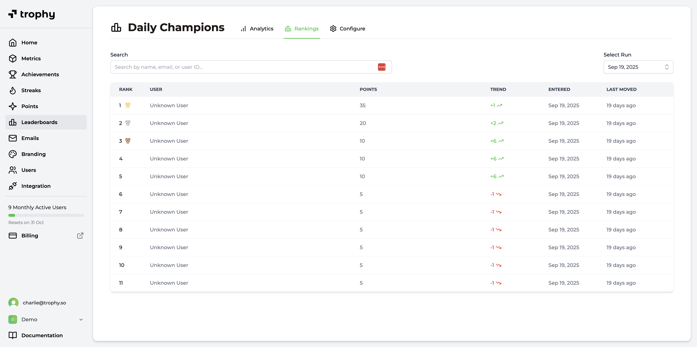

import SDKInstallCommand from "../../snippets/sdk-install-command.mdx";
import MetricChangeRequestBlock from "../../snippets/metric-change-request-block.mdx";
import LeaderboardRankingsRequest from "../../snippets/leaderboard-rankings-request.mdx";
import LeaderboardRankingsResponse from "../../snippets/leaderboard-rankings-response.mdx";
import UserLeaderboardRankingsRequest from "../../snippets/user-leaderboard-rankings-request.mdx";
import UserLeaderboardRankingsResponse from "../../snippets/user-leaderboard-rankings-response.mdx";

Esta guía describe el proceso completo para agregar una funcionalidad de clasificaciones a tu aplicación web o móvil usando Trophy.

Con fines ilustrativos, utilizaremos el ejemplo de una plataforma de estudio que usa una clasificación diaria para crear competencia amistosa en torno a la visualización de tarjetas de memoria.

<Tip>
  Para ver un ejemplo completamente funcional de esto en la práctica, consulta la [demostración en vivo](https://examples.trophy.so) o el [repositorio de github](https://github.com/trophyso/example-study-platform/tree/demo).
</Tip>

## Requisitos previos {#pre-requisites}

- Una cuenta de [Trophy](https://app.trophy.so/sign-up)
- Aproximadamente 10 minutos

## Configuración de Trophy {#trophy-setup}

En Trophy, las [Métricas](/es/platform/metrics) son los componentes fundamentales de la gamificación y modelan las diferentes interacciones que los usuarios realizan con tu producto.

En esta guía, la interacción que nos interesa es `flashcards-viewed`, pero puedes crear una métrica que represente mejor la interacción en torno a la cual deseas crear clasificaciones.

En el panel de Trophy, dirígete a la [página de métricas](https://app.trophy.so/metrics) y crea una métrica.

<Frame>
  <video
    autoPlay
    muted
    loop
    playsInline
    className="w-full aspect-video"
    src="../../assets/guides/achievements-feature/create_new_metric.mp4"
  ></video>
</Frame>

Una vez que hayas creado tu métrica, dirígete a la [página de clasificaciones](https://app.trophy.so/leaderboards) y crea las clasificaciones que desees. Puedes encontrar todos los detalles sobre los tipos de clasificaciones y los diferentes casos de uso en la [documentación de clasificaciones](/es/platform/leaderboards).

<Frame>
  <video
    autoPlay
    muted
    loop
    playsInline
    className="w-full aspect-video"
    src="../../assets/guides/leaderboards-feature/creating_leaderboards.mp4"
  ></video>
</Frame>

Para los propósitos de esta guía, hemos configurado una clasificación diaria que rastrea el XP total que un usuario gana al ver tarjetas de estudio.

<Tip>
  Para una guía completa sobre cómo agregar una función de XP a tu aplicación web o móvil, consulta
  nuestra [guía completa](/es/guides/how-to-build-an-xp-feature).
</Tip>

En Trophy rastreas las interacciones de los usuarios enviando [Eventos](/es/platform/events) desde tu código a las API de Trophy contra una métrica específica.

Cuando se registran eventos para un usuario específico, Trophy actualiza automáticamente su clasificación en cada clasificación de la que forma parte.

Esto es lo que hace que construir experiencias gamificadas con Trophy sea tan fácil, hace todo el trabajo por ti en segundo plano.

## Instalando Trophy SDK {#installing-trophy-sdk}

Para interactuar con Trophy desde tu código, utilizarás el Trophy SDK disponible en la mayoría de los principales [lenguajes de programación](/es/api-reference/client-libraries).

Instala el Trophy SDK:

<SDKInstallCommand />

A continuación, obtén tu clave de API desde la [página de integración](https://app.trophy.so/integration) de Trophy y agrégala como una variable de entorno **solo del lado del servidor**.

```bash
TROPHY_API_KEY='*******'
```

<Warning>
  Asegúrate de **no** exponer tu clave de API en código del lado del cliente.
</Warning>

## Rastreando Interacciones de Usuarios {#tracking-user-interactions}

Para rastrear un evento (interacción de usuario) contra tu métrica, utiliza la [API de cambio de métrica](/es/api-reference/endpoints/metrics/send-a-metric-change-event).

<MetricChangeRequestBlock />

La respuesta a esta llamada de API es el conjunto completo de cambios a cualquier función que hayas construido con Trophy, incluyendo cualquier cambio en su clasificación en cualquier clasificación de la que formen parte.

{/* vale off */}

```json Response [expandable]
{
  "metricId": "d01dcbcb-d51e-4c12-b054-dc811dcdc623",
  "eventId": "0040fe51-6bce-4b44-b0ad-bddc4e123534",
  "total": 750,
  ...,
  "leaderboards": {
    "daily_champions": {
      "id": "0040fe51-6bce-4b44-b0ad-bddc4e123535",
      "key": "daily_champions",
      "name": "Daily Champions",
      "description": null,
      "rankBy": "metric",
      "runUnit": null,
      "runInterval": 0,
      "maxParticipants": 100,
      "metricName": "Flashcards Flipped",
      "metricKey": "flashcards-flipped",
      "threshold": 10,
      "start": "2025-01-01",
      "end": null,
      "previousRank": 50,
      "rank": 12
    }
  }
}
```

{/* vale on */}

Valida que esto esté funcionando revisando el [panel de control](https://app.trophy.so) de Trophy.

<Frame>
  
</Frame>

## Mostrando Clasificaciones {#displaying-leaderboards}

Tienes varias opciones para mostrar clasificaciones en tu aplicación. Aquí veremos las opciones más comunes.

### Notificaciones Emergentes {#pop-up-notifications}

Podemos utilizar la respuesta de la [API de cambio de métrica](/es/api-reference/endpoints/metrics/send-a-metric-change-event) para mostrar notificaciones emergentes (o 'toasts') cuando los usuarios suben en las clasificaciones.

Aquí hay un ejemplo de esto en acción:

```ts Leaderboard Rank Up Pop-up
// Sends event to Trophy
const response = await viewFlashcard();

if (!response) {
  return;
}

const leaderboard = response.leaderboards["daily_champions"];

if (!leaderboard) {
  return;
}

// Show toasts if the user moved up the leaderboard
if (leaderboard.rank > leaderboard.previousRank) {
  toast({
    title: "You're on the move!,
    description: `You moved up ${leaderboard.previousRank - leaderboard.rank} places!,
  });
}
```

<Tip>
  Si quieres reproducir efectos de sonido, utiliza la [API de Audio
  HTML5](https://developer.mozilla.org/en-US/docs/Web/API/Web_Audio_API) y siéntete
  libre de usar estos [archivos de
  audio](https://github.com/trophyso/example-study-platform/tree/demo/public/sounds)
  que recomendamos.
</Tip>

### Mostrar las Clasificaciones {#displaying-leaderboard-rankings}

Para obtener una clasificación y sus rankings más actualizados, utiliza la [API de clasificación](/es/api-reference/endpoints/leaderboards/get-leaderboard).

<LeaderboardRankingsRequest />

<Tip>
  También puedes utilizar el parámetro `run` con la fecha de la 'ejecución' pasada específica
  de una clasificación para la cual deseas obtener datos.
</Tip>

Aquí hay un ejemplo de los datos devueltos por la API de clasificación:

<LeaderboardRankingsResponse />

### Mostrar el Historial de Rango del Usuario {#displaying-user-rank-history}

Utiliza la [API de clasificación de usuario](/es/api-reference/endpoints/users/get-a-users-leaderboard) para obtener datos sobre cómo ha cambiado el rango de un usuario específico a lo largo del tiempo en una clasificación particular.

<UserLeaderboardRankingsRequest />

Aquí hay un ejemplo de los datos devueltos por la API de rankings de clasificación de usuario, que incluye el rango actual del usuario en el atributo `rank` y un array de rangos anteriores en el atributo `history`:

<UserLeaderboardRankingsResponse />

## Analíticas {#analytics}

La [página de clasificaciones](https://app.trophy.so/achievements) en Trophy muestra cuántos usuarios están participando activamente en una clasificación, así como una medida de competitividad basada en cuántos cambios de rango están ocurriendo.

La página de analíticas también muestra una distribución de las puntuaciones de los usuarios para ayudar a identificar grupos de usuarios dentro de las clasificaciones.

<Frame>
  
</Frame>

Además, la página de clasificaciones de la clasificación muestra las posiciones actuales y pasadas de una clasificación:

<Frame>
  
</Frame>

## Obtener soporte {#get-support}

¿Quieres ponerte en contacto con el equipo de Trophy? Comunícate con nosotros por [correo electrónico](mailto:support@trophy.so). ¡Estamos aquí para ayudarte!
