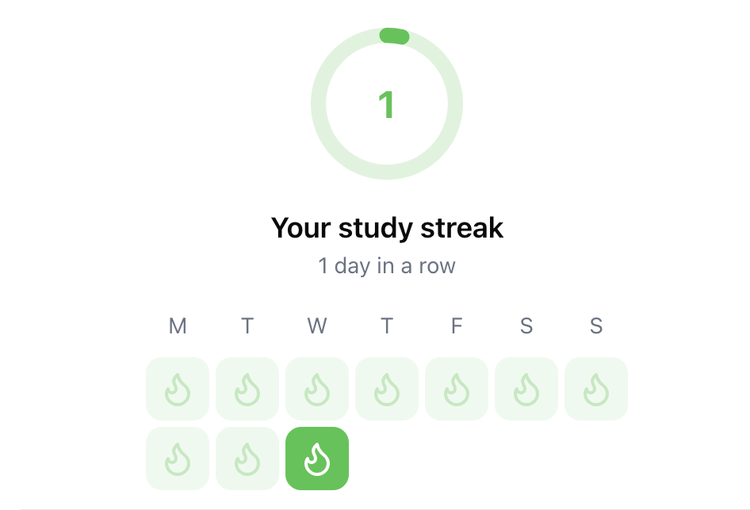
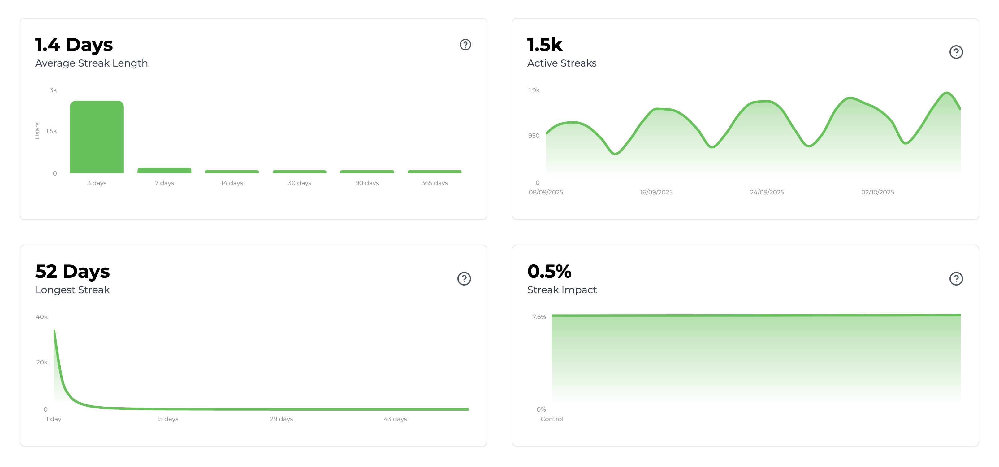

import SDKInstallCommand from "../../snippets/sdk-install-command.mdx";
import MetricChangeRequestBlock from "../../snippets/metric-change-request-block.mdx";
import StreakRequestBlock from "../../snippets/streak-request-block.mdx";
import StreakResponseBlock from "../../snippets/streak-response-block.mdx";

Esta guía describe el proceso completo para añadir una funcionalidad de rachas a tu aplicación web o móvil usando Trophy.

A modo ilustrativo, utilizaremos el ejemplo de una plataforma de estudio que emplea una racha diaria para incentivar y recompensar a los usuarios por ver tarjetas de estudio.

<Tip>
  Para ver un ejemplo completamente funcional de esto en la práctica, consulta la [demostración en vivo](https://examples.trophy.so) o el [repositorio de github](https://github.com/trophyso/example-study-platform/tree/demo).
</Tip>

## Requisitos previos {#pre-requisites}

- Una cuenta de [Trophy](https://app.trophy.so/sign-up)
- Aproximadamente 10 minutos

## Configuración de Trophy {#trophy-setup}

En Trophy, las [Métricas](/es/platform/metrics) son los componentes fundamentales de la gamificación y modelan las diferentes interacciones que los usuarios realizan con tu producto.

En esta guía, la interacción que nos interesa es `flashcards-viewed`, pero puedes crear una métrica que mejor represente la interacción desde la cual quieres generar rachas.

En el panel de Trophy, dirígete a la [página de métricas](https://app.trophy.so/metrics) y crea una métrica.

<Frame>
  <video
    autoPlay
    muted
    loop
    playsInline
    className="w-full aspect-video"
    src="../../assets/guides/achievements-feature/create_new_metric.mp4"
  ></video>
</Frame>

Una vez que hayas creado tu métrica, dirígete a la [página de rachas](https://app.trophy.so/streaks/configure) y selecciona la frecuencia de racha que deseas (diaria, semanal o mensual).

Luego añade tu métrica a las condiciones de racha y establece el umbral que los usuarios deben cumplir (por ejemplo, al menos 1 para extender su racha en cada período).

También puedes añadir múltiples métricas y elegir si los usuarios deben cumplir todas o solo una—consulta la [documentación de condiciones de racha](/es/platform/streaks#streak-conditions) para más detalles.

En Trophy puedes hacer seguimiento de las interacciones de los usuarios enviando [Eventos](/es/platform/events) desde tu código a las API de Trophy asociados a una métrica específica.

Cuando se registran eventos para un usuario específico, Trophy verificará automáticamente si han cumplido las condiciones de su racha para el período actual y actualizará la racha del usuario en consecuencia.

Esto es lo que hace que crear experiencias gamificadas con Trophy sea tan fácil: hace todo el trabajo por ti entre bastidores.

## Instalación del SDK de Trophy {#installing-trophy-sdk}

Para interactuar con Trophy desde tu código utilizarás el SDK de Trophy disponible en la mayoría de los principales [lenguajes de programación](/es/api-reference/client-libraries).

Instala el SDK de Trophy:

<SDKInstallCommand />

A continuación, obtén tu clave API desde la [página de integración](https://app.trophy.so/integration) de Trophy y agrégala como una variable de entorno **solo del lado del servidor**.

```bash
TROPHY_API_KEY='*******'
```

<Warning>
  Asegúrate de **no** exponer tu clave API en código del lado del cliente.
</Warning>

## Seguimiento de Interacciones de Usuarios {#tracking-user-interactions}

Para hacer seguimiento de un evento (interacción de usuario) asociado a tu métrica, utiliza la [API de cambio de métrica](/es/api-reference/endpoints/metrics/send-a-metric-change-event).

<MetricChangeRequestBlock />

<Tip>
  Al incluir la zona horaria del usuario en el atributo `tz`, Trophy
  hará seguimiento automático de las rachas según el reloj local del usuario y gestionará
  casos límite complicados donde los usuarios cambian de zona horaria.
</Tip>

La respuesta a esta llamada API es el conjunto completo de cambios a cualquier funcionalidad que hayas creado con Trophy, incluyendo los datos más recientes sobre la racha del usuario.

{/* vale off */}

```json Response [expandable]
{
  "metricId": "d01dcbcb-d51e-4c12-b054-dc811dcdc623",
  "eventId": "0040fe51-6bce-4b44-b0ad-bddc4e123534",
  "total": 750,
  ...,
  "currentStreak": {
    "length": 1,
    "frequency": "daily",
    "started": "2025-04-02",
    "periodStart": "2025-03-31",
    "periodEnd": "2025-04-05",
    "expires": "2025-04-12"
  },
  ...
}
```

{/* vale on */}

Valida que esto funciona verificando el [panel de control](https://app.trophy.so) de Trophy.

## Visualización de Rachas {#displaying-streaks}

Tienes varias opciones para mostrar rachas en tu aplicación. Aquí veremos las opciones más comunes.

### Notificaciones Emergentes {#pop-up-notifications}

Podemos usar la respuesta de la [API de cambio de métrica](/es/api-reference/endpoints/metrics/send-a-metric-change-event) para mostrar notificaciones emergentes (o 'toasts') cuando el usuario extiende su racha.

Aquí hay un ejemplo de esto en acción:

```ts Streak Extended Pop-up
// Sends event to Trophy
const response = await viewFlashcard();

if (!response) {
  return;
}

// Show toast if user has extended their streak
if (response.currentStreak?.extended) {
  toast({
    title: "You're on a roll!",
    description: `Keep going to keep your ${response.currentStreak.length} day streak!`,
  });
}
```

<Frame>
  <video
    autoPlay
    muted
    loop
    playsInline
    className="w-full aspect-video"
    src="../../assets/guides/streaks-feature/streak-toasts.mp4"
  ></video>
</Frame>

<Tip>
  Si quieres reproducir efectos de sonido, usa la [API de Audio HTML5](https://developer.mozilla.org/en-US/docs/Web/API/Web_Audio_API) y siéntete libre de usar estos [archivos de audio](https://github.com/trophyso/example-study-platform/tree/demo/public/sounds) que recomendamos.
</Tip>

### Mostrar Rachas de Usuario {#displaying-user-streaks}

Para obtener datos sobre la racha de un usuario, usa la [API de racha de usuario](/es/api-reference/endpoints/users/get-a-users-streak).

<StreakRequestBlock />

Esta API no solo devuelve datos sobre la racha actual del usuario como `length` y `expires`, sino que también puede devolver datos históricos de rachas que se pueden usar para mostrar cualquier tipo de interfaz de racha que desees a través del parámetro `historyPeriods`.

<StreakResponseBlock />

Aquí hay un ejemplo de un calendario de rachas estilo git construido usando los datos de la respuesta anterior:

<Frame>
  
</Frame>

<Tip>
  Consulta este [repositorio de ejemplo](https://github.com/trophyso/example-study-platform/blob/demo/src/app/user-center/study-center/default-view.tsx) para ver un componente React que gestiona esta interfaz usando datos de Trophy.
</Tip>

## Analíticas {#analytics}

La [página de rachas](https://app.trophy.so/streaks) en Trophy muestra datos sobre rachas activas, la longitud promedio de las rachas y las rachas más largas.

<Frame>
  
</Frame>

## Congelación de Rachas {#streak-freezes}

Trophy también admite congelación de rachas, lo que puede ayudar a evitar que los usuarios pierdan su racha si accidentalmente se pierden un periodo.

Obtén más información sobre la congelación de rachas en la [documentación dedicada de congelación de rachas](/es/platform/streaks#streak-freezes).

## Obtener Soporte {#get-support}

¿Quieres ponerte en contacto con el equipo de Trophy? Contáctanos por [correo electrónico](mailto:support@trophy.so). ¡Estamos aquí para ayudar!
