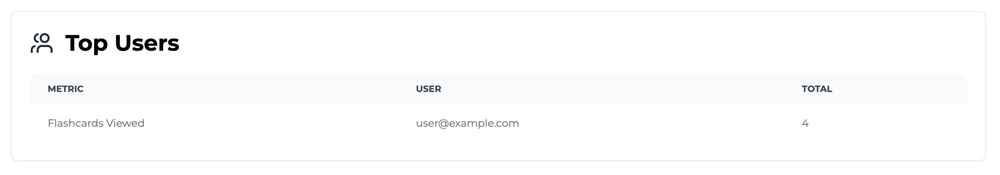
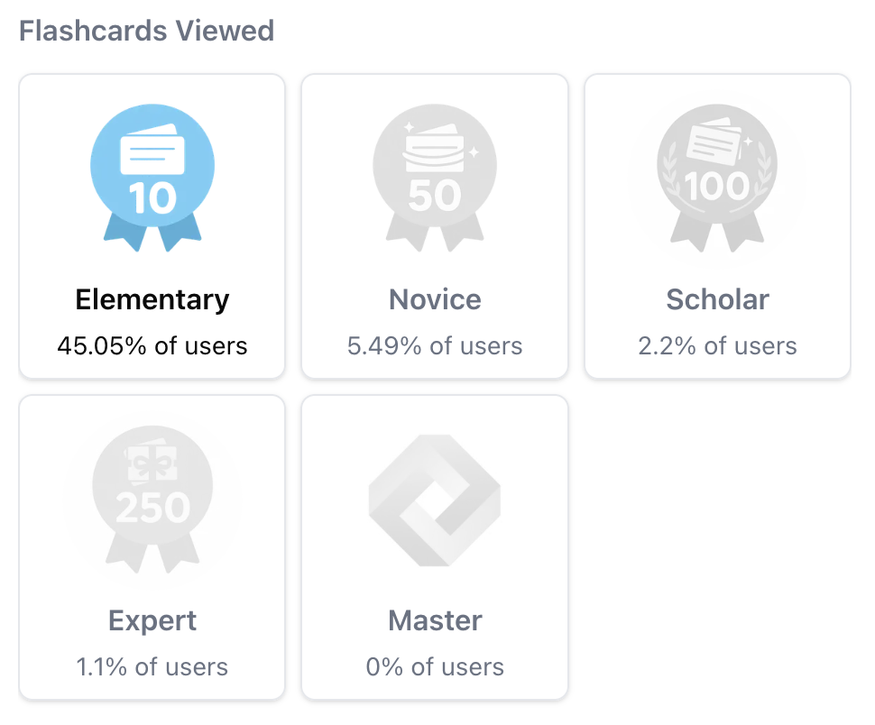

import SDKInstallCommand from "../../snippets/sdk-install-command.mdx";
import MetricChangeRequestBlock from "../../snippets/metric-change-request-block.mdx";
import UserAchievementsRequestBlock from "../../snippets/user-achievements-request-block.mdx";
import AllAchievementsRequestBlock from "../../snippets/all-achievements-request-block.mdx";

Esta guía describe el proceso completo para añadir una funcionalidad de logros a tu aplicación web o móvil usando Trophy.

A modo ilustrativo, usaremos el ejemplo de una plataforma de estudio que utiliza logros para incentivar y recompensar a los usuarios por ver tarjetas de memoria.

<Tip>
  Para ver un ejemplo completamente funcional de esto en la práctica, consulta la [demostración en vivo](https://examples.trophy.so) o el [repositorio de github](https://github.com/trophyso/example-study-platform/tree/demo).
</Tip>

## Requisitos previos {#pre-requisites}

- Una cuenta de [Trophy](https://app.trophy.so/sign-up)
- Aproximadamente 10 minutos

## Configuración de Trophy {#trophy-setup}

En Trophy, las [Métricas](/es/platform/metrics) son los componentes fundamentales de la gamificación y modelan las diferentes interacciones que los usuarios realizan con tu producto.

En esta guía, la interacción que nos interesa es `flashcards-viewed`, pero puedes crear una métrica que mejor represente la interacción en torno a la cual quieres construir logros.

En el panel de Trophy, dirígete a la [página de métricas](https://app.trophy.so/metrics) y crea una métrica.

<Frame>
  <video
    autoPlay
    muted
    loop
    playsInline
    className="w-full aspect-video"
    src="../../assets/guides/achievements-feature/create_new_metric.mp4"
  ></video>
</Frame>

Una vez que hayas creado tu métrica, dirígete a la [página de logros](https://app.trophy.so/achievements) y crea los logros que desees. Puedes encontrar todos los detalles sobre los tipos de logros y los diferentes casos de uso en la [documentación de logros](/es/platform/achievements).

Para los propósitos de esta guía, hemos configurado un par de logros basados en un número creciente de tarjetas volteadas:

- 10 tarjetas de estudio
- 50 tarjetas de estudio
- 100 tarjetas de estudio
- 250 tarjetas de estudio
- 1,000 tarjetas de estudio

También hemos configurado algunos logros relacionados con [Rachas](/es/platform/streaks), pero no entraremos en detalle sobre estos en esta guía.

<Tip>
  Para una guía completa sobre cómo agregar una función de rachas a tu aplicación web o móvil, consulta
  nuestra [guía completa](/es/guides/how-to-build-a-streaks-feature).
</Tip>

En Trophy rastrear las interacciones de usuarios enviando [Events](/es/platform/events) desde tu código a las API de Trophy contra una métrica específica.

Cuando se registran eventos para un usuario específico, cualquier logro vinculado a la métrica especificada se **completará automáticamente** si se cumplen los requisitos.

Esto es lo que hace que crear experiencias gamificadas con Trophy sea tan fácil: realiza todo el trabajo por ti detrás de escena.

## Instalar Trophy SDK {#installing-trophy-sdk}

Para interactuar con Trophy desde tu código, utilizarás el Trophy SDK disponible en la mayoría de los [lenguajes de programación](/es/api-reference/client-libraries) principales.

Instala el Trophy SDK:

<SDKInstallCommand />

A continuación, obtén tu clave API desde la [página de integración](https://app.trophy.so/integration) de Trophy y agrégala como una variable de entorno **solo del lado del servidor**.

```bash
TROPHY_API_KEY='*******'
```

<Warning>
  Asegúrate de **no** exponer tu clave API en código del lado del cliente.
</Warning>

## Rastrear Interacciones de Usuarios {#tracking-user-interactions}

Para rastrear un evento (interacción de usuario) contra tu métrica, utiliza la [API de cambio de métrica](/es/api-reference/endpoints/metrics/send-a-metric-change-event).

<MetricChangeRequestBlock />

La respuesta a esta llamada API es el conjunto completo de cambios a cualquier funcionalidad que hayas creado con Trophy, incluidos los logros que se desbloquearon como resultado del evento.

{/* vale off */}

```json Response [expandable]
{
  "metricId": "d01dcbcb-d51e-4c12-b054-dc811dcdc623",
  "eventId": "0040fe51-6bce-4b44-b0ad-bddc4e123534",
  "total": 750,
  "achievements": [
    {
      "id": "5100fe51-6bce-6j44-b0hs-bddc4e123682",
      "trigger": "metric",
      "metricId": "5100fe51-6bce-6j44-b0hs-bddc4e123682",
      "metricName": "Flashcards Flipped",
      "metricValue": 500,
      "name": "500 Flashcards Flipped",
      "description": "Write 500 words in the app.",
      "achievedAt": "2020-01-01T00:00:00Z"
    }
  ],
  ...
}
```

{/* vale on */}

Valida que esto funciona verificando el [panel de control](https://app.trophy.so) de Trophy.

<Frame>
  
</Frame>

## Mostrar Logros {#displaying-achievements}

Tienes varias opciones para mostrar logros en tu aplicación. Aquí veremos las opciones más comunes.

### Notificaciones Emergentes {#pop-up-notifications}

Podemos usar la respuesta del [API de cambio de métrica](/es/api-reference/endpoints/metrics/send-a-metric-change-event) para mostrar notificaciones emergentes (o 'toasts') cuando los usuarios completan logros.

Aquí hay un ejemplo de esto en acción:

```ts Achievement Completed Pop-up
// Sends event to Trophy
const response = await viewFlashcard();

if (!response) {
  return;
}

// Show toasts if the user has unlocked any new achievements
response.achievements.forEach((achievement) => {
  toast({
    title: achievement.name,
    description: achievement.description,
    image: {
      src: achievement.badgeUrl,
      alt: achievement.name,
    },
  });
});
```

<Frame>
  <video
    autoPlay
    muted
    loop
    playsInline
    className="w-full aspect-video"
    src="../../assets/guides/achievements-feature/displaying-toasts.mp4"
  ></video>
</Frame>

<Tip>
  Si quieres reproducir efectos de sonido, usa el [API de Audio HTML5](https://developer.mozilla.org/en-US/docs/Web/API/Web_Audio_API) y siéntete libre de usar estos [archivos de audio](https://github.com/trophyso/example-study-platform/tree/demo/public/sounds) que recomendamos.
</Tip>

### Mostrar Logros de Usuario {#displaying-user-achievements}

Para obtener todos los logros que un usuario ha completado, usa el [API de logros de usuario](/es/api-reference/endpoints/users/get-a-users-completed-achievements).

<UserAchievementsRequestBlock />

<Tip>
  También puedes obtener logros incompletos al mismo tiempo pasando `includeIncomplete` como `'true'`.
</Tip>

<Frame>
  <video
    autoPlay
    muted
    loop
    playsInline
    className="w-full aspect-video"
    src="../../assets/guides/achievements-feature/displaying_trophy_cabinet.mp4"
  ></video>
</Frame>

### Mostrar Todos los Logros {#displaying-all-achievements}

Si en cambio quieres mostrar todos los logros que has configurado en Trophy como parte de una interfaz de usuario globalmente accesible que no esté vinculada a un usuario en particular, puedes usar el [API de todos los logros](/es/api-reference/endpoints/achievements/all-achievements).

<AllAchievementsRequestBlock />

### Estadísticas de Finalización de Logros {#achievement-completion-stats}

Tanto el API de logros de usuario como el API de todos los logros incluyen estadísticas de finalización como `completions` (el número de usuarios que han completado un logro) y `rarity` (el porcentaje de usuarios que han completado un logro).

<Frame>
  
</Frame>

## Analíticas {#analytics}

La [página de logros](https://app.trophy.so/achievements) en Trophy muestra cuántos usuarios han completado cada logro que has configurado.

<Frame>
  
</Frame>

Además, la página de analíticas de cualquier métrica en Trophy incluye un gráfico que muestra el progreso de los usuarios a través de tus Logros.

<Frame>
  
</Frame>

## Obtener Soporte {#get-support}

¿Quieres ponerte en contacto con el equipo de Trophy? Comunícate con nosotros por [correo electrónico](mailto:support@trophy.so). ¡Estamos aquí para ayudarte!
