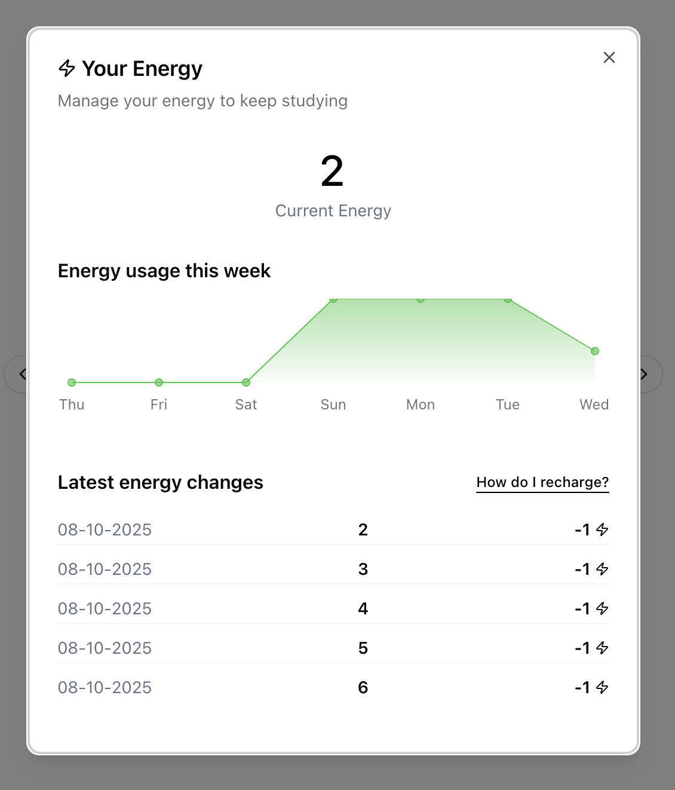
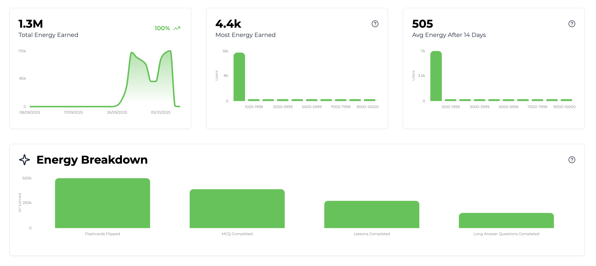

import SDKInstallCommand from "../../snippets/sdk-install-command.mdx";
import MetricChangeRequestBlock from "../../snippets/metric-change-request-block.mdx";
import UserPointsRequest from "../../snippets/user-points-request-block.mdx";
import UserEnergyResponse from "../../snippets/user-energy-response-block.mdx";
import UserPointsEventSummaryRequest from "../../snippets/user-points-summary-request-block.mdx";

Esta guía describe el proceso completo para añadir una función de energía a tu aplicación web o móvil usando Trophy.

Con fines ilustrativos, usaremos el ejemplo de una plataforma de estudio que utiliza energía para controlar la velocidad a la que los usuarios pueden ver tarjetas de memoria.

<Tip>
  Para ver un ejemplo completamente funcional de esto en la práctica, consulta la [demostración en vivo](https://examples.trophy.so) o el [repositorio de github](https://github.com/trophyso/example-study-platform/tree/demo).
</Tip>

## Requisitos previos {#pre-requisites}

- Una cuenta de [Trophy](https://app.trophy.so/sign-up)
- Aproximadamente 10 minutos

## Configuración de Trophy {#trophy-setup}

En Trophy, las [Métricas](/es/platform/metrics) son los componentes básicos de la gamificación y modelan las diferentes interacciones que los usuarios realizan con tu producto.

En esta guía, la interacción que nos interesa es `flashcards-viewed`, pero puedes crear cualquier número de métricas que mejor representen las interacciones desde las cuales deseas otorgar y consumir energía.

En el panel de Trophy, dirígete a la [página de métricas](https://app.trophy.so/metrics) y crea una métrica.

<Frame>
  <video
    autoPlay
    muted
    loop
    playsInline
    className="w-full aspect-video"
    src="../../assets/guides/achievements-feature/create_new_metric.mp4"
  ></video>
</Frame>

Una vez que hayas creado tu métrica, dirígete a la [página de puntos](https://app.trophy.so/points) y crea un nuevo sistema de puntos llamado 'Energía'.

<Frame>
  <video
    autoPlay
    muted
    loop
    playsInline
    className="w-full aspect-video"
    src="../../assets/guides/xp-feature/create_system.mp4"
  ></video>
</Frame>

Una vez creado, serás llevado a la página de configuración del sistema de energía donde podrás crear [activadores de puntos](/es/platform/points#types-of-triggers) para cada una de las formas en que deseas otorgar o consumir energía.

<Frame>
  <video
    autoPlay
    muted
    loop
    playsInline
    className="w-full aspect-video"
    src="../../assets/guides/xp-feature/create_trigger.mp4"
  ></video>
</Frame>

Usa disparadores 'time' para otorgar a los usuarios nueva energía cada hora o diariamente, y utiliza [otros tipos](/es/platform/points#types-of-triggers) de disparadores con valores negativos para consumir energía de las diferentes interacciones de usuario que desees.

En Trophy rastreas las interacciones de los usuarios enviando [Eventos](/es/platform/events) desde tu código a las APIs de Trophy contra una métrica específica.

Cuando se registran eventos para un usuario específico, Trophy verificará automáticamente si alguno de los disparadores configurados contra tu sistema de energía debe activarse, y los procesará en consecuencia.

Trophy también se encarga de otorgar automáticamente nueva energía a los usuarios con el tiempo de acuerdo con cualquier disparador 'time' que hayas configurado.

Esto es lo que hace que construir experiencias gamificadas con Trophy sea tan fácil: realiza todo el trabajo por ti en segundo plano.

## Instalación del SDK de Trophy {#installing-trophy-sdk}

Para interactuar con Trophy desde tu código utilizarás el SDK de Trophy disponible en los principales [lenguajes de programación](/es/api-reference/client-libraries).

Instala el SDK de Trophy:

<SDKInstallCommand />

A continuación, obtén tu clave de API desde la [página de integración](https://app.trophy.so/integration) de Trophy y agrégala como una variable de entorno **exclusivamente del lado del servidor**.

```bash
TROPHY_API_KEY='*******'
```

<Warning>
  Asegúrate de **no** exponer tu clave de API en código del lado del cliente.
</Warning>

## Rastreo de Interacciones de Usuario {#tracking-user-interactions}

Para rastrear un evento (interacción de usuario) contra tu métrica, utiliza la [API de cambio de métrica](/es/api-reference/endpoints/metrics/send-a-metric-change-event).

<MetricChangeRequestBlock />

La respuesta a esta llamada de API es el conjunto completo de cambios en cualquier funcionalidad que hayas construido con Trophy, incluyendo cualquier cambio en la energía como resultado del evento, y desde qué disparadores se consumió energía.

{/* vale off */}

```json Response [expandable]
{
  "metricId": "d01dcbcb-d51e-4c12-b054-dc811dcdc623",
  "eventId": "0040fe51-6bce-4b44-b0ad-bddc4e123534",
  "total": 750,
  ...,
  "points": {
    "energy": {
      "id": "0040fe51-6bce-4b44-b0ad-bddc4e123534",
      "name": "Energy",
      "description": null,
      "badgeUrl": null,
      "total": 9,
      "added": -1,
      "awards": [
        {
          "id": "0040fe51-6bce-4b44-b0ad-bddc4e123534",
          "awarded": -1,
          "date": "2021-01-01T00:00:00Z",
          "total": 9,
          "trigger": {
            "id": "0040fe51-6bce-4b44-b0ad-bddc4e123534",
            "type": "metric",
            "metricName": "Flashcards Flipped",
            "metricThreshold": 1,
            "points": -1
          }
        }
      ]
    }
  },
  ...
}
```

{/* vale on */}

Valida que esto funciona revisando el [panel de control](https://app.trophy.so) de Trophy.

## Medición del Uso {#metering-usage}

Para evitar que los usuarios realicen acciones en tu producto basándose en energía, usa la [API de puntos de usuario](/es/api-reference/endpoints/users/get-a-users-points) para obtener su total actual de energía.

<UserPointsRequest />

Esto devuelve datos sobre la energía total que tiene el usuario, permitiéndote usar la propiedad `total` para controlar qué acciones puede realizar un usuario:

<UserEnergyResponse />

Aquí hay un ejemplo donde a un usuario solo se le permite ver una tarjeta de estudio si `total > 0`

```ts
const energy = await trophy.users.points("user-id", "energy");

if (!energy) {
  return;
}

if (energy.total > 0) {
  showNextFlashcard();
}
```

Luego puedes modificar tu configuración de triggers en Trophy y controlar la velocidad a la que los usuarios pueden interactuar con tu producto directamente desde el panel de Trophy sin necesidad de realizar cambios en el código.

## Visualización de la Energía {#displaying-energy}

Para obtener la energía de un usuario, usa la [API de puntos de usuario](/es/api-reference/endpoints/users/get-a-users-points).

<UserPointsRequest />

Esta API devuelve datos sobre la energía total del usuario, pero puede configurarse para también devolver entre 1 y 100 de los cambios de energía más recientes del usuario utilizando el [parámetro de consulta](/es/api-reference/endpoints/users/get-a-users-points#parameter-awards) `awards`.

<UserEnergyResponse />

La [API de resumen de puntos de usuario](/es/api-reference/endpoints/users/get-a-users-points-summary) también puede utilizarse para impulsar interfaces basadas en gráficos, como mostrar a los usuarios su uso de energía a lo largo del tiempo.

<UserPointsEventSummaryRequest />

Aquí hay un ejemplo de una interfaz que muestra a los usuarios su energía actual, un gráfico que muestra su uso a lo largo del tiempo y una lista de sus cambios más recientes en energía.

<Frame>
  
</Frame>

## Analíticas {#analytics}

En Trophy, tu [página del sistema de energía](https://app.trophy.so/points) incluye gráficos de analíticas que muestran datos sobre la energía total otorgada/consumida y un desglose de exactamente qué triggers causan los cambios más frecuentes en energía.

<Frame>
  
</Frame>

## Obtener soporte {#get-support}

¿Quieres contactar con el equipo de Trophy? Comunícate con nosotros por [correo electrónico](mailto:support@trophy.so). ¡Estamos aquí para ayudarte!
