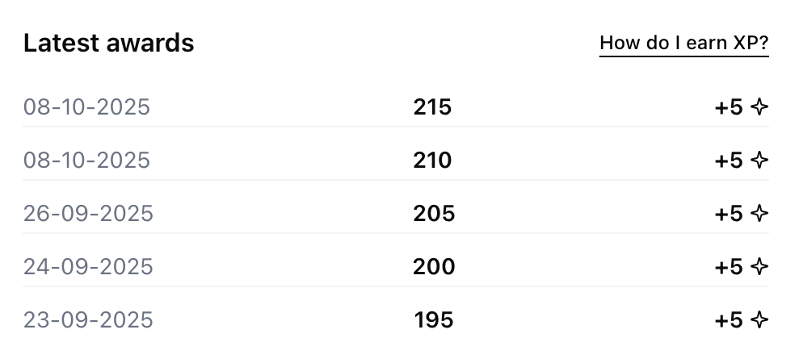
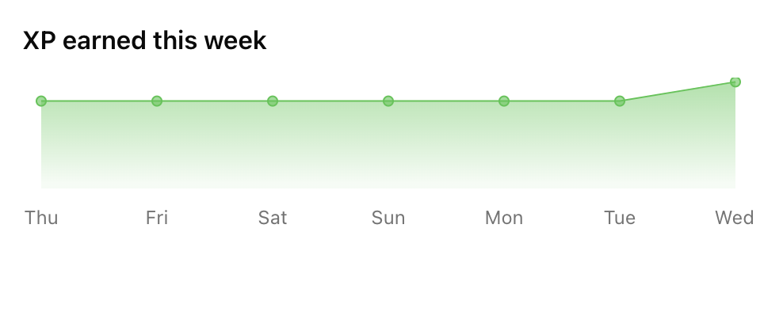
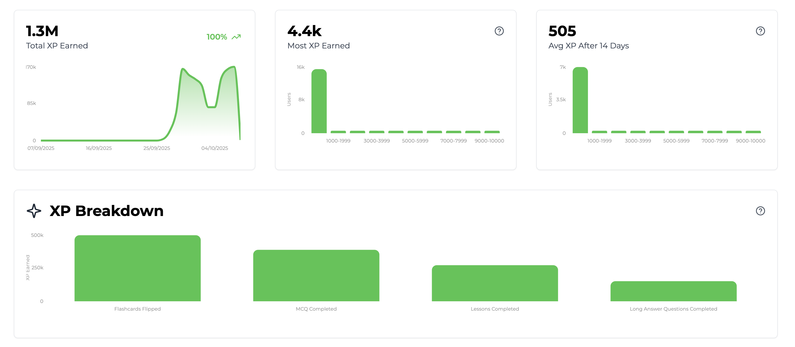

import SDKInstallCommand from "../../snippets/sdk-install-command.mdx";
import MetricChangeRequestBlock from "../../snippets/metric-change-request-block.mdx";
import MetricChangeResponseBlock from "../../snippets/metric-change-response-block.mdx";
import UserPointsRequest from "../../snippets/user-points-request-block.mdx";
import UserPointsResponse from "../../snippets/user-points-response-block.mdx";
import UserPointsEventSummaryRequest from "../../snippets/user-points-summary-request-block.mdx";
import UserPointsEventSummaryResponse from "../../snippets/user-points-summary-response-block.mdx";

La guía describe el proceso completo para añadir una función de XP a tu aplicación web o móvil usando Trophy.

Con fines ilustrativos, usaremos el ejemplo de una plataforma de estudio que utiliza XP para recompensar a los usuarios por realizar diferentes interacciones.

<Tip>
  Para ver un ejemplo completamente funcional de esto en la práctica, consulta la [demostración
  en vivo](https://examples.trophy.so) o el [repositorio de
  github](https://github.com/trophyso/example-study-platform/tree/demo).
</Tip>

## Requisitos previos {#pre-requisites}

- Una cuenta de [Trophy](https://app.trophy.so/sign-up)
- Aproximadamente 10 minutos

## Configuración de Trophy {#trophy-setup}

En Trophy, las [Métricas](/es/platform/metrics) son los bloques de construcción de la gamificación y modelan las diferentes interacciones que los usuarios tienen con tu producto.

En esta guía, la interacción que nos interesa es `flashcards-viewed`, pero puedes crear cualquier número de métricas que mejor representen las interacciones por las que deseas recompensar XP.

En el panel de Trophy, dirígete a la [página de métricas](https://app.trophy.so/metrics) y crea una métrica.

<Frame>
  <video
    autoPlay
    muted
    loop
    playsInline
    className="w-full aspect-video"
    src="../../assets/guides/achievements-feature/create_new_metric.mp4"
  ></video>
</Frame>

Una vez que hayas creado tu métrica, dirígete a la [página de puntos](https://app.trophy.so/points) y crea un nuevo sistema de puntos llamado 'XP'.

<Frame>
  <video
    autoPlay
    muted
    loop
    playsInline
    className="w-full aspect-video"
    src="../../assets/guides/xp-feature/create_system.mp4"
  ></video>
</Frame>

Una vez creado, serás redirigido a la página de configuración del sistema de XP donde puedes crear 'disparadores' para cada una de las formas en que deseas recompensar a los usuarios con XP.

<Frame>
  <video
    autoPlay
    muted
    loop
    playsInline
    className="w-full aspect-video"
    src="../../assets/guides/xp-feature/create_trigger.mp4"
  ></video>
</Frame>

En Trophy rastrear las interacciones de los usuarios se hace enviando [Eventos](/es/platform/events) desde tu código a las APIs de Trophy contra una métrica específica.

Cuando se registran eventos para un usuario específico, Trophy verificará automáticamente si el evento está asociado a una métrica configurada como parte de algún disparador de XP.

Si es así, Trophy otorgará al usuario la cantidad apropiada de XP según la configuración del disparador.

Esto es lo que hace que construir experiencias gamificadas con Trophy sea tan fácil: hace todo el trabajo por ti detrás de escena.

<Tip>
  El XP también puede otorgarse a los usuarios en base a logros, rachas y otros
  disparadores. Consulta la [documentación de puntos](/es/platform/points#points-triggers) dedicada
  para más información.
</Tip>

## Instalación del SDK de Trophy {#installing-trophy-sdk}

Para interactuar con Trophy desde tu código utilizarás el SDK de Trophy disponible en los principales [lenguajes de programación](/es/api-reference/client-libraries).

Instala el SDK de Trophy:

<SDKInstallCommand />

A continuación, obtén tu clave API desde la [página de integración](https://app.trophy.so/integration) de Trophy y agrégala como una variable de entorno **exclusivamente del lado del servidor**.

```bash
TROPHY_API_KEY='*******'
```

<Warning>
  Asegúrate de **no** exponer tu clave API en código del lado del cliente.
</Warning>

## Rastreo de Interacciones de Usuario {#tracking-user-interactions}

Para rastrear un evento (interacción de usuario) contra tu métrica, utiliza la [API de cambio de métrica](/es/api-reference/endpoints/metrics/send-a-metric-change-event).

<MetricChangeRequestBlock />

La respuesta a esta llamada API es el conjunto completo de cambios en cualquier característica que hayas construido con Trophy, incluyendo cualquier XP que se haya otorgado al usuario como resultado del evento, y desde qué disparadores se otorgó.

<Note>
  Si utilizas [Niveles de Puntos](/es/platform/points#points-levels), el objeto `xp` puede incluir un campo **`level`** **solo cuando** el nivel del usuario cambió en esta solicitud; puede omitirse cuando su nivel permaneció igual. Consulta la [referencia de la API de cambio de métrica](/es/api-reference/endpoints/metrics/send-a-metric-change-event) para el esquema completo de respuesta.
</Note>

{/* vale off */}

```json Response [expandable]
{
  "metricId": "d01dcbcb-d51e-4c12-b054-dc811dcdc623",
  "eventId": "0040fe51-6bce-4b44-b0ad-bddc4e123534",
  "total": 900,
  ...,
  "points": {
    "xp": {
      "id": "0040fe51-6bce-4b44-b0ad-bddc4e123534",
      "key": "xp",
      "name": "XP",
      "description": null,
      "badgeUrl": null,
      "maxPoints": null,
      "total": 450,
      "added": 50,
      "awards": [
        {
          "id": "0040fe51-6bce-4b44-b0ad-bddc4e123534",
          "awarded": 50,
          "date": "2021-01-01T00:00:00Z",
          "total": 450,
          "trigger": {
            "id": "0040fe51-6bce-4b44-b0ad-bddc4e123534",
            "type": "metric",
            "metricName": "Flashcards Flipped",
            "metricThreshold": 100,
            "points": 50
          }
        }
      ]
    }
  },
  ...
}
```

{/* vale on */}

Valida que esto esté funcionando revisando el [panel de control](https://app.trophy.so) de Trophy.

## Mostrar XP {#displaying-xp}

Tienes varias opciones para mostrar XP en tu aplicación. Aquí veremos las opciones más comunes.

### Notificaciones Emergentes {#pop-up-notifications}

Podemos usar la respuesta de la [API de cambio de métrica](/es/api-reference/endpoints/metrics/send-a-metric-change-event) para mostrar a los usuarios notificaciones emergentes cuando se les otorga nuevo XP.

Aquí hay un ejemplo de esto en acción:

```ts XP Pop-ups
// Sends event to Trophy
const response = await viewFlashcard();

if (!response) {
  return;
}

const xp = response.points.xp;

// Show toast if user was awarded XP
if (xp.awards.length > 0) {
  const trigger = xp.awards[0].trigger;

  toast({
    title: `You gained ${xp.added} XP`,

    // e.g. "+20 XP for 10 flashcards flipped"
    description: `+${trigger.points} XP for ${
      trigger.metricThreshold
    } ${trigger.metricName.toLowercase()}`,
  });
}
```

<Tip>
  Si deseas reproducir efectos de sonido, usa la [API de Audio
  HTML5](https://developer.mozilla.org/en-US/docs/Web/API/Web_Audio_API) y siéntete
  libre de usar estos [archivos de
  audio](https://github.com/trophyso/example-study-platform/tree/demo/public/sounds)
  que recomendamos.
</Tip>

### Mostrar XP del Usuario {#displaying-user-xp}

Para obtener el XP de un usuario, utiliza la [API de Puntos del usuario](/es/api-reference/endpoints/users/get-a-users-points).

<UserPointsRequest />

Esta API devuelve datos sobre el XP total del usuario, pero puede configurarse para devolver también entre 1 y 100 de las recompensas de XP más recientes del usuario mediante el `awards` [parámetro de consulta](/es/api-reference/endpoints/users/get-a-users-points#parameter-awards).

<UserPointsResponse />

Aquí hay un ejemplo de una interfaz que muestra a los usuarios una lista de sus recompensas más recientes basada en los datos devueltos por la API de Puntos del usuario.

<Frame>
  
</Frame>

### Gráfico de XP del Usuario {#user-xp-chart}

La [API de resumen de Puntos del usuario](/es/api-reference/endpoints/users/get-a-users-points-summary) devuelve datos históricos listos para graficar que muestran cómo ha cambiado el XP de un usuario a lo largo del tiempo.

<UserPointsEventSummaryRequest />

Utiliza los parámetros de consulta `aggregation`, `start_date` y `end_date` para controlar los datos devueltos. Aquí hay un ejemplo de datos de XP agregados diariamente:

<UserPointsEventSummaryResponse />

Y aquí hay un ejemplo de los tipos de gráficos que puedes construir con estos datos:

<Frame>
  
</Frame>

## Analíticas {#analytics}

En Trophy, tu [página del sistema de xp](https://app.trophy.so/points) incluye gráficos de analíticas que muestran datos sobre el total de XP ganado y un desglose exacto de qué desencadenadores otorgan la mayor cantidad de XP.

<Frame>
  
</Frame>

## Obtener Soporte {#get-support}

¿Quieres contactar con el equipo de Trophy? Comunícate con nosotros por [correo electrónico](mailto:support@trophy.so). ¡Estamos aquí para ayudarte!
