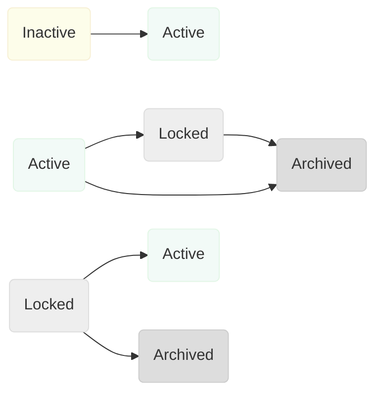
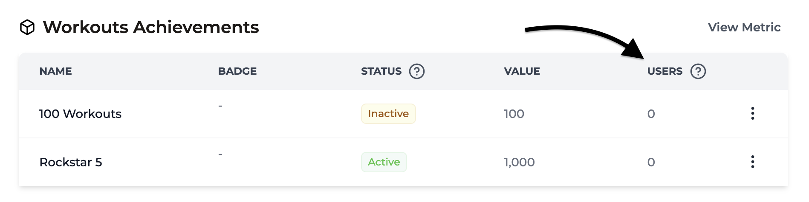
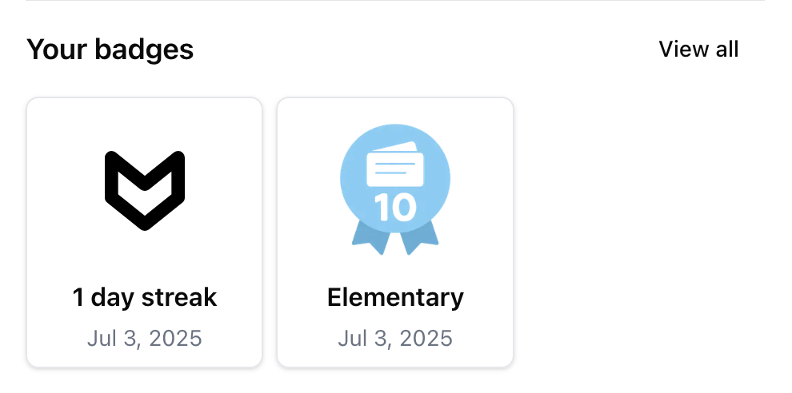
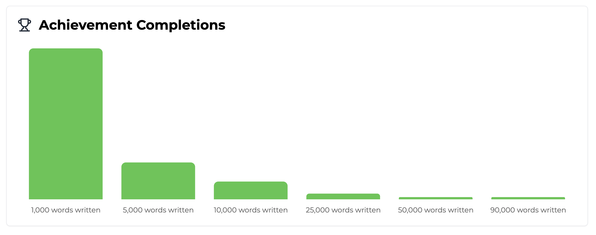

import MetricChangeResponseBlock from "../../snippets/metric-change-response-block.mdx";
import AllAchievementsResponseBlock from "../../snippets/all-achievements-response-block.mdx";

## ¿Qué son los Logros? {#what-are-achievements}

Los logros son recompensas que los usuarios pueden desbloquear mientras usan tu plataforma. Se pueden utilizar para recompensar a los usuarios por lograr un progreso continuo en los recorridos principales del usuario, o para motivar a los usuarios a explorar funciones más nuevas.

Los logros funcionan mejor cuando están diseñados para incentivar a los usuarios a realizar acciones que probablemente aumenten la retención.

<Tip>
  Usa las [analíticas de métricas](/es/platform/metrics#metric-analytics) de Trophy para comparar
  la retención de cada interacción del usuario, y luego configura logros en torno
  a estas interacciones para maximizar el impacto en la retención.
</Tip>

Aquí veremos los tipos de logros que puedes construir con Trophy, las diferentes formas de usarlos y cómo integrarlos en tu plataforma.

Mira cómo Charlie muestra el uso de logros en una aplicación NextJS:

<Frame>
  <iframe
    width="560"
    height="315"
    src="https://www.youtube.com/embed/U6TRxV036Lk?si=pAX37TXL8rNeFzz7"
    title="YouTube video player"
    frameborder="0"
    allow="accelerometer; autoplay; clipboard-write; encrypted-media; gyroscope; picture-in-picture"
    allowfullscreen
  ></iframe>
</Frame>

## Tipos de Logros {#achievement-types}

Trophy ofrece cuatro tipos de logros: [Métricas](#metric-achievements), [API](#api-achievements), [Rachas](#streak-achievements) y [logros compuestos](#composite-achievements), detallados a continuación.

### Logros de Métricas {#metric-achievements}

Los logros de métricas están vinculados a [Métricas](/es/platform/metrics) y se utilizan mejor cuando quieres incentivar a los usuarios a realizar la misma acción una y otra vez.

Tomemos el ejemplo de una plataforma de estudio que usa Trophy para animar a los usuarios a ver más tarjetas de memoria con logros de métricas de la siguiente manera:

- 1.000 tarjetas de memoria
- 2.500 tarjetas de memoria
- 5.000 tarjetas de memoria
- 10.000 tarjetas de memoria
- 25.000 tarjetas de memoria
- 50.000 tarjetas de memoria

En este caso, crearías una métrica llamada _Tarjetas Volteadas_ y crearías logros asociados a la métrica para cada hito.

Dado que estos logros están directamente vinculados a la métrica _Tarjetas Volteadas_, Trophy rastreará automáticamente cuándo los usuarios desbloquean estos logros a medida que [incrementan la métrica](/es/platform/events#tracking-metric-events).

Cuando se desbloquean logros, Trophy incluye información sobre los logros desbloqueados en la respuesta del [API de Eventos](/es/api-reference/endpoints/metrics/send-a-metric-change-event) y activa automáticamente los [Correos de Logros](/es/platform/emails#achievement-emails) si están configurados.

<MetricChangeResponseBlock />

### Logros de API {#api-achievements}

Los logros de API solo se pueden completar una vez y son útiles para recompensar a los usuarios por realizar acciones específicas.

Ejemplos comunes incluyen:

- Un usuario completando su perfil después de registrarse
- Un usuario vinculando su cuenta de redes sociales a una plataforma
- Un usuario compartiendo su experiencia del producto en redes sociales

Los logros de API sirven como una forma fácil de recompensar a los usuarios por completar cualquier acción que consideres importante para la retención.

Al igual que los logros de métricas, los logros de API también pueden activar [Correos de Logros](/es/platform/emails#achievement-emails) automatizados si están configurados.

### Logros de Racha {#streak-achievements}

Los logros de racha están directamente vinculados a la [Racha](/es/platform/streaks) de un usuario y se desbloquean automáticamente cuando los usuarios alcanzan una longitud de racha determinada.

Puedes crear tantos logros de racha como desees para longitudes de racha crecientes, por ejemplo 7 días, 30 días y 365 días para motivar a los usuarios a usar tu aplicación cada vez más.

Al igual que los logros de métricas y API, puedes agregar un nombre personalizado y asignar una insignia a los logros de racha.

### Logros Compuestos {#composite-achievements}

Los Logros compuestos se desbloquean automáticamente cuando un usuario ha completado todos los Logros prerequisitos que selecciones. Son ideales para crear recompensas escalonadas o de nivel de maestría que reconocen a los usuarios que han logrado un conjunto específico de hitos.

Por ejemplo, podrías crear un Logro compuesto "Maestro del Estudio" que se desbloquea cuando un usuario ha completado:
- 1,000 tarjetas de estudio
- Racha de 7 días
- Completar la incorporación

Los Logros compuestos son útiles para crear rutas de progresión y fomentar que los usuarios interactúen en diferentes áreas de tu aplicación. Al igual que otros tipos de Logros, pueden activar [Correos de Logros](/es/platform/emails#achievement-emails) cuando se desbloquean.

## Crear Logros {#creating-achievements}

Para crear nuevos Logros, dirígete a la [página de Logros](https://app.trophy.so/achievements) en el panel de Trophy y presiona el botón **Nuevo Logro**:

<Frame>
  <video
    autoPlay
    muted
    loop
    playsInline
    className="w-full aspect-video"
    src="../../assets/platform/achievements/create_new_achievement.mp4"
  ></video>
</Frame>

<Steps>
<Step title="Ingresa un nombre">
  Ingresa un nombre para el Logro. Este será devuelto desde las API y estará disponible para usar en correos y otras áreas de Trophy según corresponda.
</Step>

<Step title="Ingresa una descripción (Opcional)">
  Ingresa una breve descripción del Logro. Esta será devuelta desde las API y
  estará disponible para usar en correos y otras áreas de Trophy según
  corresponda.
</Step>

<Step title="Agrega una insignia (Opcional)">
  Puedes agregar una insignia subiendo una imagen o ingresando una URL de imagen personalizada.
  La URL se devuelve en las respuestas de la API y se usa en correos y otras áreas de
  Trophy según corresponda.
</Step>

<Step title="Elige un tipo de activador">
  Elige cómo quieres que se desbloquee este Logro.
  
- Elegir **Métrica** significa que el Logro se desbloqueará automáticamente cuando el total de la métrica del usuario alcance el valor de activación del Logro.

- Elegir **Racha** significa que el logro se desbloqueará automáticamente cuando la longitud de la racha del usuario alcance el valor de activación del logro.

- Elegir **Llamada API** significa que el logro solo se desbloqueará cuando se marque explícitamente como completado por tu código mediante una solicitud a la [API de completar logro](/es/api-reference/endpoints/achievements/mark-an-achievement-as-completed).

- Elegir **Compuesto** significa que el logro se desbloqueará automáticamente cuando el usuario haya completado todos los logros prerequisitos que selecciones.

</Step>

<Step title="Configurar activador">
  Una vez que hayas elegido el tipo de activador para el logro, debes configurar los ajustes del activador.

- Si elegiste el activador **Métrica**, deberás seleccionar la métrica y el valor total del usuario que debe desbloquear el logro al alcanzarlo.

- Si elegiste el activador **Racha**, deberás establecer la longitud de racha que debe desbloquear el logro.

- Si elegiste el activador **Llamada API**, deberás elegir una referencia única `key` que usarás para completar el logro mediante la [API](/es/api-reference/endpoints/achievements/mark-an-achievement-as-completed).

- Si elegiste el activador **Compuesto**, deberás seleccionar los logros prerequisitos que deben completarse todos para que este logro se desbloquee. El logro compuesto se desbloqueará automáticamente cuando un usuario complete el último prerequisito.

</Step>

<Step title="Agregar filtros de atributos (Opcional)">
Puedes asignar filtros de atributos a un logro para restringir aún más quién puede desbloquearlos y cuándo.

- Para limitar un logro de **Métrica** a que solo se aplique a eventos con [atributos de evento personalizados](/es/platform/events#custom-event-attributes) específicos, agrega uno o más filtros en la sección **Atributos de Evento**.

- Para limitar cualquier tipo de logro a que solo se aplique a un usuario con uno o más [atributos de usuario personalizados](/es/platform/users#custom-user-attributes) específicos, agrega atributos y los valores deseados en la sección **Atributos de Usuario**.

<Note>
  Cuando configuras múltiples filtros de atributos de evento, todos deben coincidir para que
  se aplique el logro de métrica. En las respuestas de la API, `eventAttributes` es el
  campo canónico e `eventAttribute` está obsoleto por compatibilidad con versiones anteriores.
</Note>

</Step>

<Step title="Guarda los cambios">
  Guarda el nuevo logro.
</Step>
</Steps>

## Gestión de Logros {#managing-achievements}

Trophy incluye herramientas integradas que te ayudan a probar y controlar qué logros se pueden desbloquear, por quién y cuándo, sin afectar el entorno de producción.

### Estados de Logros {#achievement-statuses}

Aquí tienes una descripción general de los diferentes estados de logros y su significado.

**Inactivo**

Todos los logros se crean como inactivos. Los logros inactivos no se pueden completar y no se devuelven en ninguna API de logros. Los usuarios no los verán hasta que los actives.

**Activo**

Cuando activas un logro, lo pones en 'producción'. Los usuarios pueden completarlo y se devolverá en todas las API de logros.

**Bloqueado**

Cuando bloqueas un logro, los usuarios que aún no lo hayan desbloqueado no podrán desbloquearlo, pero los usuarios que ya lo hayan desbloqueado no se verán afectados.

Los logros bloqueados solo se devuelven en las API para usuarios que ya los han conseguido.

**Archivado**

Los logros archivados no se pueden completar y no se devuelven en ninguna API de logros.

<Warning>
  Una vez que archivas un logro, desaparece de Trophy, así que asegúrate de archivar
  únicamente los logros que ya no necesites.
</Warning>

Los logros archivados pueden restaurarse [contactando con soporte](#get-support).

### Flujo de Trabajo de Logros {#achievement-workflow}

Los logros pueden moverse entre diferentes estados según el siguiente flujo de trabajo:



## Completar Logros {#completing-achievements}

Si utilizas logros de métricas, no es necesario _completar_ logros explícitamente. Una vez que hayas configurado el [seguimiento de métricas](/es/platform/events#tracking-metric-events) en tu código, todos los logros vinculados a la métrica se rastrearán automáticamente.

De manera similar, si estás utilizando logros de racha, todos los logros relacionados con la racha del usuario se desbloquearán automáticamente cuando un usuario alcance la longitud de racha respectiva.

Los logros compuestos también se completan automáticamente. Se desbloquean tan pronto como un usuario haya completado todos sus logros prerequisito. No se necesitan llamadas API adicionales.

Sin embargo, si estás utilizando logros de API, tendrás que marcarlos como completados para cada usuario según corresponda. Para hacer esto, puedes usar la [API de Completar Logro](/es/api-reference/endpoints/achievements/mark-an-achievement-as-completed) utilizando el `key` del logro que deseas completar.

Esto devolverá una respuesta que contiene los detalles del logro que se completó, que puede ser utilizada en cualquier flujo de trabajo posterior a la finalización, como mostrar una notificación dentro de la aplicación.

{/* vale off */}

```json Response
{
  "completionId": "0040fe51-6bce-4b44-b0ad-bddc4e123534",
  "achievement": {
    "id": "5100fe51-6bce-6j44-b0hs-bddc4e123682",
    "trigger": "api",
    "name": "Finish onboarding",
    "description": "Complete the onboarding process.",
    "badgeUrl": "https://example.com/badge.png",
    "key": "finish-onboarding",
    "achievedAt": "2021-01-01T00:00:00Z"
  }
}
```

{/* vale on */}

## Retroactividad de Logros {#backdating-achievements}

Por defecto, cada vez que mueves un logro al [estado](#managing-achievements) 'Activo', Trophy verificará si algún usuario existente cumple con los requisitos del logro y lo completará automáticamente en segundo plano.

Esto significa que cuando lances nuevos logros a producción, o edites un logro activo existente, la retroactividad ocurrirá automáticamente.

<Note>
  Cuando los logros se completan de esta manera, los usuarios no reciben
  notificaciones de que esto ha ocurrido. Esto es para prevenir que los cambios a tus
  logros en Trophy resulten en que los usuarios reciban muchas notificaciones.
</Note>

Puedes verificar cuántos usuarios han completado logros en cualquier momento en la [página de logros](https://app.trophy.so/achievements) en el panel de Trophy. La columna _Usuarios_ en los logros puede actualizarse durante la retroactividad.

<Frame>
  
</Frame>

## Uso de Insignias {#using-badges}

<Frame>
  <video
    autoPlay
    muted
    loop
    playsInline
    className="w-full aspect-video"
    src="../../assets/platform/achievements/upload_badge.mp4"
  ></video>
</Frame>

Puedes asignar una insignia a cualquier logro subiendo una imagen—Trophy la sirve y devuelve la URL—o proporcionando tu propia URL de imagen. Las respuestas relevantes de la API incluyen ese valor en `badgeUrl` para usarlo como `src` en etiquetas ``.

```json Response {8}
{
  "completionId": "0040fe51-6bce-4b44-b0ad-bddc4e123534",
  "achievement": {
    "id": "5100fe51-6bce-6j44-b0hs-bddc4e123682",
    "trigger": "api",
    "name": "Finish onboarding",
    "description": "Complete the onboarding process.",
    "badgeUrl": "https://example.com/badge.png",
    "key": "finish-onboarding",
    "achievedAt": "2021-01-01T00:00:00Z"
  }
}
```

## Visualización de Logros {#displaying-achievements}

Trophy cuenta con varias API que permiten mostrar logros dentro de tus aplicaciones. Aquí exploraremos las diferentes formas de utilizarlas y los tipos de interfaces que puedes construir.

<Tip>
  Consulta nuestra [guía completa](/es/guides/how-to-build-an-achievements-feature) sobre cómo agregar una funcionalidad de logros a tu aplicación para más detalles.
</Tip>

### Todos los Logros {#all-achievements}

Para mostrar una vista general de todos los logros que los usuarios pueden completar, utiliza el [endpoint de todos los logros](/es/api-reference/endpoints/achievements/all-achievements). Usa estos datos para construir interfaces que den a los usuarios una idea de las rutas de progresión dentro de tu aplicación.

<Frame>
  <video
    autoPlay
    muted
    loop
    playsInline
    className="w-full aspect-video"
    src="../../assets/platform/achievements/displaying_trophy_cabinet.mp4"
  ></video>
</Frame>

El endpoint de todos los logros devuelve una lista de todos los logros dentro de tu cuenta de Trophy. Cada logro devuelto también incluye `completions` (el número de usuarios que han completado el logro) y `rarity` (el porcentaje de usuarios que han completado el logro) de la siguiente manera:

<AllAchievementsResponseBlock />

### Logros del Usuario {#user-achievements}

Si en cambio estás construyendo elementos de interfaz específicos del usuario, utiliza el [endpoint de logros del usuario](/es/api-reference/endpoints/users/get-a-users-completed-achievements) para devolver los logros que un usuario específico ha completado.

<Tip>
  También puedes incluir logros que un usuario aún no ha completado incluyendo el parámetro de consulta `includeIncomplete=true`.
</Tip>

<Frame>
  
</Frame>

## Analítica de Logros {#achievement-analytics}

Si tienes logros configurados para cualquiera de tus [Métricas](/es/platform/metrics), la página de analítica de métricas muestra un gráfico con el progreso actual de todos los usuarios de la siguiente manera:

<Frame>
  
</Frame>

## Preguntas frecuentes {#frequently-asked-questions}

<AccordionGroup>
  <Accordion title="¿Qué tipo de logros debo usar?">
    Usa logros de métricas para recompensar a los usuarios por realizar la misma acción repetidamente y motivarlos a repetirla más veces.

    Usa logros de Racha para recompensar a los usuarios por mantener su Racha.

    Usa logros de API cuando quieras recompensar a los usuarios por realizar acciones específicas que solo deben hacer una vez.

    Usa logros compuestos cuando quieras crear recompensas escalonadas o de nivel maestro que se desbloquean cuando los usuarios completan un conjunto específico de logros previos.

  </Accordion>

    <Accordion title="¿Qué logros debería crear?">
    Los logros, al igual que toda la gamificación, generan mejor retención cuando están totalmente alineados con la razón principal por la que el usuario utiliza tu plataforma.

    Usa la [analítica de métricas](/es/platform/metrics#metric-analytics) de Trophy para comparar la retención de cada interacción de usuario y luego configura logros en torno a esas interacciones para maximizar el impacto en la retención.

  </Accordion>
</AccordionGroup>

## Obtener ayuda {#get-support}

¿Quieres ponerte en contacto con el equipo de Trophy? Escríbenos por [correo electrónico](mailto:support@trophy.so). ¡Estamos aquí para ayudarte!
