import { PlanBadge } from "../../es/components/plan-badge.jsx";

Trophy puede enviar correos electrónicos automatizados a los usuarios según activadores clave sin requerir código. Aquí veremos cuáles son estos activadores y cómo pueden formar parte de la experiencia de gamificación de tu producto.

## Tipos de correos electrónicos {#types-of-emails}

Trophy admite 4 tipos de correos electrónicos, cada uno diseñado para adaptarse a un escenario común en la construcción de experiencias de gamificación.

Todos los correos electrónicos son opcionales, pero los cuatro pueden usarse simultáneamente y pueden controlarse desde la página [Emails](https://app.trophy.so/emails/configure) en el panel de Trophy.

<Frame>
  <video
    autoPlay
    muted
    loop
    playsInline
    className="w-full aspect-15/4"
    src="../../assets/platform/emails/email_types.mp4"
  ></video>
</Frame>

- **Correos de logros** se envían a los usuarios cada vez que desbloquean un [Logro](/es/platform/achievements).
- **Correos de resumen** se envían a los usuarios con una frecuencia predefinida para resumir el progreso. Los correos de resumen pueden configurarse para enviarse diaria, semanal, mensual o anualmente según tu caso de uso.
- **Correos de reactivación** se envían a los usuarios después de que se vuelven inactivos con el objetivo de traerlos de vuelta a tu aplicación.
- **Correos de racha** se envían automáticamente a los usuarios recordándoles que extiendan su [Racha](/es/platform/streaks).

## Envío de correos electrónicos {#sending-emails}

Para comenzar a enviar correos electrónicos con Trophy, necesitarás verificar tu dominio y agregar y activar plantillas de correo para los tipos que deseas enviar.

<Tip>
  Los usuarios pueden controlar qué notificaciones por correo electrónico reciben a través del
  [API de preferencias de usuario](/es/platform/users#notification-preferences) de Trophy. Esto te permite
  construir un centro de preferencias en tu aplicación donde los usuarios puedan optar por recibir o no
  tipos específicos de correos electrónicos.
</Tip>

### Verificación de dominio {#domain-verification}

Trophy permite enviar correos electrónicos desde tu propio dominio de forma nativa. Hay dos formas de configurar esto: Verificación del remitente y Verificación DNS.

Todos los ajustes de dominio se pueden encontrar en la página [Dominios](https://app.trophy.so/emails/domains) en el panel de Trophy.

<Tip>
  Si buscas configurarlo rápidamente, recomendamos comenzar con Verificación del remitente y luego configurar la Verificación DNS cuando estés listo para pasar a producción.
</Tip>

<CardGroup cols={2}>
  <Card
    title="Verificación del remitente"
    icon="check"
    href="#sender-verification-basic"
  >
    Verifica rápidamente una única dirección de correo electrónico
  </Card>
  <Card title="Verificación DNS" icon="lock" href="#dns-verification-advanced">
    Recomendado para uso en producción
  </Card>
</CardGroup>

#### Verificación del remitente (Básica) {#sender-verification-basic}

Durante la incorporación se te pedirá configurar la Verificación del remitente. Esta es una forma muy sencilla de verificar rápidamente una única dirección de correo electrónico que deseas usar con Trophy sin necesidad de cambiar código ni configuraciones de DNS.

Se te pedirá ingresar la dirección de correo electrónico, el nombre del remitente y el correo de respuesta que deseas que Trophy use al enviar correos:

<Frame>
  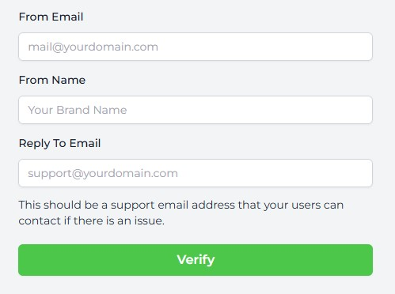
</Frame>

Trophy enviará un correo de verificación a esa dirección. Simplemente haz clic en el enlace del correo para informarle a Trophy que eres propietario de la dirección y estarás listo.

<Note>
  El correo que recibas provendrá de nuestro proveedor de correo electrónico, Postmark. ¡Así que busca 'Postmark Support' en tu bandeja de entrada!
</Note>

La Verificación del remitente es excelente para comenzar, pero tiene la limitación de que no aprovecharás tu reputación de correo existente y solo podrás enviar correos desde una dirección.

Además, si deseas cambiar la dirección en el futuro, tendrás que pasar por Verificación del remitente nuevamente, lo cual puedes hacer en la [pantalla de configuración](https://app.trophy.so/integration?tab=domains).

#### Verificación DNS (Avanzado) {#dns-verification-advanced}

<Note>
  Esta función está disponible en el plan [Starter](/es/account/billing#starter-plan).
</Note>

Para uso en producción recomendamos la Verificación DNS. Una vez configurada, esto te permite configurar Trophy para enviar correos desde cualquier dirección de tu dominio. Así que si deseas cambiar la dirección en el futuro, no necesitarás verificar nuevamente.

Completar la verificación DNS también te brinda todos los beneficios de cualquier reputación de dominio existente y es la mejor manera de asegurar que tus correos eviten la carpeta de spam.

Sin embargo, esto requiere agregar un par de entradas nuevas a tu DNS para permitir que Trophy verifique que eres propietario del dominio.

Sigue los pasos a continuación para configurar la verificación DNS:

<Steps>
<Step title="Dirígete a la página de Correos">
    Dentro de la página de Correos, encontrarás la pestaña [Dominios](https://app.trophy.so/emails/domains) que es donde configurarás todo lo relacionado con el dominio de correo que Trophy utilizará para enviar correos en tu nombre.
</Step>

<Step title="Configura tu dominio">
    Desplázate hacia abajo hasta la sección de Verificación DNS e ingresa el dominio que deseas configurar con Trophy.

    También puedes configurar una Ruta de Retorno personalizada. Aquí es donde Trophy reenviará las notificaciones de correos rebotados para ayudarte a investigar problemas de entregabilidad:

    <Frame>
      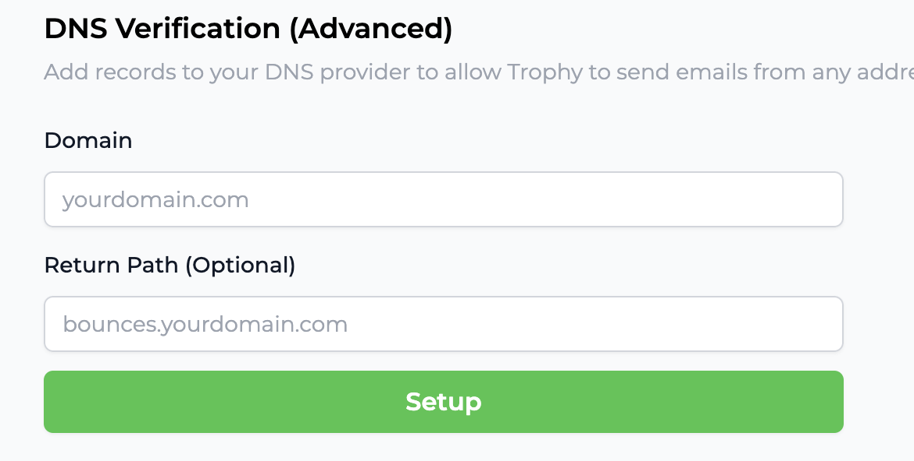
    </Frame>

</Step>

<Step title="Configura tus registros DNS">

    Una vez que hayas ingresado tu dominio de correo, Trophy te proporcionará los detalles de dos nuevos registros DNS que necesitarás agregar a tu proveedor de DNS.

    <Frame>
      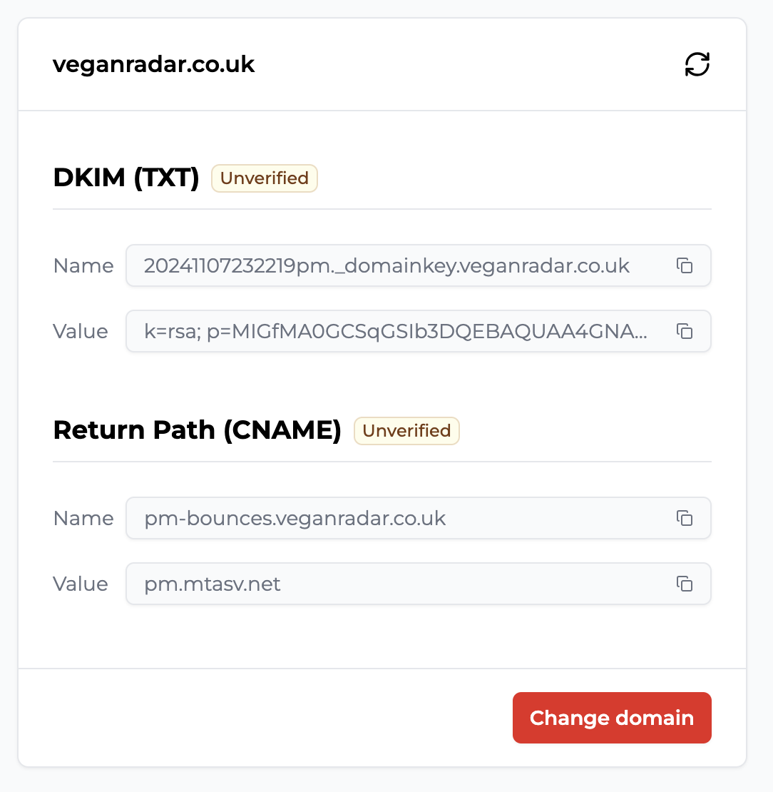
    </Frame>

    - Primero está el registro **DKIM**, que los proveedores de buzones de correo como Google utilizan para verificar la autenticidad de los emails. Introduce el nombre y el valor proporcionados como un nuevo registro **TXT** en tu proveedor de DNS.
    - Segundo está el registro **Return Path**. Este se utiliza para reenviar notificaciones de rebotes de email a tu dominio. Introduce el nombre y el valor proporcionados como un nuevo registro **CNAME** en tu proveedor de DNS.

    Estas son las páginas de los proveedores de DNS más comunes sobre cómo configurar nuevos registros:

    <AccordionGroup>
      <Accordion title='GoDaddy'>
          [Agregar un registro TXT](https://www.godaddy.com/en-uk/help/add-a-txt-record-19232)
          [Agregar un registro CNAME](https://www.godaddy.com/en-uk/help/add-a-cname-record-19236)
      </Accordion>
      <Accordion title='Cloudflare'>
          [Agregar registros DNS](https://developers.cloudflare.com/dns/manage-dns-records/how-to/create-dns-records/#create-dns-records)
      </Accordion>
      <Accordion title="NameCheap">
          [Agregar un registro CNAME](https://www.namecheap.com/support/knowledgebase/article.aspx/9646/2237/how-to-create-a-cname-record-for-your-domain/)
          [Agregar un registro TXT](https://www.namecheap.com/support/knowledgebase/article.aspx/317/2237how-do-i-add-txtspfdkimdmarc-records-for-my-domain/#:~:text=this%20guide%20.-,DKIM%20records,-DKIM%20(DomainKeys%20Identified))
      </Accordion>
    </AccordionGroup>

    <Warning>Nota: Si estás utilizando un proxy como Cloudflare, asegúrate de desactivarlo para estos registros o Trophy no podrá verificarlos correctamente.</Warning>

</Step>

<Step title="Verificar registros DNS">

    Una vez que hayas agregado los dos registros en tu configuración de DNS, pulsa el ícono de actualización y Trophy intentará verificar los registros por ti.

    Normalmente Trophy puede verificar los registros en unos minutos, pero ten en cuenta que los cambios de DNS pueden tardar hasta unas horas en propagarse completamente.

    Si ves la siguiente alerta, puede que los registros aún no se hayan propagado, o puede haber un problema con tu configuración.

    <Frame>
      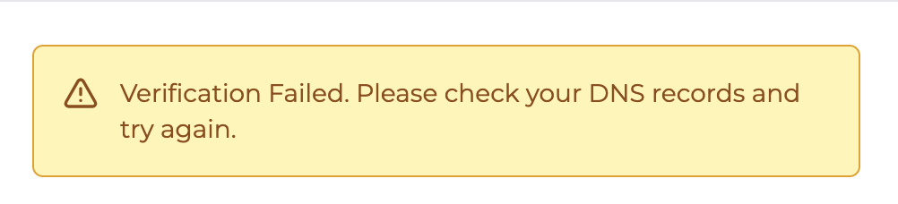
    </Frame>

    Una vez que estés seguro de que todo está configurado correctamente en tu proveedor de DNS, pulsa actualizar y Trophy intentará verificar tus registros DNS una vez más.

    Tan pronto como veas el siguiente mensaje, sabrás que todo está verificado:

    <Frame>
      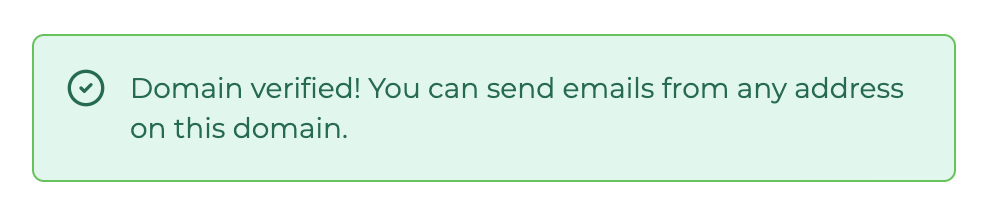
    </Frame>

</Step>

<Step title="Configura tu dirección de envío">

    Una vez que tus registros DNS estén verificados, es momento de elegir la dirección de correo electrónico desde la que deseas enviar emails. Ten en cuenta que ahora que has verificado completamente tu dominio, puedes cambiar esta dirección cuando quieras sin afectar la capacidad de entrega.

    Simplemente ingresa la dirección de correo electrónico desde la que deseas que Trophy envíe, el nombre que se mostrará a los usuarios en la bandeja de entrada cuando reciban emails y una dirección de correo de soporte que puedan usar para contactarte si es necesario:

    <Frame>
      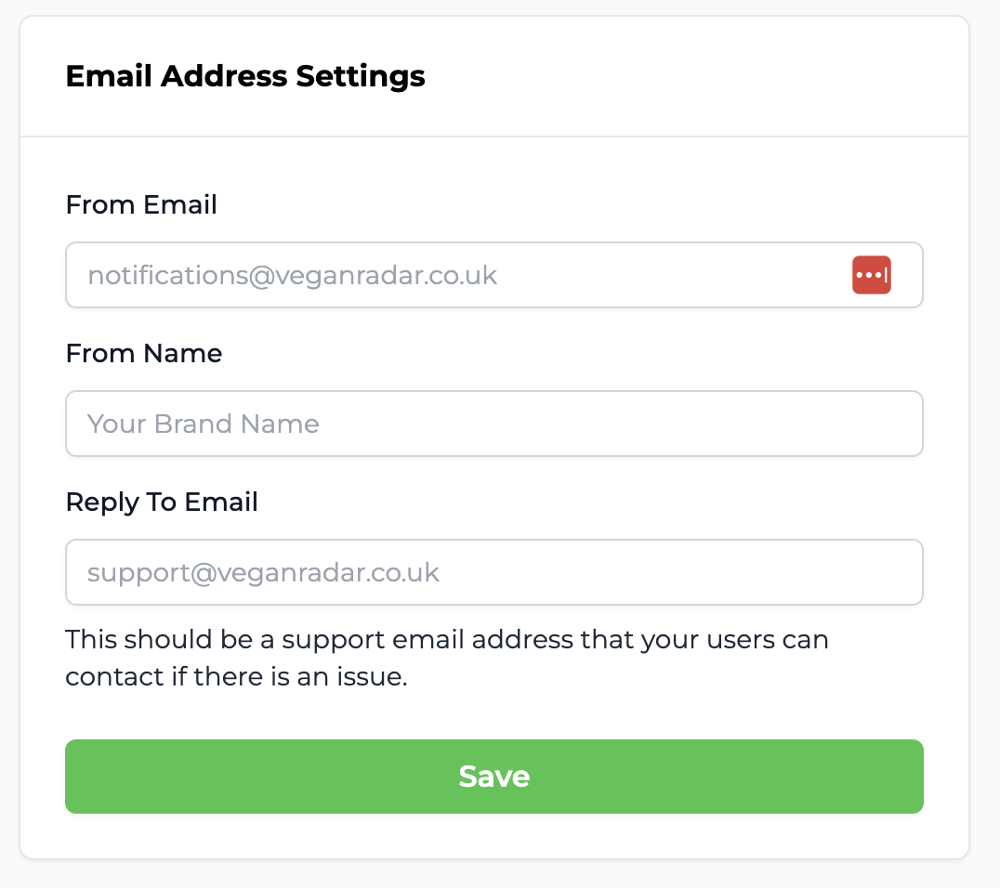
    </Frame>

</Step>

</Steps>

### Disparadores de Email {#email-triggers}

En la página de [configuración de email](https://app.trophy.so/emails/configure), cada tipo de email tiene su propia sección. Agrega plantillas bajo el tipo relevante y activa una para comenzar a enviar.

#### Emails de Resumen {#recap-emails}

Los emails de **Resumen** envían informes de progreso semanales o mensuales a los usuarios. Puedes cambiar la frecuencia de estos emails en la página de [integración](https://app.trophy.so/integration) usando la configuración de **Período de Agregación**.

<Frame>
  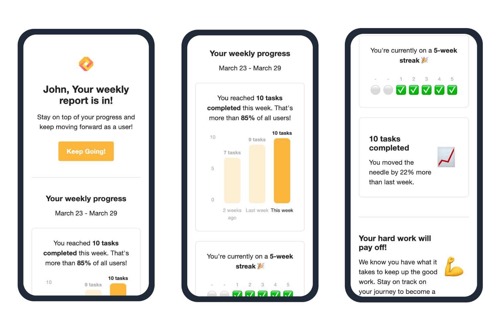
</Frame>

#### Emails de Reactivación {#reactivation-emails}

Los emails de **Reactivación** envían mensajes de recuperación a los usuarios después de que se vuelven inactivos. Estos emails se envían según el siguiente cronograma:

- Después de 3 días de inactividad
- Después de 5 días de inactividad
- Después de 7 días de inactividad
- Después de 14 días de inactividad
- Después de 30 días de inactividad

<Frame>
  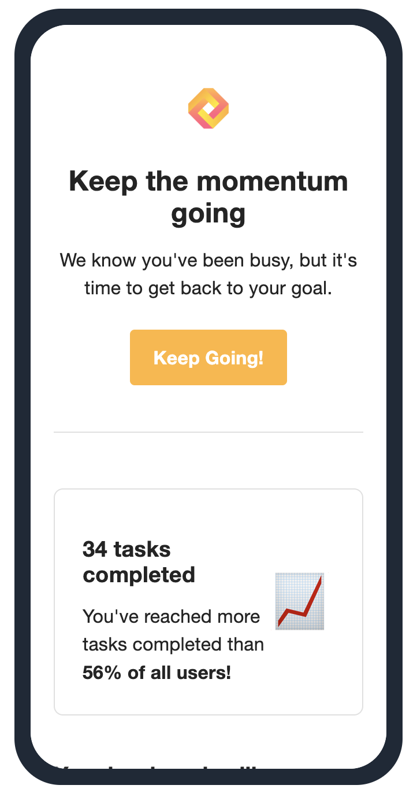
</Frame>

#### Emails de Rachas {#streak-emails}

Los emails de **Rachas** recuerdan a los usuarios extender su racha antes de que expire. Estos emails se envían según la frecuencia de racha que configuraste en la [página de rachas](https://app.trophy.so/streaks):

- Si tu aplicación usa una **racha diaria**, este correo se enviará cuatro horas antes del final del día (en la zona horaria de cada usuario).
- Para **rachas semanales**, se enviará el viernes por la mañana.
- Para **rachas mensuales**, se enviará el día 25 del mes.

<Frame>
  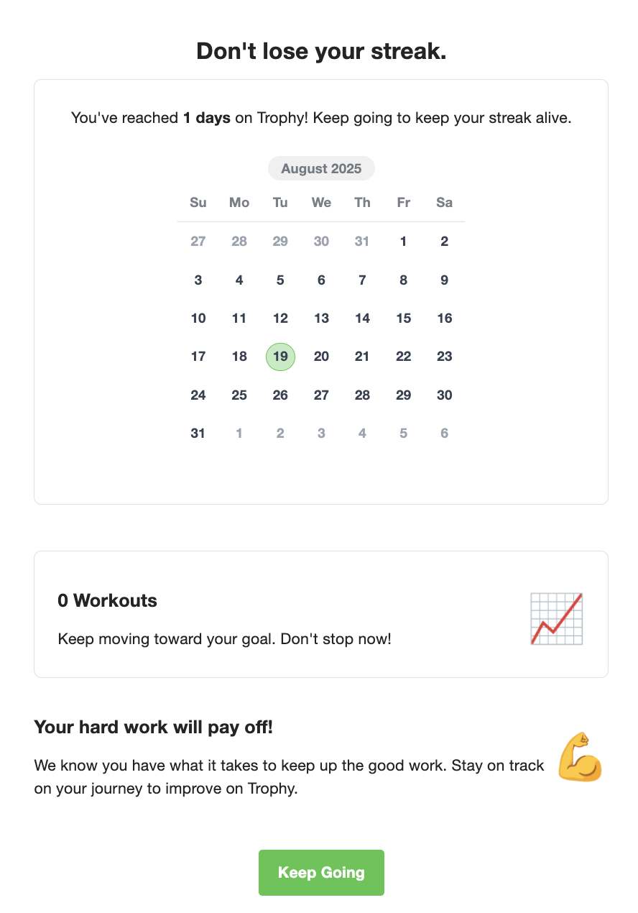
</Frame>

#### Correos de Logros {#achievement-emails}

Los correos de **logros** felicitan a los usuarios cuando completan un [logro](/es/platform/achievements) que has configurado en Trophy. Estos correos se envían entre las 5-9 PM el día en que se completa el logro, o al día siguiente a las 5 PM si ya han pasado las 9 PM cuando el usuario completa el logro.

<Frame>
  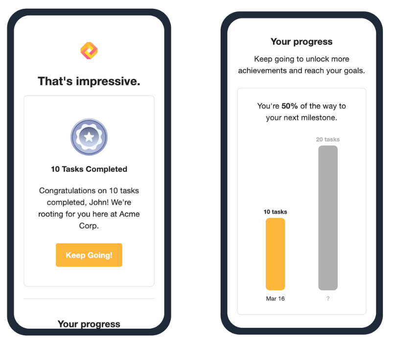
</Frame>

#### Limitar Correos a Tipos Específicos de Usuarios {#limiting-emails-to-specific-types-of-users}

Cada plantilla de correo puede limitarse a usuarios con valores específicos de [atributos de usuario personalizados](/es/platform/users#custom-user-attributes).

Para cada atributo al que desees restringir el correo, haz clic en el icono de más junto al encabezado **Filtros de Usuario** de la plantilla de correo, luego selecciona el atributo e ingresa el valor deseado. Solo los usuarios que tengan **todos** los valores de atributo especificados recibirán correos de esta plantilla.

<Frame>
  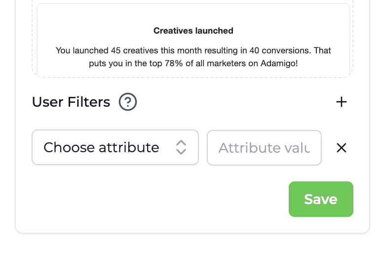
</Frame>

#### Zonas Horarias {#time-zones}

Si especificas una zona horaria para cada usuario mediante [Identificación de Usuarios](/es/platform/users#param-tz), Trophy utilizará esa zona horaria local para programar correos según la lógica especificada anteriormente. Si no proporcionas zonas horarias para los usuarios que identificas, Trophy utilizará por defecto la hora del Este.

## Diseño de Correos {#designing-emails}

Trophy cuenta con un editor de correos basado en bloques completamente funcional que te permite diseñar plantillas, controlando todo el texto del correo y las líneas de asunto. En la página de [correos](https://app.trophy.so/emails/configure), agrega plantillas en cada sección de [tipo de correo](#email-triggers) que desees usar.

<Frame>
  <video
    autoPlay
    muted
    loop
    playsInline
    className="w-full aspect-15/4"
    src="../../assets/platform/emails/designing_emails.mp4"
  ></video>
</Frame>

### Plantillas Predeterminadas {#default-templates}

Por defecto, Trophy proporciona una plantilla para cada [tipo de correo electrónico](#types-of-emails) como punto de partida. Las plantillas predeterminadas no se pueden modificar, pero puedes duplicarlas y personalizarlas como desees.

<Tip>
  También puedes crear plantillas en blanco si prefieres empezar desde cero.
</Tip>

### Crear una Nueva Plantilla {#creating-a-new-template}

Para crear una nueva plantilla de correo electrónico, sigue los pasos a continuación.

<Steps>
  <Step title="Dirígete a la página de Correos Electrónicos">
    Dentro de la página de Correos Electrónicos, encontrarás la pestaña
    [Configurar](https://app.trophy.so/emails/configure), donde cada sección de tipo de correo contiene sus plantillas.
  </Step>
  <Step title="Añadir una plantilla">
    Haz clic en el botón *Añadir Plantilla* dentro de la sección del tipo de correo electrónico para el que deseas crear una plantilla.

    <Frame>
      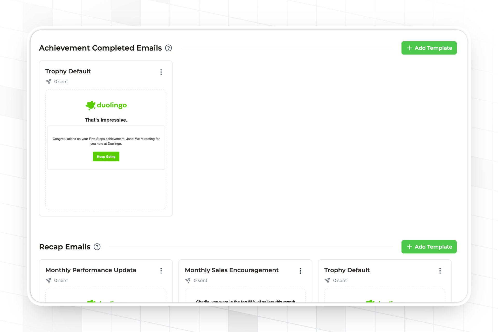
    </Frame>

  </Step>
  <Step title="Diseña tu nueva plantilla">
    Usa el editor basado en bloques para diseñar tu plantilla de correo electrónico.

    <Frame>
      <video
        autoPlay
        muted
        loop
        playsInline
        className="w-full aspect-15/4"
        src="../../assets/platform/emails/designing_emails.mp4"
      ></video>
    </Frame>

  </Step>
</Steps>

### Tipos de Bloques {#block-types}

El constructor de correos electrónicos de Trophy admite varios tipos de bloques diferentes que cumplen distintos propósitos. Todos los componentes básicos que esperarías encontrar en un editor de correo electrónico, como párrafos, encabezados e imágenes, se denominan [Bloques Básicos](#basic-blocks). También existe un conjunto de componentes más potentes, como gráficos y rachas, que aprovechan los datos de actividad del usuario y las funciones de gamificación de Trophy. Estos se denominan [Bloques Inteligentes](#smart-blocks).

<Frame>
  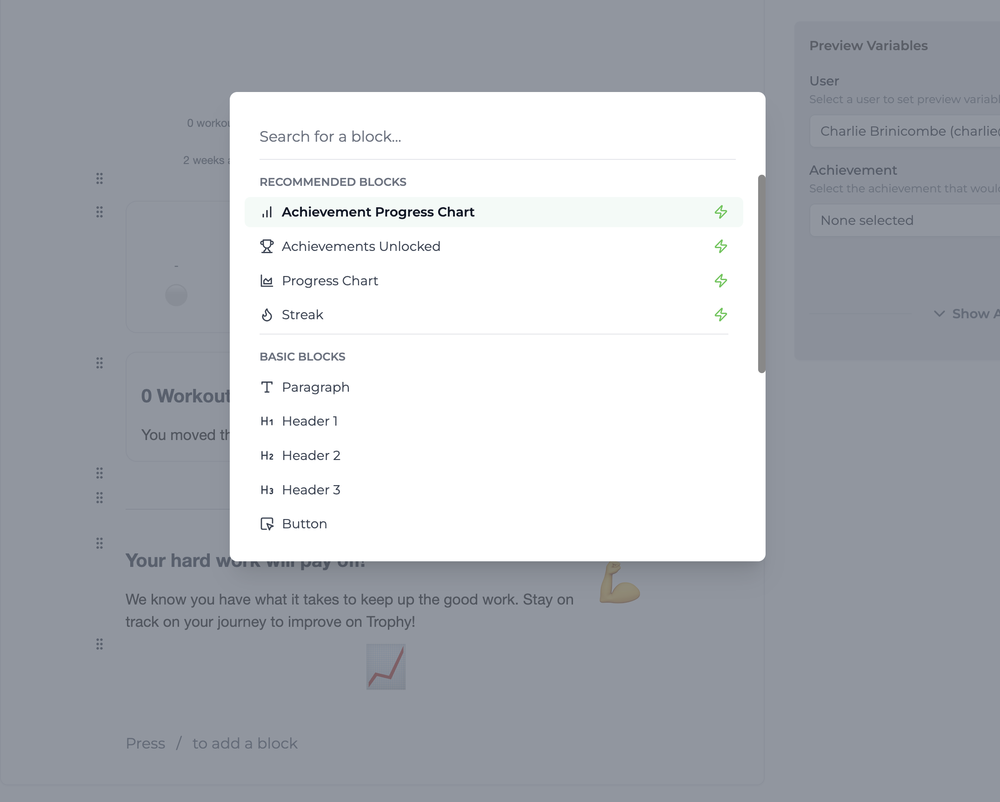
</Frame>

#### Bloques Básicos {#basic-blocks}

Aquí está la lista completa de bloques básicos sin opinión que Trophy admite:

- **Párrafo** - Ideal para fragmentos de texto cortos o largos.
- **H1, H2, H3** - Útil para encabezados de diferentes tamaños.
- **Botón** - Crea una llamada a la acción para que los usuarios interactúen en los correos electrónicos.
- **Tarjeta** - Puede anidar otros bloques, enfocando la atención.
- **Divisor** - Ideal para separar contenido en secciones lógicas.
- **Emoji** - Incluye cualquier emoji compatible, controlando el tamaño.
- **Imagen** - Sube cualquier imagen y Trophy la renderizará en los correos electrónicos.
- **Espaciador** - Ideal para dar espacio a los bloques y que destaquen.
- **Columnas** - Útil para crear diseños de hasta 3 columnas con cualquier contenido.
- **Logo** - Renderizará el logo de tu organización, configurado en la página de [Marca](https://app.trophy.so/branding).

#### Bloques Condicionales {#conditional-blocks}

Trophy también cuenta con un potente sistema de renderizado condicional impulsado por el tipo de bloque _Condicional_.

Al anidar cualquier otro bloque dentro de un bloque condicional y configurar la lógica de condiciones, puedes crear prácticamente cualquier diseño de correo electrónico que mostrará diferentes bloques según la evaluación de las condiciones en el momento del envío.

Si estás familiarizado con los operadores lógicos `if/else`, esto te resultará muy familiar. De lo contrario, aquí tienes un diagrama rápido para explicar cómo funciona.

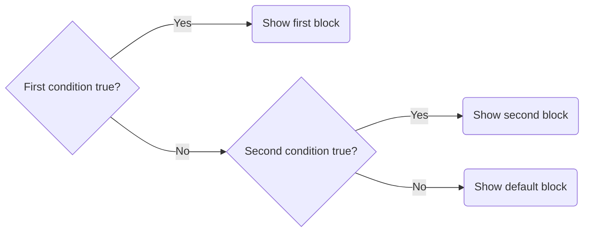
```mermaid
flowchart LR
    B@{ shape: diamond, label: "First condition true?" }
    C@{ shape: rounded, label: "Show first block" }
    D@{ shape: diamond, label: "Second condition true?" }
    E@{ shape: rounded, label: "Show second block" }
    F@{ shape: rounded, label: "Show default block" }

    B-- Yes --->C
    B-- No --->D
    D-- Yes --->E
    D-- No --->F
```

Un caso de uso común para el bloque condicional es mostrar condicionalmente a un usuario su racha (uno de los [Bloques Inteligentes](#smart-blocks) integrados de Trophy) y texto motivacional relacionado con la racha solo si tiene una racha activa. Si el destinatario no tiene una racha en el momento en que se envía el correo electrónico, se muestra un mensaje simple en su lugar.

<Frame>
  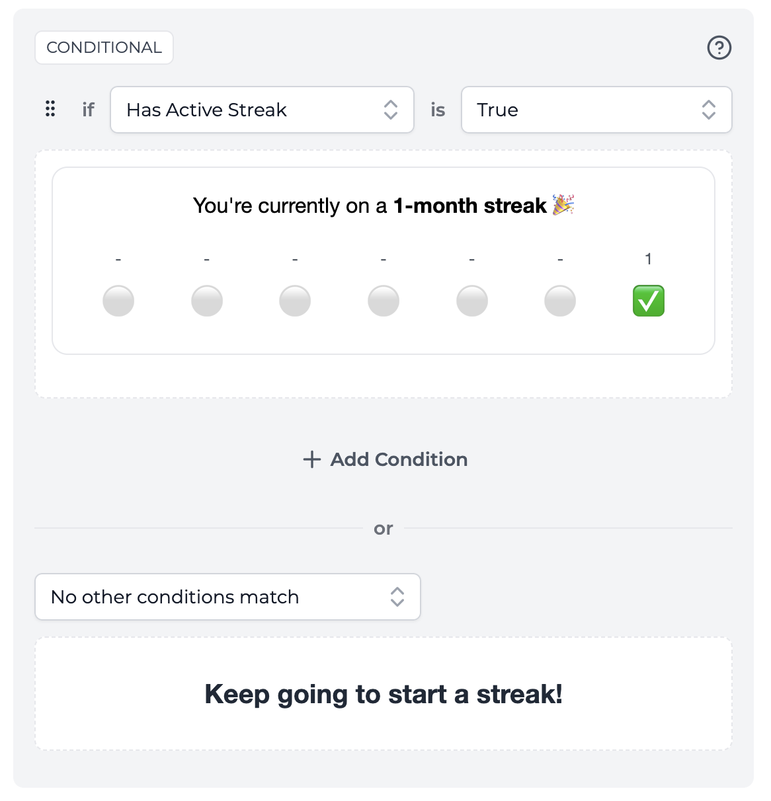
</Frame>

Esto crea un marco poderoso para diseñar correos electrónicos basados en datos de usuario altamente relevantes y personalizados, y puede utilizarse para crear una amplia gama de correos para casos de uso comunes de gamificación.

#### Bloques Inteligentes {#smart-blocks}

Los bloques inteligentes son componentes potentes diseñados para soportar casos de uso comunes de gamificación e integrarse con todas las funcionalidades de Trophy, incluyendo métricas, logros y rachas.

Puedes encontrar todos los bloques inteligentes en la sección _Bloques Recomendados_, y siempre son reconocibles por el icono <Icon icon="zap" />.

Mira a Charlie explicar los bloques inteligentes y cómo funcionan:

<Frame>
  <iframe
    width="560"
    height="315"
    src="https://www.youtube.com/embed/CA7i8Gd5K1s?si=mHkAwVPZYMoBPm15"
    title="YouTube video player"
    frameborder="0"
    allow="accelerometer; autoplay; clipboard-write; encrypted-media; gyroscope; picture-in-picture"
    allowfullscreen
  ></iframe>
</Frame>

Lee más sobre el caso de uso de cada bloque inteligente:

<AccordionGroup>
  <Accordion title="Gráfico de Progreso de Logros" icon="zap">
    El bloque de gráfico de progreso de logros muestra un gráfico con barras para hasta cinco logros de una métrica particular, destacando aquellos que el destinatario ha desbloqueado.
    
    Elige la métrica para mostrar logros usando el selector de métrica.

    <Frame>
      <video
        autoPlay
        muted
        loop
        playsInline
        className="w-full aspect-video"
        src="../../assets/platform/emails/achievement_progress_block.mp4"
      ></video>
    </Frame>

  </Accordion>

{" "}

<Accordion title="Logros Desbloqueados" icon="zap">
  El bloque de logros desbloqueados muestra el logro que el destinatario ha desbloqueado. Esto solo es útil en el contexto de correos de logros desbloqueados. Si el destinatario no ha desbloqueado ningún logro, este bloque no se mostrará en los correos.

Cuando los logros tienen insignias, estas se mostrarán automáticamente, junto con el nombre del logro.

  <Frame>
      <video
        autoPlay
        muted
        loop
        playsInline
        className="w-full aspect-video"
        src="../../assets/platform/emails/achievements_unlocked_block.mp4"
      ></video>
    </Frame>
</Accordion>

{" "}

<Accordion title="Gráfico de Progreso" icon="zap">
  El bloque de gráfico de progreso muestra el progreso del destinatario respecto a una métrica específica durante los últimos 3 [períodos de agregación](#aggregation-period).

  <Frame>
      <video
        autoPlay
        muted
        loop
        playsInline
        className="w-full aspect-video"
        src="../../assets/platform/emails/progress_chart_block.mp4"
      ></video>
    </Frame>
</Accordion>

  <Accordion title="Racha" icon="zap">
    El bloque de racha muestra la racha actual del destinatario según la configuración de rachas de tu cuenta.
    
    Para rachas diarias, se muestra un bloque de calendario que presenta el historial de rachas del último mes. Las rachas semanales y mensuales muestran el historial de los últimos 7 períodos de racha.

    <Frame>
      <video
        autoPlay
        muted
        loop
        playsInline
        className="w-full aspect-video"
        src="../../assets/platform/emails/streak_block.mp4"
      ></video>
    </Frame>

  </Accordion>
</AccordionGroup>

### Variables de Email {#email-variables}

Trophy proporciona un amplio conjunto de variables de email que pueden utilizarse para insertar texto altamente relevante y personalizado en el cuerpo de los correos electrónicos y las líneas de asunto.

Las variables aportan contexto desde tu cuenta de Trophy, los datos de progreso del destinatario y la configuración específica del email a tus plantillas de correo electrónico.

Las variables de email pueden insertarse escribiendo `@` en cualquier bloque que admita texto enriquecido, como encabezados, párrafos y botones, y buscando la variable deseada.

Esto abrirá la ventana del editor de variables donde podrás configurar las variables como se muestra en la demostración a continuación.

<Tip>También puedes usar variables en las líneas de asunto del email.</Tip>

<Frame>
  <video
    autoPlay
    muted
    loop
    playsInline
    className="w-full aspect-video"
    src="../../assets/platform/emails/email_variables_demo.mp4"
  ></video>
</Frame>

Consulta a continuación la lista completa de todas las variables de email compatibles con el generador de correos electrónicos, organizadas por categoría.

<AccordionGroup>
<Accordion title="Usuario">
Variables relacionadas con el destinatario del email.

- **Nombre**: El nombre del destinatario, si está configurado

Además, todos los [atributos personalizados de usuario](/es/platform/users#custom-user-attributes) están disponibles como variables de email.

</Accordion>
<Accordion title="Métricas">
  Variables relacionadas con los datos de eventos rastreados de los destinatarios contra métricas.

Cada métrica de Trophy admite las siguientes variables de correo electrónico:

- **Nombre de la Métrica**: El nombre de la métrica
- **Unidades de la Métrica**: Las unidades de la métrica
- **Total Actual**: La suma de todos los valores de eventos del destinatario hasta la fecha
- **Cambio en Este Periodo**: Cambio absoluto en el total actual del destinatario en el periodo de agregación actual
- **Cambio en Este Periodo (%)**: Cambio porcentual en el total actual del destinatario en el periodo de agregación actual
- **Percentil (Todo el Tiempo)**: El total actual del destinatario comparado con todos los demás usuarios de todo el tiempo
- **Percentil (Este Periodo)**: El total actual del destinatario comparado con todos los demás usuarios en el periodo de agregación actual

Además, los alias dinámicos **Highest** y **Lowest** admiten el mismo conjunto de variables. Al usar estos alias, Trophy seleccionará la métrica donde el destinatario tenga el total actual más alto o más bajo en el momento del envío.

Al usar variables de métricas, también tiene la opción de filtrar los datos que cualquiera de las variables anteriores referencian mediante un [atributo de evento personalizado](/es/platform/events#custom-event-attributes).

    </Accordion>

<Accordion title="Puntos">

De manera similar a las métricas, cada sistema de puntos tiene las siguientes variables que se pueden usar para agregar datos dinámicos al contenido del correo electrónico:

- **Total Actual**: Los puntos totales del destinatario
- **Cambio en Este Periodo**: Cambio absoluto en los puntos totales del destinatario en el periodo de agregación actual
- **Cambio en Este Periodo (%)**: Cambio porcentual en los puntos totales del destinatario en el periodo de agregación actual
- **Percentil (Todo el Tiempo)**: Los puntos totales del destinatario comparados con todos los demás usuarios de todo el tiempo
- **Percentil (Este Periodo)**: Los puntos totales del destinatario comparados con todos los demás usuarios en el periodo de agregación actual

.

</Accordion>
<Accordion title="Logros">
  <Note>
  Estas variables solo son relevantes para [correos de logros](#achievement-emails).
  </Note>

Al configurar una plantilla para usar con correos de logros, están disponibles las siguientes variables:

- **Es el Logro Final**: Si el logro que desencadena el correo es parte de una serie de logros de métricas, esto es verdadero cuando el logro es el último de la serie
- **Porcentaje Hasta el Próximo Logro**: Si el logro que desencadena el correo es parte de una serie de logros de métricas, este es el porcentaje hasta que el usuario desbloquee el siguiente logro de la serie
- **Nombre del Logro**: El nombre del logro que desencadenó el correo
- **Descripción del Logro**: La descripción del logro que desencadenó el correo

.

  </Accordion>
<Accordion title="Racha">
  Variables relacionadas con la racha del destinatario.

- **Tiene Racha Activa**: Verdadero si el destinatario tiene una racha activa al momento de enviar el correo, falso en caso contrario
- **Longitud de la Racha**: La longitud de la racha actual del destinatario
- **Racha Extendida**: Verdadero si la racha del destinatario se extendió, falso en caso contrario
- **Días Desde la Última Extensión**: El número de días desde que el usuario extendió su racha por última vez

.

</Accordion>
<Accordion title="Reactivación">
  <Note>
  Estas variables solo son relevantes para [correos de reactivación](#reactivation-emails).
  </Note>

- **Número de Mensaje**: El número del mensaje en la secuencia de reactivación (1-5)

.

</Accordion>
<Accordion title="Período de Agregación">
    <Note>
  Estas variables solo son relevantes para [correos de resumen](#recap-emails).
  </Note>

- **Rango de Fechas del Período Actual**: Las fechas de inicio y fin del período de agregación actual

.

</Accordion>
</AccordionGroup>

#### Uso Avanzado {#advanced-usage}

Hay un par de opciones adicionales a considerar al usar variables de correo.

**Prefijo y sufijo**

Puedes proporcionar un prefijo y un sufijo para variables de texto como el nombre del destinatario o el nombre de una métrica en particular.

<Frame>
  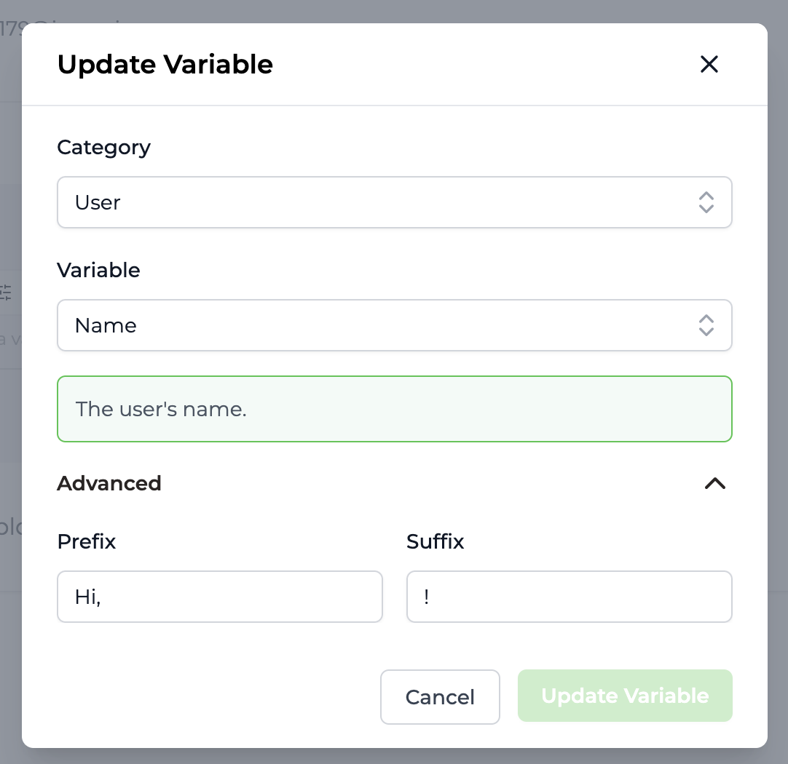
</Frame>

Si el valor de la variable no se renderiza cuando se envía el correo electrónico, Trophy no mostrará la variable ni el prefijo ni el sufijo para mantener los correos limpios.

**Singular y plural**

Al usar variables numéricas como el total de puntos actual del destinatario o el total de métricas, también puedes proporcionar un sufijo singular y plural para acompañarlo.

<Frame>
  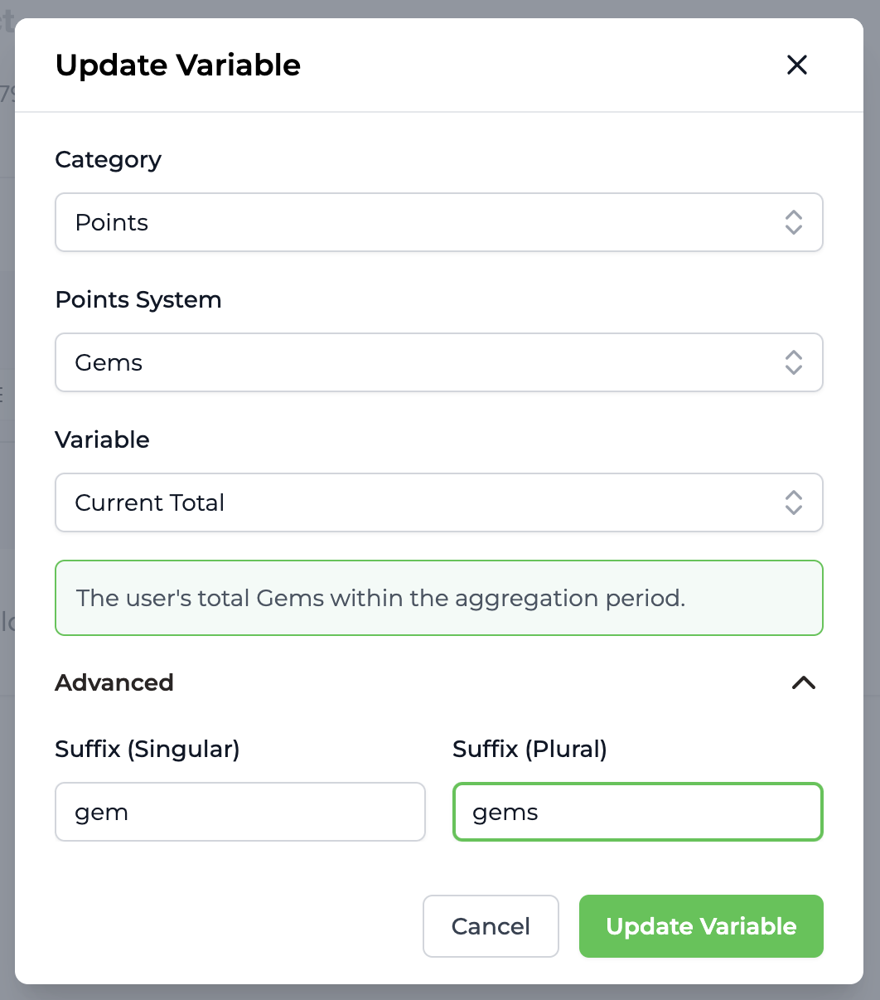
</Frame>

### Variaciones de texto {#text-variations}

Las variaciones se pueden usar para agregar aleatoriedad al texto dentro de los correos electrónicos enviados por Trophy. Esto evita que los correos se vuelvan aburridos y ayuda a mejorar las tasas de apertura y clics.

<Frame>
  <iframe
    width="560"
    height="315"
    src="https://www.youtube.com/embed/mlxMqHsdql8?si=hhizWfwiylgxxEuV"
    title="YouTube video player"
    frameborder="0"
    allow="accelerometer; autoplay; clipboard-write; encrypted-media; gyroscope; picture-in-picture"
    allowfullscreen
  ></iframe>
</Frame>

Cualquier bloque que admita entrada de texto, incluyendo H1, H2, H3 y párrafo, admite variaciones.

<Tip>También puedes usar variaciones para agregar aleatoriedad a las líneas de asunto del correo electrónico.</Tip>

Para crear una variación, haz clic en el botón _Agregar variación_ en cualquier bloque que las admita.

<Frame>
  <video
    autoPlay
    muted
    loop
    playsInline
    className="w-full aspect-video"
    src="../../assets/platform/emails/creating_variations.mp4"
  ></video>
</Frame>

<Note>
  Las variaciones aún no admiten pruebas A/B, pero esto está en nuestra hoja de ruta, así que mantente atento...
</Note>

### Uso del editor {#using-the-editor}

El editor de plantillas de correo electrónico es un lienzo en blanco para diseñar correos electrónicos que se vean genial en la bandeja de entrada. El uso de [Bloques](#block-types) preconfigurados hace que sea realmente fácil crear plantillas de correo electrónico que se adapten a casos de uso comunes de gamificación. Aquí te explicaremos cómo usar mejor el editor para crear correos electrónicos con un aspecto increíble.

#### Agregar bloques {#adding-blocks}

Para agregar un nuevo bloque a una plantilla de correo electrónico, presiona la tecla <Icon icon="square-slash" />. Esto abrirá el cuadro de diálogo de selección de bloques donde puedes elegir el bloque que deseas agregar.

<Frame>
  <video
    autoPlay
    muted
    loop
    playsInline
    className="w-full aspect-video"
    src="../../assets/platform/emails/add_new_block_slash.mp4"
  ></video>
</Frame>

O si deseas agregar un bloque inmediatamente después de otro bloque, usa el menú de bloques.

<Frame>
  <video
    autoPlay
    muted
    loop
    playsInline
    className="w-full aspect-video"
    src="../../assets/platform/emails/add_new_block_by_block_menu.mp4"
  ></video>
</Frame>

#### Organizar bloques {#arranging-blocks}

Los bloques se pueden arrastrar hacia arriba y hacia abajo usando el menú de bloques.

<Frame>
  <video
    autoPlay
    muted
    loop
    playsInline
    className="w-full aspect-video"
    src="../../assets/platform/emails/arranging_blocks.mp4"
  ></video>
</Frame>

#### Formato de texto {#text-formatting}

El editor de correo electrónico ofrece formato de texto enriquecido que incluye negritas, cursivas, [hipervínculos](https://www.youtube.com/watch?v=dQw4w9WgXcQ) y formato `code`.

<Frame>
  <video
    autoPlay
    muted
    loop
    playsInline
    className="w-full aspect-video"
    src="../../assets/platform/emails/rich_text_formatting.mp4"
  ></video>
</Frame>

### Estilo de fuente {#font-style}

En la [página de configuración de correo electrónico](https://app.trophy.so/emails/configure), encontrarás una configuración para cambiar el estilo de fuente utilizado en todos los correos electrónicos.

<Frame>
  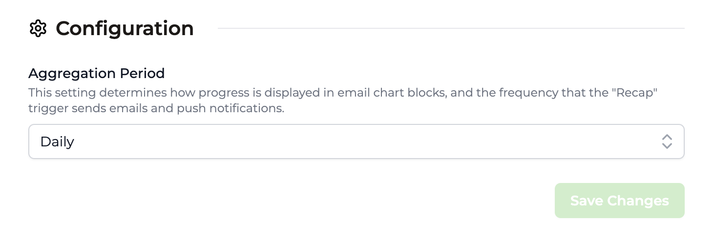
</Frame>

Otros estilos de correo electrónico se extraen de la configuración de [Marca](https://app.trophy.so/branding) de tu cuenta de Trophy.

## Gestión de bajas {#handling-unsubscribes}

Todos los correos electrónicos que Trophy envía incluyen un enlace y mensaje para darse de baja. Esto es importante para mantener el cumplimiento normativo y no es posible ocultarlo.

<Info>
  El mensaje se leerá de la siguiente manera: Está recibiendo este correo electrónico porque está suscrito a informes de progreso y correos de logros. Si ya no desea recibir estos correos electrónicos, puede cancelar la suscripción.
</Info>

Cualquier destinatario que haga clic en este enlace será dirigido a una página con marca que le permite controlar qué notificaciones por correo electrónico recibe.

<Tip>
  Como alternativa al enlace de cancelación de suscripción, también puedes construir un centro
  de preferencias en tu aplicación usando la [API de preferencias de usuario
  ](/es/platform/users#notification-preferences) de Trophy. Esto ofrece a los usuarios un control más granular
  sobre qué tipos de correos electrónicos reciben.
</Tip>

## Analíticas de Email {#email-analytics}

Trophy tiene analíticas integradas para todos los correos electrónicos que envía. Esto incluye:

- Destinatarios (El número total de personas que recibieron el correo electrónico)
- Tasa de apertura (El porcentaje de destinatarios que abrieron el correo electrónico)
- Tasa de clics (El porcentaje de destinatarios que hicieron clic en al menos un enlace en el correo electrónico)
- Tasa de retención (El porcentaje de usuarios que abrieron el correo electrónico y regresaron a usar tu plataforma después de al menos 2 días)

<Frame>
  <video
    autoPlay
    muted
    loop
    playsInline
    className="w-full aspect-video"
    src="../../assets/platform/emails/email_analytics.mp4"
  ></video>
</Frame>

## Preguntas Frecuentes {#frequently-asked-questions}

<AccordionGroup>
<Accordion title="¿Puedo enviar correos electrónicos desde mi propio dominio?">
    ¡Sí! El envío de correos electrónicos desde tu propio dominio está soportado de forma nativa. Sigue los pasos en la sección sobre [envío de correos electrónicos](#sending-emails) para comenzar.
  </Accordion>

{" "}

<Accordion title="¿Limitan la cantidad de correos electrónicos que puedo enviar?">
  No, no limitamos la cantidad de correos electrónicos que puedes enviar. Sin embargo, monitoreamos
  el uso para prevenir abusos.
</Accordion>

</AccordionGroup>

## Obtener Soporte {#get-support}

¿Quieres ponerte en contacto con el equipo de Trophy? Comunícate con nosotros por [correo electrónico](mailto:support@trophy.so). ¡Estamos aquí para ayudarte!
