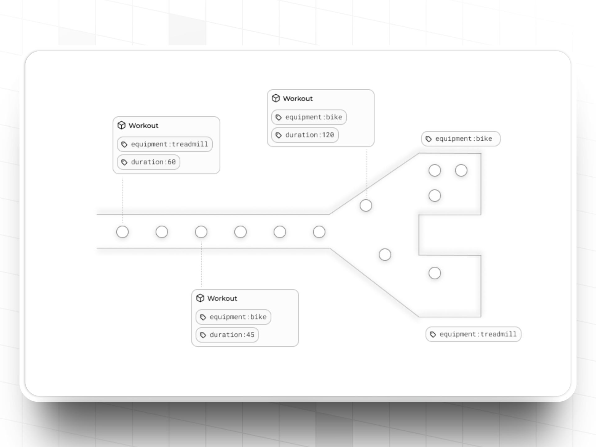

import MetricChangeRequestBlock from "../../snippets/metric-change-request-block.mdx";
import MetricChangeResponseBlock from "../../snippets/metric-change-response-block.mdx";
import IdempotentEventTracking from "../../snippets/idempotent-event-tracking.mdx";

## ¿Qué son los Eventos? {#what-are-events}

Los eventos representan interacciones individuales de usuarios con [Métricas](/es/platform/metrics) en Trophy. Un evento corresponde a una única interacción realizada por un único usuario.

Cuando [integras métricas](#tracking-metric-events) en tu plataforma, estás configurando tu plataforma para transmitir continuamente eventos a tus métricas de Trophy por cada interacción de usuario. Estas interacciones impulsan todas las funciones de gamificación que configures en torno a estas métricas.

## Atributos Clave {#key-attributes}

### Valor del Evento {#event-value}

El `value` de un evento es la cantidad numérica que se añadirá al recuento total de la métrica del usuario como resultado de la interacción de usuario con la que se relaciona.

<Tip>
El valor de un evento puede ser positivo o negativo, y puede ser un número entero o un decimal.
</Tip>

## Atributos Personalizados de Eventos {#custom-event-attributes}

<Note>
  Esta función está disponible en el plan [Pro](/es/account/billing#pro-plan)
</Note>

<Frame>
  
</Frame>

Puedes especificar varios atributos personalizados de eventos para ayudarte a rastrear información adicional relevante para tu caso de uso en los eventos que envías a Trophy.

Por ejemplo, una aplicación de aprendizaje de idiomas podría tener una métrica de 'Preguntas Completadas' y usar un atributo personalizado de evento para almacenar si la respuesta a cada pregunta fue correcta.

De manera similar, una aplicación de fitness podría usar una métrica de 'Ejercicios Completados' y usar un atributo personalizado de evento para almacenar el peso que se usó en cada ejercicio y otro atributo personalizado de evento para almacenar cuánto duró el ejercicio.

El uso de atributos de eventos personalizados de esta manera te permite enriquecer los eventos en Trophy con contexto adicional relevante para tu caso de uso y utilizarlo para potenciar características de gamificación aún más atractivas.

### Creación de Atributos {#creating-attributes}

Para crear un nuevo atributo de evento personalizado, dirígete a la página de métricas en el panel de Trophy y presiona el botón _Agregar Atributo de Evento_.

Asigna un nombre y una clave única al atributo; usarás la clave al hacer referencia al atributo en las llamadas a la API.

<Frame>
  <video
    autoPlay
    muted
    loop
    playsInline
    className="w-full aspect-15/4"
    src="../../assets/platform/events/create_custom_event_attribute.mp4"
  ></video>
</Frame>

### Configuración de Atributos {#setting-attributes}

Para establecer el valor de un atributo personalizado en un evento, pasa su valor en el objeto `attributes` en tu código de seguimiento de métricas.

<Warning>
  Trophy solo establecerá valores de atributos que hayan sido creados primero
  en el panel. Hacemos esto para ayudarte a mantener un conjunto limpio de atributos y
  prevenir sobrescrituras accidentales.

Si recibes un error similar al siguiente, es posible que hayas escrito incorrectamente la clave del atributo en la solicitud, o que necesites crear primero el atributo en el panel de Trophy:

```json
{
  "error": "Invalid attribute keys: device. Please ensure all attribute keys match those set up at https://app.trophy.so/metrics."
}
```

</Warning>

Aquí hay un ejemplo de una carga útil de evento donde se establecen los valores de dos atributos, `device` e `duration`:

```json {7-10}
{
  "user": {
    "id": "18",
    "tz": "Europe/London"
  },
  "value": 25,
  "attributes": {
    "device": "ios",
    "duration": "120"
  }
}
```

### Uso de Atributos {#using-attributes}

Los atributos de eventos personalizados se pueden utilizar para potenciar activadores más avanzados para logros y puntos, y pueden usarse en plantillas de correo electrónico para personalizar el texto y controlar los datos mostrados en gráficos.

#### Activadores de Características Avanzadas {#advanced-feature-triggers}

Los atributos de eventos personalizados se pueden utilizar para configurar activadores de logros o puntos que solo rastreen eventos con valores de atributos específicos. Sigue los enlaces a las páginas relevantes a continuación para obtener más información.

<CardGroup>
  <Card
    title="Activadores de Logros"
    icon="trophy"
    href="/es/platform/achievements#creating-achievements"
  >
    Configura logros que solo se pueden desbloquear mediante eventos con ciertos
    valores de atributos.
  </Card>
  <Card
    title="Activadores de Puntos"
    icon="sparkle"
    href="/es/platform/points#points-triggers"
  >
    Configura activadores de puntos para otorgar puntos únicamente desde eventos con
    valores de atributos específicos.
  </Card>
</CardGroup>

#### Personalización de correos electrónicos {#email-customization}

Si utilizas cualquier [correo electrónico](/es/platform/emails) de Trophy, los atributos de eventos se pueden usar para personalizar los datos mostrados en ciertos bloques de correo.

En primer lugar, al usar variables basadas en métricas en el contenido del correo, puedes utilizar atributos de eventos para controlar con mayor precisión qué datos referencia la variable.

Por ejemplo, aquí hay un caso donde usamos una variable de correo para informar a los usuarios sobre el número total de entrenamientos que han realizado en diferentes equipos de gimnasio, utilizando una métrica 'Workouts' y un atributo 'Equipment':

<Frame>
  <video
    autoPlay
    muted
    loop
    playsInline
    className="w-full aspect-15/4"
    src="../../assets/platform/events/using_attributes_in_emails.mp4"
  ></video>
</Frame>

En segundo lugar, aquí hay un ejemplo donde agregamos un gráfico a un correo que muestra a los usuarios cuántos entrenamientos han realizado en una bicicleta a lo largo del tiempo:

<Frame>
  <video
    autoPlay
    muted
    loop
    playsInline
    className="w-full aspect-15/4"
    src="../../assets/platform/events/using_attributes_in_email_charts.mp4"
  ></video>
</Frame>

Existen un gran número de posibilidades aquí, ¡así que sé creativo!

## Seguimiento de eventos de Métricas {#tracking-metric-events}

Cada métrica tiene un `key` único que puedes usar para referenciar y hacer seguimiento de eventos en tu código. Puedes encontrar el `key` en la página de configuración de la métrica.

Para empezar a hacer seguimiento de las interacciones de los usuarios como eventos en tus Métricas de Trophy, utiliza la [API de Métricas](/es/api-reference/endpoints/metrics/send-a-metric-change-event) o una de nuestras [bibliotecas cliente](/es/api-reference/client-libraries) con tipado seguro, compatibles con la mayoría de los lenguajes de programación principales.

Aquí hay un ejemplo donde una plataforma de estudio ficticia está utilizando una métrica para rastrear el número de tarjetas de memoria volteadas por cada estudiante. Cada vez que un estudiante interactúa, la plataforma envía un evento a Trophy indicándole cuántas tarjetas vieron:

<MetricChangeRequestBlock />

Cualquier [Logros](/es/platform/achievements), [Rachas](/es/platform/streaks), [Puntos](/es/platform/points) o [Clasificaciones](/es/platform/leaderboards) que se hayan configurado para esta métrica se procesarán automáticamente, y la respuesta contendrá cualquier actualización del progreso del usuario que sea resultado directo del evento ocurrido:

<MetricChangeResponseBlock />

En este ejemplo, la respuesta incluye lo siguiente:

- Los logros recién desbloqueados del usuario como resultado del evento
- La racha más reciente del usuario como resultado del evento
- Los puntos más recientes del usuario para cada sistema de puntos que cambió como resultado del evento
- Los datos de clasificación más recientes del usuario para cada clasificación que cambió como resultado del evento

Con un poco de código personalizado, estos datos de respuesta se pueden utilizar para impulsar cualquier experiencia dentro de la aplicación que desees, incluyendo:

- Activar notificaciones dentro de la aplicación
- Efectos de sonido
- Animaciones

Mira a Charlie integrar el seguimiento de métricas en una aplicación simple de NextJS usando el SDK de [Node.js](/es/api-reference/client-libraries) de Trophy:

<Frame>
  <iframe
    width="560"
    height="315"
    src="https://www.youtube.com/embed/ZxbOylQ6kQU?si=2C8IvN0trlIzLeO7"
    title="YouTube video player"
    frameborder="0"
    allow="accelerometer; autoplay; clipboard-write; encrypted-media; gyroscope; picture-in-picture; web-share"
    referrerpolicy="strict-origin-when-cross-origin"
    allowfullscreen
  ></iframe>
</Frame>

### Eventos Idempotentes {#idempotent-events}

Trophy admite garantizar la unicidad de los eventos para que los usuarios no puedan aumentar una métrica realizando la misma acción una y otra vez.

Por ejemplo, una aplicación de aprendizaje de idiomas podría especificar que los usuarios solo pueden aumentar la métrica `lessons-completed` en 1 por cada lección única completada, por lo que si completan la misma lección dos veces, solo cuenta la primera.

<IdempotentEventTracking />

Esto ayuda a mantener tu código libre de lógica que verifica si los usuarios han completado acciones previamente, y en su lugar puedes confiar en que Trophy mantendrá las restricciones que necesitas.

Para usar eventos idempotentes, utiliza el encabezado `Idempotency-Key` en la [API de eventos de métricas](/es/api-reference/endpoints/metrics/send-a-metric-change-event).

[Más información sobre idempotencia](/es/api-reference/idempotency).

## Obtener Soporte {#get-support}

¿Quieres ponerte en contacto con el equipo de Trophy? Contáctanos por [correo electrónico](mailto:support@trophy.so). ¡Estamos aquí para ayudarte!
