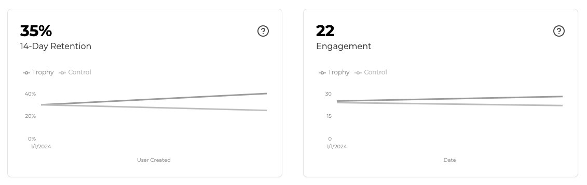
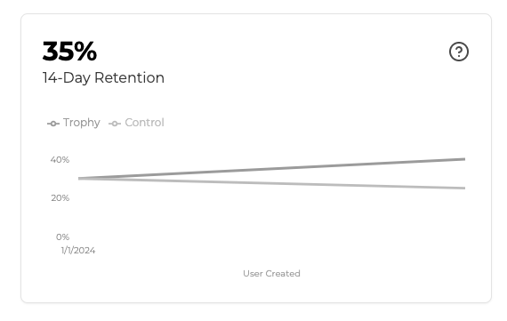

import ControlFlagBlock from "../../snippets/control-flag-block.mdx";

Trophy proporciona un conjunto básico de primitivas para ayudarte a implementar experiencias de gamificación más rápido. Pero la gamificación no es algo que puedas configurar y olvidar.

Una parte clave de gestionar una plataforma gamificada es la experimentación: ajustar y optimizar la experiencia del usuario para asegurar que los usuarios sigan regresando.

Normalmente, tendrías que construir estas herramientas tú mismo, pero con Trophy obtienes un stack de experimentación simple listo para usar.

<Tip>
  Tenemos planes para ampliar las capacidades de experimentación de Trophy en el futuro para
  soportar pruebas A/B más granulares de tus funcionalidades de gamificación.
</Tip>

## Ratio de control {#control-ratio}

Trophy tiene una capacidad integrada para realizar pruebas A/B automáticas de las funcionalidades de gamificación usando un ratio de control.

Encontrado en la [página de integración](https://app.trophy.so/integration/configure) del panel de Trophy, el ratio de control ajusta el porcentaje de usuarios que se asignan al grupo de 'control' frente al grupo 'experimental'.

<Frame>
  <video
    autoPlay
    muted
    loop
    playsInline
    className="w-full aspect-15/4"
    src="../../assets/platform/experimentation/control_ratio.mp4"
  ></video>
</Frame>

Trophy devuelve el atributo `control` como `true` o `false` en la mayoría de las APIs relacionadas con datos de usuario, lo que te permite mostrar condicionalmente las funcionalidades de gamificación a los usuarios que están en el grupo experimental.

Si planeas medir el impacto general de las funcionalidades de gamificación, asegúrate de mostrar esas funcionalidades solo a los usuarios con `control` configurado como `false`.

<ControlFlagBlock />

<Note>
  Trophy tampoco envía [Emails](/es/features/emails) ni [Notificaciones Push](/es/features/push-notifications) a usuarios que están en el grupo de
  control.
</Note>

Los paneles de Métricas comparan la retención y el engagement de usuarios entre los grupos de control y experimentales, lo que te permite medir el impacto de las funciones que desarrollas con Trophy y ajustar las mecánicas cuando sea necesario.

<Frame>
  
</Frame>

## ¿Qué es la retención? {#what-is-retention}

La retención de usuarios es el porcentaje de usuarios que siguen usando tu producto después de un período determinado.

Los marcos temporales comunes incluyen retención a 7, 14 y 30 días, donde los períodos más cortos proporcionan información sobre la experiencia inicial del usuario y los más largos ofrecen perspectivas sobre el ajuste producto-mercado a largo plazo.

### Analítica de retención {#retention-analytics}

Trophy incluye un gráfico de retención para cada métrica en su panel de métricas y un gráfico agregado de retención de usuarios en el panel principal.

<Frame>
  
</Frame>

La [página de integración](https://app.trophy.so/integration/configure) te permite controlar el marco temporal en el que deseas medir la retención mediante la configuración 'Ventana de activación de nuevos usuarios'.

<Frame>
  
</Frame>

## ¿Qué es el Engagement? {#what-is-engagement}

El engagement de usuarios en Trophy se refiere al nivel promedio de actividad que tus usuarios muestran al usar tu producto.

Como Trophy rastrea las interacciones de usuarios a través de [Métricas](/es/features/metrics), puede ofrecerte información sobre qué tan activos están tus usuarios con respecto a cada una y en conjunto.

El engagement de usuarios en Trophy es el valor promedio total de eventos de métricas por usuario activo diario. La fórmula es:

```
sum of all metric event values in a day / number of users active that day
```
  
### Analíticas de Engagement {#engagement-analytics}

Los dashboards de Trophy para cada métrica muestran gráficos de engagement para esa métrica, y el dashboard principal de Trophy presenta el engagement de usuarios de forma agregada.

<Frame>
  
</Frame>

Trophy también muestra gráficos que presentan el engagement de usuarios durante sus primeros días después de registrarse en tu producto.

<Frame>
  
</Frame>

Nos referimos a esto como 'engagement temprano' y es el engagement de usuarios medido por Trophy únicamente para usuarios dentro del período de tiempo establecido en la configuración 'Ventana de Activación de Nuevos Usuarios' en la [página de integración](https://app.trophy.so/integration/configure).

<Frame>
  
</Frame>

Este es un gráfico útil para comprender el engagement de usuarios durante sus primeros días con tu producto y para identificar dónde pueden estar ocurriendo obstáculos en la activación inicial de usuarios.

## Obtener soporte {#get-support}

¿Quieres ponerte en contacto con el equipo de Trophy? Contáctanos por [correo electrónico](mailto:support@trophy.so). ¡Estamos aquí para ayudarte!