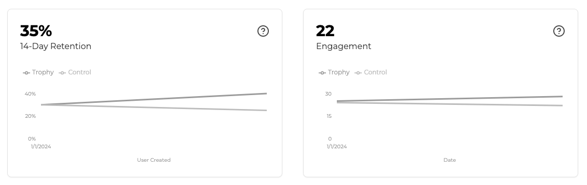
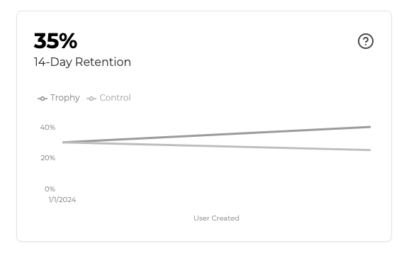
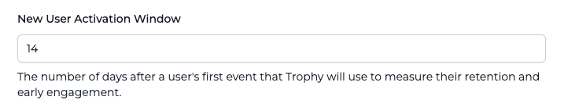
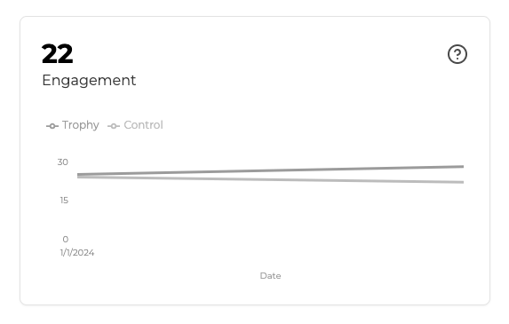
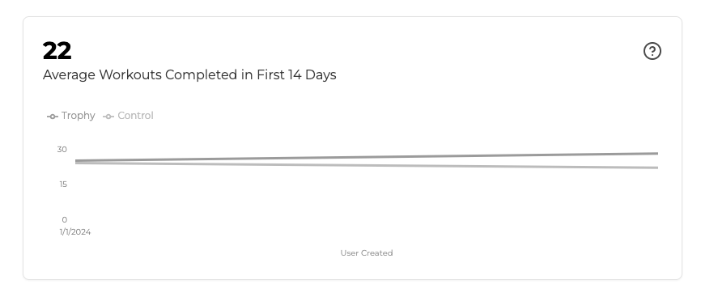

import ControlFlagBlock from "../../snippets/control-flag-block.mdx";

Trophy proporciona un conjunto básico de primitivas para ayudarte a implementar experiencias de gamificación más rápido. Pero la gamificación no es algo que puedas configurar y olvidar.

Una parte clave de gestionar una plataforma gamificada es la experimentación: ajustar y optimizar la experiencia del usuario para asegurar que los usuarios sigan regresando.

Normalmente, tendrías que construir estas herramientas tú mismo, pero con Trophy obtienes un stack de experimentación simple listo para usar.

<Tip>
  Tenemos planes para extender las capacidades de experimentación de Trophy en el futuro para
  soportar pruebas A/B más granulares de tus funciones de gamificación.
</Tip>

## Ratio de Control {#control-ratio}

Trophy tiene una capacidad integrada para realizar pruebas A/B automáticas de funciones de gamificación usando un ratio de control.

Disponible en la [página de integración](https://app.trophy.so/integration/configure) del panel de Trophy, el ratio de control ajusta el porcentaje de usuarios que se asignan al grupo de 'control' frente al grupo 'experimental'.

También puedes leer y actualizar `controlRatio` y `userActivationWindow` con la [API de administración de configuración de organización](/es/admin-api/endpoints/settings/update-organization-settings).

<Frame>
  <video
    autoPlay
    muted
    loop
    playsInline
    className="w-full aspect-15/4"
    src="../../assets/platform/experimentation/control_ratio.mp4"
  ></video>
</Frame>

Trophy devuelve el atributo `control` como `true` o `false` en la mayoría de las APIs relacionadas con datos de usuario, permitiéndote mostrar condicionalmente funciones de gamificación a usuarios que están en el grupo experimental.

Si planeas medir el impacto general de las funciones de gamificación, asegúrate de mostrar esas funciones solo a usuarios con `control` establecido en `false`.

<ControlFlagBlock />

<Note>
  Trophy tampoco envía ningún [Email](/es/features/emails) ni [Notificación Push](/es/features/push-notifications) a los usuarios que están en el grupo de control.
</Note>

Los dashboards de analíticas luego comparan la retención y el engagement de usuarios entre los usuarios en los grupos de control y experimental, permitiéndote medir el impacto de las funcionalidades que construyes con Trophy y ajustar las mecánicas cuando sea necesario.

<Frame>
  
</Frame>

Tanto la retención como el engagement de usuarios son métricas importantes a utilizar al medir el impacto de los cambios en la experiencia del usuario. Las siguientes secciones explican qué significa cada una y cómo se relacionan con las funcionalidades que construyes con Trophy.

## ¿Qué es la retención? {#what-is-retention}

La retención de usuarios es el porcentaje de usuarios que siguen utilizando tu producto después de un período determinado.

Los marcos de tiempo comunes incluyen retención a 7 días, 14 días y 30 días, donde los marcos de tiempo más cortos proporcionan información sobre la experiencia inicial del usuario y los marcos de tiempo más largos ofrecen información sobre el ajuste producto-mercado a largo plazo.

### Analíticas de retención {#retention-analytics}

Trophy incluye un gráfico de retención para cada métrica en su dashboard de métricas y un gráfico agregado de retención de usuarios en el dashboard principal.

<Frame>
  
</Frame>

La [página de integración](https://app.trophy.so/integration/configure) te permite controlar el marco de tiempo sobre el cual deseas medir la retención a través de la configuración 'Ventana de activación de nuevos usuarios'.

<Frame>
  
</Frame>

## ¿Qué es el engagement? {#what-is-engagement}

El engagement de usuarios en Trophy se refiere al nivel promedio de actividad que tus usuarios muestran al utilizar tu producto.

Dado que Trophy rastrea las interacciones de usuarios a través de [Métricas](/es/features/metrics), puede brindarte información sobre qué tan activos están tus usuarios con respecto a cada una y en agregado.

La participación de usuario en Trophy es el valor promedio total de eventos métricos por usuario activo diario. La fórmula es:

```
sum of all metric event values in a day / number of users active that day
```

### Analíticas de participación {#engagement-analytics}

Los paneles de Trophy para cada métrica muestran gráficos de participación para esa métrica, y el panel principal de Trophy presenta la participación de usuario de forma agregada.

<Frame>
  
</Frame>

Trophy también muestra gráficos que presentan la participación de usuario dentro de los primeros días después de que los usuarios se registran en tu producto.

<Frame>
  
</Frame>

Nos referimos a esto como 'participación temprana' y es la participación de usuario medida por Trophy solo para usuarios dentro del período de tiempo establecido en la configuración 'Ventana de activación de nuevos usuarios' en la [página de integración](https://app.trophy.so/integration/configure).

<Frame>
  
</Frame>

Este es un gráfico útil para comprender la participación de los usuarios dentro de sus primeros días con tu producto y para identificar dónde pueden estar ocurriendo obstáculos para la activación inicial del usuario.

## Obtener soporte {#get-support}

¿Quieres ponerte en contacto con el equipo de Trophy? Contáctanos por [correo electrónico](mailto:support@trophy.so). ¡Estamos aquí para ayudarte!