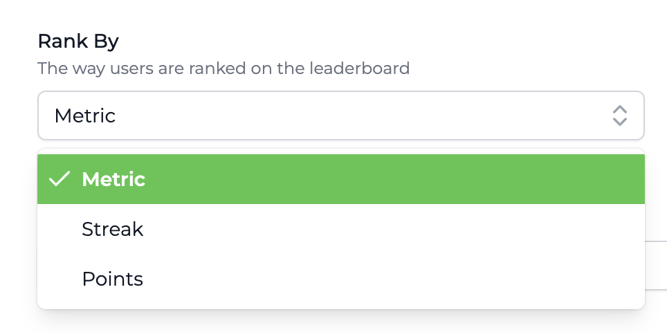
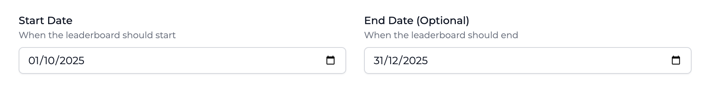
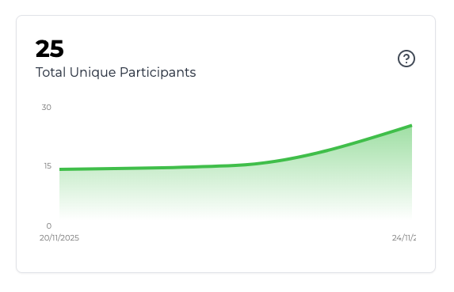
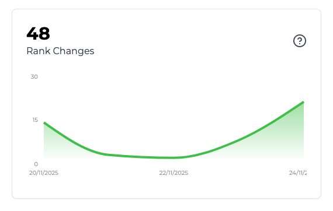
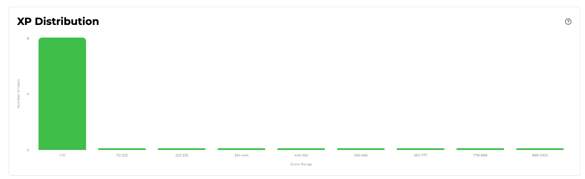

import LeaderboardSingleAttributeRequest from "../../snippets/leaderboard-rankings-request-single-attribute.mdx";
import LeaderboardMultiAttributeRequest from "../../snippets/leaderboard-rankings-request-multiple-attributes.mdx";

## ¿Qué son las Clasificaciones? {#what-are-leaderboards}

Las clasificaciones son competiciones sociales entre usuarios de tu aplicación. Utiliza las clasificaciones para aumentar la participación y fomentar la interacción social.

<Frame>
  
</Frame>

## Tipos de Clasificaciones {#types-of-leaderboards}

En esta sección describimos los diferentes tipos de clasificaciones compatibles con Trophy y cuándo usar cada una.

### Clasificaciones Perpetuas {#perpetual-leaderboards}

Las clasificaciones perpetuas nunca se reinician. Una vez iniciadas, rastrean y clasifican continuamente el progreso de los usuarios a lo largo del tiempo para siempre, o hasta la [fecha de finalización](#end-dates) configurada.

Utiliza clasificaciones perpetuas cuando quieras crear clasificaciones de actividad de usuarios de todos los tiempos.

### Clasificaciones Repetitivas {#repeating-leaderboards}

Las clasificaciones repetitivas se pueden configurar para reiniciarse después de cualquier número arbitrario de días, meses o años.

En Trophy, cada instancia de una clasificación repetitiva se denomina **'ejecución'**. Por ejemplo, una clasificación mensual tendría 12 ejecuciones en un año, pero una clasificación diaria tendría `n` ejecuciones en un mes donde `n` es el número de días en un mes determinado.

Trophy rastrea las clasificaciones en cada ejecución de una clasificación repetitiva de forma individual y proporciona [APIs](/es/api-reference/endpoints/leaderboards/get-leaderboard) para obtener datos de clasificación de ejecuciones históricas.

<Tip>
  Recomendamos usar clasificaciones repetitivas en lugar de perpetuas siempre que sea posible, ya que las clasificaciones repetitivas brindan a los nuevos usuarios las mismas oportunidades de competir con los usuarios existentes, lo que ayuda a evitar que las clasificaciones se vuelvan obsoletas.
</Tip>

#### Gestión de zonas horarias {#handling-time-zones}

Si has rastreado las [zonas horarias](/es/platform/users#param-tz) de tus usuarios con Trophy, estas se utilizarán para garantizar que cada usuario tenga las mismas oportunidades de ganar sin importar dónde se encuentre en el mundo.

En la práctica, esto significa que las clasificaciones se finalizan y los ganadores se eligen aproximadamente 12 horas después de que terminen naturalmente en UTC, lo que permite a los usuarios de todas las zonas horarias hacer su último esfuerzo.

#### Consejos para clasificaciones semanales {#tips-for-weekly-leaderboards}

Para crear una clasificación semanal, configura una [clasificación recurrente](#repeating-leaderboards) con un cronograma de 7 días y establece la fecha de inicio en el próximo primer día de la semana.

Mientras esperas a que llegue la fecha de inicio, la clasificación estará en estado `scheduled` y se activará automáticamente en la fecha de inicio.

## Lógica de clasificación {#ranking-logic}

Las clasificaciones en Trophy son configurables para ordenar a los participantes de varias formas diferentes y admitir casos de uso comunes.

### Métodos de clasificación {#ranking-methods}

El método de clasificación de una clasificación determina en qué dimensión se ordenarán los participantes.

<Frame>
  
</Frame>

#### Clasificaciones por métricas {#metric-rankings}

Las clasificaciones de métricas están vinculadas a una [Métrica](/es/platform/metrics) existente de Trophy y clasifican a los usuarios según su valor total de métrica.

Utiliza clasificaciones de métricas si solo deseas clasificar a los usuarios según una única interacción.

#### Clasificaciones por puntos {#points-rankings}

Las clasificaciones de puntos están vinculadas a un [Sistema de Puntos](/es/platform/points) existente de Trophy y clasifican automáticamente a los usuarios según su total de puntos.

Utiliza una clasificación de puntos si deseas clasificar a los usuarios según una combinación de métricas, logros u otras características de Trophy.

#### Clasificaciones por Racha {#streak-rankings}

Las clasificaciones de racha ordenan a los usuarios según la longitud de su racha actual.

<Note>
  Las clasificaciones de racha solo pueden ser [perpetuas](#perpetual-leaderboards).
</Note>

### Desglose de Clasificaciones {#ranking-breakdowns}

Si tienes una gran base de usuarios, es una buena práctica dividir a los participantes de la clasificación en grupos más pequeños y socialmente conectados. Esto suele generar mayor participación que el uso de clasificaciones globales.

Las clasificaciones en Trophy pueden configurarse para agrupar a los usuarios en grupos más pequeños según un [atributo de usuario personalizado](/es/platform/users#custom-user-attributes) específico.

<Tip>
  Al usar desgloses de clasificación, los [límites de participantes](#participant-limits)
  se aplican a nivel de grupo, no de forma general.
</Tip>

Para configurar un desglose de clasificación, dirígete a la página de configuración de la clasificación y crea o selecciona tu atributo de usuario en el campo 'Atributo de Desglose'.

Trophy comenzará automáticamente a agrupar a los usuarios en clasificaciones más pequeñas según los valores de tu atributo elegido para cada usuario.

<Frame>
  <video
    autoPlay
    muted
    loop
    playsInline
    className="w-full aspect-15/4"
    src="../../assets/platform/leaderboards/breakdowns.mp4"
  ></video>
</Frame>

Para obtener las clasificaciones de un grupo particular de usuarios con un valor de atributo específico, utiliza la [API de clasificaciones](/es/api-reference/endpoints/leaderboards/get-leaderboard), especificando el valor del atributo en el parámetro `userAttributes` de la siguiente manera:

<LeaderboardSingleAttributeRequest />

Si deseas obtener las clasificaciones de un grupo particular de usuarios con una combinación específica de atributos de usuario, crea un nuevo atributo para rastrear la combinación y úsalo como tu atributo de desglose de la siguiente manera:

<LeaderboardMultiAttributeRequest />

## Fechas de Inicio y Fin {#start-end-dates}

Utiliza las fechas de inicio y fin para controlar el período durante el cual las clasificaciones están activamente ordenando a los usuarios.

<Frame>
  
</Frame>

### Fechas de Inicio {#start-dates}

Las clasificaciones en Trophy se pueden configurar para que comiencen en una fecha futura de tu elección. Esto suele ser útil para permitir tiempo para cambios o ajustes de último momento antes de que las clasificaciones empiecen a rankear usuarios.

Las clasificaciones con una fecha de inicio en el futuro están programadas y se activan automáticamente en la fecha de inicio que elijas.

### Fechas de Finalización {#end-dates}

Las clasificaciones en Trophy pueden tener fechas de finalización. Si estableces una fecha de finalización en una clasificación, después de esa fecha entrará en estado `finished` y los rankings se finalizarán y se elegirán los ganadores.

<Note>
  Debido a diferencias en las [zonas horarias](#handling-time-zones), las clasificaciones pueden
  finalizarse hasta 12 horas después de la fecha de finalización en UTC para permitir que todos los usuarios alcancen
  la fecha de finalización según su reloj local.
</Note>

## Límites de Participantes {#participant-limits}

Las clasificaciones en Trophy tienen un número máximo de participantes de **1,000**. Sin embargo, una clasificación puede configurarse para tener cualquier número arbitrario de participantes para soportar casos de uso como _Top 100_ o similares.

<Frame>
  
</Frame>

Si una clasificación ya tiene un número de participantes que coincide con su máximo configurado, los nuevos usuarios tendrán que superar el puntaje del rango más bajo para unirse a la clasificación.

<Tip>
Elegimos limitar el tamaño de las clasificaciones para ayudar a guiar a los clientes sobre las mejores prácticas.

Tradicionalmente, las clasificaciones con muchos participantes no logran involucrar a los usuarios más allá del 1% superior, y tienen un impacto **negativo** en los usuarios de la mitad inferior, particularmente en usuarios nuevos. Para evitar esto, mantén tus clasificaciones pequeñas dividiéndolas en clasificaciones más reducidas utilizando [atributos de desglose](#ranking-breakdowns).

Para obtener más información sobre los efectos negativos en las clasificaciones globales, lee esta [publicación de blog](https://www.trophy.so/blog/leaderboard-only-motivating-top-one-percent).

</Tip>

La única excepción a esto es cuando se utilizan [atributos de desglose](#ranking-breakdowns) para agrupar a los participantes en cohortes más pequeños. Al usar atributos de desglose, el límite de participantes se aplica a cada grupo, no de forma general.

## Crear Clasificaciones {#creating-leaderboards}

Para crear una clasificación, ve a la [página de clasificaciones](https://app.trophy.so/leaderboards) en el panel de Trophy y haz clic en el botón _Nueva Clasificación_.

<Frame>
  <video
    autoPlay
    muted
    loop
    playsInline
    className="w-full aspect-15/4"
    src="../../assets/platform/leaderboards/creating_leaderboards.mp4"
  ></video>
</Frame>

<Steps>
  <Step title="Introduce un nombre">
    Elige un nombre para la clasificación.
  </Step>
  
  <Step title="Introduce una clave única">
    Introduce una clave de referencia única para la clasificación. Esto es lo que usarás para referenciar la clasificación en el código de tu aplicación.
  </Step>

   <Step title="Elige un método de clasificación">
    Elige uno de los [métodos](#ranking-methods) por el cual la clasificación clasificará a los usuarios:

    - **Métrica**: Clasifica a los usuarios por el valor total de una métrica elegida
    - **Puntos**: Clasifica a los usuarios por el total de puntos en un sistema de puntos elegido
    - **Racha**: Clasifica a los usuarios por la longitud actual de su racha

  </Step>

    <Step title="Establece el máximo de participantes">
    Elige el número máximo de participantes que debería soportar la clasificación. El
    límite superior actual admitido por Trophy es de 1,000. Lee [esta
    sección](#participant-limits) para obtener más información sobre cómo elegimos este límite.
    </Step>

    <Step title="Guarda los cambios">
    Guarda y ve a la página de configuración para establecer [fechas de inicio y finalización](#start-end-dates), [programaciones de clasificaciones repetidas](#repeating-leaderboards) y más.
    </Step>

</Steps>

## Administrar Clasificaciones {#managing-leaderboards}

Las clasificaciones en Trophy tienen varios estados para ayudarte a controlar cuándo y cómo los usuarios pueden unirse a ellas.

### Estados de la Clasificación {#leaderboard-statuses}

Las clasificaciones pueden tener uno de los siguientes estados:

- `Inactive`
- `Scheduled`
- `Active`
- `Finished`
- `Archived`

Todas las clasificaciones nuevas se crean como `Inactive`. Mientras están inactivas, se puede cambiar cualquier propiedad o configuración de la clasificación, no serán visibles para los usuarios y los usuarios no pueden unirse a ellas.

Una vez que esté listo para que los usuarios comiencen a participar, puede hacerla `Active`. Esto significa que Trophy comenzará a rastrear la actividad de los usuarios e ingresarlos en las clasificaciones.

Las clasificaciones que se han configurado con una [fecha de inicio](#start-dates) en el futuro no pueden activarse, solo pueden ser `Scheduled`. Una vez que pase la fecha de inicio, Trophy automáticamente las hará `Active` y comenzará a aceptar participantes.

Si una clasificación tiene una [fecha de finalización](#end-dates), una vez que haya pasado Trophy la moverá automáticamente al estado `Finished` y dejará de monitorear la actividad del usuario. Una vez que una clasificación ha finalizado, no será visible para los usuarios, pero aún puede consultar las API para obtener las clasificaciones de ejecuciones históricas.

Si decide que ya no necesita una clasificación, puede moverla al estado `Archived`.

<Warning>
  Una vez que una clasificación se archiva, solo puede restaurarse contactando al soporte.
</Warning>

## Mostrar Clasificaciones {#displaying-leaderboards}

<Tip>
  Consulta nuestra [guía completa](/es/guides/how-to-build-a-leaderboards-feature) sobre
  cómo agregar clasificaciones a tu aplicación para más detalles.
</Tip>

## Analítica de Clasificaciones {#leaderboard-analytics}

Trophy tiene analítica integrada para ayudarte a entender cómo los usuarios interactúan con tus clasificaciones.

<Frame>
  
</Frame>

### Total de Participantes Únicos {#total-unique-participants}

Este gráfico muestra cuántos usuarios únicos han participado en cualquier ejecución de una clasificación a lo largo del tiempo. Esto es útil para entender cuántos de tus usuarios realmente participan en las clasificaciones y cómo los [límites de participantes](#participant-limits) están afectando esto.

<Frame>
  
</Frame>

### Usuarios Activos {#active-users}

Este gráfico muestra el número de usuarios que han cambiado de rango al menos una vez en una clasificación determinada. Resulta útil para entender qué tan competitivo es el usuario promedio en una clasificación particular.

<Frame>
  
</Frame>

### Cambios de Rango {#rank-changes}

Este gráfico muestra el número total de cambios de rango en una clasificación particular a lo largo del tiempo. Resulta útil para entender qué tan competitivos son los usuarios en general.

<Frame>
  
</Frame>

### Distribución de Puntuaciones {#score-distribution}

Este gráfico es un histograma de las puntuaciones de los usuarios en una clasificación particular. Resulta útil para entender qué tan agrupados o dispersos están los usuarios, y qué secciones de las clasificaciones son las más competitivas.

<Frame>
  
</Frame>

## Preguntas Frecuentes {#frequently-asked-questions}

<AccordionGroup>
  <Accordion id="leaderboard-participant-limit-faq" title="¿Cuántos participantes puede tener una clasificación a la vez?">
    Limitamos las clasificaciones a 1,000 participantes.
    
    Lee más sobre esto en la [sección dedicada](#participant-limits) de esta página.

  </Accordion>

{" "}

<Accordion id="leaderboard-weekly-faq" title="No veo una opción de clasificación semanal, ¿cómo puedo configurar una?">
  Trophy permite ejecutar clasificaciones recurrentes cada número arbitrario de
  días. Por lo tanto, una clasificación semanal sería simplemente una clasificación que se repite cada 7
  días. Lee [esta sección](#tips-for-weekly-leaderboards) para obtener más consejos sobre
  cómo crear clasificaciones semanales.
</Accordion>
</AccordionGroup>

## Obtener Soporte {#get-support}

¿Deseas comunicarte con el equipo de Trophy? Contáctanos por [correo electrónico](mailto:support@trophy.so). ¡Estamos aquí para ayudarte!
