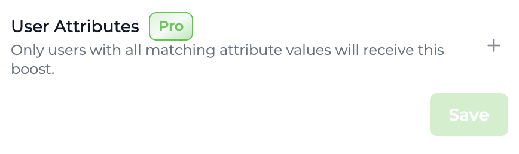
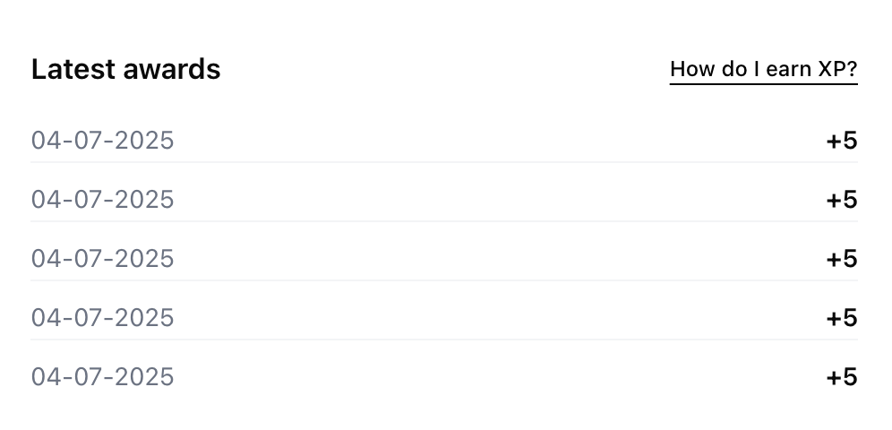
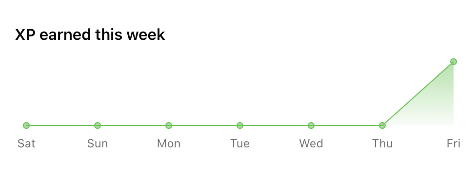
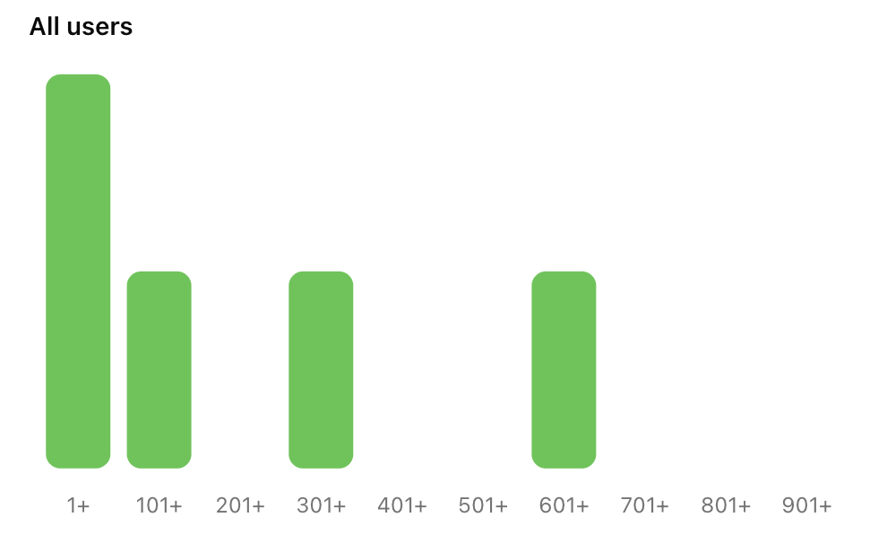
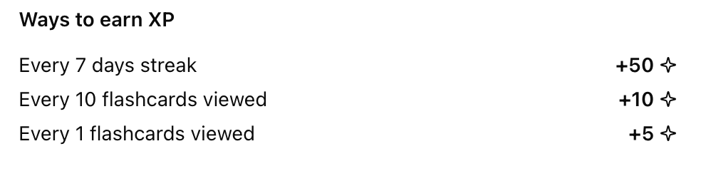
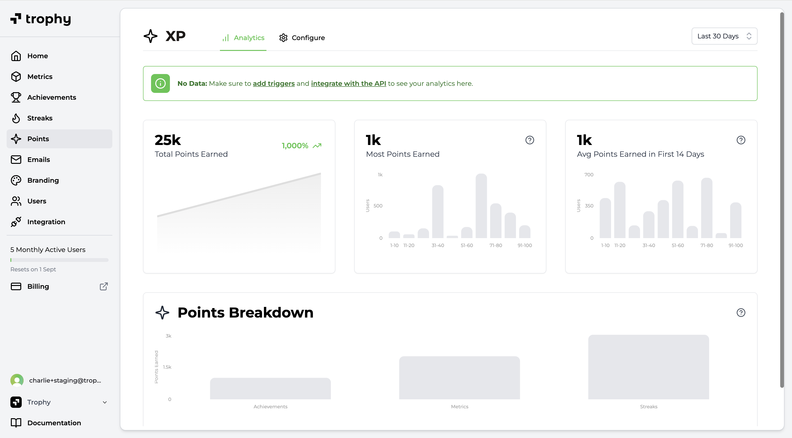

import MetricChangeResponseBlock from "../../snippets/metric-change-response-block.mdx";
import MetricChangeEventPointsLevelExcerpt from "../../snippets/metric-change-event-points-level-excerpt-block.mdx";
import PointsHistogramSummaryResponse from "../../snippets/points-histogram-summary-response-block.mdx";
import PointsLevelSummaryResponse from "../../snippets/points-level-summary-response-block.mdx";
import PointsLevelsListResponse from "../../snippets/points-levels-list-response-block.mdx";
import PointsSystemResponse from "../../snippets/points-system-response-block.mdx";
import UserPointsResponse from "../../snippets/user-points-response-block.mdx";
import UserPointsEventSummaryResponse from "../../snippets/user-points-summary-response-block.mdx";
import WebhookPointsLevelChangedPayload from "../../snippets/webhook-points-level-changed-payload-block.mdx";

## ¿Qué es un Sistema de Puntos? {#what-is-a-points-system}

Los sistemas de puntos se utilizan para crear contadores que rastrean las interacciones de los usuarios con [Métricas](/es/platform/metrics), [Logros](/es/platform/achievements) y [Rachas](/es/platform/streaks). Luego puedes construir funcionalidades como 'XP' y 'Energía' basadas en estos contadores dentro de tu producto.

## Casos de Uso {#use-cases}

### Recompensas {#rewards}

Los sistemas de puntos pueden utilizarse para crear funcionalidades como 'XP' o 'Gemas' que recompensan a los usuarios por diversas interacciones a diferentes tasas.

De esta manera, los puntos pueden usarse para ponderar el valor de ciertas interacciones de forma diferente a otras, recompensando a los usuarios por realizar las acciones que consideras más estrechamente correlacionadas con la retención.

### Medición {#metering}

Los sistemas de puntos también pueden utilizarse para crear funcionalidades como 'Energía' que miden el uso de tu producto de manera que te da control sobre la promoción y restricción de la actividad del usuario.

Esto te permite controlar la frecuencia con la que los usuarios pueden usar tu producto mediante una mecánica flexible que opera fuera de tu código base.

## Crear Sistemas de Puntos {#creating-points-systems}

Trophy te permite configurar múltiples sistemas de puntos para diferentes casos de uso dentro de tu aplicación.

<Frame>
  <video
    autoPlay
    muted
    loop
    playsInline
    className="w-full aspect-video"
    src="../../assets/platform/points/create_system.mp4"
  ></video>
</Frame>

Para crear un sistema de puntos, dirígete a la [página de puntos](https://app.trophy.so/points) y sigue los pasos a continuación.

<Steps>
  <Step title="Pulse Nuevo Sistema de Puntos">
    Asigne un nombre al nuevo sistema de puntos y una clave única. La clave es lo que
    utilizará para referenciar el sistema de puntos en las APIs y en las plantillas de correo electrónico si
    es relevante.
  </Step>
  <Step title="Agregue una descripción (Opcional)">
    También puede darle al sistema de puntos una descripción que se devuelve desde las
    APIs para mostrarse en su aplicación.
  </Step>
  <Step title="Configure el máximo de puntos (Opcional)">
  Si desea limitar el número de puntos que cada usuario puede tener en su nuevo sistema, establezca un valor en el campo 'puntos máximos'.

  <Tip>
  Cualquier [activador de puntos](#points-triggers) que configure para este sistema de puntos respetará el máximo establecido.
  </Tip>
  </Step>
  <Step title="Asigne una insignia (Opcional)">
    Puede asignar una insignia o logotipo subiendo una imagen o ingresando una
    URL de imagen personalizada. Las APIs devuelven una URL compatible con `src` para mostrar en su
    aplicación.
  </Step>
</Steps>

## Activadores de Puntos {#points-triggers}

En Trophy, los puntos se otorgan o se deducen de los usuarios a través de activadores. Estos definen las diferentes mecánicas que conforman su sistema de puntos.

Puede agregar tantos activadores como desee a cada sistema de puntos que configure, lo que le permite crear diferentes lógicas para cómo se otorgan o deducen los puntos para diferentes sistemas de puntos.

### Tipos de Activadores {#types-of-triggers}

Existen múltiples tipos de activadores en Trophy que pueden utilizarse para otorgar o deducir puntos de diferentes maneras.

#### Activadores de Métricas {#metric-triggers}

Los puntos pueden otorgarse o deducirse continuamente a medida que los usuarios incrementan las [Métricas](/es/platform/metrics). Puede elegir otorgar o deducir cualquier número arbitrario de puntos en cualquier umbral de métrica arbitrario, por ejemplo "otorgar 10 puntos por cada 3 tareas completadas".

#### Activadores de Racha {#streak-triggers}

Se pueden otorgar o deducir Puntos al alcanzar cualquier duración arbitraria de una [Racha](/es/platform/streaks), por ejemplo "otorgar 50 puntos por cada 7 días de racha".

#### Activadores de Logro {#achievement-triggers}

Se pueden otorgar o deducir Puntos cuando los usuarios desbloquean [Logros](/es/platform/achievements) específicos, por ejemplo "otorgar 100 puntos cuando los usuarios completen el logro `profile-completed`".

#### Activadores Basados en Tiempo {#time-based-triggers}

Se pueden otorgar o deducir Puntos en intervalos de tiempo repetitivos, cada hora o cada día. Por ejemplo "otorgar 10 puntos cada 3 horas".

#### Activadores de Identificación de Usuario {#user-identification-triggers}

Se pueden otorgar Puntos cuando los usuarios son identificados por primera vez en Trophy, útil para conceder una cantidad inicial de puntos cuando se registran en tu producto.

### Crear Activadores {#creating-triggers}

Para crear un nuevo activador de puntos, dirígete al sistema de puntos para el que deseas crear un activador y sigue los pasos a continuación.

<Tip>
  Todos los nuevos activadores de puntos se crean como 'Inactivos' para permitir pruebas y
  ajustes antes del despliegue a producción.
</Tip>

<Frame>
  <video
    autoPlay
    muted
    loop
    playsInline
    className="w-full aspect-video"
    src="../../assets/platform/points/create_trigger.mp4"
  ></video>
</Frame>

<Steps>
<Step title="Elige un tipo de activador">
  Elige cómo quieres que se otorguen o deduzcan puntos según lo descrito por los [tipos de activadores](#types-of-triggers) disponibles.
</Step>

<Step title="Configura el activador">
  Una vez que hayas elegido el tipo de activador de puntos, necesitas configurar los ajustes del activador.

- Si elegiste el activador de **Métrica**, necesitarás elegir la métrica y el umbral en el que se otorgarán o deducirán puntos.

- Si elegiste el activador de **Racha**, necesitarás establecer la duración de la racha que debería otorgar o deducir puntos.

- Si elegiste el disparador de **Logro**, deberás seleccionar el logro que otorgará o deducirá puntos al completarse.

- Si elegiste el disparador de **Tiempo**, deberás seleccionar la unidad de tiempo en la que deseas otorgar o deducir puntos (horas o días) y el número de esas unidades de tiempo después de las cuales deseas otorgar o deducir puntos.

- Si elegiste el disparador de **Primera Identificación de Usuario**, no necesitarás agregar ninguna configuración adicional.

</Step>

<Step title="Establece los puntos a otorgar/deducir">
  Una vez configurado tu disparador, establece el número de puntos a otorgar o deducir
  cuando se active.
</Step>

<Step title="Agrega filtros de atributos (Opcional)">
  Puedes asignar filtros de atributos a un disparador de puntos para restringir aún más cuándo se aplican.

- Para limitar un **disparador de métrica** a que solo se aplique a eventos con [atributos de eventos personalizados](/es/platform/events#custom-event-attributes) específicos, selecciona un atributo e ingresa un valor en la sección **Atributo de Evento**.

- Para limitar cualquier tipo de disparador a que solo se aplique a un usuario con uno o más [atributos de usuario personalizados](/es/platform/users#custom-user-attributes) específicos, agrega atributos y los valores deseados en la sección **Atributos de Usuario**.

</Step>

<Step title="Guarda los cambios">
  Guarda el nuevo disparador de puntos.
</Step>
<Step title="Activa">
  Una vez que estés satisfecho de que tu nuevo disparador se comportará como esperas, cambia su estado a activo para ponerlo en funcionamiento.
</Step>
</Steps>

## Equilibrio de Puntos {#balancing-points}

Gestionar un sistema de puntos efectivo requiere encontrar el ritmo óptimo al cual los usuarios ganan puntos. Demasiado rápido, y los usuarios experimentarán fatiga de puntos, volviéndolos inútiles. Demasiado lento, y los usuarios pueden aburrirse y abandonar.

La herramienta de vista previa de Trophy puede modelar diferentes escenarios para ayudarte a determinar con qué frecuencia los usuarios deben ganar Puntos en cada uno de tus sistemas de puntos.

<Frame>
  <video
    autoPlay
    muted
    loop
    playsInline
    className="w-full aspect-video"
    src="../../assets/platform/points/points_preview.mp4"
  ></video>
</Frame>

## Potenciadores de Puntos {#points-boosts}

Los potenciadores de puntos son multiplicadores que puedes usar para aumentar la cantidad de puntos otorgados a los usuarios durante un período de tiempo específico.

Esta sección explica cómo funcionan los potenciadores y cómo pueden usarse para aumentar la retención y el engagement de tu aplicación.

### Segmentación de Potenciadores {#boost-targeting}

Hay varias formas diferentes en las que puedes usar potenciadores en Trophy.

- **Potenciadores globales** multiplican los puntos ganados por todos los usuarios durante la ventana del potenciador, o pueden limitarse a una cohorte específica de usuarios usando [atributos de usuario personalizados](/es/platform/users#custom-user-attributes).
- **Potenciadores específicos por usuario** solo multiplican los puntos ganados por un único usuario dentro de la ventana del potenciador.

Normalmente, los potenciadores globales se usan para aumentar el engagement en toda la plataforma durante eventos clave del calendario como Black Friday/Cyber Monday en comercio electrónico, Año Nuevo en fitness y temporada de exámenes en plataformas educativas.

Por el contrario, los potenciadores específicos por usuario se usan comúnmente para proporcionar incentivos adicionales para que los usuarios realicen acciones que están correlacionadas con una mayor retención.

### Creación de Potenciadores {#creating-boosts}

<Note>
Los potenciadores específicos por usuario solo pueden crearse de forma programática a través de la [API de administración](/es/admin-api/endpoints/points/create-boosts).
</Note>

Para crear un potenciador de puntos global en el panel de Trophy, sigue los pasos a continuación.

<Frame>
  <video
    autoPlay
    muted
    loop
    playsInline
    className="w-full aspect-15/4"
    src="../../assets/platform/points/create_points_boost.mp4"
  ></video>
</Frame>

<Steps>
  <Step title="Ve a la página de Potenciadores">
    Ve a la [página de puntos](https://app.trophy.so/points) y haz clic en el sistema de puntos para el que deseas crear un potenciador. Luego navega a la pestaña Potenciadores y haz clic en el botón *Nuevo Potenciador*.
  </Step>
  <Step title="Elige un nombre">
    Elige un nombre para tu potenciador que describa claramente para qué es. Por ejemplo "Potenciador 2X - Todos los Usuarios - Navidad 2026".
  </Step>
  <Step title="Establece el multiplicador">
    Establece el valor numérico por el que el potenciador multiplicará los puntos ganados. Si eliges un multiplicador decimal, tendrás la opción de elegir el [comportamiento de redondeo](#boost-rounding) que debe usar el potenciador.
  </Step>
  <Step title="Establece la ventana del potenciador">
    Elige una fecha de inicio y (opcionalmente) una fecha de finalización para tu potenciador. Si eliges una fecha de inicio futura, Trophy programará el potenciador para que se active en la fecha elegida. De manera similar, si estableces una fecha de finalización, Trophy se encargará de detener tu potenciador por ti.
  </Step>
  <Step title="Agrega filtros de atributos (opcional)">

    <Note>
      Esta funcionalidad requiere [atributos de usuario personalizados](/es/platform/users#custom-user-attributes) que están disponibles en el [plan Pro](/es/account/billing#pro-plan).
    </Note>

    Si deseas que tu impulso afecte solo a una cohorte de usuarios específica, establece condiciones de atributos de usuario que coincidan con las de tu cohorte objetivo. Trophy se encargará de aplicar el impulso únicamente a los puntos obtenidos por usuarios con valores de atributos de usuario coincidentes.

    <Frame>
      
    </Frame>
  </Step>
  <Step title="Activar impulso">
    Haz clic en *Guardar Impulso* para guardar tu nuevo impulso en tu cuenta. El impulso estará en estado inactivo de forma predeterminada. Para activarlo, haz clic en el menú desplegable a la derecha del nombre del impulso en la página de Impulsos y haz clic en Activar.
  </Step>
</Steps>

### Multiplicadores de Impulso {#boost-multipliers}

Cada impulso tiene un único valor multiplicador que aumenta el total de puntos obtenidos por los usuarios afectados por ese impulso.

Los multiplicadores de impulso deben ser números positivos, pero pueden ser decimales para soportar escenarios donde se requieran impulsos porcentuales como '50% más puntos'.

### Acumulación de Impulsos {#boost-stacking}

Los impulsos de puntos en Trophy se acumulan mediante [multiplicación](#boost-multipliers). Esto permite que los usuarios se beneficien de múltiples impulsos simultáneamente.

Para demostrar la acumulación, considera un impulso 2X, 1.5X y 3X todos activos dentro del mismo período de tiempo. El multiplicador de impulso resultante para un usuario que califique para los tres impulsos sería el siguiente:

```txt Boost Stacking Example
Overall Multiplier (3 boosts) = 2X * 1.5X * 3X = 9X
```

### Redondeo de Impulsos {#boost-rounding}

Trophy admite [valores de eventos de métrica de punto flotante](/es/platform/events#event-value), pero se encarga de redondear los puntos a enteros automáticamente.

Sin embargo, al usar [multiplicadores de impulso](#boost-multipliers) decimales, puede haber algunos escenarios donde este redondeo predeterminado no sea suficiente para producir siempre valores de puntos enteros.

Por lo tanto, Trophy ofrece tres modos de redondeo para proporcionar control adicional sobre el comportamiento de redondeo específicamente cuando los boosts están involucrados en los cálculos de Puntos.

- **Redondear hacia abajo**: Por defecto, Trophy redondeará los Puntos hacia abajo al entero más cercano cuando la multiplicación de boost resulte en un decimal.
- **Redondear hacia arriba**: Trophy redondea los Puntos decimales hacia arriba al entero más cercano después de la multiplicación de boost.
- **Redondear al más cercano**: Trophy redondeará los Puntos al entero más cercano, hacia arriba o hacia abajo, según el valor final después de la multiplicación de boost. Por ejemplo `1.2` se redondea a `1` y `1.7` se redondea a `2`.

<Tip>
En escenarios donde los Puntos se utilizan para imitar las mecánicas de crédito de plataforma, se recomienda usar el comportamiento predeterminado de redondeo hacia abajo para proteger contra deslizamientos.
</Tip>

Simplemente elige tu modo de redondeo preferido al [crear boosts](/es/platform/points#creating-boosts) a través del panel de Trophy.

## Niveles de Puntos {#points-levels}

Los niveles de Puntos son hitos discretos que defines en un sistema de Puntos en Trophy.

Cada nivel tiene un umbral. Cuando el total de Puntos de un usuario en el sistema supera este umbral, Trophy les asigna ese nivel automáticamente. No necesitas mantener la lógica de niveles en tu propio código base.

Usa los niveles para niveles de rango, interfaz de progresión, niveles de recompensas o analíticas. Trophy mantiene el nivel actual de cada usuario sincronizado cada vez que ganan o pierden Puntos en ese sistema.

### Configuración de niveles {#configuring-levels}

Para configurar niveles para un sistema de Puntos, ábrelo desde la [página de Puntos](https://app.trophy.so/points) en el panel de Trophy y usa la pestaña de niveles para agregar o gestionar niveles.

<Frame>
  <video
    autoPlay
    muted
    loop
    playsInline
    className="w-full aspect-video"
    src="../../assets/platform/points/create_points_level.mp4"
  ></video>
</Frame>

<Steps>
  <Step title="Abre tu sistema de puntos">
    Desde la página de puntos, selecciona el sistema de puntos al que deseas agregar niveles.
  </Step>
  <Step title="Abre la pestaña de niveles">
    Desde la página de tu sistema de puntos, abre la pestaña de niveles.
  </Step>
  <Step title="Agrega niveles">
    Crea cada nivel con una clave estable, un nombre visible, una descripción opcional, una imagen de insignia y el umbral de puntos requerido para alcanzar ese nivel.
    
    Los umbrales deben reflejar cómo deseas que se sienta la progresión a medida que los usuarios acumulan puntos de tus activadores.
  </Step>
  <Step title="Guarda">
    Guarda tus niveles. Trophy evaluará los totales contra estos umbrales en cada cambio de puntos.
  </Step>
</Steps>

### Mostrar Niveles {#displaying-levels}

La mayoría de los equipos combinan tres enfoques: una vista estática de cada nivel (para pantallas de progresión), el nivel actual del usuario (para encabezados y perfil) y retroalimentación inmediata cuando una acción los impulsa a un nuevo nivel.

#### Mostrar Todos los Niveles {#displaying-all-levels}

Llama a la [API de obtener niveles](/es/api-reference/endpoints/points/get-points-levels) una vez por clave de sistema de puntos (por ejemplo, al cargar la aplicación o desde tu servidor al renderizar una página de progresión).

La respuesta es un array de niveles con `key`, `name`, `description`, `badgeUrl` opcional y el umbral `points` para cada nivel. Al vincular tu interfaz a la respuesta de la API de Trophy, te asegurarás de que se actualice automáticamente cuando realices cambios en los niveles en el panel de Trophy.

<PointsLevelsListResponse />

#### Mostrar el Nivel del Usuario {#displaying-user-level}

La [API de puntos del usuario](/es/api-reference/endpoints/users/get-a-users-points) devuelve el `total` del usuario, su objeto `level` actual y `awards` recientes. El campo `level` contiene el nivel actual del usuario, o null si no existen niveles o aún no han alcanzado el umbral de puntos para ningún nivel.

Combina `total` con la lista ordenada de niveles del paso anterior para dibujar una barra de progreso entre el umbral actual y el siguiente.

<UserPointsResponse />

#### Notificaciones de Cambio de Nivel {#level-change-notifications}

Cuando envías un [evento de cambio de métrica](/es/api-reference/endpoints/metrics/send-a-metric-change-event), la respuesta incluirá un mapa `points` indexado por las claves de tu sistema de puntos para cada sistema que cambió como resultado del evento.

Los datos contienen una clave `level` solo cuando el nivel del usuario cambió debido a este evento. Si su nivel permaneció igual, esa clave se omite, por lo que puedes tratar de forma segura un `level` presente como una señal de cambio de nivel sin contabilidad adicional.

<MetricChangeEventPointsLevelExcerpt />

Un patrón típico es verificar el objeto de tu sistema después de un evento exitoso, y luego activar una notificación emergente, un modal o un sonido:

```ts
const pts = response.points?.xp; // use your points system key

if (pts?.level) {
  // Level changed on this request — e.g. toast, modal, confetti if level up
  notifyLevelChange(pts.level.name, pts.total);
}
```

El mismo comportamiento de `level` se aplica cuando los puntos cambian por la [finalización de un logro](/es/api-reference/endpoints/achievements/mark-an-achievement-as-completed).

Para notificaciones impulsadas por el servidor (correo electrónico, push, CRM) que no deben depender de que el cliente vea la respuesta HTTP, suscríbete al webhook [`points.level_changed`](/es/webhooks/events/points/points-level-changed) en su lugar.

Este webhook se activa cuando el nivel de un usuario cambia como resultado de ganar o perder puntos, e incluye `previousLevel` y `newLevel`.

#### Análisis a nivel de cuenta {#account-level-analytics}

La [API de resumen de nivel](/es/api-reference/endpoints/points/get-points-level-summary) devuelve cuántos usuarios están actualmente en cada nivel, lo cual es útil para paneles de administración, vistas de embudo o balanceo de progresión.

<PointsLevelSummaryResponse />

## Mostrando Puntos {#displaying-points}

Hay varias formas de usar Trophy para obtener y mostrar puntos en tu aplicación.

<Note>
  Para ver ejemplos funcionales, consulta nuestras guías sobre cómo agregar una [función de
  XP](/es/guides/how-to-build-an-xp-feature) o una [función de
  energía](/es/guides/how-to-build-an-energy-feature) a tu aplicación web o móvil.
</Note>

<Frame>
  <video
    autoPlay
    muted
    loop
    playsInline
    className="w-full aspect-video"
    src="../../assets/platform/points/displaying_points.mp4"
  ></video>
</Frame>

### Activación de UI transaccional {#triggering-transactional-ui}

En primer lugar, cualquier punto otorgado o deducido de los usuarios como resultado de un evento de cambio de métrica se devuelve en la respuesta al utilizar la [API de evento de cambio de métrica](/es/api-reference/endpoints/metrics/send-a-metric-change-event).

La respuesta incluye el nuevo total de puntos del usuario, cuántos puntos se otorgaron o dedujeron como resultado del evento, y los detalles de los activadores de puntos específicos que se ejecutaron. Cuando los [Niveles de Puntos](#points-levels) están habilitados, cada objeto de puntos en esa respuesta también puede incluir **`level`**: Trophy incluye el **nuevo** nivel del usuario **solo cuando cambió** como resultado de ese evento. El mismo comportamiento opcional de `level` se aplica cuando los puntos cambian por una [finalización de logro](/es/api-reference/endpoints/achievements/mark-an-achievement-as-completed).

Ejemplo de respuesta `POST /metrics/{key}/event` (los campos coinciden con la especificación de la API de Trophy; tus claves bajo `points` e `leaderboards` dependen de tu cuenta):

<MetricChangeResponseBlock />

Esto hace que sea realmente sencillo leer la respuesta y activar cualquiera de las siguientes UI transaccionales en tu aplicación:

- Mostrar notificaciones y ventanas emergentes dentro de la aplicación
- Reproducir efectos de sonido

### Visualización de los Puntos del usuario {#displaying-users-points}

Trophy también tiene APIs que te permiten obtener los datos de puntos del usuario cuando lo necesites.

Primero, la [API de puntos de usuario](/es/api-reference/endpoints/users/get-a-users-points) devuelve el total de puntos del usuario para un sistema de puntos particular, su **`level`** actual (o `null` si los niveles no están en uso o aún no han alcanzado un nivel), y hasta 100 de los eventos más recientes que otorgaron puntos o dedujeron puntos de ellos.

Puedes usar esta API para mostrar el total de puntos del usuario en cualquier lugar de tu plataforma, así como una sección de 'Últimas recompensas' o similar.

`GET /users/{id}/points/{key}` — ejemplo de cuerpo de respuesta (especificación de API de Trophy):

<UserPointsResponse />

<Frame>
  
</Frame>

Luego, la [API de resumen de Puntos de usuario](/es/api-reference/endpoints/users/get-a-users-points-summary) puede utilizarse para obtener datos históricos de Puntos para un usuario en particular.

Los datos pueden agregarse diariamente, semanalmente o mensualmente entre una fecha de inicio y una fecha de fin. Utiliza esta API para mostrar a los usuarios gráficos de progreso de Puntos en cualquier período de tiempo.

Ejemplo de respuesta `GET /users/{id}/points/{key}/event-summary` **200** (especificación de API de Trophy; la estructura coincide con tus parámetros de consulta `aggregation`, `startDate` y `endDate`):

<UserPointsEventSummaryResponse />

<Frame>
  
</Frame>

### Visualización de Datos Agregados {#displaying-aggregate-data}

Además, hay varias APIs que pueden utilizarse para obtener y mostrar datos de Puntos a nivel de cuenta.

Primero, la [API de resumen de Puntos](/es/api-reference/endpoints/points/get-points-summary) devuelve datos agregados del sistema de Puntos en toda tu base de usuarios.

Utiliza estos datos para mostrar un histograma de Puntos para un sistema de Puntos en particular y mostrar a los usuarios cómo se comparan con otros en la plataforma. Cuando utilizas [Niveles de Puntos](#points-levels), la [API de resumen de niveles](/es/api-reference/endpoints/points/get-points-level-summary) complementa esto con un recuento de usuarios por nivel.

`GET /points/{key}/summary` — ejemplo de respuesta **200** (especificación de API de Trophy):

<PointsHistogramSummaryResponse />

Finalmente, la [API de sistema de Puntos](/es/api-reference/endpoints/points/get-points) devuelve los metadatos del sistema y los disparadores. Ejemplo de respuesta **200** (especificación de API de Trophy):

<PointsSystemResponse />

<Tip>
  La API de resumen de Puntos también puede filtrarse para devolver únicamente datos de usuarios con
  [atributos de usuario personalizados](/es/platform/users#custom-user-attributes) específicos.
</Tip>

<Frame>
  
</Frame>

Utiliza la respuesta de la [API de sistema de Puntos](/es/api-reference/endpoints/points/get-points) para mostrar a los usuarios cómo pueden ganar Puntos en tu plataforma. Cualquier nuevo disparador que agregues se devolverá automáticamente desde esta API, reduciendo cambios de código en tu plataforma y trasladando las operaciones a Trophy.

<Frame>
  
</Frame>

## Analíticas de puntos {#points-analytics}

Trophy cuenta con analíticas integradas para rastrear las otorgaciones de puntos de cada sistema de puntos que configures en tus usuarios en tiempo real, incluyendo:

- Total de puntos ganados por todos los usuarios a lo largo del tiempo
- Máximo de puntos ganados por un solo usuario
- Promedio de puntos ganados en los primeros 14 días (útil para entender patrones de retención de nuevos usuarios y el impacto de los puntos)
- Un desglose de los activadores de puntos otorgados más comunes

<Frame>
  
</Frame>

## Obtener soporte {#get-support}

¿Quieres ponerte en contacto con el equipo de Trophy? Comunícate con nosotros por [correo electrónico](mailto:support@trophy.so). ¡Estamos aquí para ayudar!
