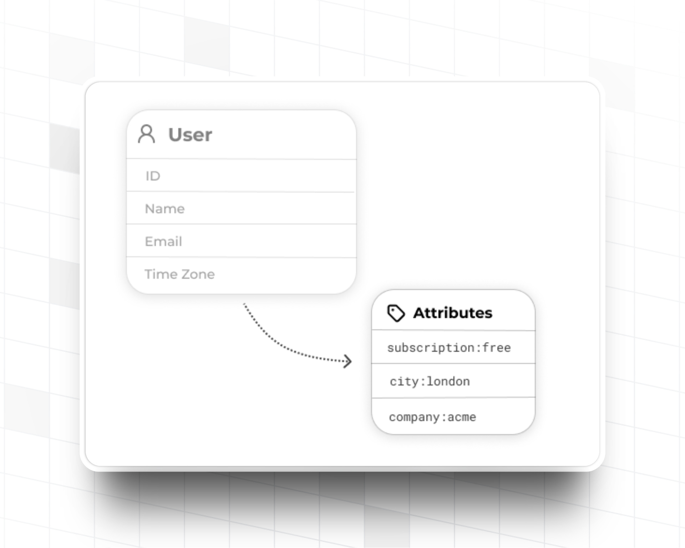
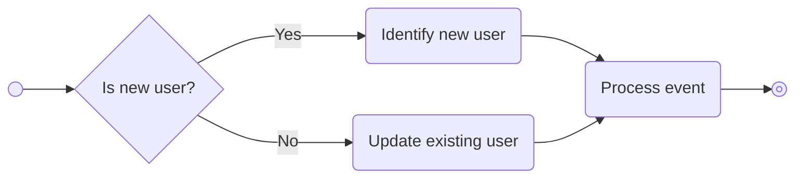
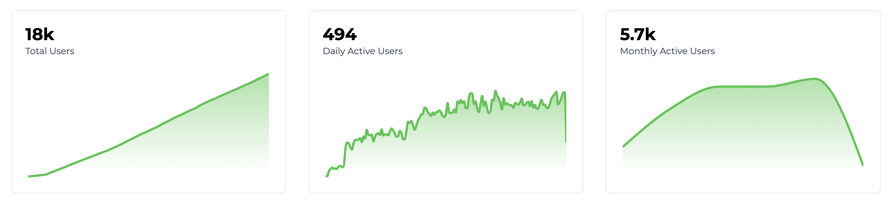
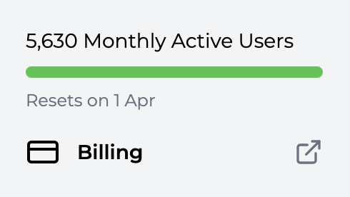

import MetricChangeRequestBlock from "../../snippets/metric-change-request-block.mdx";
import IdentifyUserRequestBlock from "../../snippets/identify-user-request-block.mdx";
import UpdateUserNotificationPreferencesBlock from "../../snippets/update-user-notification-preferences-block.mdx";
import GetUserNotificationPreferencesBlock from "../../snippets/get-user-notification-preferences-block.mdx";

## ¿Qué son los Usuarios? {#what-are-users}

Los usuarios son las personas individuales que utilizan tu producto. Le informas a Trophy sobre tus usuarios a través de APIs y utilizas el panel de control para diseñar experiencias de gamificación en torno a ellos.

Los usuarios deben ser individuos, no pueden ser empresas u organizaciones. Para crear estructuras organizacionales o agrupaciones de usuarios, considera utilizar un [atributo de usuario personalizado](#custom-user-attributes).

## Atributos Clave {#key-attributes}

Los atributos clave son propiedades de los usuarios controladas y administradas por Trophy y sirven para cosas como `id` o `email`, algunos son obligatorios mientras que otros son opcionales.

### Atributos Obligatorios {#required-attributes}

Trophy solo requiere un atributo clave, `id`. Cada usuario del que informes a Trophy debe tener un `id`, esto es lo que los identifica como una persona única.

<ParamField path="id" type="string" required={true}>
  Este es el ID del usuario en **tu** base de datos.
</ParamField>

<Tip>
  Para simplificar las cosas, Trophy te permite usar tu propio `id` que ya tienes
  en tu base de datos en lugar de necesitar gestionar otro solo para Trophy.
</Tip>

### Atributos Opcionales {#optional-attributes}

Además, puedes informar a Trophy sobre cualquiera de los siguientes atributos clave opcionales y los pondrá a tu disposición como parte de tu experiencia de gamificación:

<ParamField path="name" type="string">
  El nombre completo del usuario. Esto es accesible en plantillas de correo electrónico y otras áreas
  donde puedas querer dirigirte al usuario por su nombre.
</ParamField>

<ParamField path="email" type="string">
  La dirección de correo electrónico del usuario. Esta dirección se utilizará en cualquier
  [correo electrónico](/es/platform/emails) que configures como parte de tu experiencia
  de gamificación con Trophy.
</ParamField>

<ParamField path="tz" type="string">
  La zona horaria del usuario. Debe especificarse como un [identificador de zona horaria
  IANA](https://en.wikipedia.org/wiki/List_of_tz_database_time_zones).
  Se utiliza para rachas, clasificaciones de Clasificación y para enviar correos electrónicos a los usuarios
  de acuerdo con su hora local.

En JavaScript, puedes obtener la zona horaria del usuario utilizando este fragmento:

```js Fetching timezone
// e.g. 'Europe/London'
const timezone = Intl.DateTimeFormat().resolvedOptions().timeZone;
```

</ParamField>

<ParamField path="subscribeToEmails" type="boolean" default="true">
  Si has configurado algún [correo electrónico](/es/platform/emails) de Trophy, solo se
  enviarán a un usuario cuando este campo sea verdadero. Nota: Si no proporcionas un
  `email`, intentar establecer este campo como verdadero resultará en un error.
</ParamField>

<ParamField path="deviceTokens" type="array<string>">
  La lista de tokens de dispositivo a asociar con el usuario. Si has configurado alguna
  [Notificación push](/es/platform/push-notifications) de Trophy, solo se
  enviarán a un usuario cuando se proporcione este campo.
</ParamField>

## Atributos de usuario personalizados {#custom-user-attributes}

<Note>
  Esta funcionalidad está disponible en el [plan Pro](/es/account/billing#pro-plan)
</Note>

<Frame>
  
</Frame>

Los atributos de usuario personalizados son gestionados por ti y pueden ser cualquier cosa que desees según tu caso de uso.

Por ejemplo, una aplicación de aprendizaje de idiomas podría utilizar un atributo de usuario personalizado para el idioma que está aprendiendo un usuario, o una plataforma de estudios podría usar uno para la asignatura favorita del usuario.

Los atributos de usuario personalizados te permiten informar a Trophy sobre esta información contextual y utilizarla para personalizar las funcionalidades de gamificación.

### Crear atributos {#creating-attributes}

Para crear un nuevo atributo de usuario personalizado, dirígete a la [pestaña de atributos](https://app.trophy.so/users/attributes) de la página de usuarios en el panel de Trophy y haz clic en el botón _Agregar atributo de usuario_.

Asigna un nombre y una clave única al atributo. La clave es lo que utilizarás para hacer referencia al atributo en las llamadas API.

<Frame>
  <video
    autoPlay
    muted
    loop
    playsInline
    className="w-full aspect-15/4"
    src="../../assets/platform/users/create_custom_user_attribute.mp4"
  ></video>
</Frame>

### Establecer Atributos {#setting-attributes}

Los atributos pueden asignarse valores para usuarios específicos utilizando su clave única de forma inline, a medida que los usuarios incrementan métricas a través de la [API de incremento de métricas](/es/api-reference/endpoints/metrics/send-a-metric-change-event), o explícitamente mediante las APIs de [identificación de usuario](/es/api-reference/endpoints/users/identify-a-user), [creación de usuario](/es/api-reference/endpoints/users/create-a-user) o [actualización de usuario](/es/api-reference/endpoints/users/update-a-user).

<Warning>
  Trophy solo establecerá valores de atributos que primero hayan sido creados
  en el panel de control. Lo hacemos para ayudarte a mantener un conjunto limpio de atributos y
  prevenir sobrescrituras accidentales.

Si recibes un error similar al siguiente, es posible que hayas escrito incorrectamente la clave del atributo en la solicitud, o necesites crear primero el atributo en el panel de control de Trophy:

{/* vale off */}

```json
{
  "error": "Invalid attribute keys: pln. Please ensure all attribute keys match those set up at https://app.trophy.so/users/attributes."
}
```

{/* vale on */}

</Warning>

En todas las APIs, el esquema para establecer valores de atributos es consistente. Aquí tienes un ejemplo de un payload de solicitud que establece el valor de dos atributos de usuario personalizados `subject` y `plan`:

```json {4-7}
{
  "name": "Joe Bloggs",
  "email": "joe.bloggs@example.com",
  "attributes": {
    "subject": "physics",
    "plan": "free"
  }
}
```

### Usar Atributos {#using-attributes}

Utiliza atributos de usuario personalizados en Trophy para personalizar características de gamificación, agregar y filtrar datos devueltos por las APIs, y para segmentar y comparar cohortes de usuarios en analíticas.

#### Personalización de Características {#feature-personalization}

Los atributos de usuario personalizados pueden utilizarse para personalizar logros, personalizar la forma en que diferentes usuarios ganan puntos y más. Sigue los enlaces a las páginas relevantes a continuación para obtener más información.

<CardGroup>
  <Card
    title="Personalizar Logros"
    icon="trophy"
    href="/es/platform/achievements#creating-achievements"
  >
    Configura logros que solo pueden ser desbloqueados por usuarios específicos.
  </Card>
  <Card
    title="Personalizar Puntos"
    icon="sparkle"
    href="/es/platform/points#points-triggers"
  >
    Personaliza cómo diferentes usuarios ganan puntos.
  </Card>
  <Card
    title="Segmentación de Email"
    icon="split"
    href="/es/platform/emails#limiting-emails-to-specific-types-of-users"
  >
    Controla qué usuarios reciben emails gamificados.
  </Card>
  <Card
    title="Personalización de Email"
    icon="trophy"
    href="/es/platform/emails#email-variables"
  >
    Personaliza el contenido y las líneas de asunto del email con atributos de usuario personalizados.
  </Card>
</CardGroup>

#### Agregación y Filtrado de Datos {#data-aggregation-and-filtering}

Puedes utilizar atributos de usuario personalizados para agregar y filtrar los datos devueltos por algunas APIs, lo que permite implementar una amplia gama de casos de uso de gamificación. En todos los casos, los atributos se incluyen en el parámetro de consulta `userAttributes` utilizando un esquema consistente:

`?userAttributes=city:london,subscription-plan:pro`

A continuación se muestra una lista de todas las APIs que admiten el parámetro de consulta `userAttributes`:

- [Resumen de Puntos](/es/api-reference/endpoints/points/get-points-summary)

#### Analíticas Segmentadas {#segmented-analytics}

Los atributos de usuario personalizados se pueden utilizar para segmentar y comparar gráficos de retención y engagement entre grupos de usuarios.

Esto es útil para comprender qué cohortes están aprovechando al máximo tus funciones de gamificación y cuáles tienen dificultades para interactuar y, por lo tanto, requieren atención.

<Frame>
  <video
    autoPlay
    muted
    loop
    playsInline
    className="w-full aspect-15/4"
    src="../../assets/platform/users/segmenting_analytics.mp4"
  ></video>
</Frame>

## Identificación de Usuarios {#identifying-users}

Cuando le informas a Trophy sobre un usuario en tu plataforma, llamamos a esto **identificación**. Existen dos formas de identificar usuarios con Trophy: identificación [en línea](#inline-identification) e identificación [explícita](#explicit-identification).

<Tip>
  Recomendamos comenzar con la identificación en línea si eres nuevo en
  Trophy. Si decides que necesitas más control, prueba la identificación explícita.
</Tip>

### Identificación en Línea {#inline-identification}

La identificación en línea es la forma más sencilla de informar a Trophy sobre tus usuarios, ya que no requiere ningún código específico de identificación de usuario. Simplemente le informas a Trophy sobre los usuarios mientras utilizan normalmente tu plataforma.

En la práctica, esto significa que cada vez que utilizas la [API de Eventos de Métricas](/es/api-reference/endpoints/metrics/send-a-metric-change-event), proporcionas los detalles completos del usuario que desencadenó el evento.

A continuación se muestra un ejemplo en el que se realiza una llamada a la API de eventos de métricas, y los detalles del usuario que realizó la interacción se incluyen en el cuerpo de la solicitud:

<MetricChangeRequestBlock />

En este caso, si esta es la primera interacción del usuario (es decir, es un usuario nuevo), se creará automáticamente un nuevo registro para él en Trophy.

Sin embargo, si Trophy encuentra un registro existente con el mismo `id`, Trophy actualizará cualquier detalle del usuario que se haya pasado.

En otras palabras, la identificación en línea se realiza mediante una operación de tipo `UPSERT`.

<br />



<br />

Identificar usuarios de esta manera tiene dos beneficios clave:

- Todos los usuarios nuevos que se registren en tu plataforma e incrementen una métrica se rastrean automáticamente en Trophy sin necesidad de escribir código de identificación explícito
- Cualquier cambio en las propiedades de usuarios existentes, como nombre o dirección de email, se sincroniza automáticamente con Trophy la próxima vez que el usuario incremente una métrica

De esta manera, la identificación en línea te permite mantener toda tu base de usuarios constantemente sincronizada con Trophy con la mínima cantidad de código requerido de tu parte.

Por eso recomendamos comenzar primero con la identificación en línea y luego explorar la identificación explícita si descubres que necesitas más control.

### Identificación Explícita {#explicit-identification}

La identificación explícita es cuando escribes código en tu aplicación que le indica explícitamente a Trophy sobre los usuarios de forma separada de cualquier interacción con métricas. Esto es útil si deseas tener control completo sobre cómo y cuándo Trophy conoce a tus usuarios.

Los escenarios en los que podrías querer usar identificación explícita incluyen:

- Quieres informarle a Trophy sobre usuarios nuevos inmediatamente al registrarse, antes de que incrementen una métrica
- Rastreas muchas métricas en Trophy y no quieres repetir el código de identificación en línea
- Quieres informarle a Trophy únicamente sobre un grupo específico de usuarios, sobre el cual controlas las condiciones

En este caso, puedes informar a Trophy sobre nuevos usuarios utilizando la [API de identificación de usuarios](/es/api-reference/endpoints/users/identify-a-user).

<IdentifyUserRequestBlock />

<Tip>
  Al igual que en la identificación en línea, la identificación explícita también funciona mediante
  una operación `UPSERT`, lo que significa que todos los atributos de usuario se mantienen sincronizados
  con Trophy automáticamente.
</Tip>

## Crear usuarios {#creating-users}

Para crear explícitamente un nuevo usuario en Trophy, utiliza la [API de creación de usuarios](/es/api-reference/endpoints/users/create-a-user).

## Mantener los usuarios actualizados {#keeping-users-up-to-date}

Para informar a Trophy sobre una actualización de un usuario en tu plataforma, puedes utilizar la [API de actualización de usuarios](/es/api-reference/endpoints/users/update-a-user).

Todas las propiedades que pases a Trophy se actualizarán a los nuevos valores que especifiques.

<Tip>
  Dado que la [identificación de usuarios](#identifying-users) mantiene los registros de usuarios actualizados por
  defecto, generalmente no es necesario actualizar explícitamente los usuarios en Trophy cada
  vez que una de sus propiedades cambia en tu aplicación. Sin embargo, la API de actualización de usuarios
  está disponible si realmente la necesitas.
</Tip>

## Configurar preferencias de usuario {#setting-user-preferences}

Trophy tiene APIs para ayudarte a crear un centro de preferencias que tus usuarios pueden utilizar para controlar y personalizar cómo interactúan con tus funciones de gamificación.

Esta sección describe todas las preferencias que puedes exponer a tus usuarios y su función.

### Preferencias de notificaciones {#notification-preferences}

Puedes usar Trophy para enviar [correos electrónicos](/es/platform/emails) y [Notificaciones push](/es/platform/push-notifications) gamificados a tus usuarios.

La [API de actualización de preferencias](/es/api-reference/endpoints/users/update-user-preferences) de Trophy te permite crear un centro de preferencias dentro de tu aplicación con el que tus usuarios pueden interactuar para controlar qué notificaciones reciben y a través de qué canales.

<Frame>
  
</Frame>

El API te permite actualizar las preferencias de notificación de un usuario para diferentes tipos de notificación:

- **achievement_completed**: Notificaciones enviadas cuando un usuario completa un logro
- **recap**: Notificaciones periódicas de resumen sobre el progreso del usuario
- **reactivation**: Notificaciones enviadas para reactivar usuarios inactivos
- **streak_reminder**: Recordatorios para ayudar a los usuarios a mantener sus rachas

Para cada tipo de notificación, puedes especificar en qué canales debe recibir notificaciones el usuario: `email`, `push`, o ambos. Para desactivar completamente un tipo de notificación, pasa un array vacío.

Por ejemplo, el siguiente fragmento de código actualiza las preferencias de notificación de un usuario en Trophy:

<UpdateUserNotificationPreferencesBlock />

Para construir una interfaz de centro de preferencias en tu aplicación, primero necesitarás obtener las preferencias actuales del usuario usando el [API de obtener preferencias](/es/api-reference/endpoints/users/get-user-preferences).

Esto devolverá la configuración de notificaciones actual del usuario, que luego puedes mostrar en tu interfaz y permitir que los usuarios la modifiquen.

<GetUserNotificationPreferencesBlock />

El API devuelve una respuesta que contiene las preferencias de notificación actuales del usuario para cada tipo de notificación:

```json Response {3}
{
  "notifications": {
    "achievement_completed": ["email", "push"],
    "recap": ["email"],
    "reactivation": ["push"],
    "streak_reminder": ["email", "push"]
  }
}
```

Puedes usar esta respuesta para:

- **Rellenar controles de formulario**: Preseleccionar casillas de verificación o interruptores en tu interfaz de centro de preferencias según los valores actuales
- **Mostrar el estado actual**: Mostrar qué notificaciones están activadas y a través de qué canales
- **Manejar preferencias faltantes**: Si un tipo de notificación no está presente en la respuesta, significa que el usuario aún no ha establecido preferencias para ese tipo, y puedes usar la configuración predeterminada de tu aplicación

Una vez que hayas obtenido y mostrado las preferencias, los usuarios pueden hacer cambios en tu interfaz, y puedes usar el [API de actualizar preferencias](/es/api-reference/endpoints/users/update-user-preferences) para guardar sus selecciones de vuelta en Trophy.

## Recuperación de Información de Usuario {#retrieving-user-information}

Para obtener los detalles de un usuario que ya has identificado con Trophy, utiliza la [API Get User](/es/api-reference/endpoints/users/get-a-single-user).

Esto devolverá los detalles completos del usuario junto con el atributo `control` que puedes usar para inscribir condicionalmente a usuarios en cualquier función de gamificación. Obtén más información sobre [Experimentación](/es/experimentation/overview).

```json Response {3}
{
  "id": "user-id",
  "control": false,
  "created": "2021-01-01T00:00:00Z",
  "email": "user@example.com",
  "name": "User",
  "subscribeToEmails": true,
  "tz": "Europe/London",
  "updated": "2021-01-01T00:00:00Z"
}
```

## Analíticas de Usuario {#user-analytics}

### Analíticas Básicas {#basic-analytics}

Por defecto, Trophy incluye analíticas de usuario de alto nivel en la [página de Usuarios](https://app.trophy.so/users), incluyendo:

- El número total de usuarios sobre los que has informado a Trophy
- El número de usuarios que están activos diariamente
- El número de usuarios que están activos mensualmente

<Frame>
  
</Frame>

En esta página también puedes buscar entre todos los usuarios que Trophy ha registrado, lo cual puede ser útil para depuración.

### Principales Usuarios {#top-users}

Además, en el [Dashboard](https://app.trophy.so), Trophy muestra una lista de _Principales Usuarios_ con el conjunto de usuarios que han logrado mayor progreso en las métricas de tu plataforma.

¡Estos son tus usuarios más comprometidos, así que es útil saber quiénes son!

## Preguntas Frecuentes {#frequently-asked-questions}

<AccordionGroup>
  <Accordion title="¿Cuántos usuarios puedo informar a Trophy?">
    ¡Tantos como quieras! Trophy solo cobra cada mes por usuarios _activos_, que son los usuarios que interactúan con tu producto al menos una vez en un mes determinado.

    Esto es excelente porque significa que si un usuario abandona, no pagarás por él en los meses siguientes.

    Puedes ver el número total de usuarios por los que se te cobrará cada mes dentro de Trophy en la barra lateral:

    <Frame>
      
    </Frame>

    Puedes estimar tus costos de uso en nuestra [página de Precios](https://trophy.so/pricing).

  </Accordion>

</AccordionGroup>

## Obtener Soporte {#get-support}

¿Quieres ponerte en contacto con el equipo de Trophy? Contáctanos por [correo electrónico](mailto:support@trophy.so). ¡Estamos aquí para ayudarte!
