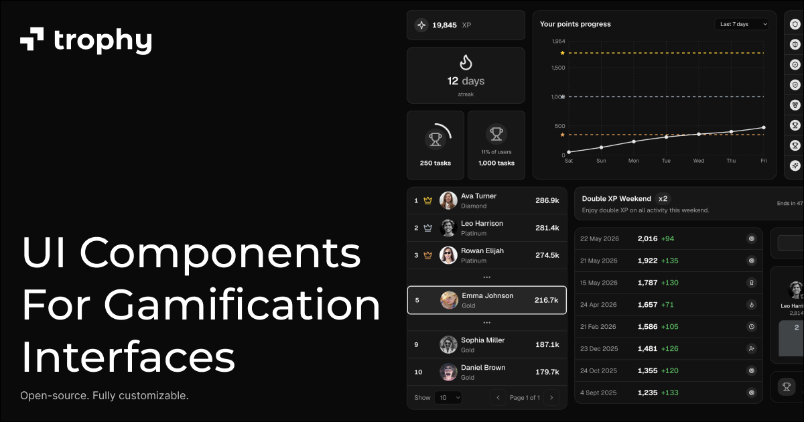

<Frame>
    
</Frame>

El Kit de UI de Gamificación de Trophy es una biblioteca de componentes construida sobre [shadcn/ui](https://ui.shadcn.com) que te ayuda a crear experiencias de gamificación más rápido. Proporciona componentes prediseñados para rachas, logros, clasificaciones, puntos y más.

El Kit de UI está diseñado para funcionar con cualquier plataforma de gamificación, pero todas las props y formas de datos están diseñadas intencionalmente para trabajar sin problemas con Trophy.

## Requisitos Previos {#prerequisites}

- **React 18+** — Los componentes son React del lado del cliente.
- **Tailwind v4+** — El estilo utiliza clases de utilidad de Tailwind. Configura Tailwind para que esas clases se compilen, y agrega los [tokens de tema semántico](https://ui.trophy.so/docs/styles) que Trophy espera (o mapéalos a tu sistema de diseño).
- **Estructura de shadcn/ui** — Mantén un proyecto que ya siga la configuración de [shadcn/ui](https://ui.shadcn.com/docs/installation) (`components.json`, alias y diseño opcional `src/`).

## Comenzar {#getting-started}

Los componentes están disponibles a través del CLI de shadcn:

```bash
npx shadcn@latest add https://ui.trophy.so/<component>
```

Por ejemplo, para instalar el componente Insignia de Racha:

```bash
npx shadcn@latest add https://ui.trophy.so/streak-badge
```

Una vez que un componente está instalado, puedes importarlo y usarlo como cualquier otro componente de React. Los archivos se agregan a tu proyecto (el mismo modelo de [código abierto](https://ui.shadcn.com/docs) que shadcn/ui), por lo que puedes ajustar el marcado y alinear los estilos con tu sistema de diseño.

Por ejemplo, después de instalar el componente [Insignia de Racha](https://ui.trophy.so/streak-badge), puedes componerlo en una página como la siguiente:

```tsx
"use client"

import { StreakBadge } from "@/components/ui/streak-badge"

export default function Page() {
  const streak = 7

  return (
    <div className="flex items-center justify-center p-8">
      <StreakBadge length={streak} />
    </div>
  )
}
```

La ruta de importación predeterminada es `@/components/ui/<component>`. Si tu `components.json` usa otro directorio o alias, actualiza la importación para que coincida.

Para props, variantes y formas de datos, usa la sección API de cada componente en su página de documentación—consulta [Todos los componentes](https://ui.trophy.so/docs/components) para ver la lista completa.