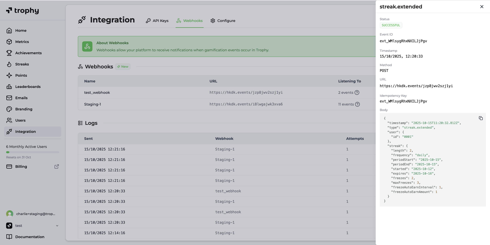

## Monitoreo de la Entrega de Webhooks {#monitoring-webhook-delivery}

El panel de Trophy cuenta con analíticas integradas para todos los eventos de webhook enviados a tus endpoints, incluyendo la visualización del estado de los eventos enviados y la carga útil.

<Frame>
  
</Frame>

## Retención de Datos {#data-retention}

Trophy retiene todos los registros de webhooks durante **7 días**. Si deseas discutir el aumento de tu período de retención de datos, por favor [contáctanos](mailto:support@trophy.so) y con gusto lo hablaremos contigo.

## Obtén Soporte {#get-support}

¿Quieres comunicarte con el equipo de Trophy? Contáctanos por [correo electrónico](mailto:support@trophy.so). ¡Estamos aquí para ayudarte!
