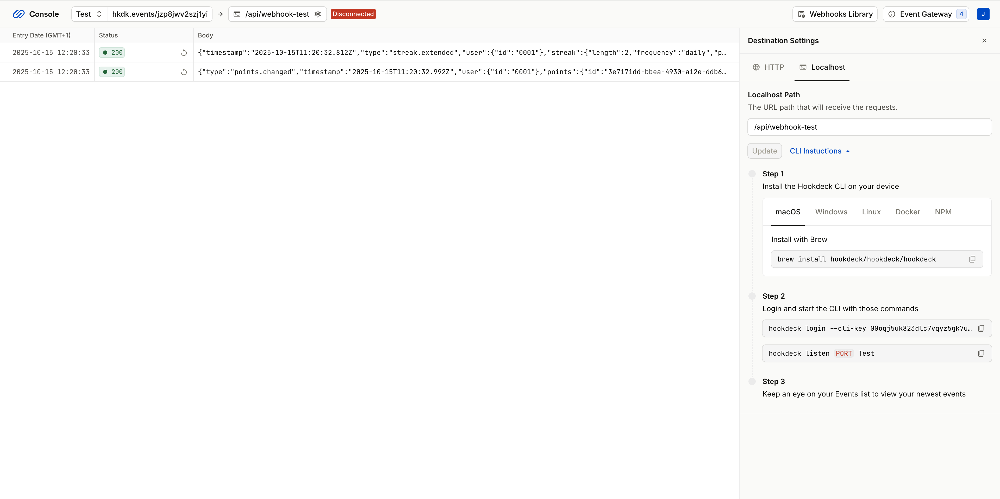
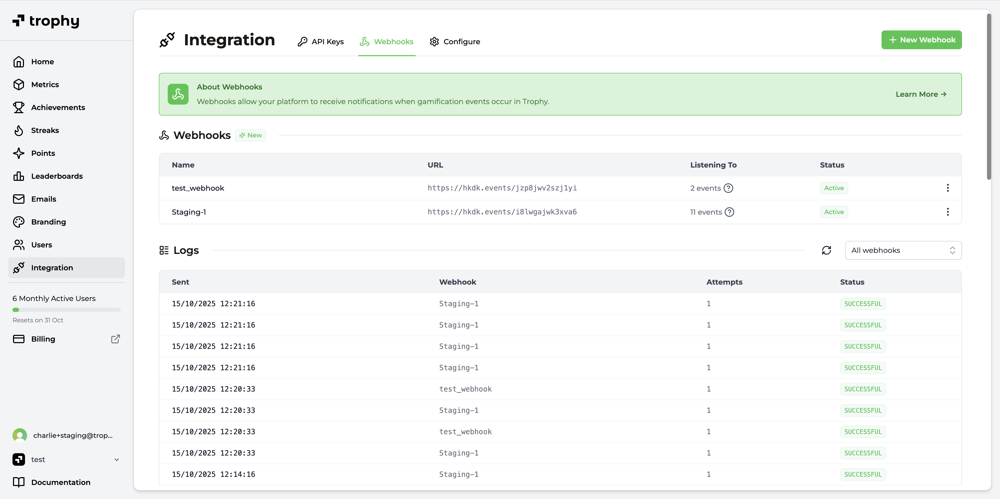

## Primeros pasos {#getting-started}

<Note>
  Si aún no tienes una cuenta de Trophy, sigue primero la [guía de inicio rápido
  de Trophy](/es/getting-started/quickstart) para comenzar.
</Note>

En Trophy puedes tener múltiples webhooks para manejar uno o más tipos de eventos. Sigue los pasos a continuación para comenzar a recibir eventos de webhook de Trophy.

<Frame>
  <iframe
    width="560"
    height="315"
    src="https://www.youtube.com/embed/_jtHmRqDcMM?si=DHl8d6i-jKJedCxZ"
    title="YouTube video player"
    frameborder="0"
    allow="accelerometer; autoplay; clipboard-write; encrypted-media; gyroscope; picture-in-picture"
    allowfullscreen
  ></iframe>
</Frame>

<Steps>
  <Step title="Crear webhook de prueba">
  Para desarrollar y probar webhooks, es útil usar un servicio de prueba que pueda hacer de proxy para los eventos de Trophy y enviarlos a tu entorno de desarrollo local.

Puedes elegir usar cualquier herramienta de desarrollo de webhooks que prefieras, pero recomendamos [Hookdeck Console](https://console.hookdeck.com).

Primero, accede a la plataforma de pruebas de webhooks de tu elección y crea un nuevo endpoint de prueba.

Luego, configura este endpoint para hacer de proxy con los eventos que recibe hacia tu entorno de desarrollo local.

<Frame>
  
</Frame>

  </Step>
  <Step title="Configurar webhook de prueba en Trophy">
    Una vez que tengas tu endpoint de prueba, dirígete a la página de [webhooks](https://app.trophy.so/integration/webhooks) del panel de Trophy y crea un nuevo webhook.

    - Asigna un nombre a tu nuevo webhook como 'Pruebas locales' o similar
    - Pega la URL de tu endpoint de prueba en el campo 'Webhook URL'
    - Selecciona los eventos de webhook a los que deseas suscribir este webhook
    - Guarda el nuevo webhook

    <Tip>
    Puedes modificar los eventos a los que el webhook está suscrito en cualquier momento después de su creación.
    </Tip>

    <Frame>

  
</Frame>

  </Step>
  <Step title="Escribir el manejador de webhook">
  Un manejador de webhook es simplemente un endpoint HTTP estándar capaz de recibir solicitudes `POST`.

Trophy enviará solicitudes a tu manejador, indicándole qué `type` de evento está enviando. Esto te permite construir un manejador que puede procesar múltiples tipos de eventos.

    Depende de ti cómo elijas escribir tu manejador, pero un patrón común es usar una declaración `switch`.

    Aquí hay un ejemplo de este patrón en NodeJS:

    ```js Handling Webhook Events
    switch (payload.type) {
        case "achievement.completed":
            // Handle achievement completed events
            break;
        case "leaderboard.started":
            // Handle leaderboard started events
            break;
        case "points.changed":
            // Handle points changed events
            break;
        case "points.level_changed":
            // Handle points level changed events
            break;
        default:
            // Handle unrecognised event type
            break;
    }
    ```

    <Warning>
    Asegúrate de que tu manejador de webhook esté configurado para devolver un código de estado `200`. Si Trophy detecta que tu manejador devuelve un código de estado que no es `2XX`, lo tratará como un fallo e [intentará la solicitud nuevamente](/es/webhooks/retries).
    </Warning>

  </Step>
  <Step title="Validar el comportamiento del webhook de prueba">
    Una vez que hayas escrito y asegurado tu manejador, estás listo para enviar tu primer evento de prueba.

    Usando un usuario de prueba, realiza interacciones en tu producto del tipo para el que deseas probar webhooks. Por ejemplo, si quieres probar el webhook `achievement.completed`, activa una finalización de logro en Trophy.

    Trophy enviará los eventos relevantes a tu URL de webhook y deberías verlos en tu herramienta de prueba de webhooks. Esto luego reenviará el evento a tu manejador de webhook local, activando la ejecución de tu código.

    Ahora puedes iterar en tu código hasta que estés satisfecho con la funcionalidad que deseas.

  </Step>
  <Step title="Asegurar el manejador de webhook">
  Para ayudarte a asegurar tu manejador de webhook de modo que solo responda a eventos enviados desde Trophy y no a atacantes maliciosos, Trophy incluye una firma de webhook con cada evento.

Esta firma se envía en el encabezado `X-Trophy-Signature` y es un hash codificado en `base64` de la carga útil de la solicitud, hash generado mediante un secreto de webhook seguro proporcionado por Trophy.

Para validar que los eventos que recibe tu manejador de webhooks provienen efectivamente de Trophy, necesitas crear tu propio hash utilizando tu secreto de webhook seguro y compararlo con la firma en el encabezado `X-Trophy-Signature`.

Obtén tu secreto de webhook seguro desde la página de webhooks en Trophy.

<Frame>
  <video
    autoPlay
    muted
    loop
    playsInline
    className="w-full aspect-15/4"
    src="../../assets/webhooks/copy_secret.mp4"
  ></video>
</Frame>

<Warning>
  Asegúrate de almacenar tu secreto de webhook en una variable de entorno segura y
  no lo envíes al control de versiones.
</Warning>

Una vez que tengas tu secreto de webhook, estás listo para comenzar a validar eventos. Aquí tienes un ejemplo en Node.js:

```js Validating Webhook Events
  // Extract X-Trophy-Signature header from the request
  const hmacHeader = request.headers.get("X-Trophy-Signature");

  // Create a hash based on the parsed body
  const hash = crypto
      .createHmac("sha256", process.env.TROPHY_WEBHOOK_SECRET as string)
      .update(await request.text())
      .digest("base64");

  // Compare the created hash with the value of the X-Trophy-Signature header
  if (hash === hmacHeader) {
      console.log("Webhook is originating from Trophy");
      // Request validated, continue processing
  } else {
      console.log("Signature is invalid, rejected");
      // Request is not from Trophy, reject with 4XX status
  }
```

<Warning>
  Si tu manejador detecta una solicitud que no se originó desde Trophy, es
  importante rechazar la solicitud lo antes posible con un código de estado `4XX`.
</Warning>

  </Step>
  <Step title="Crear webhook de producción">
    Una vez que estés satisfecho con la funcionalidad de tu webhook de prueba, crea un webhook completamente nuevo en Trophy con la misma configuración que tu webhook de prueba, pero esta vez con la URL de tu manejador de producción.

    <Note>
    Cada webhook en Trophy tiene un secreto de webhook único, así que no olvides agregarlo como una nueva variable de entorno en tu despliegue de producción.
    </Note>

  </Step>
</Steps>

## Ejemplo Completo de Webhook {#full-webhook-example}

Aquí tienes un ejemplo completo y funcional de un endpoint de webhook en NextJS capaz de recibir de forma segura eventos de webhook desde Trophy.

```ts Example NextJS Webhook Endpoint
import crypto from "crypto";

import { NextRequest, NextResponse } from "next/server";

interface WebhookPayload {
  type: string;
  [x: string]: unknown;
}

export async function POST(request: NextRequest) {
  // Extract 'X-Trophy-Signature' header from the request
  const hmacHeader = request.headers.get("X-Trophy-Signature");

  // Create a hash based on the parsed body
  const hash = crypto
    // copy this secret from the Webhooks page in Trophy
    .createHmac("sha256", process.env.TROPHY_WEBHOOK_SECRET as string)
    .update(await request.text())
    .digest("base64");

  // Compare the created hash with the value of the X-Trophy-Signature header
  if (hash === hmacHeader) {
    console.log("Webhook is originating from Trophy");

    handleEvent(request.body as unknown as WebhookPayload);

    return NextResponse.json({ message: "Webhook received" }, { status: 200 });
  } else {
    console.log("Signature is invalid, rejected");

    return NextResponse.json({ message: "Webhook rejected" }, { status: 403 });
  }
}

function handleEvent(payload: WebhookPayload) {
  switch (payload.type) {
    case "points.changed":
      console.log("Handling points changed event");
      break;
    case "points.level_changed":
      console.log("Handling points level changed event");
      break;
    case "streak.extended":
      console.log("Handling streak extended event");
      break;
    default:
      break;
  }
}
```

## Obtener Soporte {#get-support}

¿Quieres ponerte en contacto con el equipo de Trophy? Comunícate con nosotros por [correo electrónico](mailto:support@trophy.so). ¡Estamos aquí para ayudarte!
