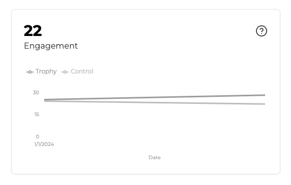
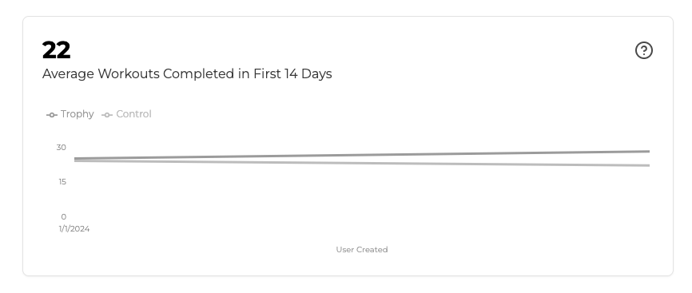

## What Is Engagement?

User engagement in Trophy refers to the average level of activity that your users show when using your product.

As Trohpy tracks user interactions through [Metrics](/platforms/metrics), it can give you insights into how active your users are against each, and in aggregate.

<Tip>
  Importantly, user engagement in Trophy is determined from the average total
  metric event value of all daily active users.
</Tip>

## Engagement Analytics

Trophy has dashboards that include engagement charts on each metric page and on the main Trophy dashboard that shows user engagement in aggregate.

<Frame>
  
</Frame>

Trophy also displays charts that show user engagement within users' first days after signing up for your product.

<Frame>
  
</Frame>

We refer to this as 'early engagement' and it is user engagement as measured by Trophy only for users within the timeframe set in the 'New User Activation Window' setting on the [integration page](https://app.trophy.so/integration/configure).

<Frame>
  
</Frame>

This is a useful chart for understanding the engagement of users within their very first days with your product and to understand where blockers to initial user activation may be occurring.

## Get Support

Want to get in touch with the Trophy team? Reach out to us via [email](mailto:support@trophy.so). We're here to help!
