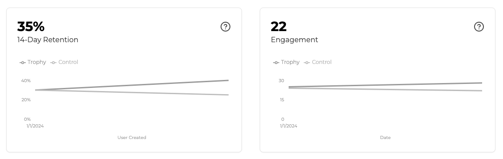

import ControlFlagBlock from "/snippets/control-flag-block.mdx";

Trophy provides a core set of primitives to help you ship gamification experiences faster. But gamification is not something you can set and forget.

A key part of running a gamified platform is experimentation — tweaking and optimizing the user experience to ensure that users keep coming back.

Usually, you'd have to build these tools yourself, but with Trophy you get a simple experimentation stack out-of-the-box.

<Tip>
  We have plans to extend Trophy's experimentation capabilities in the future to
  support more granular A/B testing of your gamification features.
</Tip>

## Control Ratio

Trophy has a built-in measure to automatically A/B test gamification feautres using a control ratio.

Found in the [integration page](https://app.trophy.so/integration/configure) of the Trophy dashboard, the control ratio adjusts the percentage of users that are assigned to the 'control' group verses the 'experimental' group.

<Frame>
  <video
    autoPlay
    muted
    loop
    playsInline
    className="w-full aspect-15/4"
    src="../assets/experimentation/control_ratio.mp4"
  ></video>
</Frame>

Trophy returns the `control` attribute as `true` or `false` in most APIs that relate to user data allowing you to conditionally show gamification feautres to users who are in the experiemental group.

<ControlFlagBlock />

<Note>
  Trophy also doesn't send any [Emails](/platform/emails) or [Push
  Notifications](/platform/push-notifications) to users who are in the control
  group.
</Note>

Analytics dashboards then compare retention and user engagement between users in the control and experimental groups allowing you to measure the impact of the features you build with Trophy and adjust mechanics where neccesary.

<Frame>
  
</Frame>

## Retention & Engagement

Both retention and user engagement are important metrics to use when measuring the impaact of changes to user experience. The following sections outline what each means and how it relates to features you build with Trophy.

<CardGroup>
  <Card title="Retention" icon="refresh-cw" href="/experimentation/retention">
    Learn how to measure the impact of gamification on retention
  </Card>
  <Card title="Engagement" icon="heart" href="/experimentation/engagement">
    Learn how to measure the impact of gamification on user engagement
  </Card>
</CardGroup>

## Get Support

Want to get in touch with the Trophy team? Reach out to us via [email](mailto:support@trophy.so). We're here to help!
