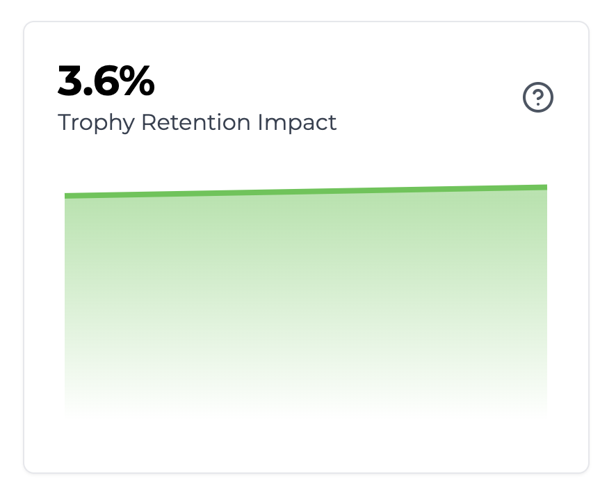

## What Is The Trophy Impact Score?

By default, Trophy only enrolls 90% of your users in any gamification emails. It leaves the other 10% out as a 'control cohort'.

Trophy then automatically tracks the 14-day retention of the two cohorts and compares them, resulting in the Trophy Impact Score.

<Frame>
  
</Frame>

The Trophy Impact Score reflects the percentage difference in 14-day retention between the control cohort and the rest of your userbase.

<Tip>
  An Impact Score of 5% means that users enrolled in gamification features are
  5% more likely to be using your platform after 14 days than the control
  cohort.
</Tip>

## Customizing the control ratio

If you'd prefer to use a different ratio of control to non-control users then you can do so on the [Integration](https://app.trophy.so/integration) page.

Use the slider to change the percentage of your userbase that will be set as control users and opted out of gamification emails.

<Frame>
  <video
    autoPlay
    muted
    loop
    playsInline
    className="w-full aspect-15/4"
    src="../assets/experimentation/trophy_impact_score/control_ratio.mp4"
  ></video>
</Frame>

## Get Support

Want to get in touch with the Trophy team? Reach out to us via [email](mailto:support@trophy.so). We're here to help!
