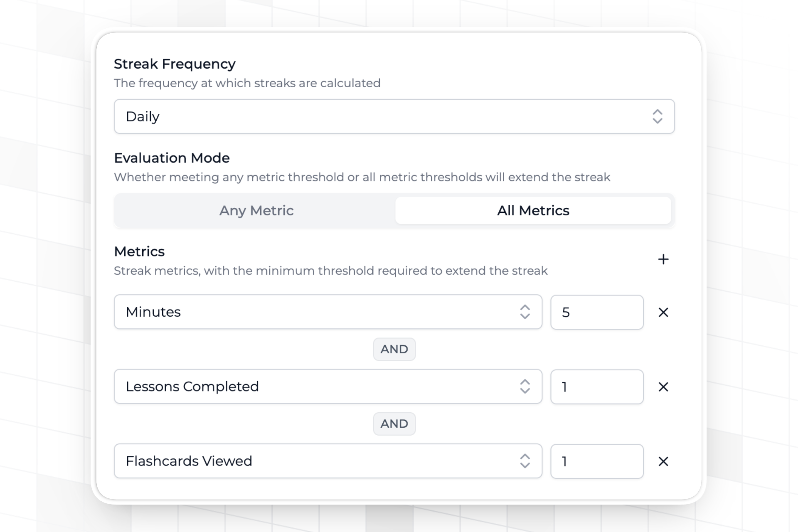
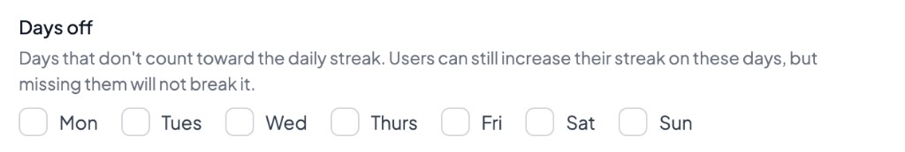
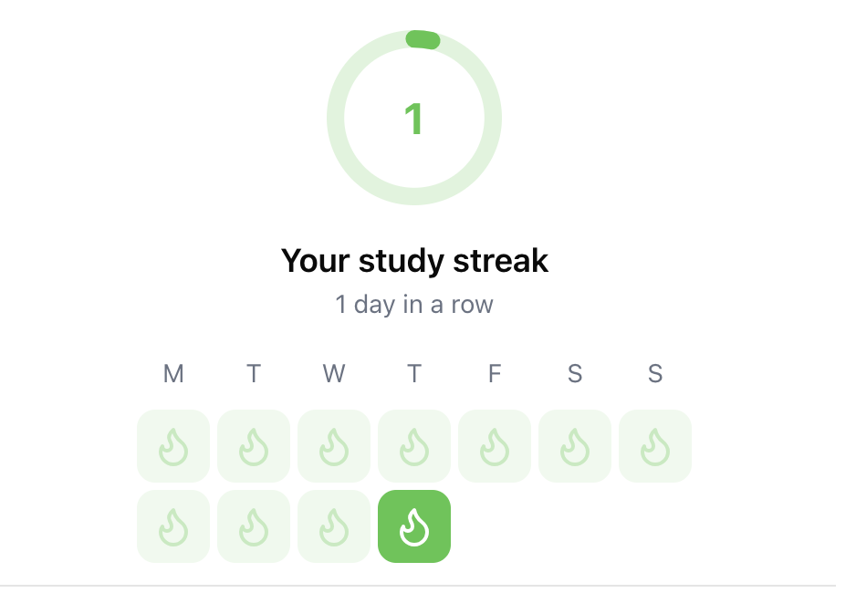

import MetricChangeResponseBlock from "../snippets/metric-change-response-block.mdx";

## What are Streaks? {#what-are-streaks}

A streak is a period of consecutive days, weeks or months that a user has performed a key action on your platform. Streaks have been shown to meaningfully increase retention, particularly when the user action being tracked aligns with the core value of your product.

## Streak Frequency {#streak-frequency}

Streaks in Trophy can be **daily, weekly or monthly**. This means that a user must meet their [streak conditions](#streak-conditions) at least once every calendar day, week or month to maintain their streak.

If you've [configured time zones](/features/users#param-tz) for your users, Trophy will automatically track each user's streak in their local time zone (including taking into account when users change time zones) and keep streaks in tact.

<Note>
Trophy automatically computes streak data for every streak frequency, meaning you can switch at any time.
</Note>

## Streak Conditions {#streak-conditions}

In Trophy you can set the thresholds that a user must meet in order to extend their streak based on your configured [Metrics](/features/metrics).

You can choose which metrics should be part of your streak, and for those that you chose, you can set a custom threshold that users must meet.

<Frame>
  
</Frame>

When combining metrics in this way, you can choose between two evaluation modes:
- `ALL` means a user must meet every metric threshold to extend their streak
- `OR` means a user only has to meet one of your metric thresholds to extend their streak

In this way you can design your streak logic to match your application use case.

### Days Off {#days-off}

For daily streaks, you can mark specific days of the week as days off on the [streaks page](https://app.trophy.so/streaks) of the Trophy dashboard. Those days do not count toward the streak: users can still extend their streak if they are active, but missing a day off will not break it.

<Frame>
  
</Frame>

You must leave at least one day that counts toward the streak. Weekly and monthly streaks ignore days off.

Unlike [streak freezes](#streak-freezes), days off are not consumed. They apply every week until you change them.

If you've enabled [streak personalization](#streak-personalization), users can override the default days off through [user preferences](/features/users#streak-preferences).

## Streak Freezes {#streak-freezes}

Streak freezes help users keep their streaks for longer by allowing them to miss a set number ofperiods without it resetting to zero. This helps keep streaks motivating even if users don't maintain a perfect usage habit.

Streak freezes are optional and can be configured on the [streaks page](https://app.trophy.so/streaks) of the Trophy dashboard.

When enabled, you decide how many freezes a user can have, and how many are granted to them over time. When a user misses a period, one freeze is consumed. Freezes are consumed until users have no freezes left, at which point the user's streak is reset to zero.

<Note>
Streak freezes are different from [streak pauses](#streak-pauses) in that freezes allow users to miss a set number of days (or periods) without breaking their streak, regardless of the reason, while streak pauses specifically protect a streak over a known and pre-defined date range, such as a scheduled vacation or break. Freezes are consumed automatically when the user misses a required activity, whereas pauses are manually created in advance to cover planned absences.
</Note>

### Granting Freezes {#granting-freezes}

You can configure any number of arbitrary freezes to grant to new users when you first identify them with Trophy. To set this up, enable freeze grants and set the starting freeze count on the [streaks page](https://app.trophy.so/streaks) of the Trophy dashboard.

<Frame>
  <video
    autoPlay
    muted
    loop
    playsInline
    className="w-full aspect-15/4"
    src="../assets/features/streaks/freeze_grants.mp4"
  ></video>
</Frame>

### Freeze Accumulation {#freeze-accumulation}

Trophy can automatically grant streak freezes to users over time. You can choose an arbitrary number of days over which to grant an arbitrary number of freezes to each user.

To set this up, set the number of days over which to grant freezes and the number of freezes to grant on the [streaks page](https://app.trophy.so/streaks) of the Trophy dashboard. Here you can also set the maximum number of freezes that each user can have, up to a limit of 100.

<Frame>
  <video
    autoPlay
    muted
    loop
    playsInline
    className="w-full aspect-15/4"
    src="../assets/features/streaks/freeze_accumulation.mp4"
  ></video>
</Frame>

<Tip>
If you've [configured time zones](/features/users#param-tz) for your users, Trophy will automatically consume freezes at midnight in the user's time zone when necessary to extend their streak, and if any new freezes are due to be granted to a user, they will be granted up to ten minutes later.
</Tip>

## Streak Pauses {#streak-pauses}

Streak pauses protect a user's streak over a known date range, such as a vacation or other planned break. While a pause covers a period, Trophy maintains the user's streak length instead of ending the streak if they miss their [streak conditions](#streak-conditions).

<Note>
Streak pauses are different from [streak freezes](#streak-freezes) in that pauses specifically protect a user's streak over a known and pre-defined date range, such as a scheduled vacation or break, while freezes allow users to miss a set number of days (or periods) without breaking their streak, regardless of the reason. Pauses are manually created in advance to cover planned absences, whereas freezes are consumed automatically when the user misses a required activity.
</Note>

### Creating Pauses {#creating-pauses}

Create pauses with the [create streak pauses admin API](/admin-api/endpoints/streaks/create-pauses). You can create pauses for up to 100 users in a single request.

Each pause requires:

- `userId`: the user to create a pause for
- `start`: the first date the pause covers
- `end`: the last date the pause covers

Start dates in the past are rejected. If you've [configured time zones](/features/users#param-tz) for your users, Trophy evaluates `start` against today in each user's local timezone.

### Deleting Pauses {#deleting-pauses}

To stop a pause from applying, delete it with the [delete streak pauses admin API](/admin-api/endpoints/streaks/delete-pauses).

### Reading Pauses {#reading-pauses}

The [user streaks API](/api-reference/endpoints/users/get-a-users-streak) returns upcoming and currently active pauses in the `pauses` field. Past and deleted pauses are omitted.

Each period in `streakHistory` includes `usedPause`, which is `true` when the user's streak was paused during that period.

## Tracking Streaks {#tracking-streaks}

Trophy automatically calculates streaks for all users based on the [metric events](/features/events#tracking-metric-events) you report to Trophy.

There's no extra work required to track streaks, and you can start using them right away. Just make sure that streaks are enabled in the Trophy dashboard.

<Tip>
For a full walk through on how to set up a streak feature using Trophy, check out our [official guide](/guides/how-to-build-a-streaks-feature).
</Tip>

## Streak Personalization {#streak-personalization}

Trophy can support users personalizing how their streak works within guardrails you set for them. To do this, turn on streak personalization in the [streaks page](https://app.trophy.so/streaks) of the Trophy dashboard.

Once enabled, users will be able to customize the [streak conditions](#streak-conditions) that they must meet to extend their streak, including streak evaluation mode, the threshold for each metric, and [days off](#days-off), through user preferences.

<Tip>
To learn more about how to set user preferences for a specific user, read the dedicated documentation on [user preferences](/features/users#streak-preferences).
</Tip>

<Frame>
  <video
    autoPlay
    muted
    loop
    playsInline
    className="w-full aspect-15/4"
    height="200"
    width="100%"
    noZoom
    src="../assets/features/streaks/streak_personalization.mp4"
  />
</Frame>

## Managing Streaks {#managing-streaks}

This section outlines some of the operations you can perform to manage user's streaks in your application.

### Restoring A User's Streak {#restoring-a-users-streak}

To restore a user's streak, head to the user details page and use the 'Restore Streak' action. Restoring a user's streak sets it to the length it was when they last lost it.

<Tip>
You can also use the [restore streak admin API](/admin-api/endpoints/streaks/restore-streaks) to restore streaks programmatically.
</Tip>

<Frame>
  <video
    autoPlay
    muted
    loop
    playsInline
    className="w-full aspect-15/4"
    src="../assets/features/streaks/restoring_streaks.mp4"
  ></video>
</Frame>

## Displaying Streaks {#displaying-streaks}

Trophy exposes streak data in two ways, which can be used to build UI elements within your applications and display streaks to users.

<Tip>
  Check out our [full guide](/guides/how-to-build-a-streaks-feature) on adding a
  streaks feature to your app for more details.
</Tip>

### Metric Event Response {#metric-event-response}

When you [increment a metric](/features/events#tracking-metric-events) for a user, the [metric API](/api-reference/endpoints/events/submit-a-metric-event) response will include the user's current
streak.

<MetricChangeResponseBlock />

This can be used to transactionally trigger UI/UX elements including:

- Showing in-app pop-ups
- Playing sound effects

### User Streaks API {#user-streaks-api}

The [user streaks API](/api-reference/endpoints/users/get-a-users-streak) returns the current streak for a single user, along with their recent streak history and any upcoming or active [streak pauses](#streak-pauses). Use the `historyPeriods` query parameter to control how many periods to return.

{/* vale off */}

```json Response [expandable]
{
  "length": 1,
  "frequency": "weekly",
  "started": "2025-04-02",
  "periodStart": "2025-03-31",
  "periodEnd": "2025-04-05",
  "expires": "2025-04-12",
  "rank": 5,
  "pauses": [
    {
      "id": "550e8400-e29b-41d4-a716-446655440000",
      "start": "2026-08-20",
      "end": "2026-08-27"
    }
  ],
  "streakHistory": [
    {
      "periodStart": "2025-03-02",
      "periodEnd": "2025-03-08",
      "length": 9,
      "usedPause": false
    },
    {
      "periodStart": "2025-03-09",
      "periodEnd": "2025-03-15",
      "length": 0,
      "usedPause": false
    },
    {
      "periodStart": "2025-03-16",
      "periodEnd": "2025-03-22",
      "length": 0,
      "usedPause": false
    },
    {
      "periodStart": "2025-03-23",
      "periodEnd": "2025-03-29",
      "length": 1,
      "usedPause": false
    },
    {
      "periodStart": "2025-03-30",
      "periodEnd": "2025-04-05",
      "length": 2,
      "usedPause": false
    },
    {
      "periodStart": "2025-04-06",
      "periodEnd": "2025-04-12",
      "length": 3,
      "usedPause": false
    },
    {
      "periodStart": "2025-04-13",
      "periodEnd": "2025-04-19",
      "length": 4,
      "usedPause": false
    }
  ]
}
```

{/* vale on */}

Use this data to display a user's streak history within your application.

<Frame>
  
</Frame>

### List Multiple User's Streaks {#list-multiple-users-streaks}

If you want to display streaks for multiple users at once, for example to support a friend streak or user group feature, then use the [list user streaks API](/api-reference/endpoints/streaks/get-streaks).

```json [expandable]
[
  {
    "userId": "user-123",
    "streakLength": 15,
    "extended": "2025-01-01T05:03:00Z"
  },
  {
    "userId": "user-456",
    "streakLength": 12,
    "extended": "2025-01-01T08:43:00Z"
  },
  {
    "userId": "user-789",
    "streakLength": 0,
    "extended": null
  }
]
```

## Get Support {#get-support}

Want to get in touch with the Trophy team? Reach out to us via [email](mailto:support@trophy.so). We're here to help!
