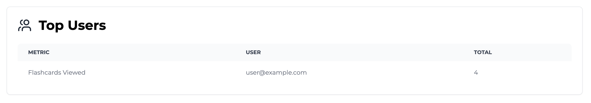
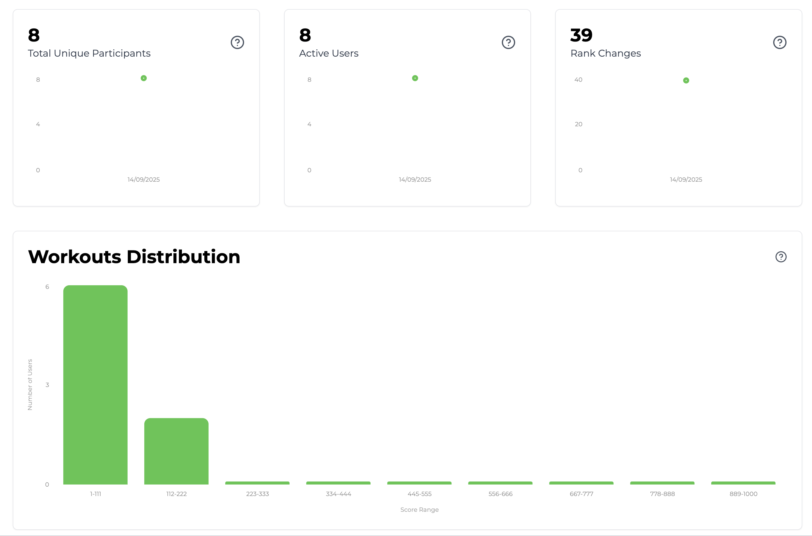
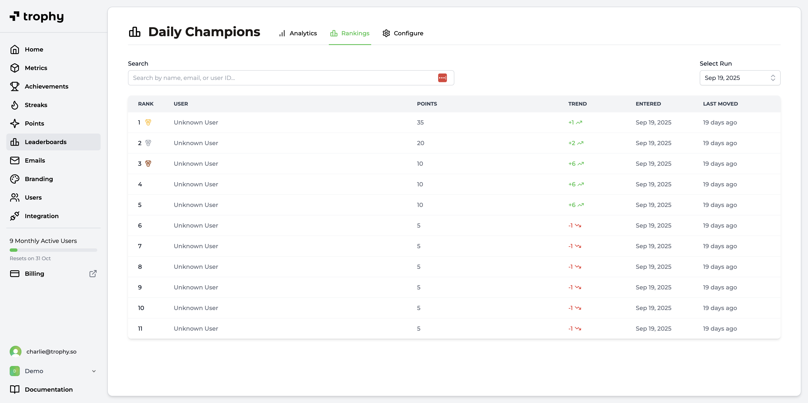

import SDKInstallCommand from "/snippets/sdk-install-command.mdx";
import MetricChangeRequestBlock from "/snippets/metric-change-request-block.mdx";
import LeaderboardRankingsRequest from "/snippets/leaderboard-rankings-request.mdx";
import LeaderboardRankingsResponse from "/snippets/leaderboard-rankings-response.mdx";
import UserLeaderboardRankingsRequest from "/snippets/user-leaderboard-rankings-request.mdx";
import UserLeaderboardRankingsResponse from "/snippets/user-leaderboard-rankings-response.mdx";

The guide outlines the full process of adding a leaderboards feature to your web or mobile app using Trophy.

For illustration purposes we'll use the example of a study platform that uses a daily leaderboard to create friendly competition around viewing flashcards.

<Tip>
  To see a fully working example of this in practice, check out the [live
  demo](https://examples.trophy.so) or [github
  repo](https://github.com/trophyso/example-study-platform/tree/demo).
</Tip>

## Pre-requisites

- A [Trophy](https://app.trophy.so/sign-up) account
- About 10 minutes

## Trophy Setup

In Trophy, [Metrics](/platform/metrics) are the building blocks of gamification and model the different interactions users make with your product.

In this guide the interaction we're interested in is `flashcards-viewed`, but you can create a metric that best represents the interaction you want to build leaderboards around.

In the Trophy dashboard, head to the [metrics page](https://app.trophy.so/metrics) and create a metric.

<Frame>
  <video
    autoPlay
    muted
    loop
    playsInline
    className="w-full aspect-video"
    src="../assets/guides/achievements-feature/create_new_metric.mp4"
  ></video>
</Frame>

Once you've created your metric, head to the [leaderboards page](https://app.trophy.so/leaderboards) and create the leaderboards you want. You can find all the details on the types of leaderboards and the different use cases in the [leaderboards docs](/platform/leaderboards).

<Frame>
  <video
    autoPlay
    muted
    loop
    playsInline
    className="w-full aspect-video"
    src="../assets/guides/leaderboards-feature/creating_leaderboards.mp4"
  ></video>
</Frame>

For the purposes of this guide we've set up a daily leaderboard that tracks the total XP a user earns by viewing flashcards.

<Tip>
  For a full guide on adding an XP feature to your web or mobile app, check out
  our [full guide](/guides/how-to-build-an-xp-feature).
</Tip>

In Trophy you track user interactions by sending [Events](/platform/events) from your code to Trophy APIs against a specific metric.

When events are recorded for a specific user, Trophy automatically updates their ranking in each leaderboard they are a part of.

This is what makes building gamified experiences with Trophy so easy, it does all the work for you behind the scenes.

## Installing Trophy SDK

To interact with Trophy from your code you'll use the Trophy SDK available in most major [programming languages](/api-reference/client-libraries).

Install the Trophy SDK:

<SDKInstallCommand />

Next, grab your API key from the Trophy [integration page](https://app.trophy.so/integration) and add this as a **server-side only** environment variable.

```bash
TROPHY_API_KEY='*******'
```

<Warning>
  Make sure you **don't** expose your API key in client-side code.
</Warning>

## Tracking User Interactions

To track an event (user interaction) against your metric, use the [metric change API](/api-reference/endpoints/metrics/send-a-metric-change-event).

<MetricChangeRequestBlock />

The response to this API call is the complete set of changes to any features you've built with Trophy, including any changes to their ranking in any leaderboards they are a part of.

{/* vale off */}

```json Response [expandable]
{
  "metricId": "d01dcbcb-d51e-4c12-b054-dc811dcdc623",
  "eventId": "0040fe51-6bce-4b44-b0ad-bddc4e123534",
  "total": 750,
  ...,
  "leaderboards": {
    "daily_champions": {
      "id": "0040fe51-6bce-4b44-b0ad-bddc4e123535",
      "key": "daily_champions",
      "name": "Daily Champions",
      "description": null,
      "rankBy": "metric",
      "runUnit": null,
      "runInterval": 0,
      "maxParticipants": 100,
      "metricName": "Flashcards Flipped",
      "metricKey": "flashcards-flipped",
      "threshold": 10,
      "start": "2025-01-01",
      "end": null,
      "previousRank": 50,
      "rank": 12
    }
  }
}
```

{/* vale on */}

Validate this is working by checking the Trophy [dashboard](https://app.trophy.so).

<Frame>
  
</Frame>

## Displaying Leaderboards

You have a number of options for displaying leaderboards in your application. Here we'll look at the most common options.

### Pop-up Notifications

We can use the response of the [metric change API](/api-reference/endpoints/metrics/send-a-metric-change-event) to show pop-up notifications (or 'toasts') when users move up the rankings.

Here's an example of this in action:

```ts Leaderboard Rank Up Pop-up
// Sends event to Trophy
const response = await viewFlashcard();

if (!response) {
  return;
}

const leaderboard = response.leaderboards["daily_champions"];

if (!leaderboard) {
  return;
}

// Show toasts if the user moved up the leaderboard
if (leaderboard.rank > leaderboard.previousRank) {
  toast({
    title: "You're on the move!,
    description: `You moved up ${leaderboard.previousRank - leaderboard.rank} places!,
  });
}
```

<Tip>
  If you want to play sound effects, use the [HTML5 Audio
  API](https://developer.mozilla.org/en-US/docs/Web/API/Web_Audio_API) and feel
  free to steal these [audio
  files](https://github.com/trophyso/example-study-platform/tree/demo/public/sounds)
  we recommend.
</Tip>

### Displaying Leaderboard Rankings

To fetch a leaderboard and its most up to date rankings, use the [leaderboard API](/api-reference/endpoints/leaderboards/get-leaderboard).

<LeaderboardRankingsRequest />

<Tip>
  You can also use the `run` parameter with the date of the specific past 'run'
  of a leaderboard you want to fetch data for.
</Tip>

Here's an example of the data returned from the leaderboard API:

<LeaderboardRankingsResponse />

### Displaying User Rank History

Use the [user leaderboard API](/api-reference/endpoints/users/get-a-users-leaderboard) to fetch data on how a specific user's rank has changed over time in a particular leaderboard.

<UserLeaderboardRankingsRequest />

Here's an example of the data returned from the user leaderboard rankings API which includes the users current rank in the `rank` attribute and an array of previous ranks in the `history` attribute:

<UserLeaderboardRankingsResponse />

## Analytics

The [leaderboards page](https://app.trophy.so/achievements) in Trophy shows how many users are actively participating in a leaderboard, as well as a measure of competitiveness based on how many rank changes are occurring.

The analytics page also shows a distribution of users scores to help identify clusters of users within rankings.

<Frame>
  
</Frame>

Additionally the leaderboard rankings page shows current and past rankings of a leaderboard:

<Frame>
  
</Frame>

## Get Support

Want to get in touch with the Trophy team? Reach out to us via [email](mailto:support@trophy.so). We're here to help!
