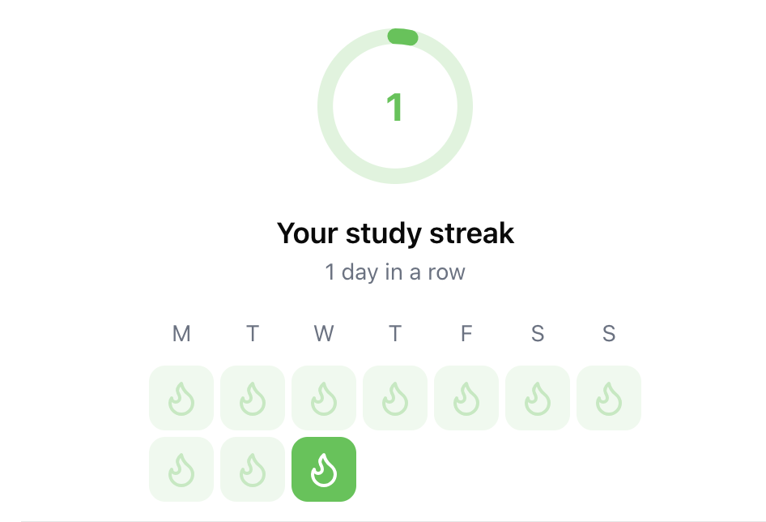
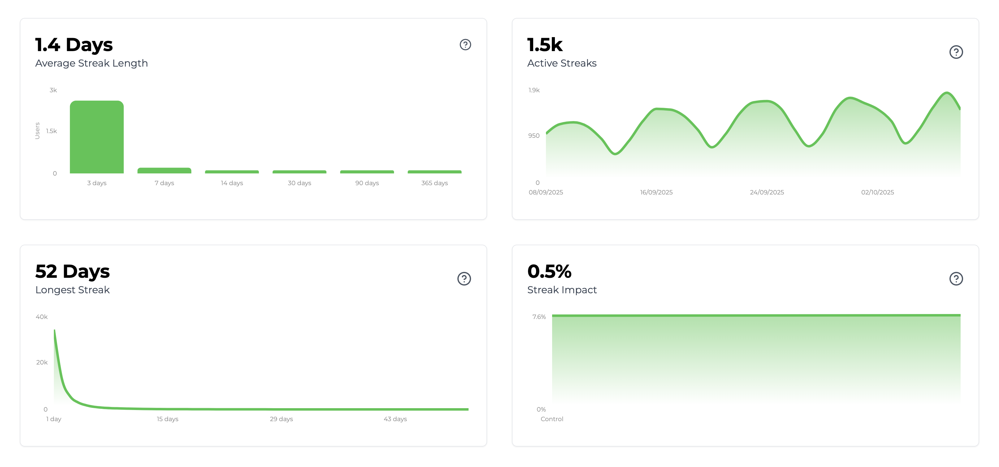

import SDKInstallCommand from "/snippets/sdk-install-command.mdx";
import MetricChangeRequestBlock from "/snippets/metric-change-request-block.mdx";
import MetricChangeResponseBlock from "/snippets/metric-change-response-block.mdx";
import StreakRequestBlock from "/snippets/streak-request-block.mdx";
import StreakResponseBlock from "/snippets/streak-response-block.mdx";

The guide outlines the full process of adding a streaks feature to your web or mobile app using Trophy.

For illustration purposes we'll use the example of a study platform that uses a daily streak to incentivize and reward users for viewing flashcards.

<Tip>
  To see a fully working example of this in practice, check out the [live
  demo](https://examples.trophy.so) or [github
  repo](https://github.com/trophyso/example-study-platform/tree/demo).
</Tip>

## Pre-requisites

- A [Trophy](https://app.trophy.so/sign-up) account
- About 10 minutes

## Trophy Setup

In Trophy, [Metrics](/platform/metrics) are the building blocks of gamification and model the different interactions users make with your product.

In this guide the interaction we're interested in is `flashcards-viewed`, but you can create a metric that best represents the interaction you want to drive streaks from.

In the Trophy dashboard, head to the [metrics page](https://app.trophy.so/metrics) and create a metric.

<Frame>
  <video
    autoPlay
    muted
    loop
    playsInline
    className="w-full aspect-video"
    src="../assets/guides/achievements-feature/create_new_metric.mp4"
  ></video>
</Frame>

Once you've created your metric, head to the [streaks page](https://app.trophy.so/streaks/configure) and select the streak frequency you want (daily, weekly or monthly). Then select the metric you created in the dropdown.

In Trophy you track user interactions by sending [Events](/platform/events) from your code to Trophy APIs against a specific metric.

When events are recorded for a specific user, Trophy will automatically check if the event is against a metric that is selected in your streak settings and update the user's streak accordingly.

This is what makes building gamified experiences with Trophy so easy, it does all the work for you behind the scenes.

## Installing Trophy SDK

To interact with Trophy from your code you'll use the Trophy SDK available in most major [programming languages](/api-reference/client-libraries).

Install the Trophy SDK:

<SDKInstallCommand />

Next, grab your API key from the Trophy [integration page](https://app.trophy.so/integration) and add this as a **server-side only** environment variable.

```bash
TROPHY_API_KEY='*******'
```

<Warning>
  Make sure you **don't** expose your API key in client-side code.
</Warning>

## Tracking User Interactions

To track an event (user interaction) against your metric, use the [metric change API](/api-reference/endpoints/metrics/send-a-metric-change-event).

<MetricChangeRequestBlock />

<Tip>
  By including the user's timezone in the `tz` attribute, Trophy will
  automatically track streaks according to the user's local clock and handle
  awkward edge cases where users change time zones.
</Tip>

The response to this API call is the complete set of changes to any features you've built with Trophy, including the latest data on the users streak.

<MetricChangeResponseBlock />

Validate this is working by checking the Trophy [dashboard](https://app.trophy.so).

## Displaying Streaks

You have a number of options for displaying streaks in your application. Here we'll look at the most common options.

### Pop-up Notifications

We can use the response of the [metric change API](/api-reference/endpoints/metrics/send-a-metric-change-event) to show pop-up notifications (or 'toasts') when user extends their streak.

Here's an example of this in action:

```ts Streak Extended Pop-up
// Sends event to Trophy
const response = await viewFlashcard();

if (!response) {
  return;
}

// Show toast if user has extended their streak
if (response.currentStreak?.extended) {
  toast({
    title: "You're on a roll!",
    description: `Keep going to keep your ${response.currentStreak.length} day streak!`,
  });
}
```

<Frame>
  <video
    autoPlay
    muted
    loop
    playsInline
    className="w-full aspect-video"
    src="../assets/guides/streaks-feature/streak-toasts.mp4"
  ></video>
</Frame>

<Tip>
  If you want to play sound effects, use the [HTML5 Audio
  API](https://developer.mozilla.org/en-US/docs/Web/API/Web_Audio_API) and feel
  free to steal these [audio
  files](https://github.com/trophyso/example-study-platform/tree/demo/public/sounds)
  we recommend.
</Tip>

### Displaying User Streaks

To fetch data on a user's streak use the [user streak API](/api-reference/endpoints/users/get-a-users-streak).

<StreakRequestBlock />

This API not only returns data on the user's current streak like `length` and `expires`, but it can also return historical streak data which can be used to display any kind of streak UI you like through the `historyPeriods` parameter.

<StreakResponseBlock />

Here's an example of a git-style streak calendar built using the data in the response above:

<Frame>
  
</Frame>

<Tip>
  Check this [example
  repo](https://github.com/trophyso/example-study-platform/blob/demo/src/app/user-center/study-center/default-view.tsx)
  for a React component that drives this UI using data from Trophy.
</Tip>

## Analytics

The [streaks page](https://app.trophy.so/streaks) in Trophy shows data on active streaks, the average length of streaks and longest streaks.

<Frame>
  
</Frame>

## Streak Freezes

Trophy also supports streak freezes which can help prevent users from losing their streak if they accidentally miss a period.

Learn more about streak freezes in the dedicated [streak freezes docs](/platform/streaks#streak-freezes).

## Get Support

Want to get in touch with the Trophy team? Reach out to us via [email](mailto:support@trophy.so). We're here to help!
