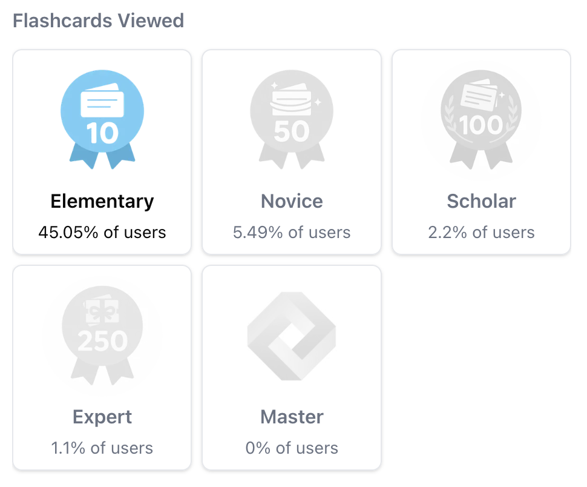

import SDKInstallCommand from "/snippets/sdk-install-command.mdx";
import MetricChangeRequestBlock from "/snippets/metric-change-request-block.mdx";
import MetricChangeResponseBlock from "/snippets/metric-change-response-block.mdx";
import UserAchievementsRequestBlock from "/snippets/user-achievements-request-block.mdx";
import AllAchievementsRequestBlock from "/snippets/all-achievements-request-block.mdx";

The guide outlines the full process of adding an achievements feature to your web or mobile app using Trophy.

For illustration purposes we'll use the example of a study platform that uses achievements to incentivize and reward users for viewing flashcards.

<Tip>
  To see a fully working example of this in practice, check out the [live
  demo](https://examples.trophy.so) or [github
  repo](https://github.com/trophyso/example-study-platform/tree/demo).
</Tip>

## Pre-requisites

- A [Trophy](https://app.trophy.so/sign-up) account
- About 10 minutes

## Trophy Setup

In Trophy, [Metrics](/platform/metrics) are the building blocks of gamification and model the different interactions users make with your product.

In this guide the interaction we're interested in is `flashcards-viewed`, but you can create a metric that best represents the interaction you want to build achievements around.

In the Trophy dashboard, head to the [metrics page](https://app.trophy.so/metrics) and create a metric.

<Frame>
  <video
    autoPlay
    muted
    loop
    playsInline
    className="w-full aspect-video"
    src="../assets/guides/achievements-feature/create_new_metric.mp4"
  ></video>
</Frame>

Once you've created your metric, head to the [achievements page](https://app.trophy.so/achievements) and create the achievements you want. You can find all the details on the types of achievements and the different use cases in the [achievements docs](/platform/achievements).

For the purposes of this guide we've set up a couple of achievements based on an increasing number of flashcards flipped:

- 10 flashcards
- 50 flashcards
- 100 flashcards
- 250 flashcards
- 1,000 flashcards

We've also set up a few achievements related to [Streaks](/platform/streaks), but we won't go into detail on these in this guide.

<Tip>
  For a full guide on adding a streaks feature to your web or mobile app, check
  out our [full guide](/guides/how-to-build-a-streaks-feature).
</Tip>

In Trophy you track user interactions by sending [Events](/platform/events) from your code to Trophy APIs against a specific metric.

When events are recorded for a specific user, any achievements linked to the specified metric will be **completed automatically** if the requirements are met.

This is what makes building gamified experiences with Trophy so easy, it does all the work for you behind the scenes.

## Installing Trophy SDK

To interact with Trophy from your code you'll use the Trophy SDK available in most major [programming languages](/api-reference/client-libraries).

Install the Trophy SDK:

<SDKInstallCommand />

Next, grab your API key from the Trophy [integration page](https://app.trophy.so/integration) and add this as a **server-side only** environment variable.

```bash
TROPHY_API_KEY='*******'
```

<Warning>
  Make sure you **don't** expose your API key in client-side code.
</Warning>

## Tracking User Interactions

To track an event (user interaction) against your metric, use the [metric change API](/api-reference/endpoints/metrics/send-a-metric-change-event).

<MetricChangeRequestBlock />

The response to this API call is the complete set of changes to any features you've built with Trophy, including any achievements that were unlocked as a result of the event.

<MetricChangeResponseBlock />

Validate this is working by checking the Trophy [dashboard](https://app.trophy.so).

<Frame>
  
</Frame>

## Displaying Achievements

You have a number of options for displaying achievements in your application. Here we'll look at the most common options.

### Pop-up Notifications

We can use the response of the [metric change API](/api-reference/endpoints/metrics/send-a-metric-change-event) to show pop-up notifications (or 'toasts') when users complete achievements.

Here's an example of this in action:

```ts Achievement Completed Pop-up
// Sends event to Trophy
const response = await viewFlashcard();

if (!response) {
  return;
}

// Show toasts if the user has unlocked any new achievements
response.achievements.forEach((achievement) => {
  toast({
    title: achievement.name,
    description: achievement.description,
    image: {
      src: achievement.badgeUrl,
      alt: achievement.name,
    },
  });
});
```

<Frame>
  <video
    autoPlay
    muted
    loop
    playsInline
    className="w-full aspect-video"
    src="../assets/guides/achievements-feature/displaying-toasts.mp4"
  ></video>
</Frame>

<Tip>
  If you want to play sound effects, use the [HTML5 Audio
  API](https://developer.mozilla.org/en-US/docs/Web/API/Web_Audio_API) and feel
  free to steal these [audio
  files](https://github.com/trophyso/example-study-platform/tree/demo/public/sounds)
  we recommend.
</Tip>

### Displaying User Achievements

To fetch all achievements a user has completed, use the [user achievements API](/api-reference/endpoints/users/get-a-users-completed-achievements).

<UserAchievementsRequestBlock />

<Tip>
  You can also fetch incomplete achievements at the same time by passing
  `includeIncomplete` as `'true'`.
</Tip>

<Frame>
  <video
    autoPlay
    muted
    loop
    playsInline
    className="w-full aspect-video"
    src="../assets/guides/achievements-feature/displaying_trophy_cabinet.mp4"
  ></video>
</Frame>

### Displaying All Achievements

If instead you want to display all achievements you've set up in Trophy as part of a globally accessible UI that isn't linked to a particular user, you can use the [all achievements API](/api-reference/endpoints/achievements/all-achievements).

<AllAchievementsRequestBlock />

### Achievement Completion Stats

Both the user achievements API and the all achievements API include completion
statistics like `completions` (the number of users that have completed an
achievement) and `rarity` (the percentage of users that have completed an
achievement).

<Frame>
  
</Frame>

## Analytics

The [achievements page](https://app.trophy.so/achievements) in Trophy shows how many users have completed each achievement you've set up.

<Frame>
  
</Frame>

Additionally the analytics page on any metric in Trophy includes a chart that shows the progress of users through your achievements.

<Frame>
  
</Frame>

## Get Support

Want to get in touch with the Trophy team? Reach out to us via [email](mailto:support@trophy.so). We're here to help!
