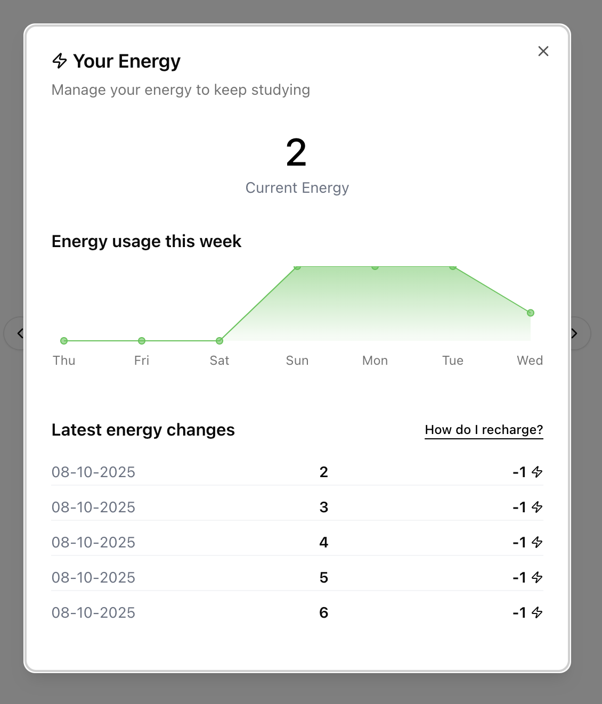
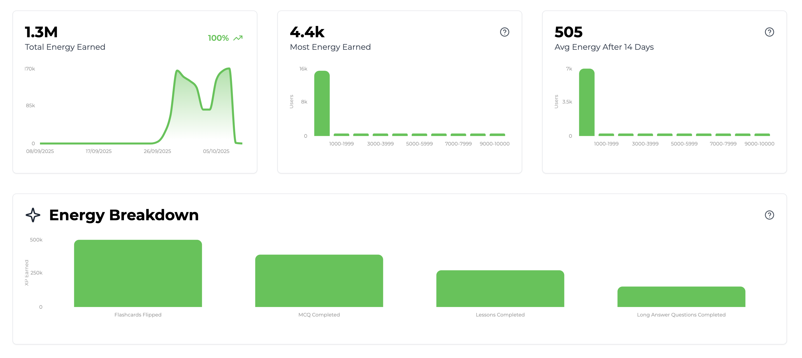

import SDKInstallCommand from "/snippets/sdk-install-command.mdx";
import MetricChangeRequestBlock from "/snippets/metric-change-request-block.mdx";
import MetricChangeResponseBlock from "/snippets/metric-change-response-block.mdx";
import UserPointsRequest from "/snippets/user-points-request-block.mdx";
import UserEnergyResponse from "/snippets/user-energy-response-block.mdx";
import UserPointsEventSummaryRequest from "/snippets/user-points-summary-request-block.mdx";

The guide outlines the full process of adding an energy feature to your web or mobile app using Trophy.

For illustration purposes we'll use the example of a study platform that uses energy to meter the rate at which users can view flashcards.

<Tip>
  To see a fully working example of this in practice, check out the [live
  demo](https://examples.trophy.so) or [github
  repo](https://github.com/trophyso/example-study-platform/tree/demo).
</Tip>

## Pre-requisites

- A [Trophy](https://app.trophy.so/sign-up) account
- About 10 minutes

## Trophy Setup

In Trophy, [Metrics](/platform/metrics) are the building blocks of gamification and model the different interactions users make with your product.

In this guide the interaction we're interested in is `flashcards-viewed`, but you can create any number of metrics that best represents the interactions you want to grant and consume energy from.

In the Trophy dashboard, head to the [metrics page](https://app.trophy.so/metrics) and create a metric.

<Frame>
  <video
    autoPlay
    muted
    loop
    playsInline
    className="w-full aspect-video"
    src="../assets/guides/achievements-feature/create_new_metric.mp4"
  ></video>
</Frame>

Once you've created your metric, head to the [points page](https://app.trophy.so/points) and create a new points system called 'Energy'.

<Frame>
  <video
    autoPlay
    muted
    loop
    playsInline
    className="w-full aspect-video"
    src="../assets/guides/xp-feature/create_system.mp4"
  ></video>
</Frame>

Once created, you'll be taken to the configure page for the energy system where you can create [points triggers](/platform/points#types-of-triggers) for each of the ways you want to grant or consume energy.

<Frame>
  <video
    autoPlay
    muted
    loop
    playsInline
    className="w-full aspect-video"
    src="../assets/guides/xp-feature/create_trigger.mp4"
  ></video>
</Frame>

Use 'time' triggers to grant users with new energy on an hourly or daily basis, and use [other types](/points#types-of-triggers) of triggers with negative values to consume energy from the different user interactions you want.

In Trophy you track user interactions by sending [Events](/platform/events) from your code to Trophy APIs against a specific metric.

When events are recorded for a specific user, Trophy will automatically check if any of the triggers set up against your energy system should be triggered, and process them accordingly.

Trophy also takes care of automatically granting new energy to users over time in accordance with any 'time' triggers you've set up.

This is what makes building gamified experiences with Trophy so easy, it does all the work for you behind the scenes.

## Installing Trophy SDK

To interact with Trophy from your code you'll use the Trophy SDK available in most major [programming languages](/api-reference/client-libraries).

Install the Trophy SDK:

<SDKInstallCommand />

Next, grab your API key from the Trophy [integration page](https://app.trophy.so/integration) and add this as a **server-side only** environment variable.

```bash
TROPHY_API_KEY='*******'
```

<Warning>
  Make sure you **don't** expose your API key in client-side code.
</Warning>

## Tracking User Interactions

To track an event (user interaction) against your metric, use the [metric change API](/api-reference/endpoints/metrics/send-a-metric-change-event).

<MetricChangeRequestBlock />

The response to this API call is the complete set of changes to any features you've built with Trophy, including any changes in energy as a result of the event, and from what triggers energy was consumed.

<MetricChangeResponseBlock />

Validate this is working by checking the Trophy [dashboard](https://app.trophy.so).

## Metering Usage

To prevent users from taking actions in your product based on energy, use the [user points API](/api-reference/endpoints/users/get-a-users-points) to fetch their current total energy.

<UserPointsRequest />

This returns data on the total energy the user has, allowing you to use the `total` property to control what actions a user can perform:

<UserEnergyResponse />

Here's an example where a user is only allowed to view a flashcard if `total > 0`

```ts
const energy = await trophy.users.points("user-id", "energy");

if (!energy) {
  return;
}

if (energy.total > 0) {
  showNextFlashcard();
}
```

You can then modify your trigger setup in Trophy and control the rate at which users can interact with your product right from the Trophy dashboard without needing to make any code changes.

## Displaying Energy

To fetch a users energy use the [user points API](/api-reference/endpoints/users/get-a-users-points).

<UserPointsRequest />

This API returns data on the user's total energy but can be configured to also return between 1 and 100 of the user's most recent energy changes by using the `awards` [query parameter](/api-reference/endpoints/users/get-a-users-points#parameter-awards).

<UserEnergyResponse />

The [user points summary API](/api-reference/endpoints/users/get-a-users-points-summary) can also be used to drive chart-based UI, like showing users their energy usage over time.

<UserPointsEventSummaryRequest />

Here's an example of a UI that shows users their current energy, a chart showing their usage over time, and a list of their most recent changes in energy.

<Frame>
  
</Frame>

## Analytics

In Trophy your [energy system page](https://app.trophy.so/points), includes analytics charts that shows data on total energy awarded/consumed and a breakdown of exactly what triggers cause the most frequent changes in energy.

<Frame>
  
</Frame>

## Get Support

Want to get in touch with the Trophy team? Reach out to us via [email](mailto:support@trophy.so). We're here to help!
