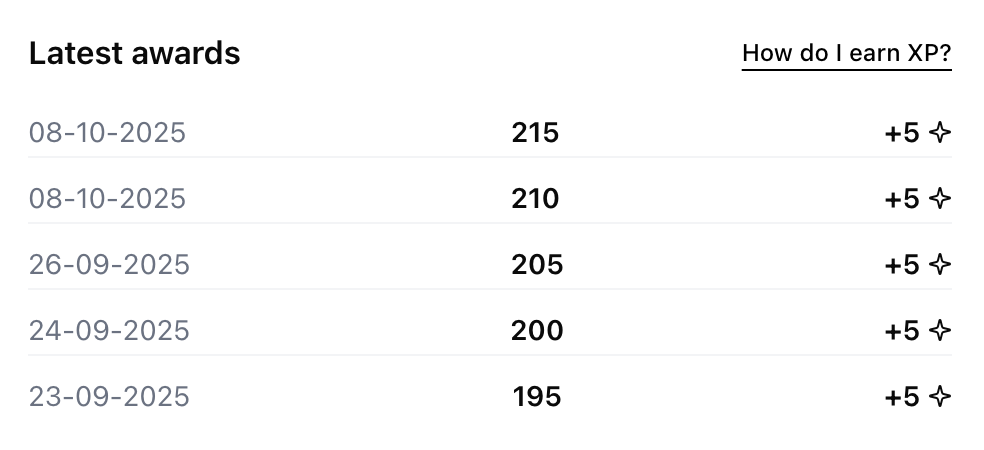
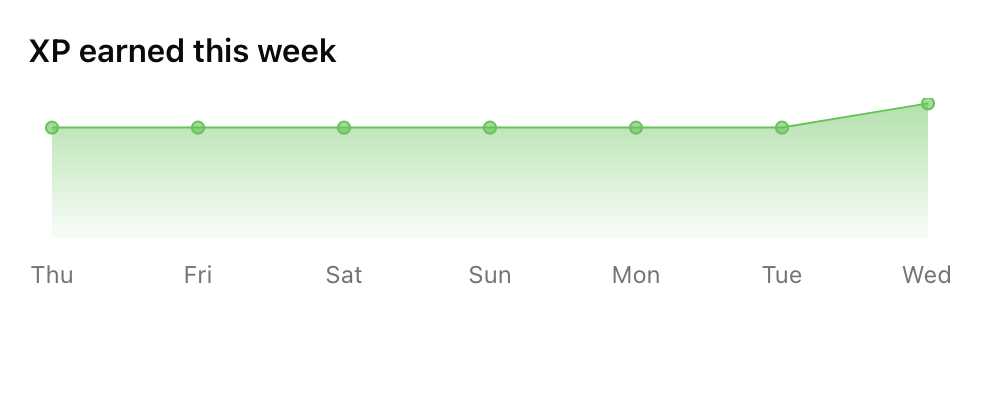
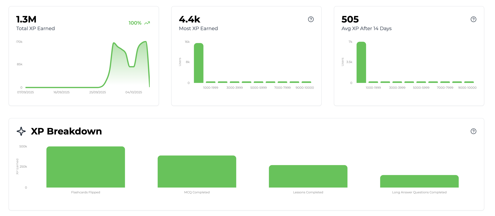

import SDKInstallCommand from "/snippets/sdk-install-command.mdx";
import MetricChangeRequestBlock from "/snippets/metric-change-request-block.mdx";
import MetricChangeResponseBlock from "/snippets/metric-change-response-block.mdx";
import UserPointsRequest from "/snippets/user-points-request-block.mdx";
import UserPointsResponse from "/snippets/user-points-response-block.mdx";
import UserPointsEventSummaryRequest from "/snippets/user-points-summary-request-block.mdx";
import UserPointsEventSummaryResponse from "/snippets/user-points-summary-response-block.mdx";

The guide outlines the full process of adding an XP feature to your web or mobile app using Trophy.

For illustration purposes we'll use the example of a study platform that uses XP to reward users for taking different interactions.

<Tip>
  To see a fully working example of this in practice, check out the [live
  demo](https://examples.trophy.so) or [github
  repo](https://github.com/trophyso/example-study-platform/tree/demo).
</Tip>

## Pre-requisites

- A [Trophy](https://app.trophy.so/sign-up) account
- About 10 minutes

## Trophy Setup

In Trophy, [Metrics](/platform/metrics) are the building blocks of gamification and model the different interactions users make with your product.

In this guide the interaction we're interested in is `flashcards-viewed`, but you can create any number of metrics that best represents the interactions you want to reward XP from.

In the Trophy dashboard, head to the [metrics page](https://app.trophy.so/metrics) and create a metric.

<Frame>
  <video
    autoPlay
    muted
    loop
    playsInline
    className="w-full aspect-video"
    src="../assets/guides/achievements-feature/create_new_metric.mp4"
  ></video>
</Frame>

Once you've created your metric, head to the [points page](https://app.trophy.so/points) and create a new points system called 'XP'.

<Frame>
  <video
    autoPlay
    muted
    loop
    playsInline
    className="w-full aspect-video"
    src="../assets/guides/xp-feature/create_system.mp4"
  ></video>
</Frame>

Once created, you'll be taken to the configure page for the XP system where you can create 'triggers' for each of the ways you want to reward users with XP.

<Frame>
  <video
    autoPlay
    muted
    loop
    playsInline
    className="w-full aspect-video"
    src="../assets/guides/xp-feature/create_trigger.mp4"
  ></video>
</Frame>

In Trophy you track user interactions by sending [Events](/platform/events) from your code to Trophy APIs against a specific metric.

When events are recorded for a specific user, Trophy will automatically check if the event is against a metric that is configured as part of any XP triggers.

If so Trophy will award the user with the appropriate amount of XP according to the trigger configuration.

This is what makes building gamified experiences with Trophy so easy, it does all the work for you behind the scenes.

<Tip>
  XP can also be awarded to users based on achievements, streaks and other
  triggers. See the dedicated [points docs](/platform/points#points-triggers)
  for more information.
</Tip>

## Installing Trophy SDK

To interact with Trophy from your code you'll use the Trophy SDK available in most major [programming languages](/api-reference/client-libraries).

Install the Trophy SDK:

<SDKInstallCommand />

Next, grab your API key from the Trophy [integration page](https://app.trophy.so/integration) and add this as a **server-side only** environment variable.

```bash
TROPHY_API_KEY='*******'
```

<Warning>
  Make sure you **don't** expose your API key in client-side code.
</Warning>

## Tracking User Interactions

To track an event (user interaction) against your metric, use the [metric change API](/api-reference/endpoints/metrics/send-a-metric-change-event).

<MetricChangeRequestBlock />

The response to this API call is the complete set of changes to any features you've built with Trophy, including any XP that was awarded to the user as a result of the event, and from what triggers it was awarded.

<MetricChangeResponseBlock />

Validate this is working by checking the Trophy [dashboard](https://app.trophy.so).

## Displaying XP

You have a number of options for displaying XP in your application. Here we'll look at the most common options.

### Pop-up Notifications

We can use the response of the [metric change API](/api-reference/endpoints/metrics/send-a-metric-change-event) to show users pop-up notifications when users are awarded new XP.

Here's an example of this in action:

```ts XP Pop-ups
// Sends event to Trophy
const response = await viewFlashcard();

if (!response) {
  return;
}

const xp = response.points.xp;

// Show toast if user was awarded XP
if (xp.awards.length > 0) {
  const trigger = xp.awards[0].trigger;

  toast({
    title: `You gained ${xp.added} XP`,

    // e.g. "+20 XP for 10 flashcards flipped"
    description: `+${trigger.points} XP for ${
      trigger.metricThreshold
    } ${trigger.metricName.toLowercase()}`,
  });
}
```

<Tip>
  If you want to play sound effects, use the [HTML5 Audio
  API](https://developer.mozilla.org/en-US/docs/Web/API/Web_Audio_API) and feel
  free to steal these [audio
  files](https://github.com/trophyso/example-study-platform/tree/demo/public/sounds)
  we recommend.
</Tip>

### Displaying User XP

To fetch a users XP use the [user points API](/api-reference/endpoints/users/get-a-users-points).

<UserPointsRequest />

This API returns data on the user's total XP but can be configured to also return between 1 and 100 of the user's most recent XP awards by using the `awards` [query parameter](/api-reference/endpoints/users/get-a-users-points#parameter-awards).

<UserPointsResponse />

Here's an example of a UI that shows users a list of their most recent awards based on the data returned from the user points API.

<Frame>
  
</Frame>

### User XP Chart

The [user points summary API](/api-reference/endpoints/users/get-a-users-points-summary) returns chart-ready historical data for displaying how a user's XP has changed over time.

<UserPointsEventSummaryRequest />

Use the `aggregation`, `start_date` and `end_date` query parameters to control the data returned. Here's an example of XP data aggregated daily:

<UserPointsEventSummaryResponse />

And here's an example of the types of charts you can build with this data:

<Frame>
  
</Frame>

## Analytics

In Trophy your [xp system page](https://app.trophy.so/points), includes analytics charts that shows data on total XP earned and a breakdown of exactly what triggers award the most XP.

<Frame>
  
</Frame>

## Get Support

Want to get in touch with the Trophy team? Reach out to us via [email](mailto:support@trophy.so). We're here to help!
