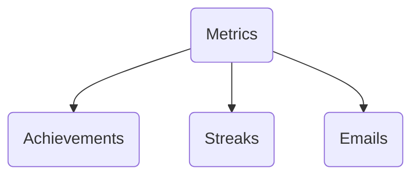
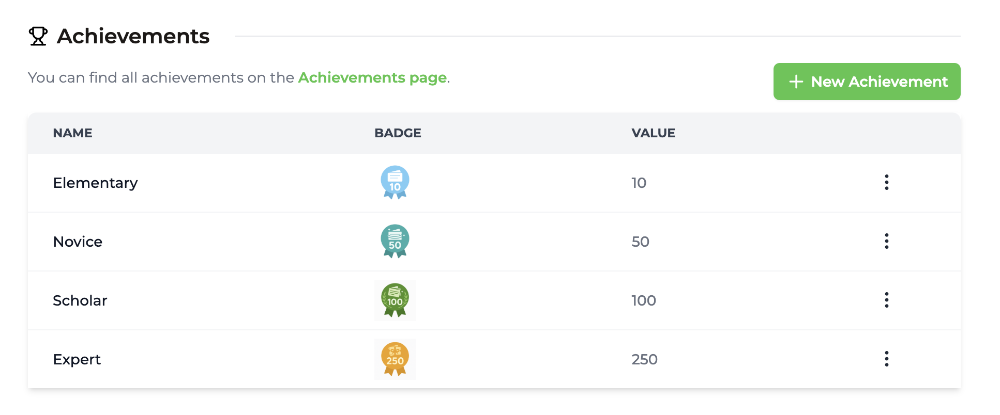
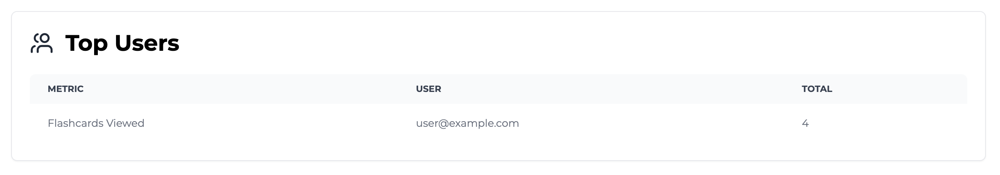

import MetricChangeRequestBlock from "/snippets/metric-change-request-block.mdx";
import MetricChangeResponseBlock from "/snippets/metric-change-response-block.mdx";

In this tutorial we'll build an example study platform using Trophy for gamification.

If you want to just skip to the end then feel free to check out the [template repository](https://github.com/trophyso/example-study-platform) or the [live demo (TBD)](https://example.com).

## Tech Stack

- NextJS 15 (React 19)
- [Shadcn/Ui](https://ui.shadcn.com)
- [Lucide](https://lucide.dev/icons) for iconography
- [Motion](https://motion.dev/) for animations
- [HTML5 Audio API](https://developer.mozilla.org/en-US/docs/Web/API/Web_Audio_API) for sound effects
- [Trophy](https://trophy.so) for gamification

## Pre-requisites

- A Trophy account

## Setup & Installation

<Tip>
  Want to skip the setup? Head straight to [the fun
  part](#basic-flashcard-layout).
</Tip>

First we need to create a new NextJS project:

```bash
npx create-next-app@latest
```

Feel free to configure this new project however you like but for the purposes of this tutorial we'll pretty much stick with the defaults:

```bash
What is your project named? my-app
Would you like to use TypeScript? Yes
Would you like to use ESLint? Yes
Would you like to use Tailwind CSS? Yes
Would you like your code inside a `src/` directory? Yes
Would you like to use App Router? (recommended) Yes
Would you like to use Turbopack for `next dev`?  Yes
Would you like to customize the import alias (`@/*` by default)? No
```

Next, I initialized a new install of everyones favourite UI library, shadcn/ui:

```bash
npx shadcn@latest init
```

I ran into a warning with React 19, which [looks to be a common issue](https://ui.shadcn.com/docs/react-19) when initializing with `npm`:

```bash
It looks like you are using React 19.
Some packages may fail to install due to peer dependency issues in npm (see https://ui.shadcn.com/react-19).

? How would you like to proceed? › - Use arrow-keys. Return to submit.
❯   Use --force
    Use --legacy-peer-deps
```

For the purposes of this tutorial I chose `--force` but you should use whichever setting you feel suits your requirements.

## Setting Up Flashcard Data

For the purposes of this tutorial, we're going to be using some simple types with an in-memory data store. In a production application you'd probably want to consider storing this information in a database.

Here we'll have a very simple type that stores information about each flashcard where we'll use the `front` property to store questions that the student wants to learn the answer to, and the `back` property to store the answers to each question:

```ts src/types/flashcard.ts
export interface IFlashcard {
  id: string;
  front: string;
  back: string;
}
```

Then to get us started we'll store a few flashcards in memory centered around learning capital cities:

```ts src/data.ts [expandable]
import { IFlashcard } from "./types/flashcard";

export const flashcards: IFlashcard[] = [
  {
    id: "1",
    front: "What is the capital of France?",
    back: "Paris",
  },
  {
    id: "2",
    front: "What is the capital of Germany?",
    back: "Berlin",
  },
  {
    id: "3",
    front: "What is the capital of Italy?",
    back: "Rome",
  },
  {
    id: "4",
    front: "What is the capital of Spain?",
    back: "Madrid",
  },
  {
    id: "5",
    front: "What is the capital of Portugal?",
    back: "Lisbon",
  },
  {
    id: "6",
    front: "What is the capital of Greece?",
    back: "Athens",
  },
  {
    id: "7",
    front: "What is the capital of Turkey?",
    back: "Ankara",
  },
  {
    id: "8",
    front: "What is the capital of Poland?",
    back: "Warsaw",
  },
  {
    id: "9",
    front: "What is the capital of Romania?",
    back: "Bucharest",
  },
  {
    id: "10",
    front: "What is the capital of Bulgaria?",
    back: "Sofia",
  },
  {
    id: "11",
    front: "What is the capital of Hungary?",
    back: "Budapest",
  },
  {
    id: "12",
    front: "What is the capital of Czechia?",
    back: "Prague",
  },
  {
    id: "13",
    front: "What is the capital of Slovakia?",
    back: "Bratislava",
  },
  {
    id: "14",
    front: "What is the capital of Croatia?",
    back: "Zagreb",
  },
  {
    id: "15",
    front: "What is the capital of Serbia?",
    back: "Belgrade",
  },
  {
    id: "16",
    front: "What is the capital of Montenegro?",
    back: "Podgorica",
  },
  {
    id: "17",
    front: "What is the capital of North Macedonia?",
    back: "Skopje",
  },
  {
    id: "18",
    front: "What is the capital of Kosovo?",
    back: "Pristina",
  },
  {
    id: "19",
    front: "What is the capital of Albania?",
    back: "Tirana",
  },
  {
    id: "20",
    front: "What is the capital of Bosnia and Herzegovina?",
    back: "Sarajevo",
  },
];
```

## Basic Flashcard Layout

With some basic data set up, we need to add a way for users to flick through their flashcards.

For this we'll use the Carousel and the Card components from shadcn/ui and for that we need to add these to our project:

```bash
npx shadcn@latest add carousel card
```

Then, we'll add a new `<Flashcards />` component that combines these into a working solution, specifying that we can pass along any list of `Flashcard` objects as props

```tsx src/app/flashcards.tsx [expandable]
import {
  Carousel,
  CarouselContent,
  CarouselItem,
  CarouselPrevious,
  CarouselNext,
} from "@/components/ui/carousel";
import { Card, CardContent } from "@/components/ui/card";
import { IFlashcard } from "@/types/flashcard";

interface Props {
  flashcards: IFlashcard[];
}

export default function Flashcards({ flashcards }: Props) {
  return (
    <Carousel className="w-full max-w-md">
      <CarouselContent>
        {flashcards.map((flashcard) => (
          <CarouselItem key={flashcard.id}>
            <div className="p-1">
              <Card>
                <CardContent className="flex items-center justify-center p-6">
                  <span className="text-4xl text-center font-semibold">
                    {flashcard.front}
                  </span>
                </CardContent>
              </Card>
            </div>
          </CarouselItem>
        ))}
      </CarouselContent>
      <CarouselPrevious />
      <CarouselNext />
    </Carousel>
  );
}
```

Then we'll update our `page.tsx` file to display our `<Flashcards />` component, passing in our example data:

```tsx src/app/page.tsx
import { flashcards } from "@/data";
import Flashcards from "./flashcards";

export default function Home() {
  return (
    <div className="flex flex-col items-center justify-center h-screen">
      <Flashcards flashcards={flashcards} />
    </div>
  );
}
```

At the end of this step, you should have a working flashcard UI that allows you to flick through each flashcard in our cities data set.

<Frame>
  <video
    autoPlay
    muted
    loop
    playsInline
    className="w-full aspect-video"
    src="../../assets/guides/example-apps/example-study-app/basic-flashcard-ui.mp4"
  ></video>
</Frame>

## Flipping Flashcards

Now this is great, but it's not much use as a study app right now as there's no way to see if you got it right! We need to add a way to flip flashcards over and check our answer...

To make this simpler, we'll first create a `<Flashcard />` component that will be responsible for all the logic for each flashcard:

```tsx src/app/flashcard.tsx [expandable]
import { Card, CardContent } from "@/components/ui/card";
import { CarouselItem } from "@/components/ui/carousel";
import { IFlashcard } from "@/types/flashcard";

interface Props {
  flashcard: IFlashcard;
}

export default function Flashcard({ flashcard }: Props) {
  return (
    <CarouselItem key={flashcard.id}>
      <div className="p-1">
        <Card>
          <CardContent className="flex items-center justify-center p-6">
            <span className="text-4xl text-center font-semibold">
              {flashcard.front}
            </span>
          </CardContent>
        </Card>
      </div>
    </CarouselItem>
  );
}
```

Then we'll simplify our `<Flashcards />` component to instead just render out a list of the individual `<Flashcard />` components:

```tsx src/app/flashcards.tsx [expandable]
import {
  Carousel,
  CarouselContent,
  CarouselPrevious,
  CarouselNext,
} from "@/components/ui/carousel";
import { IFlashcard } from "@/types/flashcard";
import Flashcard from "./flashcard";

interface Props {
  flashcards: IFlashcard[];
}

export default function Flashcards({ flashcards }: Props) {
  return (
    <Carousel className="w-full max-w-md">
      <CarouselContent>
        {flashcards.map((flashcard) => (
          <Flashcard key={flashcard.id} flashcard={flashcard} />
        ))}
      </CarouselContent>
      <CarouselPrevious />
      <CarouselNext />
    </Carousel>
  );
}
```

Now we're ready to add interactivity to each flashcard. Here's what we'll do:

- First, we'll add a `side` state variable that will hold the current side of the flashcard that's showing.
- Next, we'll add an `onClick` handler to the `<Card />` component that will update the `side` state to `back` when clicked if the front of the card is currently showing.
- Finally, we'll conditional render the text in the `<Card />` based on the value of the `side` state variable.

Here's the finished file:

```tsx src/app/flashcard.tsx [expandable] {10,12-16,21,24}
import { Card, CardContent } from "@/components/ui/card";
import { CarouselItem } from "@/components/ui/carousel";
import { IFlashcard } from "@/types/flashcard";

interface Props {
  flashcard: IFlashcard;
}

export default function Flashcard({ flashcard }: Props) {
  const [side, setSide] = useState<"front" | "back">("front");

  const handleCardClick = () => {
    if (side === "front") {
      setSide("back");
    }
  };

  return (
    <CarouselItem key={flashcard.id}>
      <div className="p-1">
        <Card onClick={handleCardClick}>
          <CardContent className="flex items-center justify-center p-6">
            <span className="text-4xl text-center font-semibold">
              {side === "front" ? flashcard.front : flashcard.back}
            </span>
          </CardContent>
        </Card>
      </div>
    </CarouselItem>
  );
}
```

Then, we'll use [Motion](https://motion.dev) to add a neat flip animation to the card when we click on it. For this we first need to install the package into our project:

```bash
npm install motion
```

If you think about it, when you flip a flashcard, you tend to do it in the Y-axis. So here we'll use a `<motion.div />` with an light spring animation in the y-axis to create the effect:

```tsx src/app/flashcard.tsx [expandable] {7-8,26-37}
"use client";

import { Card, CardContent } from "@/components/ui/card";
import { CarouselItem } from "@/components/ui/carousel";
import { IFlashcard } from "@/types/flashcard";
import { useState } from "react";
import { motion } from "motion/react";
import styles from "./flashcard.module.css";

interface Props {
  flashcard: IFlashcard;
}

export default function Flashcard({ flashcard }: Props) {
  const [side, setSide] = useState<"front" | "back">("front");

  const handleCardClick = () => {
    if (side === "front") {
      setSide("back");
    }
  };

  return (
    <CarouselItem key={flashcard.id}>
      <div className="p-1">
        <motion.div
          onClick={handleCardClick}
          className="cursor-pointer"
          animate={{ rotateY: side === "front" ? 0 : 180 }}
          transition={{ duration: 1, type: "spring" }}
          style={{ perspective: "1000px" }}
        >
          <Card className={`relative w-full h-[200px] ${styles.card}`}>
            <CardContent
              className={`flex items-center justify-center p-6 absolute w-full h-full ${styles.backface_hidden}`}
            >
              <span className="text-4xl text-center font-semibold">
                {side === "front" ? flashcard.front : flashcard.back}
              </span>
            </CardContent>
          </Card>
        </motion.div>
      </div>
    </CarouselItem>
  );
}
```

You'll notice we also added a couple of styles here. These do a couple of things:

- Ensure that when a `<Card />` is flipping, the 'backface' isn't visible during the animation with `backface-visibility: hidden;`
- As the `<Card />` component is a child of the `<motion.div />`, usually it would appear flat when it's parent rotates in 3D. Adding `transform-style: preserve-3d;` to the `<Card />` ensures it keeps it's 3D effect when it's parent animates.

```css src/app/flashcard.module.css
.backface-hidden {
  backface-visibility: hidden;
  -webkit-backface-visibility: hidden;
}

.card {
  transform-style: preserve-3d;
  -webkit-transform-style: preserve-3d;
}
```

## A Flippin' Bug!

Sweet! Our project is now starting to feel like a real study tool! However the keen eyed (or maybe not so keen!) will notice there's one major bug here. When we flip a card over, the answer on the back appears in reverse 😢...

<Frame>
  <video
    autoPlay
    muted
    loop
    playsInline
    className="w-full aspect-video"
    src="../../assets/guides/example-apps/example-study-app/flipping-flashcards.mp4"
  ></video>
</Frame>

I you think about it, when you write a flashcard, you actually write the answer on the back in the opposite direction to the question on the front.

And as we're using `motion` to literally flip over our card in the Y-axis, we need to make sure we write our answers backwards as well.

First, we'll add a little CSS snippet to handle writing text backwards:

```css src/app/flascard.module.css {11-14}
.backface-hidden {
  backface-visibility: hidden;
  -webkit-backface-visibility: hidden;
}

.card {
  transform-style: preserve-3d;
  -webkit-transform-style: preserve-3d;
}

.flipped_text {
  transform: scaleX(-1);
  transform-origin: center;
}
```

Then we'll conditionally add this style to our card text based on which side of the card is showing:

```tsx src/app/flashcard.tsx
<span
  className={`text-4xl text-center font-semibold ${
    side === "back" ? styles.flipped_text : ""
  }`}
>
  {side === "front" ? flashcard.front : flashcard.back}
</span>
```

Ok awesome. Now when we flip over a card the answer on the back should read in the right direction:

<Frame>
  <video
    autoPlay
    muted
    loop
    playsInline
    className="w-full aspect-video"
    src="../../assets/guides/example-apps/example-study-app/flipping-flashcards-fixed.mp4"
  ></video>
</Frame>

## Tracking Progress

The next step is to add some UI to show the user how many flashcards they've looked at, and how many in the set they have left. We'll use a simple progress bar to achieve this.

Before we can start tracking this level of information, we need to set up tracking for a new state variable that holds the index of the flashcard the user is currently looking at. We'll use the [carousel api](https://ui.shadcn.com/docs/components/carousel#api) to hook into the functionality here and keep our state variable up to date:

```tsx src/app/flashcards.tsx [expandable] {1,8,19-34,37}
"use client";

import {
  Carousel,
  CarouselContent,
  CarouselPrevious,
  CarouselNext,
  type CarouselApi,
} from "@/components/ui/carousel";
import { IFlashcard } from "@/types/flashcard";
import Flashcard from "./flashcard";
import { useEffect, useState } from "react";

interface Props {
  flashcards: IFlashcard[];
}

export default function Flashcards({ flashcards }: Props) {
  const [flashIndex, setFlashIndex] = useState(0);
  const [api, setApi] = useState<CarouselApi>();

  useEffect(() => {
    if (!api) {
      return;
    }

    // Initialize the flash index
    setFlashIndex(api.selectedScrollSnap() + 1);

    // Update the flash index when the carousel is scrolled
    api.on("select", () => {
      setFlashIndex(api.selectedScrollSnap() + 1);
    });
  }, [api]);

  return (
    <Carousel className="w-full" setApi={setApi}>
      <CarouselContent>
        {flashcards.map((flashcard) => (
          <Flashcard key={flashcard.id} flashcard={flashcard} />
        ))}
      </CarouselContent>
      <CarouselPrevious />
      <CarouselNext />
    </Carousel>
  );
}
```

Then we need to add the `<Progress />` component from shadcn/ui to our project:

```bash
npx shadcn@latest add progress
```

Finally we can add a progress bar above the carousel:

```tsx [expandable] {13,38-39,49}
"use client";

import {
  Carousel,
  CarouselContent,
  CarouselPrevious,
  CarouselNext,
  type CarouselApi,
} from "@/components/ui/carousel";
import { IFlashcard } from "@/types/flashcard";
import Flashcard from "./flashcard";
import { useEffect, useState } from "react";
import { Progress } from "@/components/ui/progress";

interface Props {
  flashcards: IFlashcard[];
}

export default function Flashcards({ flashcards }: Props) {
  const [flashIndex, setFlashIndex] = useState(0);
  const [api, setApi] = useState<CarouselApi>();

  useEffect(() => {
    if (!api) {
      return;
    }

    // Initialize the flash index
    setFlashIndex(api.selectedScrollSnap() + 1);

    // Update the flash index when the carousel is scrolled
    api.on("select", () => {
      setFlashIndex(api.selectedScrollSnap() + 1);
    });
  }, [api]);

  return (
    <div className="flex flex-col items-center justify-center gap-4 max-w-md">
      <Progress value={(flashIndex / flashcards.length) * 100} />
      <Carousel className="w-full" setApi={setApi}>
        <CarouselContent>
          {flashcards.map((flashcard) => (
            <Flashcard key={flashcard.id} flashcard={flashcard} />
          ))}
        </CarouselContent>
        <CarouselPrevious />
        <CarouselNext />
      </Carousel>
    </div>
  );
}
```

Sweet! Now things are really starting to come together.

<Frame>
  <video
    autoPlay
    muted
    loop
    playsInline
    className="w-full aspect-video"
    src="../../assets/guides/example-apps/example-study-app/progress-tracking.mp4"
  ></video>
</Frame>

Now the real fun begins...

## Adding Gamification

In this section we'll be adding the following gamification elements to the flashcard project:

- Achievements for completing:
  - 10 flashcards
  - 50 flashcards
  - 100 flashcards
  - 250 flashcards
- Daily streak for completing at least one flashcard a day.
- Automated emails for:
  - Achievement unlocked
  - Weekly progress summaries

This might sound like a lot, but would you be surprised if I told you you could build all this in less than 10 lines of code?

Yup, you can. [Trophy](https://trophy.so) makes it super easy to build these features with a few lines of integration code.

So, let's get started...

### How Trophy Works

First off, we need a new [Trophy account](https://app.trophy.so/sign-up). Then we can start to piece together the various parts of our gamification experience.

In Trophy, [Metrics](/platform/metrics) represent different interactions users can make and can be configured to drive features like [Achievements](/platform/achievements), [Streaks](/home/streaks) and [Emails](/platform/emails).



In Trophy we track user interactions by sending [Events](/platform/events) from our code to Trophy against a specific metric.

When events are recorded for a specific user, any achievements linked to the specified metric will be unlocked if the requirements are met, daily streaks will be automated calculated and kept up to date, and any configured emails will be scheduled.

Recording an event against a metric for a specific user makes use of Trophy's [metric event API](/api-reference/endpoints/metrics/send-a-metric-change-event), which in practice looks like this:

<MetricChangeRequestBlock />

That's how in just a few lines of code we can power a whole suite of gamification features. However, before we can start sending events, we need to set up our new Trophy account.

### Setting Up Trophy

Here's how we'll setup our Trophy account for our study app:

- First, we'll set up a _Flashcards Viewed_ metric
- Next, we'll setup achievements linked to this metric
- Then, we'll configure a daily streak linked to this metric
- Finally, we'll configure automated email sequences for this metric

Let's get into it...

<AccordionGroup>
  <Accordion title="Create the metric" icon="box">
    Head into the Trophy [metrics page](https://app.trophy.so/metrics) and create a new metric, making sure to specify `flashcards-viewed` as the metric `key`. This is what we'll use to reference the metric in our code when sending events.

    <Frame>
      <video
        autoPlay
        muted
        loop
        playsInline
        className="w-full aspect-video"
        src="../../assets/guides/example-apps/example-study-app/create-metric.mp4"
      ></video>
    </Frame>

  </Accordion>

<Accordion title="Create achievements" icon="trophy">
  Next, create one achievement for each of the following milestones:
  - 10 flashcards (Elementary)
  - 50 flashcards (Novice)
  - 100 flashcards (Scholar)
  - 250 flashcards (Expert)

{" "}

<Tip>
  Free free to download and use this library of badges (ready made for this
  example app):
  [flashcard_badges.zip](../../assets/guides/example-apps/example-study-app/flashcard_badges.zip)
</Tip>

<Frame>
  
</Frame>

</Accordion>

<Accordion title="Configure daily streak" icon="flame">
  Next, head into the [streaks page](https://app.trophy.so/streaks) and set up a daily streak.

    <Frame>
      <video
        autoPlay
        muted
        loop
        playsInline
        className="w-full aspect-video"
        src="../../assets/guides/example-apps/example-study-app/configure-streak.mp4"
      ></video>
    </Frame>

</Accordion>

  <Accordion title="Configure emails" icon="mail">
  Lastly, head into the [emails page](https://app.trophy.so/emails) and turn on the two types of emails we want.
  - Achievement unlocked emails
  - Recap emails (weekly)

Trophy also gives us a preview of the emails which is nice. Plus, feel free to configure a nice logo and brand colors in the [branding page](https://app.trophy.so/branding). These settings are automatically used in all emails sent by Trophy.

{" "}

<Frame>
  <video
    autoPlay
    muted
    loop
    playsInline
    className="w-full aspect-video"
    src="../../assets/guides/example-apps/example-study-app/configure-emails.mp4"
  ></video>
</Frame>

{" "}

<Note>
  Before you can start sending emails, you'll need to [configure your sending
  address](/platform/emails#setting-up-emails) with Trophy.
</Note>

  </Accordion>
</AccordionGroup>

### Integrating Trophy SDK

First we need to grab our account API key from the Trophy [integration page](https://app.trophy.so/integration) and add this as a **server-side only** environment variable.

<Warning>
  Make sure you **don't** expose your API key in client-side code
</Warning>

```bash .env.local
TROPHY_API_KEY='*******'
```

Next, we'll install the Trophy SDK:

```bash
npm install @trophyso/node
```

Then whenever a user views a flashcard, we simply send an event to Trophy with details of the user that performed the action (which we'll mock), and the number of flashcards they viewed (1 in this case).

In NextJS we'll do this with a server action that makes the call to Trophy to send the event, and we'll call this action when the user moves to the next flashcard in the carousel.

First, create the server action:

```tsx src/app/actions.ts [expandable]
"use server";

import { TrophyApiClient } from "@trophyso/node";
import { EventResponse } from "@trophyso/node/api";

// Set up Trophy SDK with API key
const trophy = new TrophyApiClient({
  apiKey: process.env.TROPHY_API_KEY as string,
});

/**
 * Track a flashcard viewed event in Trophy
 * @returns The event response from Trophy
 */
export async function viewFlashcard(): Promise<EventResponse | null> {
  try {
    return await trophy.metrics.event("flashcards-viewed", {
      user: {
        // Mock email
        email: "user@example.com",

        // Mock timezone
        tz: "Europe/London",

        // Mock user ID
        id: "18",
      },

      // Event represents a single user viewing 1 flashcard
      value: 1,
    });
  } catch (error) {
    console.error(error);
    return null;
  }
}
```

Then call it when the user views the next flashcard:

```tsx src/app/flashcards.tsx [expandable] {14,36-37}
"use client";

import {
  Carousel,
  CarouselContent,
  CarouselPrevious,
  CarouselNext,
  type CarouselApi,
} from "@/components/ui/carousel";
import { IFlashcard } from "@/types/flashcard";
import Flashcard from "./flashcard";
import { useEffect, useState } from "react";
import { Progress } from "@/components/ui/progress";
import { viewFlashcard } from "./actions";

interface Props {
  flashcards: IFlashcard[];
}

export default function Flashcards({ flashcards }: Props) {
  const [flashIndex, setFlashIndex] = useState(0);
  const [api, setApi] = useState<CarouselApi>();

  useEffect(() => {
    if (!api) {
      return;
    }

    // Initialize the flash index
    setFlashIndex(api.selectedScrollSnap() + 1);

    api.on("select", () => {
      // Update the flash index when the carousel is scrolled
      setFlashIndex(api.selectedScrollSnap() + 1);

      // Track the flashcard viewed event
      viewFlashcard();
    });
  }, [api]);

  return (
    <div className="flex flex-col items-center justify-center gap-4 max-w-md">
      <Progress value={(flashIndex / flashcards.length) * 100} />
      <Carousel className="w-full" setApi={setApi}>
        <CarouselContent>
          {flashcards.map((flashcard) => (
            <Flashcard key={flashcard.id} flashcard={flashcard} />
          ))}
        </CarouselContent>
        <CarouselPrevious />
        <CarouselNext />
      </Carousel>
    </div>
  );
}
```

We can validate this is working by checking the Trophy [dashboard](https://app.trophy.so) which should show our first user tracked in the _Top Users_ table:

<Frame>
  
</Frame>

Next, we'll add some UI to show off our gamification features in practice.

### Adding Gamification UX

The response to the API call that we make to track events in Trophy helpfully gives us back any changes to the users progress as a result of that event:

<MetricChangeResponseBlock />

This includes:

- The `achievements` array which is a list of newly unlocked achievements as a result of the event.
- The `currentStreak` object which is the users most up to date streak data.

This makes it really easy for us to react to changes in the users progress and do whatever we want. In this example, each time Trophy tells us a user has unlocked a new achievement, or extended their streak we'll:

- Show a pop-up toast
- Play a sound effect

#### Achievement Unlocked Toasts

First, we'll show a toast when users unlock new achievements. For this we need to add the sonner component from shadcn/ui to our project:

```bash
npx shadcn@latest add sonner
```

Then we'll create the `<Toast />` UI component we need to display toasts and a `toast()` utility function to trigger them:

```tsx src/lib/toast.tsx [expandable]
"use client";

import React from "react";
import { toast as sonnerToast } from "sonner";
import Image from "next/image";

interface ToastProps {
  id: string | number;
  title: string;
  description: string;
  image?: {
    src: string;
    alt: string;
  };
}

/**
 * A fully custom toast that still maintains the animations and interactions.
 * @param toast - The toast to display.
 * @returns The toast component.
 */
export function toast(toast: Omit<ToastProps, "id">) {
  return sonnerToast.custom((id) => (
    <Toast
      id={id}
      title={toast.title}
      description={toast.description}
      image={toast.image}
    />
  ));
}

/**
 * A fully custom toast that still maintains the animations and interactions.
 * @param props - The toast to display.
 * @returns The toast component.
 */
export function Toast(props: ToastProps) {
  const { title, description, image } = props;

  return (
    <div className="flex rounded-lg bg-white shadow-lg ring-1 ring-black/5 w-full md:max-w-[364px] items-center p-4">
      {image && (
        <div className="mr-4 flex-shrink-0">
          <Image
            src={image.src}
            alt={image.alt}
            width={40}
            height={40}
            className="rounded-md"
          />
        </div>
      )}
      <div className="flex flex-1 items-center">
        <div className="w-full">
          <p className="text-sm font-medium text-gray-900">{title}</p>
          <p className="mt-1 text-sm text-gray-500">{description}</p>
        </div>
      </div>
    </div>
  );
}
```

Next, we need to update the `page.tsx` file with the main `<Toaster />` component. This is the component from `sonner` which is responsible for displaying our toasts on the screen when we trigger them:

```tsx src/app/page.tsx {3,9}
import { flashcards } from "@/data";
import Flashcards from "./flashcards";
import { Toaster } from "@/components/ui/sonner";

export default function Home() {
  return (
    <div className="flex flex-col items-center justify-center h-screen">
      <Flashcards flashcards={flashcards} />
      <Toaster />
    </div>
  );
}
```

Next, to make sure NextJS shows our badges, we need to configure Trophy's image host as a trusted domain:

```ts next.config.ts {4-11}
import type { NextConfig } from "next";

const nextConfig: NextConfig = {
  images: {
    remotePatterns: [
      {
        protocol: "https",
        hostname: "lookmizerpsrsczvtlwh.supabase.co",
      },
    ],
  },
};

export default nextConfig;
```

And finally, we update our `<Flashcards />` component to read the response from Trophy and display toasts for any unlocked achievements:

```tsx src/app/flashcards.tsx [expandable] {15,33,38-61}
"use client";

import {
  Carousel,
  CarouselContent,
  CarouselPrevious,
  CarouselNext,
  type CarouselApi,
} from "@/components/ui/carousel";
import { IFlashcard } from "@/types/flashcard";
import Flashcard from "./flashcard";
import { useEffect, useState } from "react";
import { Progress } from "@/components/ui/progress";
import { viewFlashcard } from "./actions";
import { toast } from "@/lib/toast";

interface Props {
  flashcards: IFlashcard[];
}

export default function Flashcards({ flashcards }: Props) {
  const [flashIndex, setFlashIndex] = useState(0);
  const [api, setApi] = useState<CarouselApi>();

  useEffect(() => {
    if (!api) {
      return;
    }

    // Initialize the flash index
    setFlashIndex(api.selectedScrollSnap() + 1);

    api.on("select", async () => {
      // Update flashIndex when the carousel is scrolled
      setFlashIndex(api.selectedScrollSnap() + 1);

      // Track the flashcard viewed event
      const response = await viewFlashcard();

      if (!response) {
        return;
      }

      // Show toast if the user has unlocked any new achievements
      if (response.achievements?.length) {
        response.achievements.forEach((metricAchievements) => {
          if (metricAchievements.completed?.length) {
            metricAchievements.completed.forEach((achievement) => {
              toast({
                title: achievement.name as string,
                description: `Congratulations! You've viewed ${achievement.metricValue} flashcards!`,
                image: {
                  src: achievement.badgeUrl as string,
                  alt: achievement.name as string,
                },
              });
            });
          }
        });
      }
    });
  }, [api]);

  return (
    <div className="flex flex-col items-center justify-center gap-4 max-w-md">
      <Progress value={(flashIndex / flashcards.length) * 100} />
      <Carousel className="w-full" setApi={setApi}>
        <CarouselContent>
          {flashcards.map((flashcard) => (
            <Flashcard key={flashcard.id} flashcard={flashcard} />
          ))}
        </CarouselContent>
        <CarouselPrevious />
        <CarouselNext />
      </Carousel>
    </div>
  );
}
```

To see this in action, all we need to do is unlock our first achievement by viewing 10 flashcards:

<Frame>
  <video
    autoPlay
    muted
    loop
    playsInline
    className="w-full aspect-video"
    src="../../assets/guides/example-apps/example-study-app/displaying-toasts.mp4"
  ></video>
</Frame>

#### Streak Extended Toasts

We'll use the same methods to show similar toasts when a user extendeds their streak. As we've set up a daily streak in Trophy, this will trigger the first time a user views a flashcard each day.

<Tip>
  If we wanted to experiment with a different streak cadence, like a weekly
  streak, then none of this code changes - the great thing about Trophy is
  everything can be configured from within the dashboard and doesn't require any
  code changes.
</Tip>

All we need to do is read the `currentStreak.extended` property from Trophy and handle showing another toast with a new `if` statement:

```tsx src/app/flashcards.tsx [expandable] {62-69}
"use client";

import {
  Carousel,
  CarouselContent,
  CarouselPrevious,
  CarouselNext,
  type CarouselApi,
} from "@/components/ui/carousel";
import { IFlashcard } from "@/types/flashcard";
import Flashcard from "./flashcard";
import { useEffect, useState } from "react";
import { Progress } from "@/components/ui/progress";
import { viewFlashcard } from "./actions";
import { toast } from "@/lib/toast";

interface Props {
  flashcards: IFlashcard[];
}

export default function Flashcards({ flashcards }: Props) {
  const [flashIndex, setFlashIndex] = useState(0);
  const [api, setApi] = useState<CarouselApi>();

  useEffect(() => {
    if (!api) {
      return;
    }

    // Initialize the flash index
    setFlashIndex(api.selectedScrollSnap() + 1);

    api.on("select", async () => {
      // Update flashIndex when the carousel is scrolled
      setFlashIndex(api.selectedScrollSnap() + 1);

      // Track the flashcard viewed event
      const response = await viewFlashcard();

      if (!response) {
        return;
      }

      // Show toast if the user has unlocked any new achievements
      if (response.achievements?.length) {
        response.achievements.forEach((metricAchievements) => {
          if (metricAchievements.completed?.length) {
            metricAchievements.completed.forEach((achievement) => {
              toast({
                title: achievement.name as string,
                description: `Congratulations! You've viewed ${achievement.metricValue} flashcards!`,
                image: {
                  src: achievement.badgeUrl as string,
                  alt: achievement.name as string,
                },
              });
            });
          }
        });
      }

      // Show toast if user has extended their streak
      if (response.currentStreak?.extended) {
        toast({
          title: "You're on a roll!",
          description: `Keep going to keep your ${response.currentStreak.length} day streak!`,
        });
      }
    });
  }, [api]);

  return (
    <div className="flex flex-col items-center justify-center gap-4 max-w-md">
      <Progress value={(flashIndex / flashcards.length) * 100} />
      <Carousel className="w-full" setApi={setApi}>
        <CarouselContent>
          {flashcards.map((flashcard) => (
            <Flashcard key={flashcard.id} flashcard={flashcard} />
          ))}
        </CarouselContent>
        <CarouselPrevious />
        <CarouselNext />
      </Carousel>
    </div>
  );
}
```

Now the first time a user views a flashcard each day, they'll see one of our streak extended toasts:

<Frame>
  <video
    autoPlay
    muted
    loop
    playsInline
    className="w-full aspect-video"
    src="../../assets/guides/example-apps/example-study-app/streak-toasts.mp4"
  ></video>
</Frame>

#### Sound Effects

Gamification is first and foremost about increasing user retention. The best way to do this is to make the features we build as engaging as possible. A great way to do this that's often overlooked is with sound effects.

Here we'll add two distinct sound effects for each case where we show a toast to further engage the user. This helps distinguish the different toasts and helps users build up an expectation of what each sound means.

For this we'll make use of the [HTML5 Audio API](https://developer.mozilla.org/en-US/docs/Web/API/Web_Audio_API) and use sounds from [freesounds.org](https://freesounds.org).

<Tip>
  The sounds used in this example are in the repository in the `public/sounds`
  directory. Feel free to use them or pick others you like!
</Tip>

To load the sound files into our application, we'll create a ref for each one, then we simply call the `play()` method on each when we want to actually play the sound:

```tsx src/app/flashcards.tsx [expandable] {25-31,53-57,77-81}
"use client";

import {
  Carousel,
  CarouselContent,
  CarouselPrevious,
  CarouselNext,
  type CarouselApi,
} from "@/components/ui/carousel";
import { IFlashcard } from "@/types/flashcard";
import Flashcard from "./flashcard";
import { useEffect, useState, useRef } from "react";
import { Progress } from "@/components/ui/progress";
import { viewFlashcard } from "./actions";
import { toast } from "@/lib/toast";

interface Props {
  flashcards: IFlashcard[];
}

export default function Flashcards({ flashcards }: Props) {
  const [flashIndex, setFlashIndex] = useState(0);
  const [api, setApi] = useState<CarouselApi>();

  const achievementSound = useRef<HTMLAudioElement | null>(null);
  const streakSound = useRef<HTMLAudioElement | null>(null);

  useEffect(() => {
    achievementSound.current = new Audio("/sounds/achievement_unlocked.mp3");
    streakSound.current = new Audio("/sounds/streak_extended.mp3");
  }, []);

  useEffect(() => {
    if (!api) {
      return;
    }

    // Initialize the flash index
    setFlashIndex(api.selectedScrollSnap() + 1);

    api.on("select", async () => {
      // Update flashIndex when the carousel is scrolled
      setFlashIndex(api.selectedScrollSnap() + 1);

      // Track the flashcard viewed event
      const response = await viewFlashcard();

      if (!response) {
        return;
      }

      if (response.achievements?.length) {
        // Play the achievement sound only once for all new achievements
        if (achievementSound.current) {
          achievementSound.current.currentTime = 0;
          achievementSound.current.play();
        }

        // Show toasts if the user has unlocked any new achievements
        response.achievements.forEach((metricAchievements) => {
          if (metricAchievements.completed?.length) {
            metricAchievements.completed.forEach((achievement) => {
              toast({
                title: achievement.name as string,
                description: `Congratulations! You've viewed ${achievement.metricValue} flashcards!`,
                image: {
                  src: achievement.badgeUrl as string,
                  alt: achievement.name as string,
                },
              });
            });
          }
        });
      }

      if (response.currentStreak?.extended) {
        // Play the streak sound
        if (streakSound.current) {
          streakSound.current.currentTime = 0;
          streakSound.current.play();
        }

        // Show toast if the user has extended their streak
        toast({
          title: "You're on a roll!",
          description: `Keep going to keep your ${response.currentStreak.length} day streak!`,
        });
      }
    });
  }, [api]);

  return (
    <div className="flex flex-col items-center justify-center gap-4 max-w-md">
      <Progress value={(flashIndex / flashcards.length) * 100} />
      <Carousel className="w-full" setApi={setApi}>
        <CarouselContent>
          {flashcards.map((flashcard) => (
            <Flashcard key={flashcard.id} flashcard={flashcard} />
          ))}
        </CarouselContent>
        <CarouselPrevious />
        <CarouselNext />
      </Carousel>
    </div>
  );
}
```

#### Displaying Study Journey

The last peice of UI we'll add will be a dialog to display the user's study progress, including their streak and any achievements they've unlocked so far.

First, we'll add a couple of new server actions to fetch the users streak and achievements from Trophy. As we're using a daily sterak here, we'll fetch the last 14 days of streak data from Trophy to give us enough to work with in our UI:

```tsx src/app/actions [expandable] {6-7,10-11,24,33,45-58,60-73}
"use server";

import { TrophyApiClient } from "@trophyso/node";
import {
  EventResponse,
  MultiStageAchievementResponse,
  StreakResponse,
} from "@trophyso/node/api";

const USER_ID = "39";
const FLASHCARDS_VIEWED_METRIC_KEY = "flashcards-viewed";

// Set up Trophy SDK with API key
const trophy = new TrophyApiClient({
  apiKey: process.env.TROPHY_API_KEY as string,
});

/**
 * Track a flashcard viewed event in Trophy
 * @returns The event response from Trophy
 */
export async function viewFlashcard(): Promise<EventResponse | null> {
  try {
    return await trophy.metrics.event(FLASHCARDS_VIEWED_METRIC_KEY, {
      user: {
        // Mock email
        email: "user@example.com",

        // Mock timezone
        tz: "Europe/London",

        // Mock user ID
        id: USER_ID,
      },

      // Event represents a single user viewing 1 flashcard
      value: 1,
    });
  } catch (error) {
    console.error(error);
    return null;
  }
}

/**
 * Get the achievements for a user
 * @returns The achievements for the user
 */
export async function getAchievements(): Promise<
  MultiStageAchievementResponse[] | null
> {
  try {
    return await trophy.users.allachievements(USER_ID);
  } catch (error) {
    console.error(error);
    return null;
  }
}

/**
 * Get the streak for a user
 * @returns The streak for the user
 */
export async function getStreak(): Promise<StreakResponse | null> {
  try {
    return await trophy.users.streak(USER_ID, {
      historyPeriods: 14,
    });
  } catch (error) {
    console.error(error);
    return null;
  }
}
```

Then we'll call these actions on the server when the page is requested:

```tsx src/app/page.tsx {7-8}
import { flashcards } from "@/data";
import Flashcards from "./flashcards";
import { Toaster } from "@/components/ui/sonner";
import { getAchievements, getStreak } from "./actions";

export default async function Home() {
  const achievements = await getAchievements();
  const streak = await getStreak();

  return (
    <div className="flex flex-col items-center justify-center h-screen relative">
      <Flashcards flashcards={flashcards} />
      <Toaster />
    </div>
  );
}
```

Then we'll create a new `<StudyJourney />` component that takes in the achievements and streak data as props and renders it nicely in a dialog. Before adding this we need to add the shadcn/ui dialog component to our project:

```bash
npx shadcn@latest add dialog
```

Then we can use this as a base for our study journey component:

```tsx src/app/study-journey [expandable]
import { Separator } from "@/components/ui/separator";
import {
  MultiStageAchievementResponse,
  StreakResponse,
} from "@trophyso/node/api";
import { Flame, GraduationCap } from "lucide-react";
import Image from "next/image";
import dayjs from "dayjs";
import {
  Dialog,
  DialogTrigger,
  DialogContent,
  DialogHeader,
  DialogTitle,
  DialogDescription,
} from "@/components/ui/dialog";

interface Props {
  achievements: MultiStageAchievementResponse[] | null;
  streak: StreakResponse | null;
}

export default function StudyJourney({ achievements, streak }: Props) {
  return (
    <div className="absolute top-10 right-10 z-50">
      <Dialog>
        <DialogTrigger>
          <div className="h-12 w-12 cursor-pointer duration-100 border-1 border-gray-300 shadow-sm transition-all rounded-full relative hover:bg-gray-100">
            <GraduationCap className="h-6 w-6 absolute top-1/2 left-1/2 -translate-x-1/2 -translate-y-1/2 text-gray-800" />
          </div>
        </DialogTrigger>
        <DialogContent className="flex flex-col gap-3 min-w-[500px]">
          {/* Heading */}
          <DialogHeader>
            <DialogTitle>Your study journey</DialogTitle>
            <DialogDescription>
              Keep studying to extend your streak and earn new badges
            </DialogDescription>
          </DialogHeader>

          {/* Streak */}
          <div className="flex flex-col gap-2 items-center justify-between pt-2">
            <div className="flex flex-col items-center gap-4">
              <div className="relative h-24 w-24">
                <svg className="h-full w-full" viewBox="0 0 100 100">
                  <circle
                    className="stroke-gray-200"
                    strokeWidth="10"
                    fill="transparent"
                    r="45"
                    cx="50"
                    cy="50"
                  />
                  <circle
                    className="stroke-gray-900 transition-all"
                    strokeWidth="10"
                    strokeLinecap="round"
                    fill="transparent"
                    r="45"
                    cx="50"
                    cy="50"
                    strokeDasharray={`${(streak?.length || 0) * 10} 1000`}
                    transform="rotate(-90 50 50)"
                  />
                </svg>
                <div className="absolute inset-0 flex items-center justify-center">
                  <span className="text-2xl font-bold">
                    {streak?.length || 0}
                  </span>
                </div>
              </div>
              <div className="flex flex-col text-center">
                <h3 className="text-lg font-semibold">
                  {streak && streak.length > 0
                    ? `Your study streak`
                    : `No study streak`}
                </h3>
                <p className="text-sm text-gray-500">
                  {streak && streak.length > 0
                    ? `${streak.length} day${
                        streak.length > 1 ? "s" : ""
                      } in a row`
                    : `Start a streak`}
                </p>
              </div>
            </div>
            <div className="flex flex-col">
              <div className="grid grid-cols-7 gap-1">
                {["M", "T", "W", "T", "F", "S", "S"].map((day, i) => (
                  <div
                    key={i}
                    className="h-10 flex items-center justify-center"
                  >
                    <span className="text-sm text-gray-500">{day}</span>
                  </div>
                ))}
              </div>
              <div className="grid grid-cols-7 gap-1">
                {streak?.streakHistory?.map((day, i) => (
                  <div
                    key={i}
                    className={`h-10 w-10 rounded-lg ${
                      day.length > 0 ? "bg-gray-900" : "bg-gray-100"
                    } flex items-center justify-center`}
                  >
                    <Flame
                      className={`h-6 w-6 ${
                        day.length > 0 ? "text-white" : "text-gray-300"
                      }`}
                    />
                  </div>
                ))}
              </div>
            </div>
          </div>

          <Separator />

          {/* Achievements */}
          {achievements && achievements.length > 0 ? (
            <div className="flex flex-col gap-3">
              <div>
                <p className="text-lg font-semibold">Your badges</p>
              </div>
              <div className="grid grid-cols-3 gap-2 w-full">
                {achievements?.map((achievement) => (
                  <div
                    key={achievement.id}
                    className="p-2 rounded-md border border-gray-200 flex flex-col gap-1 items-center shadow-sm"
                  >
                    <Image
                      src={achievement.badgeUrl as string}
                      alt={achievement.name as string}
                      width={100}
                      height={100}
                      className="rounded-full border-gray-300"
                    />
                    <p className="font-semibold">{achievement.name}</p>
                    <p className="text-gray-500 text-sm">
                      {dayjs(achievement.achievedAt).format("MMM D, YYYY")}
                    </p>
                  </div>
                ))}
              </div>
            </div>
          ) : (
            <div className="flex flex-col gap-1 items-center justify-center min-h-[100px] p-3 w-full mt-3">
              <p className="font-semibold text-lg">No badges yet</p>
              <p className="text-sm text-gray-500 text-center max-w-[200px]">
                Keep studying to unlock more badges!
              </p>
            </div>
          )}
        </DialogContent>
      </Dialog>
    </div>
  );
}
```

Finally, we simply add this component to our page and we should be good to go:

```tsx src/app/page.tsx {4,13}
import { flashcards } from "@/data";
import Flashcards from "./flashcards";
import { Toaster } from "@/components/ui/sonner";
import StudyJourney from "./study-journey";
import { getAchievements, getStreak } from "./actions";

export default async function Home() {
  const achievements = await getAchievements();
  const streak = await getStreak();

  return (
    <div className="flex flex-col items-center justify-center h-screen relative">
      <StudyJourney achievements={achievements} streak={streak} />
      <Flashcards flashcards={flashcards} />
      <Toaster />
    </div>
  );
}
```

<Frame>
  <video
    autoPlay
    muted
    loop
    playsInline
    className="w-full aspect-video"
    src="../../assets/guides/example-apps/example-study-app/study-journey.mp4"
  ></video>
</Frame>

## The result

Congrats! If you're reading this you made it to the end of the tutorial and built yourself a fully-funtioning study platform. Of course there's loads more we could do to this, so here's a few ideas:

- Persist flashcards to a database
- Create multiple flashcard sets for other topics
- Add authentication
- Allow users to create their own flashcard sets

<Tip>
  If you had fun or think you learned something along the way then give the repo
  a star on [GitHub](https://github.com/trophyso/example-study-platform)!
</Tip>

## Get Support

Want to get in touch with the Trophy team? Reach out to us via [email](mailto:support@trophy.so). We're here to help!
