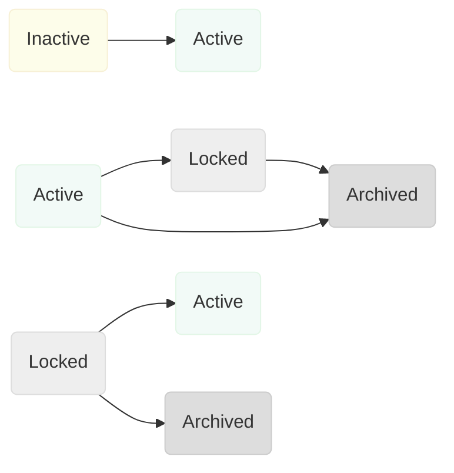
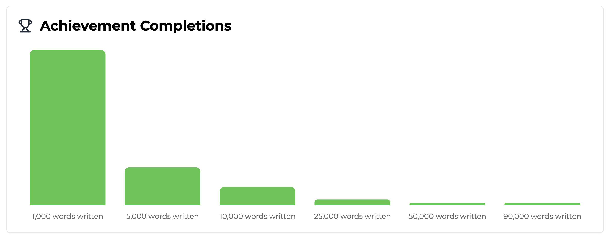

import MetricChangeResponseBlock from "/snippets/metric-change-response-block.mdx";
import AllAchievementsResponseBlock from "/snippets/all-achievements-response-block.mdx";

## What Are Achievements?

Achievements are rewards that users can unlock as they use your platform. They can be used to reward users for making continued progress along core user journeys, or to motivate users to explore more nascent features.

Achievements work best when designed to incentivize users to take actions that
are likely to lead to increased retention.

<Tip>
  Use Trophy's [metric analytics](/platform/metrics#metric-analytics) to compare
  the retention of each user interaction, then configure achievements around
  these interactions to maximize retention impact.
</Tip>

Here we'll have a look of the types of achievements you can build with Trophy, the different ways to use them, and how to integrate them into your platform.

Watch Charlie run walk through using achievements in a NextJS application:

<Frame>
  <iframe
    width="560"
    height="315"
    src="https://www.youtube.com/embed/U6TRxV036Lk?si=pAX37TXL8rNeFzz7"
    title="YouTube video player"
    frameborder="0"
    allow="accelerometer; autoplay; clipboard-write; encrypted-media; gyroscope; picture-in-picture"
    allowfullscreen
  ></iframe>
</Frame>

## Achievement Types

Trophy offers three types of achievements, [Metric](#metric-achievements), [API](#api-achievements) and [Streak achievements](#streak-achievements), detailed below.

### Metric Achievements

Metric achievements are tied to [Metrics](/platform/metrics) and are best used when you want to incentivize users to take the same action over and over again.

Let's take the example of a study platform that uses Trophy to encourage users to view more flashcards with metric achievements as follows:

- 1,000 flashcards
- 2,500 flashcards
- 5,000 flashcards
- 10,000 flashcards
- 25,000 flashcards
- 50,000 flashcards

In this case you would create a metric called _Flashcards Flipped_ and create achievements against the metric for each milestone.

Since these achievements are directly tied to the _Flashcards Flipped_ metric, Trophy will automatically track when users unlock these achievements as they [increment the metric](/platform/events#tracking-metric-events).

When achievements are unlocked, Trophy includes information about the unlocked achievements in the [Event API](/api-reference/endpoints/metrics/send-a-metric-change-event) response, and automatically triggers [Achievement Emails](/platform/emails#achievement-emails) if configured.

<MetricChangeResponseBlock />

### API Achievements

API achievements can only be completed once and are useful for rewarding users for taking specific actions.

Common examples include:

- A user completing their profile after signing up
- A user linking their social account to a platform
- A user sharing their product experience on social media

API achievements serve as an easy way to reward users for completing any action that you think is important for retention.

Just like metric achievements, API achievements can also trigger automated [Achievement Emails](/platform/emails#achievement-emails) if configured.

### Streak Achievements

Streak achievements are directly tied to a user's [Streak](/platform/streaks) and are automatically unlocked when users reach a particular streak length.

You can create as many streak achievements as you like for increasing lengths of streak, for example 7 days, 30 days and 365 days to motivate users to use your app more and more.

Just like metric and API achievements, you can add a custom name and assign a badge to streak achievements.

## Creating Achievements

To create new achievements, head to the [achievements page](https://app.trophy.so/achievements) in the Trophy dashboard and hit the **New Achievement** button:

<Frame>
  <video
    autoPlay
    muted
    loop
    playsInline
    className="w-full aspect-video"
    src="../assets/platform/achievements/create_new_achievement.mp4"
  ></video>
</Frame>

<Steps>
<Step title="Enter a name">
  Enter a name for the achievement. This will be returned from APIs and made available for use in emails and other areas of Trophy where appropriate.
</Step>

<Step title="Enter a description (Optional)">
  Enter a short description of the achievement. This will be returned from APIs
  and made available for use in emails and other areas of Trophy where
  appropriate.
</Step>

<Step title="Upload a badge (Optional)">
  You can upload and assign a badge to the achievement that will be returned in
  API responses and made available in emails and other areas of Trophy where
  appropriate.
</Step>

<Step title="Choose a trigger type">
  Choose how you want this achievement to be unlocked.
  
- Choosing **Metric** will mean the achievement will be automatically unlocked when the user's metric total reaches the achievement trigger value.

- Choosing **Streak** will mean the achievement will be automatically unlocked when the user's streak length reaches the achievement trigger value.

- Choosing **API Call** will mean the achievement will only be unlocked when explicitly marked as completed by your code through a request to the [complete achievement API](/api-reference/endpoints/achievements/mark-an-achievement-as-completed).

</Step>

<Step title="Set up trigger">
  Once you've chosen the trigger type for the achievement, you need to set up the trigger settings.

- If you chose the **Metric** trigger, you'll need to choose the metric and the user's total value that should unlock the achievement when reached.

- If you chose the **Streak** trigger, you'll need to set the streak length that should unlock the achievement.

- If you chose the **API Call** trigger, you'll need to choose a unique reference `key` you'll use the complete the achievement via the [API](/api-reference/endpoints/achievements/mark-an-achievement-as-completed).

</Step>

<Step title="Add attribute filters (Optional)">
You can assign attribute filters to an achievement to further restrict who can unlock them and when.

- To limit a **Metric** achievement to only apply to events with specific [custom event attributes](/platform/events#custom-event-attributes), select an attribute and enter a value in the **Event Attribute** section.

- To limit any type of achievement to only apply to a user with one or more specific [custom user attributes](/platform/users#custom-user-attributes), add attributes and the desired values in the **User Attributes** section.

</Step>

<Step title="Hit save">
  Save the new achievement.
</Step>
</Steps>

## Managing Achievements

Trophy has built in tools to help you test and control which achievements can be unlocked, by who and when, without affecting production.

### Achievement Statuses

Here's an overview of the different achievement statuses and what they mean.

**Inactive**

All achievements are created as inactive. Inactive achievements can't be completed and aren't returned in any achievement APIs. Users won't see them until you make them active.

**Active**

When you make an achievement active, it makes it 'live'. Users can complete it and it will be returned from all achievement APIs.

**Locked**

When you lock an achievement, users who haven't unlocked it yet won't be able to unlock it anymore, but users who have already unlocked it won't be affected.

Locked achievements are only returned in APIs for users who have already achieved them.

**Archived**

Archived achievements can't be completed and aren't returned in any achievement APIs.

<Warning>
  Once you archive an achievement it disappears from Trophy so be sure to only
  archive achievements that you no longer need.
</Warning>

Archived achievements can be restored by [contacting support](#get-support).

### Achievement Workflow

Achievements can be moved through different statuses according to the following workflow:



## Completing Achievements

If you're using metric achievements, there's no need to explicitly _complete_ achievements. Once you've set up [metric tracking](/platform/events#tracking-metric-events) in your code, all achievements linked to the metric will be automatically tracked.

Similarly, if you're using streak achievements, all achievements related to the user's streak will automatically be unlocked when a user reaches the respective streak length.

However if you're using any API achievements, you will have to mark them as completed for each user as appropriate. To do this, you can use the [Complete Achievement API](/api-reference/endpoints/achievements/mark-an-achievement-as-completed) using the `key` of the achievement you want to complete.

This will return back a response that contains details of the achievement that was completed that can be used in any post-completion workflows, like showing an in-app notification.

{/* vale off */}

```json Response
{
  "completionId": "0040fe51-6bce-4b44-b0ad-bddc4e123534",
  "achievement": {
    "id": "5100fe51-6bce-6j44-b0hs-bddc4e123682",
    "trigger": "api",
    "name": "Finish onboarding",
    "description": "Complete the onboarding process.",
    "badgeUrl": "https://example.com/badge.png",
    "key": "finish-onboarding",
    "achievedAt": "2021-01-01T00:00:00Z"
  }
}
```

{/* vale on */}

## Backdating Achievements

By default, whenever you move an achievement to 'Active' [status](#managing-achievements), Trophy will check if any existing users meet the requirements of the achievement and complete it for them behind the scenes.

This means when you release new achievements into production, or edit an existing live achievement, backdating will happen automatically.

<Note>
  When achievements are completed in this way, users don't receive any
  notifications this has happened. This is to prevent changes to your
  achievements in Trophy resulting in users getting lots of notifications.
</Note>

You can check how many users have completed achievements at any time on the [achievements page](https://app.trophy.so/achievements) in the Trophy dashboard. The _Users_ column in the achievements can update during backdating.

<Frame>
  
</Frame>

## Using Badges

<Frame>
  <video
    autoPlay
    muted
    loop
    playsInline
    className="w-full aspect-video"
    src="../assets/platform/achievements/upload_badge.mp4"
  ></video>
</Frame>

A badge can be uploaded and assigned to any achievement in Trophy. Trophy will host the image for you and return the URL back to you in relevant API responses to be used as the `src` property in `` tags.

```json Response {8}
{
  "completionId": "0040fe51-6bce-4b44-b0ad-bddc4e123534",
  "achievement": {
    "id": "5100fe51-6bce-6j44-b0hs-bddc4e123682",
    "trigger": "api",
    "name": "Finish onboarding",
    "description": "Complete the onboarding process.",
    "badgeUrl": "https://example.com/badge.png",
    "key": "finish-onboarding",
    "achievedAt": "2021-01-01T00:00:00Z"
  }
}
```

## Displaying Achievements

Trophy has a number of APIs that support displaying achievements within your applications. Here we'll look at the different ways to use them and the types of UI's you can build.

<Tip>
  Check out our [full guide](/guides/how-to-build-an-achievements-feature) on
  adding an achievements feature to your app for more details.
</Tip>

### All Achievements

To display a high-level overview of all achievements users can complete, use the [all achievements endpoint](/api-reference/endpoints/achievements/all-achievements). Use this data to build UI that gives users an idea of the progression pathways within your application.

<Frame>
  <video
    autoPlay
    muted
    loop
    playsInline
    className="w-full aspect-video"
    src="../assets/platform/achievements/displaying_trophy_cabinet.mp4"
  ></video>
</Frame>

The all achievements endpoint returns a list of all achievements within your Trophy account. Each achievement returned also includes `completions` (the number of users who have compeleted the achievement) and `rarity` (the percentage of users who have completed the achievement) as follows:

<AllAchievementsResponseBlock />

### User Achievements

If instead you're building user-specific UI elements, then use the [user achievements endpoint](/api-reference/endpoints/users/get-a-users-completed-achievements) to return achievements a specific user has completed.

<Tip>
  You can also include achievements that a user has yet to complete by including
  the query parameter `includeIncomplete=true`.
</Tip>

<Frame>
  
</Frame>

## Achievement Analytics

If you have achievements set up for any of your [Metrics](/platform/metrics), then the metric analytics page displays a chart that shows you the current progress of all Users as follows:

<Frame>
  
</Frame>

## Frequently Asked Questions

<AccordionGroup>
  <Accordion title="What type of achievements should I use?">
    Use metric achievements for rewarding users for taking the same action over and over again, and to incentivise them to do it more.

    Use streak achievements for rewarding users for keeping their streak.

    Use API achievements when you want to reward users for taking specific actions that they only need to take once.

  </Accordion>

    <Accordion title="What achievements should I create?">
    Achievements, like all gamification, offer the best retention when tightly aligned to the user's core reason for using your platform.

    Use Trophy's [metric analytics](/platform/metrics#metric-analytics) to compare the retention of each user interaction, then configure achievements around these interactions to maximize retention impact.

</Accordion>

</AccordionGroup>

## Get Support

Want to get in touch with the Trophy team? Reach out to us via [email](mailto:support@trophy.so). We're here to help!
