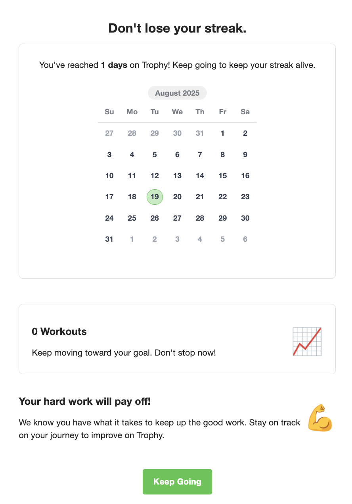
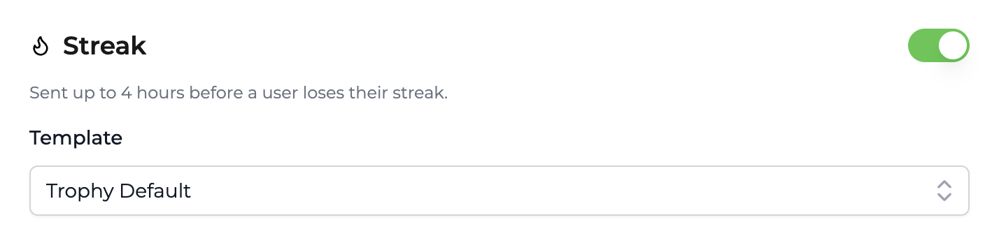
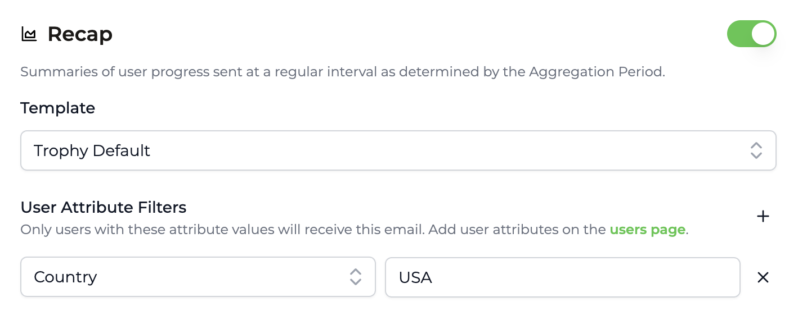
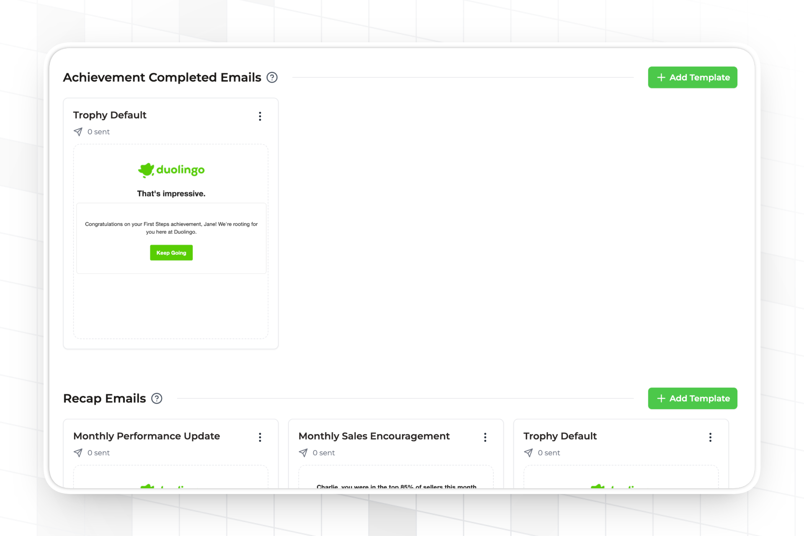
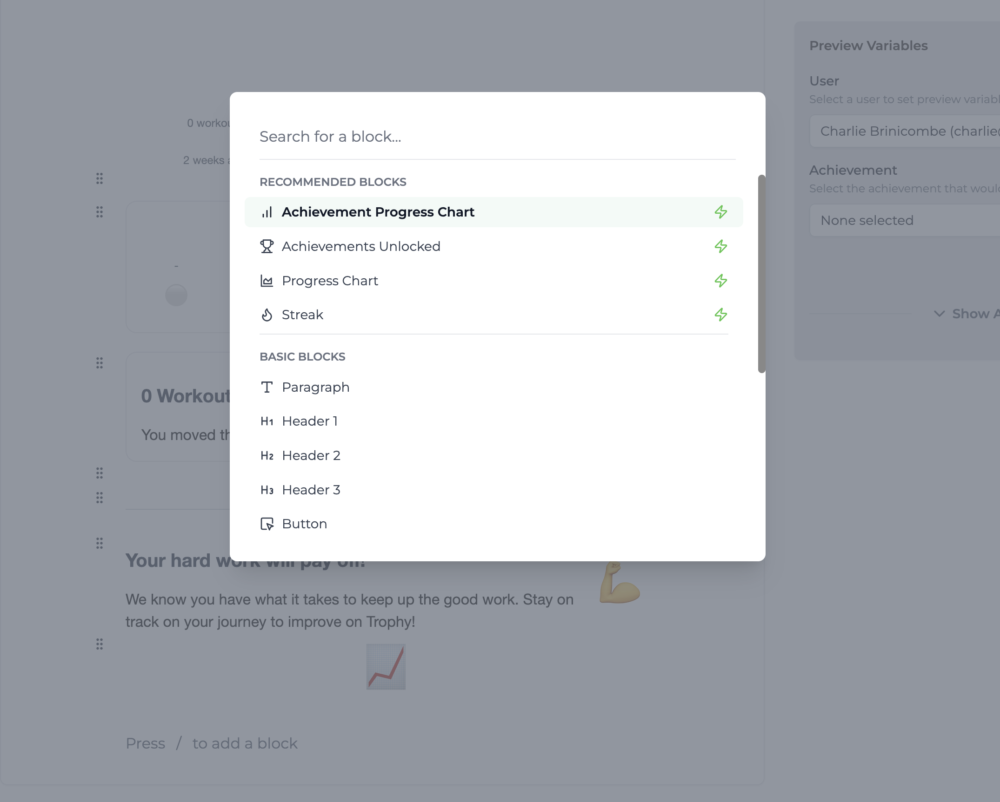
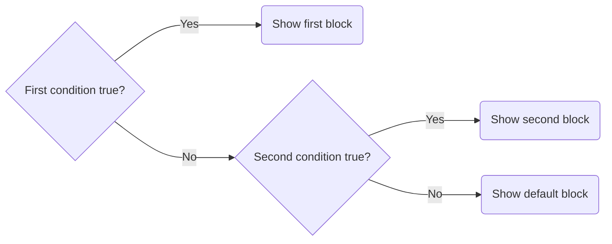
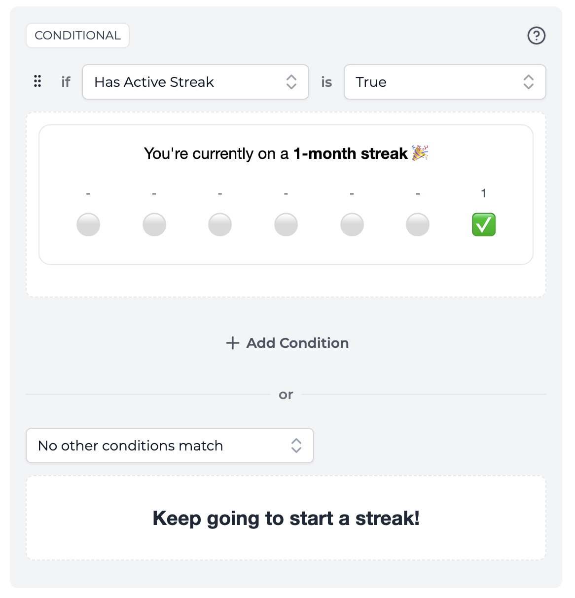
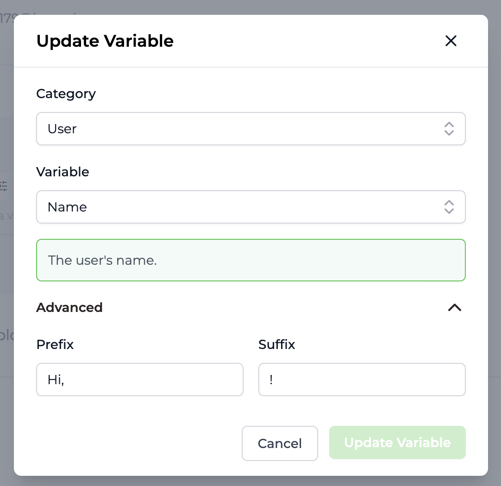
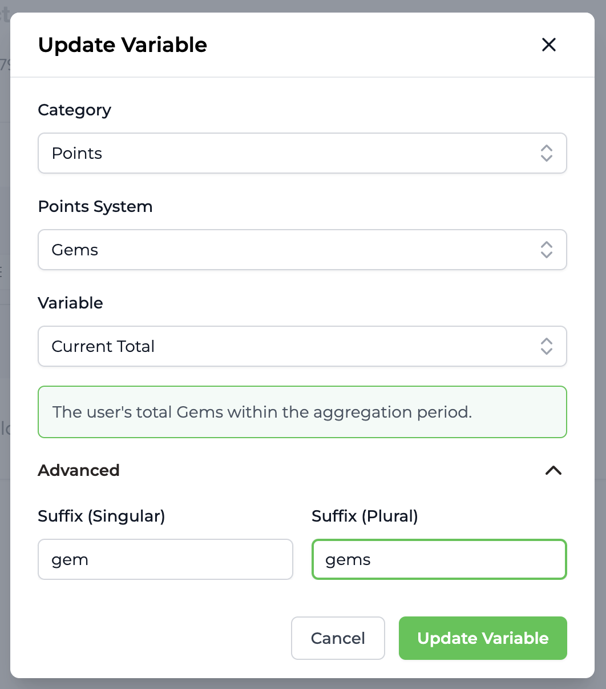
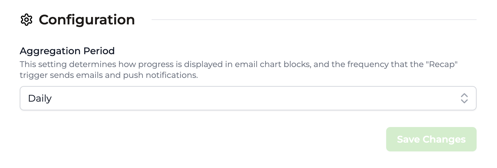

Trophy can send automated emails to users based on key triggers without requiring any code. Here we'll look at what these triggers are, and how they can form part of your product's gamification experience.

## Types Of Emails

Trophy supports 4 types of emails, each of which is designed to suit a common scenario in building gamification experiences.

All emails are optional, but all four can be used simultaneously and can be controlled from the [Emails](https://app.trophy.so/emails/configure) page in the Trophy dashboard.

<Frame>
  <video
    autoPlay
    muted
    loop
    playsInline
    className="w-full aspect-15/4"
    src="../assets/platform/emails/email_types.mp4"
  ></video>
</Frame>

- **Achievement emails** are sent to users each time they unlock an [Achievement](/platform/achievements).
- **Recap emails** are sent to users on a pre-defined frequency to summarize progress. Recap Emails can be configured to be sent daily, weekly, monthly or yearly depending on your use case.
- **Reactivation emails** are sent to users after they become inactive with the goal of bringing them back to your app.
- **Streak emails** are automatically sent to users reminding them to extend their [Streak](/platform/streaks).

## Sending Emails

To start sending emails with Trophy, you'll need to verify your domain and enable email triggers.

### Domain Verification

Trophy supports sending emails from your own domain out-of-the-box. There are two ways to set this up, Single Sender Verification and DNS Verification.

All domain settings can be found in the [Domains](https://app.trophy.so/emails/domains) page in the Trophy dashboard.

<Tip>
  If you're looking to get set up quickly we recommend starting with Single
  Sender Verification then setting up DNS Verification when you're ready to move
  to production.
</Tip>

<CardGroup cols={2}>
  <Card
    title="Sender Verification"
    icon="check"
    href="#sender-verification-basic"
  >
    Quickly verify a single email address
  </Card>
  <Card title="DNS Verification" icon="lock" href="#dns-verification-advanced">
    Recommended for production use
  </Card>
</CardGroup>

#### Sender Verification (Basic)

During onboarding you'll be prompted to set up Sender Verification. This is a super simple way to quickly verify a single email address that you want to use with Trophy without needing to change any code or DNS settings.

You'll be prompted to enter the email address, from name and reply-to email that you'd like Trophy to use when sending emails:

<Frame>
  
</Frame>

Trophy will send a verification email to that address. Simply click the link in the email to let Trophy know what you own the address and you'll be good to go.

<Note>
  The email you receive will come from our email provider, Postmark. So keep an
  eye out for 'Postmark Support' in your inbox!
</Note>

Sender Verification is great for getting started but is limited in that you won't benefit from your existing email reputation and can only send emails from one address.

Also, if you want to change the address in the future, you'll have to go through Sender Verification again which you can do in the [settings screen](https://app.trophy.so/integration?tab=domains).

#### DNS Verification (Advanced)

<Tip>Recommended for production use</Tip>

For production use we recommend DNS Verification. Once set up, this allows you to configure Trophy to send emails from any address on your domain. So if you want to change the address in future, you won't need to verify again.

Completing DNS verification also gives you the full benefits of any existing domain reputation and is the best way to make sure your emails avoid the spam folder.

This does however require adding a couple of new entries into your DNS to allow Trophy to verify you own the domain.

Follow the steps below to set up DNS verification:

<Steps>
<Step title="Head to the Emails page">
    Within the Emails page, you'll find the [Domains](https://app.trophy.so/emails/domains) tab which is where you'll configure everything related to the email domain Trophy will use to send emails on your behalf.
</Step>

<Step title="Configure your domain">
    Head down to the DNS Verification section and enter the domain you want to set up with Trophy.

    You can also also configure a custom Return Path. This is where Trophy will forward notifications of bounced emails to help you investigate deliverability issues:

    <Frame>
      
    </Frame>

</Step>

<Step title="Set up your DNS records">

    Once you've entered your email domain, Trophy will provide you with details for two new DNS records that you'll need to add to your DNS provider.

    <Frame>
      
    </Frame>

    - First is the **DKIM** record which is used by inbox providers like Google to verify the authenticity of emails. Enter the name and value provided as a new **TXT** record in your DNS provider.
    - Second is the **Return Path** record. This is used to forward notifications of email bounces to your domain. Enter the name and value provided as a new **CNAME** record in your DNS provider.

    Here are the pages for the most common DNS providers on how to set up new records:

    <AccordionGroup>
      <Accordion title='GoDaddy'>
          [Add a TXT record](https://www.godaddy.com/en-uk/help/add-a-txt-record-19232)
          [Add a CNAME record](https://www.godaddy.com/en-uk/help/add-a-cname-record-19236)
      </Accordion>
      <Accordion title='Cloudflare'>
          [Add DNS records](https://developers.cloudflare.com/dns/manage-dns-records/how-to/create-dns-records/#create-dns-records)
      </Accordion>
      <Accordion title="NameCheap">
          [Add a CNAME record](https://www.namecheap.com/support/knowledgebase/article.aspx/9646/2237/how-to-create-a-cname-record-for-your-domain/)
          [Add a TXT record](https://www.namecheap.com/support/knowledgebase/article.aspx/317/2237how-do-i-add-txtspfdkimdmarc-records-for-my-domain/#:~:text=this%20guide%20.-,DKIM%20records,-DKIM%20(DomainKeys%20Identified))
      </Accordion>
    </AccordionGroup>

    <Warning>Note: If you're using a proxy like Cloudflare, make sure to turn  it off for these records or Trophy won't be able to properly verify them.</Warning>

</Step>

<Step title="Verify DNS records">

    Once you've added the two records into your DNS settings, hit the refresh icon and Trophy will attempt to verify the records for you.

    Usually Trophy can verify records within a few minutes but bear in mind that DNS changes can take up to a few hours to fully propogate.

    If you see the following alert, the records may not have propogated yet, or there may be an issue with your setup.

    <Frame>
      
    </Frame>

    Once you're sure everything's set up correctly in your DNS provider, hit refresh and Trophy will attempt to verify your DNS records once again.

    As soon as you see the following message, you know everything's verified:

    <Frame>
      
    </Frame>

</Step>

<Step title="Configure your sending address">

    Once your DNS records are verified, it's time to choose the email address you want to send emails from. Note that now you've fully verified your domain, you can change this address whenever you like without impacting deliverability.

    Simply enter the email address you want Trophy to send from, the name to show to users in the inbox when they receive emails and a support email address they can use to contact you if needed:

    <Frame>
      
    </Frame>

</Step>

</Steps>

### Email Triggers

You can manage email triggers on the [Email Configuration](https://app.trophy.so/emails/configure) page of the Trophy dashboard. There, you'll see a list of triggers that can be turned on or off:

#### Recap Emails

The **Recap** trigger sends daily, weekly, or monthly progress reports to users. You can change the frequency of these emails on the [Integration](https://app.trophy.so/integration) page using the **Aggregation Period** setting.

<Frame>
  
</Frame>

#### Reactivation Emails

The **Reactivation** trigger sends win-back emails to users after they become inactive. These emails are sent according to the following timeline:

- After 3 days of inactivity
- After 5 days of inactivity
- After 7 days of inactivity
- After 14 days of inactivity
- After 30 days of inactivity

<Frame>
  
</Frame>

#### Streak Emails

The **Streak** trigger sends an email to each user before their streak expires. These emails are sent according to the streak frequency you configured on the [Streaks page](https://app.trophy.so/streaks):

- If your app uses a **daily streak**, this email will send four hours before the end of the day (in each user's timezone).
- For **weekly streaks**, it will send on Friday morning.
- For **monthly streaks**, it will send on the 25th of the month.

<Frame>
  
</Frame>

#### Achievement Emails

The **Achievement** trigger sends an email congratulating users when they complete an [achievements](/platform/achievements) you've configured in Trophy. These emails send between 5-9PM on the day the achievement is completed, or the next day at 5PM if it is past 9PM when the user completes the achievement.

<Frame>
  
</Frame>

#### Email Templates

For each trigger, you can assign an **Email Template** that the trigger uses. You can leave this set to _Trophy Default_ or [design your own email templates](#designing-emails) right in the Trophy dashboard.

<Frame>
  
</Frame>

<Tip>
  For **Achievement Emails**, you can configure a different template for each
  type of achievement. For example, you could have a different template for
  standalone API achievements, streak achievements, and each metric with metric
  achievements.
</Tip>

#### Limiting Emails to Specific Types of Users

Each email trigger can be limited to users with specific [custom user attribute](/platform/users#custom-user-attributes) values. For each attribute you'd like to restrict the email to, click the Plus icon next to the **User Filters** header for the email trigger, then select the attribute and enter the desired value. Only users that have **all** specified attribute values will receive emails from this trigger.

<Frame>
  
</Frame>

#### Time Zones

If you specify a timezone for each user through [User Identification](/platform/users#param-tz), Trophy will use that local time zone to schedule emails according to the logic specified above. If you do not provide time zones for the users you identify, Trophy will default to Eastern Time.

## Designing Emails

Trophy has a fully-featured block-based email builder that allows you to design templates, controlling all email copy and subject lines. Within the [Emails](https://app.trophy.so/emails/configure) page you can create templates and assign them to the 3 different [Email Types](#types-of-emails).

<Tip>
  When you create an email template, it can simulatenously be used across as
  many email types as you want. So if you want your emails to be simple, just
  having one email template might be enough. Otherwise, general best practice is
  creating one template for each type of email you want to send.
</Tip>

<Frame>
  <video
    autoPlay
    muted
    loop
    playsInline
    className="w-full aspect-15/4"
    src="../assets/platform/emails/designing_emails.mp4"
  ></video>
</Frame>

### Default Templates

By default, Trophy provides 3 email templates that are good starting points for the different [Email Types](#types-of-emails) that Trophy offers. The default templates can't be changed, but you can duplicate and customize these as you wish.

<Tip>
  You can also create blank templates if you just want to start from scratch.
</Tip>

### Creating A New Template

To create a new email template, follow the steps below.

<Steps>
  <Step title="Head to the Emails page">
    Within the Emails page, you'll find the
    [Configure](https://app.trophy.so/emails/configure) tab which is where all
    your email templates live, as well as the configuration for deciding which
    template to use for each type.
  </Step>
  <Step title="Hit the Add Template button">
    Choose an existing template to start from based on your use case, or create a new template from scratch.

    <Frame>
      
    </Frame>

  </Step>
  <Step title="Design your new template">
    Use the block-based editor to design your email template.

    <Frame>
      <video
        autoPlay
        muted
        loop
        playsInline
        className="w-full aspect-15/4"
        src="../assets/platform/emails/designing_emails.mp4"
      ></video>
    </Frame>

  </Step>
</Steps>

### Block Types

Trophy's email builder supports a number of different block types that serve different purposes. All the basic components you'd expect to find in an email editor like paragraphs, headers, and images are called [Basic Blocks](#basic-blocks). There is also a set of more powerful components like charts and streaks that leverage Trophy's user activity data and gamification features. These are called [Smart Blocks](#smart-blocks).

<Frame>
  
</Frame>

#### Basic Blocks

Here's the full list of un-opinionated basic blocks that Trophy supports:

- **Paragraph** - Good for short or longer text snippets.
- **H1, H2, H3** - Useful for headings of varying sizes.
- **Button** - Creates a call to action for users to take in emails.
- **Card** - Can nest other blocks, focusing attention.
- **Divider** - Good for seperating content into logical sections.
- **Emoji** - Include any supported emoji, controlling size.
- **Image** - Upload any image and Trophy will render it in emails.
- **Spacer** - Good for giving blocks room to stand out.
- **Columns** - Useful for creating up to 3-column layouts with any content.
- **Logo** - Will render your organization's logo, set on the [Branding](https://app.trophy.so/branding) page.

#### Conditional Blocks

Trophy also has a powerful conditional rendering system powered by the _Conditional_ block type.

By nesting any other block inside a conditional block and setting up the conditions logic, you can create almost any email design that will show different blocks in emails based on the evaluation of conditions at send time.

If you're familiar with the `if/else` logical operators then this will feel very famililar to you. Otherwise here's a quick diagram to explain how it works.

One common use case for the conditional block is to conditionally show a user their streak (one of Trophy's built-in [Smart Blocks](#smart-blocks)) and some streak-related motivational text only if they have an active streak. If the recipient isn't on a streak at the time the email is sent, then a simple message is displayed instead.

<Frame>
  
</Frame>

This creates a powerful framework to design emails based on highly relevant and personalized user data and can be used to create a wide-range of emails for common gamification use cases.

#### Smart Blocks

Smart blocks are powerful components designed to support common gamification use cases and integrate with all of Trophy's features including metrics, achievements and streaks.

You can find all smart blocks in the _Recommended Blocks_ section, and they are always recognizable by the <Icon icon="zap" /> icon.

Watch Charlie walk through smart blocks and how they work:

<Frame>
  <iframe
    width="560"
    height="315"
    src="https://www.youtube.com/embed/CA7i8Gd5K1s?si=mHkAwVPZYMoBPm15"
    title="YouTube video player"
    frameborder="0"
    allow="accelerometer; autoplay; clipboard-write; encrypted-media; gyroscope; picture-in-picture"
    allowfullscreen
  ></iframe>
</Frame>

Read more about the use case of each smart block:

<AccordionGroup>
  <Accordion title="Achievement Progress Chart" icon="zap">
    The achievement progress chart block displays a chart with bars for up to five achievements for a particular metric, highlighting any that the recipient has unlocked.
    
    Choose the metric to display achievements for using the metric selector.

    <Frame>
      <video
        autoPlay
        muted
        loop
        playsInline
        className="w-full aspect-video"
        src="../assets/platform/emails/achievement_progress_block.mp4"
      ></video>
    </Frame>

  </Accordion>

{" "}

<Accordion title="Achievements Unlocked" icon="zap">
  The achievements unlocked block displays the achievement the recipient has unlocked. This is only useful in the context of achievement unlocked emails. If the recipient hasn't unlocked any achievements, then this block won't show in emails.

Where achievements have badges, these will be automatically shown, as well as the name of the achievement.

  <Frame>
      <video
        autoPlay
        muted
        loop
        playsInline
        className="w-full aspect-video"
        src="../assets/platform/emails/achievements_unlocked_block.mp4"
      ></video>
    </Frame>
</Accordion>

{" "}

<Accordion title="Progress Chart" icon="zap">
  The progress chart block shows the recipient's progress against a particular metric over the last 3 [aggregation periods](#aggregation-period).

  <Frame>
      <video
        autoPlay
        muted
        loop
        playsInline
        className="w-full aspect-video"
        src="../assets/platform/emails/progress_chart_block.mp4"
      ></video>
    </Frame>
</Accordion>

  <Accordion title="Streak" icon="zap">
    The streak block displays the recipient's current streak according to your account's streak settings.
    
    For daily streaks, a calendar block is shown displaying the last month's streak history. Weekly and monthly streaks display the last 7 periods of streak history.

    <Frame>
      <video
        autoPlay
        muted
        loop
        playsInline
        className="w-full aspect-video"
        src="../assets/platform/emails/streak_block.mp4"
      ></video>
    </Frame>

  </Accordion>
</AccordionGroup>

### Email Variables

Trophy provides an expansive set of email variables that can be used to insert highly relevant and personalized copy into the body of emails and subject lines.

Variables bring context from your Trophy account, the recipient's progress data, and email specific settings to your email templates.

Email variables can be inserted by typing `@` in any block that supports rich text, like headers, paragraphs, and buttons, and searching for your chosen variable.

This will open up the variable editor window where you can configure variables as in the demo below.

<Tip>You can also use variables in email subject lines.</Tip>

<Frame>
  <video
    autoPlay
    muted
    loop
    playsInline
    className="w-full aspect-video"
    src="../assets/platform/emails/email_variables_demo.mp4"
  ></video>
</Frame>

See below for a full list of all email variables supported by the email builder, broken down by category.

<AccordionGroup>
<Accordion title="User">
Variables related to the recipient of the email.

- **Name**: The recipient's name, if set

Additionally all [custom user attributes](/platform/users#custom-user-attributes) are available as email variables.

</Accordion>
<Accordion title="Metrics">
  Variables related to the recipients tracked event data againt metrics.

Each Trophy metric supports the following email variables:

- **Metric Name**: The name of the metric
- **Metric Units**: The metric's units
- **Current Total**: The sum of all the recipients event values to date
- **Change This Period**: Absolute change in the recipients current total in the current aggregation period
- **Change This Period (%)**: Percent change in the recipients current total in the current aggregation period
- **Percentile (All Time)**: The recipients current total compared to all other users for all time
- **Percentile (This Period)**: The recipients current total compared to all other users in the current aggregion period

Additionally, the **Highest** and **Lowest** dynamic aliases support the same set of variables. When using these aliases, Trophy will pick the metric where the recipient has either the highest or lowest current total at send time.

When using metric variables, you also have the option of filtering the data that any of the above variables reference through a [custom event attribute](/platform/events#custom-event-attributes).

    </Accordion>

<Accordion title="Points">

Similarly to metrics, each points system has the following variables that can be used to add dynamic data to email copy:

- **Current Total**: The recipients total points
- **Change This Period**: Absolute change in the recipients total points in the current aggregation period
- **Change This Period (%)**: Percent change in the recipients total points in the current aggregation period
- **Percentile (All Time)**: The recipients total points compared to all other users for all time
- **Percentile (This Period)**: The recipients total points compared to all other users in the current aggregion period

.

</Accordion>
<Accordion title="Achievements">
  <Note>
  These variables are only relevant for [achievement emails](#achievement-emails).
  </Note>

When configuring a template for use with achievement emails, the following variables are available:

- **Is Final Achievement**: If the achievement triggering the email is part of a series of metric achievements, this is true when the achievment is the final achievement in the series
- **Percent To Next Achievement**: If the achievement triggering the email is part of a series of metric achievements, this is the percentage until the user unlocks the next achievment in the series
- **Achievement Name**: The name of the achievement that triggered the email
- **Achievement Description**: The description of the achievement that triggered the email

.

  </Accordion>
<Accordion title="Streak">
  Variables related to the recipient's streak.

- **Has Active Streak**: True if the recipient has an active streak at the time the email is sent, false otherwise
- **Streak Length**: The length of the recipient's current streak
- **Streak Extended**: True if the recipient's streak was extended, false otherwise
- **Days Since Last Extended**: The number of days since the user last extended their streak

.

</Accordion>
<Accordion title="Reactivation">
  <Note>
  These variables are only relevant for [reactivation emails](#reactivation-emails).
  </Note>

- **Message Number**: The number of the message in the reactivation sequence (1-5)

.

</Accordion>
<Accordion title="Aggregation Period">
    <Note>
  These variables are only relevant for [recap emails](#recap-emails).
  </Note>

- **Current Period Date Range**: The start and end dates of the current aggregation period

.

</Accordion>
</AccordionGroup>

#### Advanced Usage

There are a couple of additional options to consider when using emails variables.

**Prefix & Suffix**

You can provide a prefix and suffix for text variables like the recipients name, or the name of a particular metric.

<Frame>
  
</Frame>

If the value of the variable fails to render when the email is sent, then Trophy won't display the variable or the prefix or suffix to keep emails clean.

**Singular & Plural**

When using numeric variables like the recipients current points total or metric total, you can also provide a singular and plural suffix to accompany it.

<Frame>
  
</Frame>

### Text Variations

Variations can be used to add randomness to text within emails sent by Trophy. This prevents emails from getting boring and helps improve open and click rates.

<Frame>
  <iframe
    width="560"
    height="315"
    src="https://www.youtube.com/embed/mlxMqHsdql8?si=hhizWfwiylgxxEuV"
    title="YouTube video player"
    frameborder="0"
    allow="accelerometer; autoplay; clipboard-write; encrypted-media; gyroscope; picture-in-picture"
    allowfullscreen
  ></iframe>
</Frame>

Any block that supports text entry inculding H1, H2, H3 and paragraph support variations.

<Tip>You can also use variations to add randomness to email subject lines.</Tip>

To create a variation click the _Add Variation_ button on any block that supports them.

<Frame>
  <video
    autoPlay
    muted
    loop
    playsInline
    className="w-full aspect-video"
    src="../assets/platform/emails/creating_variations.mp4"
  ></video>
</Frame>

<Note>
  Variations do not support A/B testing yet, but this is on our roadmap so stay
  tuned...
</Note>

### Using The Editor

The email template editor is a blank canvas for designing emails that look great in the inbox. Using pre-configured [Blocks](#block-types) makes it really easy to create email templates that suit common gamification use cases. Here we'll walk through how to best use the editor to create awesome looking emails.

#### Adding Blocks

To add a new block an email template hit the <Icon icon="square-slash" /> key, this will open the block selection dialog where you can choose the block you want to add.

<Frame>
  <video
    autoPlay
    muted
    loop
    playsInline
    className="w-full aspect-video"
    src="../assets/platform/emails/add_new_block_slash.mp4"
  ></video>
</Frame>

Or if you want to add a block immediately after another block, use the block menu.

<Frame>
  <video
    autoPlay
    muted
    loop
    playsInline
    className="w-full aspect-video"
    src="../assets/platform/emails/add_new_block_by_block_menu.mp4"
  ></video>
</Frame>

#### Arranging Blocks

Blocks can be dragged up and down using the block menu.

<Frame>
  <video
    autoPlay
    muted
    loop
    playsInline
    className="w-full aspect-video"
    src="../assets/platform/emails/arranging_blocks.mp4"
  ></video>
</Frame>

#### Text Formatting

The email editor offers rich text formatting including bold, italics, [hyperlinks](https://www.youtube.com/watch?v=dQw4w9WgXcQ) and `code` formatting.

<Frame>
  <video
    autoPlay
    muted
    loop
    playsInline
    className="w-full aspect-video"
    src="../assets/platform/emails/rich_text_formatting.mp4"
  ></video>
</Frame>

### Font Style

On the [email configure page](https://app.trophy.so/emails/configure), you'll find a setting to change the font style used in all emails.

<Frame>
  
</Frame>

Other email styles are pulled from your Trophy account's [Branding](https://app.trophy.so/branding) settings.

## Handling Unsubscribes

All emails that Trophy sends include an unsubscribe link and message. This is important for maintaining compliance with regulations and it's not possible to hide it.

<Info>
  The message will read as follows: _You are receiving this email because you
  are subscribed to progress report and achievement emails. If you no longer
  wish to receive these emails, you can unsubscribe._
</Info>

Any recipient that clicks this link will no longer receive any emails from Trophy.

## Email Analytics

Trophy has built-in analytics for all Emails that it sends. This includes:

- Recipients (The total number of people that recieved the email)
- Open rate (The percentage of recipients that opened the email)
- Click rate (The percentage of recipients that clicked on at least one link in the email)
- Retention rate (The percentage of users that opened the email that came back and used your platform after at least 2 days)

<Frame>
  <video
    autoPlay
    muted
    loop
    playsInline
    className="w-full aspect-video"
    src="../assets/platform/emails/email_analytics.mp4"
  ></video>
</Frame>

## Frequently Asked Questions

<AccordionGroup>
<Accordion title="Can I send emails from my own domain?">
    Yes! Sending emails from your own domain is supported out-of-the-box. Follow the steps in the section on [sending emails](#sending-emails) to get started.
  </Accordion>

{" "}

<Accordion title="Do you limit how many emails I can send?">
  No, we don't limit how many emails you can send. However, we do monitor usage
  to prevent abuse.
</Accordion>

</AccordionGroup>

## Get Support

Want to get in touch with the Trophy team? Reach out to us via [email](mailto:support@trophy.so). We're here to help!
