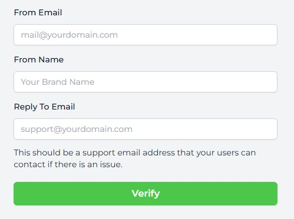

Trophy can send automated emails to users based on key triggers without requiring any code. Here we'll look at what these triggers are, and how they can form part of your product's gamification experience.

## Types Of Emails

Trophy supports 3 types of emails, each of which is designed to suit a common scenario in building gamification experiences.

All emails are optional, but all three can be used simultaneously and can be controlled from the [Emails](https://app.trophy.so/emails/configure) page in the Trophy dashboard.

<Frame>
  <video
    autoPlay
    muted
    loop
    playsInline
    className="w-full aspect-video"
    src="../assets/platform/emails/configure_emails.mp4"
  ></video>
</Frame>

### Achievement Emails

Achievement emails are sent to users each time they unlock an [Achievement](/platform/achievements).

If the achievement has a badge assigned to it, then it will be shown in the email along with the name of the achievement and a chart that shows users how far to the next achievement they are:

<Frame>
  
</Frame>

### Recap Emails

Recap emails summarize a users progress over a specified time frame. Recap Emails can be configured to be sent daily, weekly, monthly or yearly depending on your use case.

<Frame>
  
</Frame>

### Reactivation Emails

As Trophy monitors usage across your entire userbase, it can tell when your users are looking like they are becoming inactive. To encourage them to become active again, Trophy can send automated win-back emails to them.

Emails are sent as follows:

- After 3 days of inactivity
- After 5 days of inactivity
- After 7 days of inactivity
- After 14 days of inactivity
- After 30 days of inactivity

The design of the emails is a simple statement of current progress followed by a call-to-action to continue:

<Frame>
  
</Frame>

## Send-time Optimization

By default all emails sent by Trophy are sent at 17:00PM ET, however sending emails to users based on their local timezone usually results in better engagement rates.

That's why if through [User Identification](/platform/users#param-tz) you specify a timezone for each user, Trophy will optimize the send-time for you.

## Designing Emails

Trophy currently takes care of all copy and design for you, however you can configure your brand colors and logo in the [Branding](https://app.trophy.so/branding) page in the Trophy dashboard.

<Note>
  Soon we'll be releasing a block-based email builder that will allow you to
  have full control over the design and copy used in all emails sent by Trophy.
</Note>

## Setting up Emails

Trophy supports sending emails from your own domain out-of-the-box. There are two ways to set this up, Single Sender Verification and DNS Verification.

All domain settings can be found in the [Domains](https://app.trophy.so/emails/domains) page in the Trophy dashboard.

<Tip>
  If you're looking to get set up quickly we recommend starting with Single
  Sender Verification then setting up DNS Verification when you're ready to move
  to production.
</Tip>

<CardGroup cols={2}>
  <Card
    title="Sender Verification"
    icon="check"
    href="#sender-verification-basic"
  >
    Quickly verify a single email address
  </Card>
  <Card title="DNS Verification" icon="lock" href="#dns-verification-advanced">
    Recommended for production use
  </Card>
</CardGroup>

### Sender Verification (Basic)

During onboarding you'll be prompted to set up Sender Verification. This is a super simple way to quickly verify a single email address that you want to use with Trophy without needing to change any code or DNS settings.

You'll be prompted to enter the email address, from name and reply-to email that you'd like Trophy to use when sending emails:

<Frame>
  
</Frame>

Trophy will send a verification email to that address. Simply click the link in the email to let Trophy know what you own the address and you'll be good to go.

<Note>
  The email you receive will come from our email provider, Postmark. So keep an
  eye out for 'Postmark Support' in your inbox!
</Note>

Sender Verification is great for getting started but is limited in that you won't benefit from your existing email reputation and can only send emails from one address.

Also, if you want to change the address in the future, you'll have to go through Sender Verification again which you can do in the [settings screen](https://app.trophy.so/integration?tab=domains).

### DNS Verification (Advanced)

<Tip>Recommended for production use</Tip>

For production use we recommend DNS Verification. Once set up, this allows you to configure Trophy to send emails from any address on your domain. So if you want to change the address in future, you won't need to verify again.

Completing DNS verification also gives you the full benefits of any existing domain reputation and is the best way to make sure your emails avoid the spam folder.

This does however require adding a couple of new entries into your DNS to allow Trophy to verify you own the domain.

Follow the steps below to set up DNS verification:

<Steps>
<Step title="Head to the Emails page">
    Within the Emails page, you'll find the [Domains](https://app.trophy.so/emails/domains) tab which is where you'll configure everything related to the email domain Trophy will use to send emails on your behalf.
</Step>

<Step title="Configure your domain">
    Head down to the DNS Verification section and enter the domain you want to set up with Trophy.

    You can also also configure a custom Return Path. This is where Trophy will forward notifications of bounced emails to help you investigate deliverability issues:

    <Frame>
      
    </Frame>

</Step>

<Step title="Set up your DNS records">

    Once you've entered your email domain, Trophy will provide you with details for two new DNS records that you'll need to add to your DNS provider.

    <Frame>
      
    </Frame>

    - First is the **DKIM** record which is used by inbox providers like Google to verify the authenticity of emails. Enter the name and value provided as a new **TXT** record in your DNS provider.
    - Second is the **Return Path** record. This is used to forward notifications of email bounces to your domain. Enter the name and value provided as a new **CNAME** record in your DNS provider.

    Here are the pages for the most common DNS providers on how to set up new records:

    <AccordionGroup>
      <Accordion title='GoDaddy'>
          [Add a TXT record](https://www.godaddy.com/en-uk/help/add-a-txt-record-19232)
          [Add a CNAME record](https://www.godaddy.com/en-uk/help/add-a-cname-record-19236)
      </Accordion>
      <Accordion title='Cloudflare'>
          [Add DNS records](https://developers.cloudflare.com/dns/manage-dns-records/how-to/create-dns-records/#create-dns-records)
      </Accordion>
      <Accordion title="NameCheap">
          [Add a CNAME record](https://www.namecheap.com/support/knowledgebase/article.aspx/9646/2237/how-to-create-a-cname-record-for-your-domain/)
          [Add a TXT record](https://www.namecheap.com/support/knowledgebase/article.aspx/317/2237how-do-i-add-txtspfdkimdmarc-records-for-my-domain/#:~:text=this%20guide%20.-,DKIM%20records,-DKIM%20(DomainKeys%20Identified))
      </Accordion>
    </AccordionGroup>

    <Warning>Note: If you're using a proxy like Cloudflare, make sure to turn  it off for these records or Trophy won't be able to properly verify them.</Warning>

</Step>

<Step title="Verify DNS records">

    Once you've added the two records into your DNS settings, hit the refresh icon and Trophy will attempt to verify the records for you.

    Usually Trophy can verify records within a few minutes but bear in mind that DNS changes can take up to a few hours to fully propogate.

    If you see the following alert, the records may not have propogated yet, or there may be an issue with your setup.

    <Frame>
      
    </Frame>

    Once you're sure everything's set up correctly in your DNS provider, hit refresh and Trophy will attempt to verify your DNS records once again.

    As soon as you see the following message, you know everything's verified:

    <Frame>
      
    </Frame>

</Step>

<Step title="Configure your sending address">

    Once your DNS records are verified, it's time to choose the email address you want to send emails from. Note that now you've fully verified your domain, you can change this address whenever you like without impacting deliverability.

    Simply enter the email address you want Trophy to send from, the name to show to users in the inbox when they receive emails and a support email address they can use to contact you if needed:

    <Frame>
      
    </Frame>

</Step>

</Steps>

## Handling Unsubscribes

All emails that Trophy sends include an unsubscribe link and message. This is important for maintaining compliance with regulations and it's not possible to hide it.

<Info>
  The message will read as follows: _You are receiving this email because you
  are subscribed to progress report and achievement emails. If you no longer
  wish to receive these emails, you can unsubscribe._
</Info>

Any recipient that clicks this link will no longer receive any emails from Trophy.

## Email Analytics

Trophy has built-in analytics for all Emails that it sends. This includes:

- Recipients (The total number of people that recieved the email)
- Open rate (The percentage of recipients that opened the email)
- Click rate (The percentage of recipients that clicked on at least one link in the email)
- Retention rate (The percentage of users that opened the email that came back and used your platform after at least 2 days)

<Frame>
  <video
    autoPlay
    muted
    loop
    playsInline
    className="w-full aspect-video"
    src="../assets/platform/emails/email_analytics.mp4"
  ></video>
</Frame>

## Frequently Asked Questions

<AccordionGroup>
<Accordion title="Can I send emails from my own domain?">
    Yes! Sending emails from your own domain is supported out-of-the-box. Follow the steps in the section on [Settings up Emails](#setting-up-emails) to get started.
  </Accordion>

{" "}

<Accordion title="Do you limit how many emails I can send?">
  No, we don't limit how many emails you can send. However, we do monitor usage
  to prevent abuse.
</Accordion>

</AccordionGroup>

## Get Support

Want to get in touch with the Trophy team? Reach out to us via [email](mailto:support@trophy.so). We're here to help!
