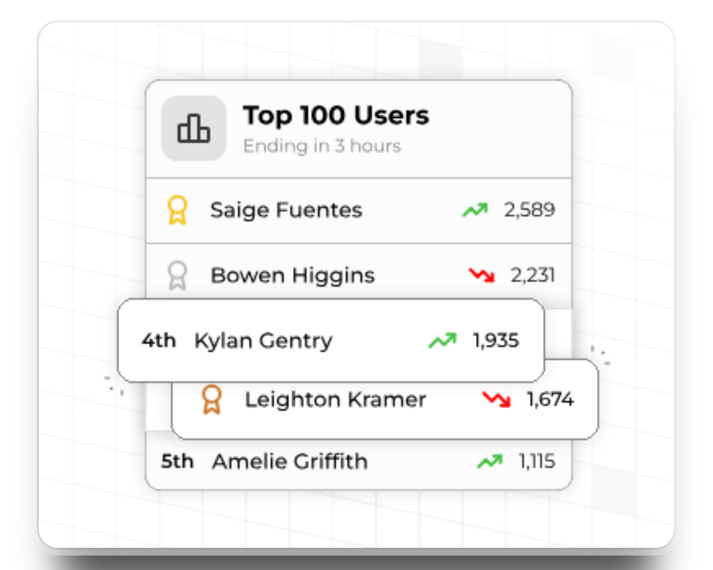
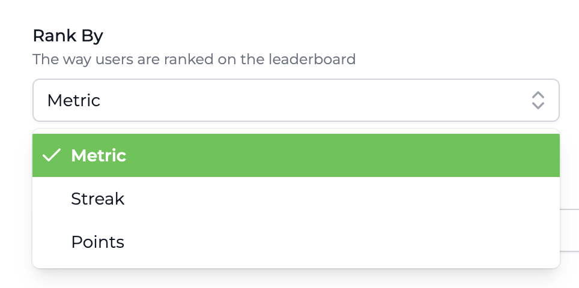
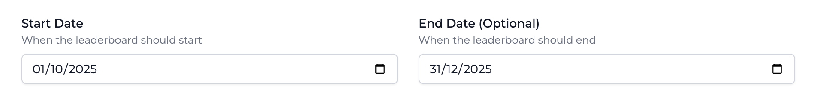
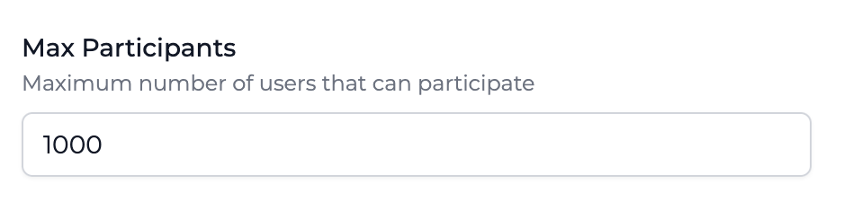
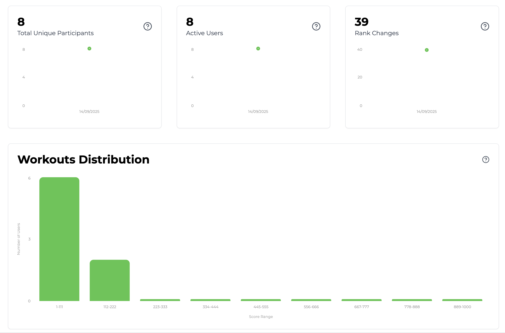

import LeaderboardSingleAttributeRequest from "/snippets/leaderboard-rankings-request-single-attribute.mdx";
import LeaderboardMultiAttributeRequest from "/snippets/leaderboard-rankings-request-multiple-attributes.mdx";

<Frame>
  
</Frame>

## What are Leaderboards?

Leaderboards are social competitions between users of your application. Use leaderboards to increase engagement and foster social interaction.

## Types of Leaderboards

Leaderboards in Trophy can be one of a few different types.

### Perpetual Leaderboards

Perpetual leaderboards never reset. Once started they continually track and rank users progress over time forever, or until the configured [end date](#end-dates).

### Repeating Leaderboards

Repeating leaderboards can be configured to reset after any arbitrary number of days, months or years.

In Trophy each instance of a repeating leaderboard is called a **'run'**. For example, a monthly leaderboard would have 12 runs in a year, but a daily leaderboard would have `n` runs in a month where `n` is the number of days in a given month.

Repeating leaderboards reset all ranks at the start of each run giving new users an equal chance to compete with existing users.

Trophy tracks the rankings in each run of a repeating leaderboard individually and provides [APIs](/api-reference/endpoints/leaderboards/get-leaderboard) to fetch ranking data on historical runs.

#### Handling Time Zones

If you have tracked users' [time zones](/platform/users#param-tz) with Trophy, these will be used to ensure that each user has an equal chance of winning no matter where they are in the world.

In practice this means leaderboards are finalized and winners chosen about 12 hours after they naturally finish in UTC to allow time for users in all time zones to make their final push.

#### Tips for Weekly Leaderboards

As the start of the week can be different in different countries, there is some debate about how to manage weekly leaderboards correctly and consistently.

We'll be adding better support for weekly leaderboards in the future based on customer requests, so if that's you [let us know](mailto:support@trophy.so)! However Trophy leaderboards will cover 90% of weekly use cases, so here's what we suggest if you want to set one up.

To create a weekly leaderboard, set up a [repeating leaderboard](#repeating-leaderboards) on a 7 day schedule and set the start date to be the next occurring first day of the week. While you wait for the start date to come around, the leaderboard will be in `scheduled` status and will automatically go live on the start date.

This will make sure each run of the leaderboard consistently tracks the start and end of each week that your users are familiar with.

## Ranking Logic

Leaderboards in Trophy are configurable to rank participants in a number of different ways to support common use cases.

### Ranking Methods

The ranking method of a leaderboard determines on what dimension participants will be ordered.

<Frame>
  
</Frame>

#### Metric Rankings

Metric leaderboards are linked to an existing Trophy [Metric](/platform/metrics) and rank users based on their progress against it.

Use metric leaderboards if you just want to rank users based on a single interaction.

#### Points Rankings

Points leaderboards are linked to an existing Trophy [Points System](/platform/points) and automatically rank users according to their total points.

Use a points leaderboard if you want to rank users based on a combination of metrics, achievements or other Trophy features.

#### Streak Rankings

Streak leaderboards rank users based on their current streak length.

<Tip>Streak leaderboards can only be [perpetual](#perpetual-leaderboards).</Tip>

### Ranking Breakdowns

If you have a large user base, it's best practice to split up leaderboard participants into smaller, more socially-connected groups. This often leads to higher engagement than when using global leaderboards.

Leaderboards in Trophy can be configured to group users into smaller groups according to a specific [custom user attribute](#custom-user-attributes).

<Tip>
  When using leaderboard breakdowns, [participant limits](#participant-limits)
  apply at the group level, not overall.
</Tip>

To set up a leaderboard breakdown head to the leaderboard configuration page and create or select your user attribute in the 'Breakdown Attribute' field.

Trophy will automatically start grouping users into smaller leaderboards based on the values of your chosen attribute for each of your users.

<Frame>
  <video
    autoPlay
    muted
    loop
    playsInline
    className="w-full aspect-15/4"
    src="../assets/platform/leaderboards/breakdowns.mp4"
  ></video>
</Frame>

To fetch rankings for a particular group of users with a specific attribute value, use the [leaderboard rankings API](/api-reference/endpoints/leaderboards/get-leaderboard), specifying the attribute value in the [`userAttributes` parameter](/api-reference/endpoints/leaderboards/get-leaderboard#parameter-user-attributes) as follows:

<LeaderboardSingleAttributeRequest />

If you wish to fetch rankings for a particular group of users with a specific combination of user attributes, create a new attribute to track the combination and use that as your breakdown attribute as follows:

<LeaderboardMultiAttributeRequest />

## Start & End Dates

Use start and end dates to control the window within which leaderboards are actively ranking users.

<Frame>
  
</Frame>

### Start Dates

Leaderboards in Trophy can be set to start at a future date of your choice. This is often useful to allow some time for last minute changes or adjustments before leaderboards start ranking users.

Leaderboards with a start date in the future are scheduled and automatically go live on the start date you choose.

### End Dates

Leaderboards in Trophy can have end dates. If you set an end date on a leaderboard then after that date it will enter `finished` status and rankings will be finalized and winners chosen.

<Note>
  Due to differences in [time zones](#handling-time-zones), leaderboards can be
  finalized up to 12 hours after the end date in UTC to allow all users to reach
  the end date according to their local clock.
</Note>

## Participant Limits

Leaderboards in Trophy have a maximum number of participants of **1,000**. However a leaderboard can be configured to have any arbitrary number of participants to support use cases like _Top 100_ or similar.

<Frame>
  
</Frame>

If a leaderboard already has a number of participants that matches its configured maximum, new users will have to surpass the score of the lowest rank to join the leaderboard.

<Tip>
We chose to limit leaderboard size to help guide customers on best practice.

Traditionally, leaderboards with lots of participants fail to engage users beyond the top 1%, and have a **negative** impact on users in the bottom half, particularly new users. To avoid this, keep your leaderboards small by breaking them down into smaller leaderboards using breakdown attributes(#ranking-breakdowns).

For more background on the negative effects on global leaderboards, read this [blog post](https://www.trophy.so/blog/leaderboard-only-motivating-top-one-percent).

</Tip>

The only exception to this is when using [breakdown attributes](#ranking-breakdowns) to group participants into smaller cohorts. When using breakdown attributes the participant limit applies to each group, not overall.

## Creating Leaderboards

To create a leaderboard, head to the [leaderboards page](https://app.trophy.so/leaderboards) in the Trophy dashboard and hit the _New Leaderboard_ button.

<Frame>
  <video
    autoPlay
    muted
    loop
    playsInline
    className="w-full aspect-15/4"
    src="../assets/platform/leaderboards/creating_leaderboards.mp4"
  ></video>
</Frame>

<Steps>
  <Step title="Enter a name">
    Choose a name for the leaderboard.
  </Step>
  
  <Step title="Enter a unique key">
    Enter a unique reference key for the leaderboard. This is what you'll use to reference the leaderboard in your application code.
  </Step>

   <Step title="Choose a ranking method">
    Choose one of the [methods](#ranking-method) that the leaderboard will rank users by:

    - **Metric**: Ranks users by total value of a chosen metric
    - **Points**: Ranks users by total points in a chosen points system
    - **Streak**: Ranks users by current streak length

  </Step>

    <Step title="Set max participants">
    Choose the maximum number of participants the leaderboard should support. The
    current upper limit supported by Trophy is 1,000. Read [this
    section](#participant-limits) to learn more about how we chose this limit.
    </Step>

    <Step title="Hit save">
    Hit save and head to the configure page to set up [start & end dates](#start-and-end-dates), [repeating leaderboard schedules](#repeating-leaderboards) and more.
    </Step>

</Steps>

## Managing Leaderboards

Leaderboards in Trophy have a number of statuses to help you control when users and how users can join them.

### Leaderboard Statuses

Leaderboards can have one of the following statuses:

- `Inactive`
- `Scheduled`
- `Active`
- `Finished`
- `Archived`

All new leaderboards are created as `Inactive`. While inactive, any properties or settings of the leaderboard can be changed, they won't be visible to users and users can't join them.

Once you're ready for users to start participating, you can make it `Active`. This means Trophy will start tracking users' activity and entering them into leaderboards.

Leaderboards that have been configured with a [start date](#start-dates) in the future can't be made active, they can only be `Scheduled`. Once the start date is past, Trophy will automatically make them `Active` and start accepting participants.

If a leaderboard has an [end date](#end-dates), then once it has past Trophy will automatically move it to `Finished` status and stop monitoring user activity. Once a leaderboard has finished it won't be visible to users but you can still query APIs to get rankings for historical runs.

If you decide you no longer need a leaderboard, you can move it to `Archived` status.

<Warning>
  Once a leaderboard is archived, it can only be restored by contacting support.
</Warning>

## Displaying Leaderboards

<Tip>
  Check out our [full guide](/guides/how-to-build-a-leaderboards-feature) on
  adding leaderboards to your app for more details.
</Tip>

## Leaderboard Analytics

Trophy has built-in analytics to help you understand how users are engaging with your leaderboards.

<Frame>
  
</Frame>

### Total Unique Participants

This chart shows how many unique users have participated in any run of a leaderboard over time. This is useful to understand how many of your users actually take part in leaderboards and how [participant limits](#participant-limits) are affecting this.

### Active Users

This chart show the number of users who have changed rank at least once in a given leaderboard. This is useful to get a sense of how competitive the average user is in a particular leaderboard.

## Rank Changes

This chart shows the total number of rank changes in a particular leaderboard over time. This is useful to understand how competitive users are across the board.

## Score Distribution

This chart is a histogram of users' scores in a particular leaderboard. This is useful to get a sense of how bunched up or spread out users are, and what sections of the rankings are the most competitive.

## Frequently Asked Questions

<AccordionGroup>
  <Accordion title="How many participants can be in a leaderboard at once?">
    We limit leaderboards to 1,000 participants.
    
    Read more about this in the [dedicated section](#participant-limits) of this page.

  </Accordion>

{" "}

<Accordion title="I don't see a weekly leaderboard option, how can I set one up?">
  Trophy supports running repeating leaderboards on any arbitrary number of
  days. So a weekly leaderboard would just be a leaderboard that repeats every 7
  days. Read [this section](#tips-for-weekly-leaderboards) for more tips of
  creating weekly leaderboards.
</Accordion>
</AccordionGroup>

## Get Support

Want to get in touch with the Trophy team? Reach out to us via [email](mailto:support@trophy.so). We're here to help!
