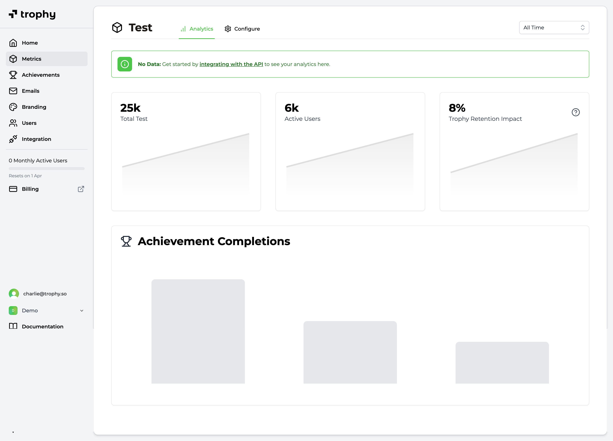
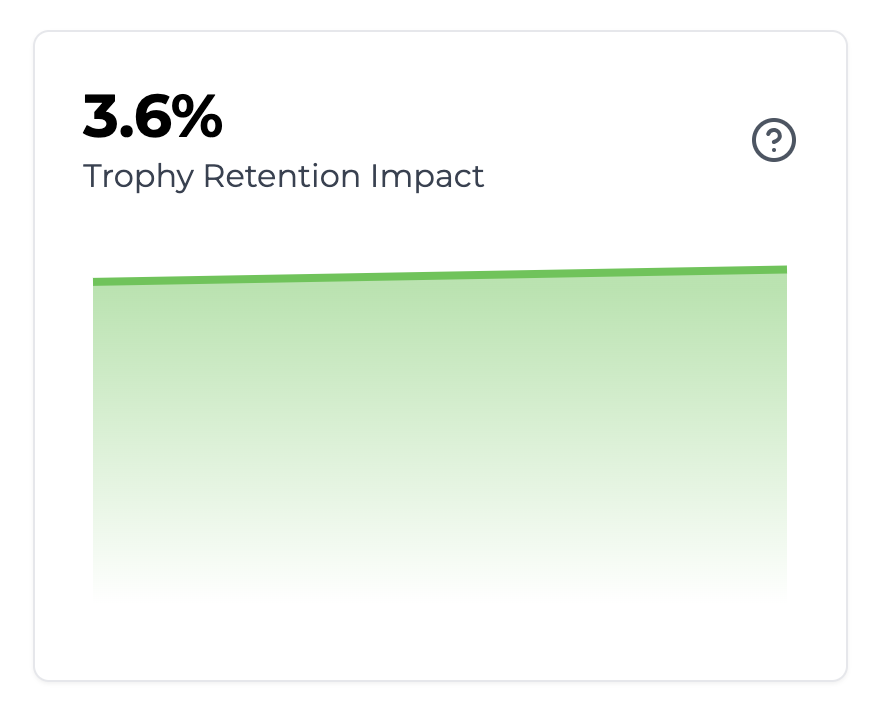
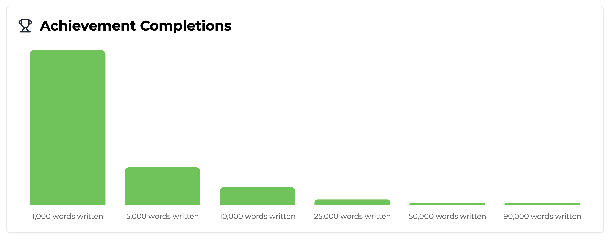

## What are Metrics?

All gamification features are centered around user interactions. At Trophy, we use the term **Metrics** to refer to the data objects that model those interactions within your web or mobile app.

Metrics are un-opinionated, meaning they can be used to model absolutely any user interaction you can think of. Examples could include:

- Followers, likes or posts
- Tasks completed
- Miles ran
- Lessons completed
- Words written
- ...

Metrics are the building blocks of the infrastructure that powers Trophy's gamification features. Each user interaction that relates to a metric is stored as an [Event](/platform/events).

Events are stored and processed in chronological order. At any particular point in time, the combined state of a user's event history reflects their overall progress on your platform.

## Key Attributes

Here we describe the key attributes that allow you to create metrics to best fit your use case.

### Units

You can easily assign units to metrics in the dashboard for either:

- Arbitrary numbers (tasks, posts, messages etc.)
- Currencies ($, £, €)

## Creating Metrics

To create a Metric, head over to the [Metrics](https://app.trophy.so/metrics) page within Trophy and hit the **New Metric** button:

<Frame>
  <video
    autoPlay
    muted
    loop
    playsInline
    className="w-full aspect-video"
    src="../assets/platform/metrics/create_new_metric.mp4"
  ></video>
</Frame>

<Steps>
  <Step title="Enter a name">
    Choose a name for the metric.
  </Step>
  
  <Step title="Hit save">
    Save the new metric.
  </Step>

   <Step title="Configure settings">
    Configure additional settings like metric units or currency if applicable on the metric configure page.
  </Step>
</Steps>

## Metric Analytics

Trophy has a built-in analytics dashboard for each metric you create. It shows you:

- The total value of all tracked events against the metric
- The number of users actively making progress against the metric
- The metric's [Trophy Retention Impact Score](#trophy-retention-impact-score)
- The metric's [Achievement Completion Chart](#achievement-completion-chart)

<Frame>
  
</Frame>

### Trophy Retention Impact Score

By default, Trophy only enrolls 90% of your users in any emails. It leaves the other 10% out as a 'control cohort'.

Trophy then automatically tracks the 14-day retention of the two cohorts and compares them, resulting in the Trophy Impact Score.

<Frame>
  
</Frame>

The Trophy Impact Score reflects the percentage difference in 14-day retention between the control cohort and the rest of your userbase.

<Tip>
  An Impact Score of 5% means that users enrolled in gamification features are
  5% more likely to be using your platform after 14 days than the control
  cohort.
</Tip>

### Achievement Completion Chart

The achievement completion chart shows the current state of the userbase in terms of the number of users who have completed each achievement that you've configured against this metric.

[Learn more about achievements](/platform/achievements).

<Frame>
  
</Frame>

## Frequently Asked Questions

<AccordionGroup>
  <Accordion title="How many metrics can I create?">
    As many as you want!
  </Accordion>

    <Accordion title="Can Trophy control my UI when events are tracked?">
    No, metrics are purely server-side and only support the business logic around achievements, streaks and other workflows like sending emails.

    They don't control any in-app UI, but our APIs provide all the data you need to build whatever UI you want.
    </Accordion>

</AccordionGroup>

## Get Support

Want to get in touch with the Trophy team? Reach out to us via [email](mailto:support@trophy.so). We're here to help!
