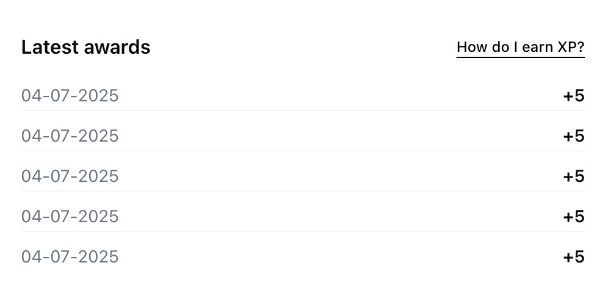
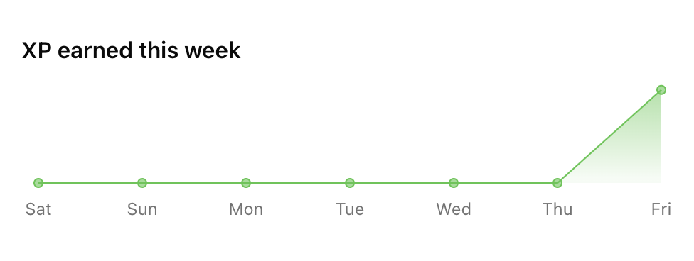
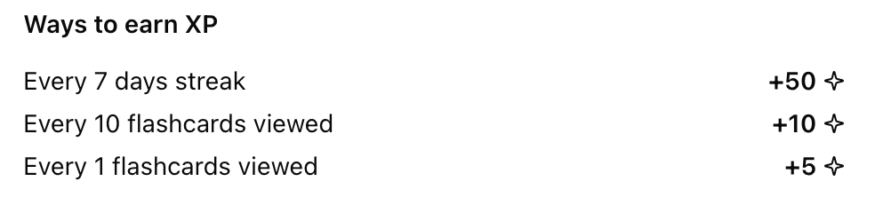
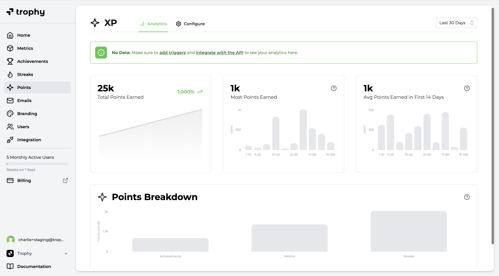

import MetricChangeResponseBlock from "/snippets/metric-change-response-block.mdx";

## What is a Points System?

Points systems allow you to create custom logic that combines multiple user interactions through [Metrics](/platform/metrics), [Achievements](/platform/achievements) and [Streaks](/platform/streaks) into one system.

## Use Cases

### Rewards

Points systems can be used to create features like 'XP' or 'Gems' that reward users for a number of interactions at different rates.

In this way points can be used to weight the value of certain interactions differently to others to reward users for taking the actions you consider most closely related to retention.

### Metering

Points systems can also be used to create features like 'Energy' that meter usage of your product in a way that gives you control over promoting and restricting user activity.

This allows you to control the rate at which users can use your product with a flexible mechanic that sits outside your codebase.

## Creating Points Systems

Trophy let's you set up multiple points systems for different use cases within your application.

<Frame>
  <video
    autoPlay
    muted
    loop
    playsInline
    className="w-full aspect-video"
    src="../assets/platform/points/create_system.mp4"
  ></video>
</Frame>

To create a points system, head to the [points page](https://app.trophy.so/points) and follow the steps below.

<Steps>
  <Step title="Hit New Points System">
    Give the new points system a name, and a unique key. The key is what you'll
    use to reference the points system in APIs and in email templates if
    relevant.
  </Step>
  <Step title="Add a description (Optional)">
    You can also give the points system a description which is returned from
    APIs to be displayed in your application.
  </Step>
  <Step title="Configure max points (Optional)">
  If you want to limit the number of points that each user can have in your new system, set a value in the 'max points' field.

  <Tip>
  Any [points triggers](#points-triggers) that you configure against this points system will respect the maximum set.
  </Tip>
  </Step>
  <Step title="Assign a badge (Optional)">
    You can also optionally upload a badge or logo to represent the points
    system. A `src` friendly URL to the image is returned from APIs for display
    in your application.
  </Step>
</Steps>

## Points Triggers

In Trophy, points are awarded to or deducted from users through triggers. These define the different mechanics that make up your points system.

You can add as many triggers as you like to each points system you set up, allowing you create different logic for how points are awarded or deducted for different points systems.

### Types of Triggers

There are multiple types of triggers in Trophy that can be used to award or deduct points in different ways.

**Metric Triggers**

Points can be awarded or deducted continually as users increment [Metrics](/platform/metrics). You can choose to award or deduct any arbitrary number of points at any arbitrary metric threshold, for example "award 10 points for every 3 tasks completed".

**Streak Triggers**

Points can be awarded or deducted for reaching any arbitrary length of a [Streak](/platform/streaks), for example "award 50 points for every 7 days streak".

**Achievement Triggers**

Points can be awarded or deducted when users unlock specific [Achievements](/platform/achievements), for example "award 100 points when users completed the `profile-completed` achievement".

**Time-based Triggers**

Points can be awarded or deducted at repeating time intervals, every hour or every day. For example "award 10 points every 3 hours".

**User Identification Triggers**

Points can be awarded when users are first identified in Trophy, useful for granting an initial amount of points when they sign up to your product.

### Creating Triggers

To create a new points trigger, head to the points system that you want to create a trigger for and follow the steps below.

<Tip>
  All new points triggers are created as 'Inactive' to allow testing and
  balancing before deployment to production.
</Tip>

<Frame>
  <video
    autoPlay
    muted
    loop
    playsInline
    className="w-full aspect-video"
    src="../assets/platform/points/create_trigger.mp4"
  ></video>
</Frame>

<Steps>
<Step title="Choose a trigger type">
  Choose how you want points to be awarded or deducted as described by the available [trigger types](#types-of-triggers).
</Step>

<Step title="Set up trigger">
  Once you've chosen the points trigger type, you need to set up the trigger settings.

- If you chose the **Metric** trigger, you'll need to choose the metric, the threshold amount at which to award or deduct points.

- If you chose the **Streak** trigger, you'll need to set the streak length that should award or deduct points.

- If you chose the **Achievement** trigger, you'll need to choose the achievement that should award or deduct points when completed.

- If you chose the **Time** trigger, you'll need to choose the time unit you want to award or deduct points on (hours or days) and the number of those time units that you want to award or deduct points after.

- If you chose the **First User Identification** trigger, you won't need to add any additional configuration.

</Step>

<Step title="Set points to award/deduct">
  Once your trigger is configured, set the number of points to award or deduct
  when fired.
</Step>

<Step title="Add attribute filters (Optional)">
  You can assign attribute filters to a points trigger to further restrict when they apply.

- To limit a **Metric trigger** to only apply to events with specific [custom event attributes](/platform/events#custom-event-attributes), select an attribute and enter a value in the **Event Attribute** section.

- To limit any type of trigger to only apply to a user with one or more specific [custom user attributes](/platform/users#custom-user-attributes), add attributes and the desired values in the **User Attributes** section.

</Step>

<Step title="Hit save">
  Save the new points trigger.
</Step>
<Step title="Activate">
  Once you're happy that your new trigger will behave as expected, change it's status to active to make it live.
</Step>
</Steps>

## Balancing Points

Running an effective points system requires finding the optimal pace at which users earn points. Too fast, and users will get points fatigue, rendering them useless. Too slow, and users may get bored and churn.

Trophy's preview tool can model different scenarios to help you determine how frequently users should earn points in each of your points systems.

<Frame>
  <video
    autoPlay
    muted
    loop
    playsInline
    className="w-full aspect-video"
    src="../assets/platform/points/points_preview.mp4"
  ></video>
</Frame>

## Displaying Points

There are a few ways to use Trophy to fetch and display points in your app.

<Frame>
  <video
    autoPlay
    muted
    loop
    playsInline
    className="w-full aspect-video"
    src="../assets/platform/points/displaying_points.mp4"
  ></video>
</Frame>

### Triggering Transactional UI

Firstly, any points awarded to or deducted from users as a result of a metric change event are returned in the response when using the [metric change event API](/api-reference/endpoints/metrics/send-a-metric-change-event).

The response includes the user's new total points, how many points were awarded or deducted as a result of the event, and the details of the specific points triggers that fired.

<MetricChangeResponseBlock />

This makes it really simple to read the response and trigger any of the following transactional UI in your application:

- Displaying in-app notifications and pop-ups
- Playing sound effects

### Displaying User's Points

Trophy also has APIs that allow you fetch user's points data whenever you want.

First, the [user points API](/api-reference/endpoints/users/get-a-users-points) returns the user's total points for a particular points system and up to 100 of the most recent events that awarded points to or deducted points from them.

You can use this API to display the user's total points anywhere in your platform as well as a 'Latest awards' section or similar.

<Frame>
  
</Frame>

Then, the [user points summary API](/api-reference/endpoints/users/get-a-users-points-summary) can be used to fetch historical points data for a particular user.

Data can be aggregated daily, weekly or monthly between a start and end date. Use this API to display points progress charts to users over any time frame.

<Frame>
  
</Frame>

### Displaying Aggregate Data

Additionally there are a number of APIs that can be used to fetch and display points data at the account level.

First, the [points summary API](/api-reference/endpoints/points/get-points-summary) returns aggregate points system data across your entire user base.

Use this data to display a histogram of points for a particular points system and show users how they compare to others on the platform.

<Tip>
  This API can also be filtered to only return data for users with specific
  [custom user attributes](/platform/users#custom-user-attributes).
</Tip>

<Frame>
  
</Frame>

Finally, the [points system API](/api-reference/endpoints/points/get-points) returns data about a particular points system, including all its triggers that award points to or deduct points from users.

Use this API to show users how they can earn points on your platform. Any new triggers you add will automatically be returned from this API helping to reduce code changes in your platform, and shifting operations to Trophy.

<Frame>
  
</Frame>

## Points Analytics

Trophy has built-in analytics to track points awards for each points system you configure across your users in real time including:

- Total points earned by all users over time
- Most points earned by a single user
- Average points earned in the first 14 days (useful for understanding new user retention patterns and the impact of points)
- A breakdown on the most commonly awarded points triggers

<Frame>
  
</Frame>

## Get Support

Want to get in touch with the Trophy team? Reach out to us via [email](mailto:support@trophy.so). We're here to help!
